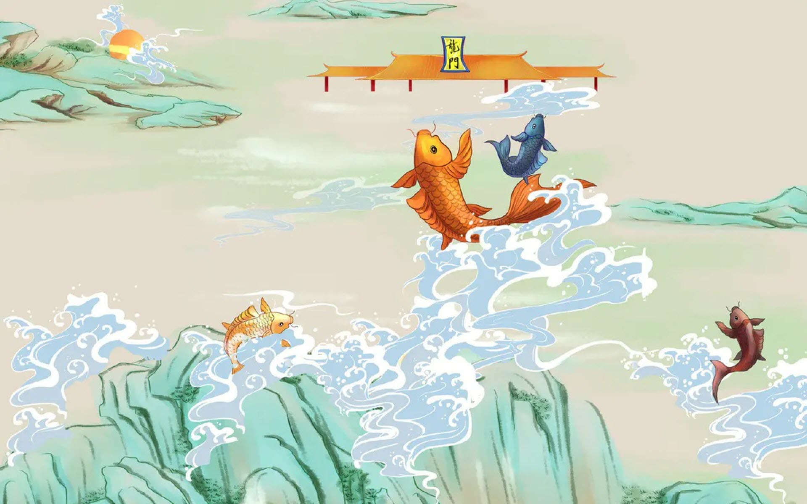

Truyền thuyết kể rằng, khi trời đất mới hình thành, Ngọc Hoàng đã tạo ra mưa, gió, bão, sấm. Sau đó, do bận rộn với việc tạo ra con người, Ngọc Hoàng đã giao cho loài rồng - sinh vật quyền lực có nhiệm vụ bay lượn trên trời và phun nước để tạo ra mưa. Tuy nhiên, do số lượng rồng không đủ để tạo ra mưa cho mọi nơi, Ngọc Hoàng đã tổ chức cuộc “thi rồng” để chọn lựa các sinh vật trở thành rồng. Khi lệnh của Ngọc Hoàng được ban xuống, vua Thủy Tề đã thông báo cho tất cả các loài dưới nước tham gia. Những sinh vật nào đủ sức mạnh và tài năng, vượt qua thử thách sẽ biến thành Rồng. 

Các sinh vật phải vượt qua một bài vô cùng hóc búa từ Ngọc Hoàng, bài toán được phát biểu như sau:

>**[Thử thách Vũ Môn](https://oj.vnoi.info/problem/dovui_2024_a)**

>*Cho một dãy số n số nguyên dương $a_1, a_2,\ldots, a_n$. Với mỗi số nguyên dương $a_i$, thí sinh cần đếm xem có bao nhiêu nghiệm nguyên của phương trình $x + y + \gcd(x, y) = a_i$*

Các con vật khác đều bó tay chịu trận. Khi đến lượt Cá Chép tham gia, gió thổi mạnh và mây đen kéo đến. Cá Chép đã vượt qua bài thi và đi vào cửa Vũ Môn. Sau khi biến thành Rồng, Cá Chép phun nước tạo ra gió và mưa, giúp muôn loài thoát khỏi hạn hán và làm cho sự sống trở lại.

Kể từ ngày Cá Chép biến thành Rồng, rất nhiều cá chép khác trên sông đã tụ tập và bơi ngược dòng đến dưới Vũ Môn. Dù dòng nước có hung dữ đến mấy, luôn có vô số con cá chép dũng cảm nhảy lên, và dù có rơi xuống đến mức trầy da tróc vảy, chúng cũng không từ bỏ.

Tuy nhiên, sau nhiều năm trôi qua, không một con cá chép nào có thể chạm đến Vũ Môn. Chúng rất thất vọng và đã kéo nhau đến gặp vua Thủy Tề, xin vua hãy hạ Vũ Môn xuống thấp hơn, bởi nếu không, sẽ không có con cá nào có thể trở thành rồng.

Sau một cuộc tranh luận làm rung chuyển cung điện dưới nước, cuối cùng vua Thủy Tề cũng đồng ý hạ Vũ Môn xuống thấp hơn để tất cả cá chép đều có thể dễ dàng nhảy qua. Tuy nhiên, vua Thuỷ Tề đặt điều kiện là tất cả con cá chép đều phải đưa ra đáp án chính xác của bài toán sau, thì mới hạ thấp Vũ Môn:

>**[Lật sỏi](https://oj.vnoi.info/problem/dovui_2024_b)**

>*Trò chơi ô ăn quan truyền thống là một trò chơi truyền thống vô cùng quen thuộc với trẻ em Việt Nam. Tuy nhiên chúng ta sẽ đi đến phiên bản khác của trò chơi nhưng cũng cực trí tuệ: trò chơi lật sỏi.*
\
>*Sân chơi gồm $n$ vị trí từ vị trí $0$ đến $n - 1$. Mỗi hiệu lệnh được đưa ra, bạn sẽ nhận được ba số nguyên $t, A, B$. Với mọi $A \leq i \leq B$, nếu $t = 0$ thì ta đổi trạng thái của vị trí thứ $i$. Nếu $t = 1$, ta cần đếm xem có bao nhiêu vị trí $i$ đang có sỏi. Hãy nhanh tay trả lời các hiệu lệnh loại $1$  nhé!*

Bài toán đã không làm khó được sự quyết tâm của các con cá chép, tất cả sau đó đều hóa thành những con rồng. Ban đầu, đàn cá chép rất hân hoan và vui mừng vì cuối cùng chúng đã đạt được ước nguyện - đó là một kỳ tích mà chỉ có thể xuất hiện một lần sau hàng trăm nghìn năm.

Nhưng sau một thời gian, chúng nhìn nhau và tự hỏi: Rốt cuộc thì làm rồng và làm cá chép có gì khác nhau? Tất nhiên không con nào có thể trả lời được vì tất cả chúng đều giống hệt nhau. Thế là đàn cá rồng lại cùng nhau gặp vua Thủy Tề để than phiền, rằng chúng phải vất vả vượt qua Vũ Môn để biến thành rồng, nhưng khi đã trở thành rồng, lại không có gì thú vị hơn so với khi làm cá chép.

Vua Thủy Tề cười lớn và nói rằng: “Thực ra, trong số các ngươi, chưa có ai trở thành rồng cả. Vũ Môn mà các ngươi dễ dàng nhảy qua thực ra là giả. Ta thấy các ngươi đáng lẽ phải nỗ lực một phen gian khó, nâng cao tiêu chuẩn bản thân… nhưng các ngươi không chỉ không cố gắng mà còn đến gặp ta để than phiền. Vì vậy, ta đã che đi Vũ Môn thật và dựng lên Vũ Môn giả để các ngươi thỏa nguyện..”

Tiếp lời, vua Thủy Tề nói: “Nếu tất cả cá chép đều dễ dàng trở thành rồng thì ‘rồng’ cuối cùng cũng chỉ là một tên gọi khác của loài cá chép mà thôi. Nếu các ngươi muốn biết rồng thật sự khác cá chép thế nào, thì chỉ có một cách duy nhất là bằng mọi giá vượt qua Long Môn thật. Khi đó, ai chỉ là cá và ai là Rồng thì các ngươi sẽ phân biệt ra ngay. Nào hãy cùng quyết tâm, luyện tập thật nhiều để chinh phục Vũ Môn thật. Ta có một thử thách thú vị dành cho các ngươi..”

>**[Xông nhà](https://oj.vnoi.info/problem/dovui_2024_c)**

>*Mỗi dịp Tết đến xuân về, ai cũng náo nức nô đón chờ những điều may mắn, những điều tốt đẹp sẽ đến với cuộc sống. Tập tục xông nhà là một phong tục nhằm đón những điều tốt lành vào đầu năm mới, từ lâu đây đã là một truyền thống văn hoá lâu đời của người Việt. Để đón nhận những điều tốt đẹp trong năm mới, ta cùng xem qua dãy số như sau:*
\
>*Với một dãy* $k$ *số nguyên* $[B_0, …, B_{k - 1}]$ *được coi là 'đẹp' nếu như tồn tại hoán vị* $[C_0, …, C_{k - 1}]$ *sao cho prefix xor của dãy* $C$ *tăng dần. Nói cách khác, gọi* $P_i = P_{i - 1} \oplus C_i$. *Ta cần có* $P_0 < P_1 < … < P_{k - 1}$.
\
>*Mỗi ngôi nhà sẽ có một dãy số $A$ gồm $n$ số nguyên đại diện. Năm mới bạn muốn xông nhà cho người thân quen của mình, với mỗi ngôi nhà của gia chủ, hãy tìm xem mọi prefix của $A$ có phải dãy đẹp không nhé. Nếu mọi prefix $A$ đều là dãy đẹp, bạn vô cùng hợp tuổi với gia chủ đấy.*

Vì là một thử thách vô cùng khó nên cuối cùng chỉ có số ít cá chép vượt qua và hóa thành những chú rồng thực thụ và đầy quyền năng. Từ câu chuyện, ta thấy tất cả cá chép đều có thể biến thành rồng nhưng không phải con nào cũng sẽ vượt qua được Vũ Môn. Tương tự như vậy, thành công dành cho tất cả mọi người. Thành công không phải là một đặc quyền và đặc lợi của riêng bất kì một ai. Tất cả chúng ta đều có thể thành công, nhưng không phải tất cả mọi người đều sẽ thành công, vì chỉ có những người thật sự nỗ lực và biết cách đầu tư vào bản thân mình mới có thể thật sự “hóa Rồng”.

 ## Thể lệ 

- Trong năm vừa qua, ắt hẳn một số bạn độc giả đã quen với dự án **Problem of the Week** của team Bedao. Dự án đã để lại nhiều dấu ấn cho cộng đồng khi hàng tuần đem đến những bài toán hóc búa, thách thức độc giả gửi về những lời giải xuất sắc về cho VNOI. Giờ đây dự án một lần nữa quay trở lại với tên 'Thách thức lập trình' trong số tạp chí VNOI Xuân Giáp Thìn. 

- Ở số  [Thách thức lập trình](https://oj.vnoi.info/contest/thachthuc_laptrinh_giapthin2024) này sẽ có 3 bài toán được đặt ra, với mỗi bài giải được các bạn hãy viết lời giải (editorial) và bài giải (code), gửi về cho chúng mình thông qua [Thách thức lập trình - Tạp chí VNOI Giáp Thìn 2024](https://forms.gle/tXfDemgzZFiHjR3k6). Vào cuối thử thách, ban biên tập sẽ chọn và công bố 3 lời giải xuất sắc nhất của 3 bài toán trên [VNOI](https://www.facebook.com/vnoi.wiki).

- **Bài giải hợp lệ:** các bài giải khi gửi về cho VNOI phải là những bài đã qua hết bộ test đã được soạn sẵn và không có hành vi chép bài giải, lời giải để nộp. Mọi bài giải gửi về vi phạm sẽ không được xét giải thưởng.

- **Thời gian nhận bài:** từ 10/2 đến 20/2, năm 2024.

- **Giải thưởng:** Ứng với mỗi lời giải được chọn, các bạn sẽ được một bộ merchandise đặc biệt gồm: *10 bao lì xì + móc khóa + dây đeo + sticker VNOI*. Chính vì thế hãy thật nhanh tay để giành lấy cho mình bộ quà có 1-0-2 dành riêng cho dịp Xuân Giáp Thìn này nhé! 
