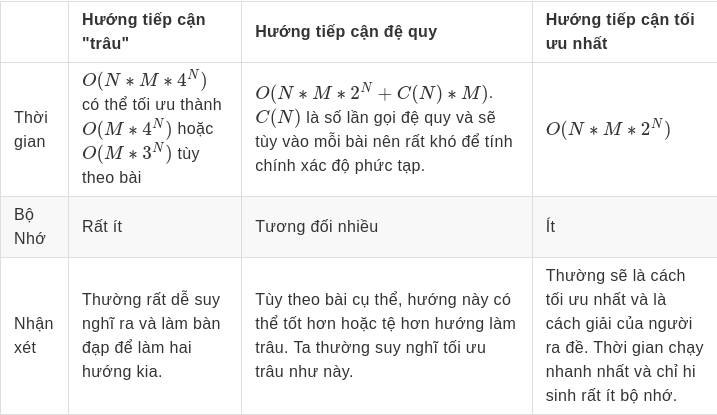

## Lời nói đầu

*Nếu bạn đã học CP lâu năm, bạn có thể đã từng thấy vài bài sử dụng DP Broken Profile nhưng khi lên mạng thì lại gần như không có các thông tin về nó. Vì thế, bài viết này sẽ mang đến cho các độc giả về các thông tin cơ bản về DP Broken Profile để có thể làm và hiểu được về dạng bài này.*

**Kiến thức cần thiết: Quy Hoạch Động, Quy hoạch động trạng thái (bitmask).**

DP Broken Profile là một dạng đặc biệt của dạng toán DP Bitmask nhằm xử lý một cách tối ưu những bài toán có một hoặc nhiều đặc điểm như:
* Bài toán thường xoay quanh lắp đầy một bảng $2D$
* Một chiều nhỏ hơn rất nhiều so với chiều còn lại.
* **Khi lắp bảng, một ô chỉ phụ thuộc vào ô kề nó.**
*  Số lượng trạng thái của mỗi ô khá it (thường là 2)

Bài tập sử dụng DP Broken Profile thường rất khó nên việc hiểu biết những hướng làm, những ưu và nhược điểm của từng hướng sẽ là chìa khóa giữa việc $AC$ bài đó hay không.

## [Bài toán 1: Counting Tilings](https://cses.fi/problemset/task/2181)

* Cho một bảng $N \times M$ , hãy tìm số lượng cách lắp đầy bảng bằng cách đặt các viên domino có kích thước $1 \times 2$ hoặc $2 \times 1$ không giao nhau.
* $N\le 10,M \le 1000$
### Phân tích:
Với $N$ bé như $1$, $2$ hay $3$ thì công thức truy hồi rất dễ để tìm ra: 
* $N=1$: Ta thấy chỉ có duy nhất $1$ cách điền (Nếu như $M$ chẵn). 
* $N=2$: $dp_m=dp_{m-1}+dp_{m-2}$, hay hàm dp của ta sẽ là số $Fibonacci$ thứ $M$. 
* $N=3$: Công thức truy hồi khó hơn chút nhưng ta có thể chứng minh được công thức truy hồi của ta sẽ là $dp_m=4*dp_{m-1}-dp_{m-2}$. Công thức đó được chứng minh ở [đây](https://goo.gl/ixTyA5).

Khi ta xét trường hợp tổng quát, việc tìm công thức truy hồi chỉ có thể khi dùng Berlekamp-Massey. Nhưng với $N$ nhỏ (nhỏ hơn $10$ như trong bài này), thì ta có thể làm cách nào đơn giản hơn không?

#### Hướng tiếp cận "trâu"

Để tiếp cận bài này, ta sẽ xếp các miêng domino dần dần từ trái sang phải. Gọi $dp_{i,mask}$ là số lượng cách để sắp xếp domino để đầy $i-1$ cột đầu tiên và cột thứ $i$ sẽ có hình dạng như $mask$. Hay rõ hơn, nếu ô $(i,j)$ đã được lắp thì bit thứ $j$ sẽ bật và nếu ô $(i,j)$ trống thì bit thứ $j$ sẽ được tắt. Xem hình bên dưới để hiểu rõ thêm vè trạng thái quy hoạch động:


Khi có $i,mask$ thì ta phải đặt một số domino để đầy dòng $i$ và được $nextmask$ cho cột $i+1$ để có thể cập nhật lên.

Ta thấy rằng chỉ có nhiều nhất một cách để tạo $nextmask$ từ $mask$ mà thôi.

Chứng minh:
* Nếu bit thứ $k$ của $nextmask$ là $1$ thì chắc chắn $bit$ thứ $k$ của $mask$ chỉ có thể là $0$ do ta phải đặt domino theo chiều ngang ở ô $(i,k)$ để biến bit thứ $k$ của $nextmask$ là 1.
* Nếu bit thứ $k$ của $nextmask$ là $0$ thì là $bit$ thứ $k$ của $mask$ vừa có thể là $0$ hoặc $1$.
    - Nếu bit thứ $k$ của $mask$ là $0$ thì ta bắt buộc phải đặt ở đây một domino theo chiều dọc do ta phải làm đầy cột $i$ thì mới lên xét được cột $i+1$
    - Nếu bit thứ $k$ của $mask$ là $1$ thì ta không thể làm gì do ô $(i,k)$ đã được lắp đầy.
* Như thế, trong mọi trường hợp thì ta cũng chỉ có một cách để biến $mask$ thành $nextmask$.

Nếu ta xây dựng $nextmask$ bằng cách xét tất cả các $nextmask$ rồi kiểm tra là $mask$ hiện tại và $nextmask$ có đồng khớp với nhau không thì nó sẽ mất khá lâu. Ta có for $M$ ,for $mask$ và for $nextmask$ nên độ phức tạp sẽ là $O(M*2^N*2^N)$ hay $O(M*4^N)$, không đủ nhanh cho bài này. Việc kiểm tra $mask$ và $nextmask$ có khớp được với nhau hay không trong $O(1)$ các bạn có thể tham khảo ở [đây](https://www.youtube.com/watch?v=0bnMHlFUM_o) tại phút thứ $40$. 

Tham khảo code mẫu thuật $O(M*N^4)$:
```cpp
#include<bits/stdc++.h>
using namespace std;
int dp[1009][1024];
const int mod=1e9+7;
int n,m;
bool good(int mask,int nextmask){
    if((mask&nextmask)!=0) return 0;
    int x=((~mask)&(~nextmask))&((1<<n)-1);
    if(x%3!=0) return 0;
    int y=x/3;
    if((y&(y<<1))!=0) return false;
    return true;
}
int main(){
    ios_base::sync_with_stdio(false); cin.tie(0); cout.tie(0);
    cin>>n>>m;
    dp[1][0]=1;
    for(int i=1;i<=m;i++){
        for(int mask=0;mask<(1<<n);mask++){
            for(int nextmask=0;nextmask<(1<<n);nextmask++){
                if(good(mask,nextmask)){
                    (dp[i+1][nextmask]+=dp[i][mask])%=mod;
                }
            }
        }
    }
    cout<<dp[m+1][0];
}
```

Có một tối ưu là thay vì xét tất cả các $nextmask$ thì ta chỉ xét các mask con của phần bù của $mask$ hiện tại. Nó sẽ tối ưu độ phức tạp từ $O(M*4^N)$ thành $O(M*3^N)$. Nếu ta chỉ xét các submask bằng đệ quy thì ta sẽ gặp một trở ngại là hằng số rất cao nên khó có thể áp dụng cho bài khác. Vì thế, ta có thể sử dụng một trick biến đổi bit để xét các submask bằng vòng for ở [đây](https://cp-algorithms.com/algebra/all-submasks.html#iterating-through-all-masks-with-their-submasks-complexity-o3n). Như thế, code của ta vừa được tối ưu hơn và đủ nhanh để ac bài này.

Tham khảo code mẫu:

```cpp
#include<bits/stdc++.h>
using namespace std;
int dp[1009][1024];
const int mod=1e9+7;
int n,m;
bool good(int mask,int nextmask){
    int x=((~mask)&(~nextmask))&((1<<n)-1);
    if(x%3!=0) return 0;
    int y=x/3;
    if((y&(y<<1))!=0) return false;
    return true;
}
int main(){
    ios_base::sync_with_stdio(false); cin.tie(0); cout.tie(0);
    cin>>n>>m;
    dp[1][0]=1;
    for(int i=1;i<=m;i++){
        for(int mask=0;mask<(1<<n);mask++){
            if(good(mask,0)){
                dp[i+1][0]+=dp[i][mask];
                dp[i+1][0]%=mod;
            }
            int nmask=((1<<n)-1)^mask; //phan bu cua mask
            for(int nextmask = nmask; nextmask > 0; nextmask = (nextmask - 1) & nmask){
                if(good(mask,nextmask)){
                    dp[i+1][nextmask]+=dp[i][mask];
                    dp[i+1][nextmask]%=mod;
                }
            }
        }
    }
    cout<<dp[m+1][0];
}
```

#### Tối ưu thứ nhất 
Với bài này, ta sẽ dựng các $nextmask$ có thể bằng cách điền tuần tự vào các ô trống của $mask$. Hay cụ thể hơn, ta sẽ đi từng dồng của cột thứ $j$ đang được biểu diễn bởi $mask$. Nếu như dòng(bit) thứ $j$ đã được điền thì ta bỏ qua và xét dòng tiếp theo. Nếu như dòng(bit) thứ $j$ đang trống thì ta xét hai trường hợp sau:

* Đặt domino $1\times 2$ ở đây (tất nhiên là ta chỉ đặt được nếu như $i+1$ không vượt quá $M$. Việc này tương đương với lắp đầy ô $(i+1,j)$, hay bặt bit thứ j của $nextmask$.
* Đặt domino $2\times 1$ ở đây nếu dòng(bit) thứ $j+1$ đang trống. Việc này không ảnh hưởng đến dòng tiếp theo nên ta sẽ không biến đổi $nextmask$. 

Khi đi hết $N$ dòng thì ta sẽ cập nhật cho $dp_{i+1,nextmask}$ tương ứng với các trường hợp ta xét.

Vì hai trường hợp ta đều cần phải xét nên khi cài đặt, ta sẽ sử dụng một hàm đệ quy để thử hết tất cả trường hợp có thể của $nextmask$.

Vì ta muốn lắp đầy hết tất cả các ô trên bảng và không lấn ra ngoài bảng nên là đáp án của ta sẽ là $dp_{m+1,0}$. Trường hợp cơ sở của ta sẽ là $dp_{1,0}=1$.

Tham khảo code mẫu:

```cpp
#include<bits/stdc++.h>
using namespace std;
int dp[1009][1024];
const int mod=1e9+7;
int n,m;
bool on(int mask,int i){
    return mask&(1<<i);
}
void up(int j,int i,int mask,int nextmask){
    if(j>=n){
        dp[i+1][nextmask]+=dp[i][mask];
        dp[i+1][nextmask]%=mod;
		return;
    }
    if(on(mask,j)){
        up(j+1,i,mask,nextmask); //Neu bit thu j da duoc bat
    }
    else{
        if(j+1<n&&!on(mask,j+1)){
            up(j+2,i,mask,nextmask); //TH2
        }
        up(j+1,i,mask,(nextmask|(1<<j))); //TH1
    }
}
int main(){
    ios_base::sync_with_stdio(false); cin.tie(0); cout.tie(0);
    cin>>n>>m;
    dp[1][0]=1;
    for(int i=1;i<=m;i++){
        for(int j=0;j<(1<<n);j++){
            up(0,i,j,0);
        }
    }
    cout<<dp[m+1][0];
}
```

Ta nhận thấy, việc xét các $mask$ và $nextmask$ đã tốn ít nhất thời gian chạy là $O(N*M*2^N)$. Nhưng code ở trên còn phần đệ quy nữa, vậy thời gian chạy của việc đệ quy là gì? 

Gọi $totalcall(i)$ là số lần gọi đệ quy với một $mask$ có $i$ số $0$ liên tiếp. Ta thấy là $totalcall(1)=totalcall(2)=1$. Còn với $n>2$ thì $totalcall(n)=totalcall(n-1)+totalcall(n-2)$. Ta dễ dàng thấy là hàm $totalcall$ là hàm fibonacci. Vì thế, với một $mask$ có $i$ số $0$ thì ta sẽ có cận trên là $F_i$ với $F_i$ là số fibonacci thứ $i$. 

Ta thấy là có tất cả $\binom{n}{k}$ $mask$ có $k$ số $0$ với $mask$ $n$ bit. Vì thế, cận trên của số lần gọi đệ quy của ta sẽ là $m*\sum_{k=0}^n \binom{n}{k}*F_k$ mà hàm $Fibonacci$ có tính chất là có mối quan hệ chặt chẽ với tỉ lệ vàng, hay,  $F_k \approx \phi^k$. Sử dụng nhị thức Newton, ta tính được  cận trên của số lần gọi đệ quy sẽ là $m*\sum_{k=0}^n \binom{n}{k}*\phi^k=m*(1+\phi)^n$. Hay độ phức tạp cuối cùng của chương trình chạy là $O(N*M*2^N+M*(1+\phi)^N)$. 
#### Tối ưu thứ hai
Ở đây, ta nghĩ đến việc cố gắng khử đệ quy và loại bỏ đi vế $M*(1+\phi)^N$ trong độ phức tạp. Nhưng việc này không hề dễ dàng như ta nghĩ do với mỗi $mask$ để mà tìm $nextmask$ không dùng đệ quy thì không phải việc dễ dàng. Vì thế, thay vì với mỗi $mask$ ta tìm mỗi $nextmask$ để cập nhật thì ta sẽ lấp đầy bảng từ dòng một và từng cột một luôn thay vì phải đề quy để lắp đầy cả cột. Nhưng, nếu ta muốn làm thế thì phải định nghĩa lại công thức quy hoạch động của chúng ta. Gọi $dp_{i,j,mask}$ là số cách lắp đầy $i-1$ cột đầu của bảng, cột thứ $i$ được lắp đầy $j$ dòng và trang thái của $j-1$ dòng đầu cột $i+1$ và $N-j+1$ dòng cuối của cột $i$ khi ghép lại là $mask$. Xem hình bên dưới để hiểu rõ hơn.


Khi ta biến đổi định nghĩa công thức dp của chúng ta như thế, ta có thể dễ dàng tìm ra công thức quy hoạch động hơn.

Nếu ô $(i,j+1)$ đã được lắp thì tương đương với việc là ta không thể làm gì nên $dp_{i,j+1,mask1}+=dp_{i,j,mask}$ với $mask1$ là $mask$ đã tắt bit thứ $j+1$.

Nếu ô $(i,j+1)$ trống thì ta làm hai việc sau:
* Ta có thể đặt một domino $1\times 2$ ở đây và cập nhật là $dp_{i,j+1,mask2}+=dp_{i,j,mask}$ với $mask2$ là $mask$ đã bật bit thứ $j+1$.
* Nếu như ô $(i,j+2)$ trống thì ta có thể đặt một domino $2\times 1$ ở đây và cập nhật là $dp_{i,j+2,mask}+=dp_{i,j,mask}$. 

Sau khi điền hết cột $i$ thì ta sẽ cập nhật các mask cho cột $i+1$. Hay, $dp_{i+1,0,mask}=dp_{i,n,mask}$ $\forall$ $mask <2^n$. 
 
Đáp án của ta sẽ là $dp_{m+1,0,0}$ và trường hợp cơ sở của ta sẽ là $dp_{1,0,0}=1$.

Tham khảo code mẫu:

```cpp
#include<bits/stdc++.h>
using namespace std;
int dp[1009][11][1024];
const int mod=1e9+7;
int n,m;
bool on(int mask,int i){
    return mask&(1<<i);
}
int main(){
    ios_base::sync_with_stdio(false); cin.tie(0); cout.tie(0);
    cin>>n>>m;
    dp[1][0][0]=1;
    for(int i=1;i<=m;i++){
        for(int j=0;j<n;j++){
            for(int mask=0;mask<(1<<n);mask++){
                if(on(mask,j)){
                    dp[i][j+1][mask^(1<<j)]+=dp[i][j][mask];
                    dp[i][j+1][mask^(1<<j)]%=mod; //bit thu j bat
                }
                else{
                    if(j+1<n&&!on(mask,j+1)){
                        dp[i][j+2][mask]+=dp[i][j][mask];
                        dp[i][j+2][mask]%=mod; //dat domino doc
                    }
                    dp[i][j+1][mask^(1<<j)]+=dp[i][j][mask];
                    dp[i][j+1][mask^(1<<j)]%=mod; //dat domino ngang
                }
            }
        }
        for(int mask=0;mask<(1<<n);mask++){
            dp[i+1][0][mask]=dp[i][n][mask];
        }
    }
    cout<<dp[m+1][0][0];
}
```
Ta dễ dàng nhận thấy là code trên có độ phức tạp là $O(N*M*2^N)$.

#### Tối ưu bộ nhớ:
[USACO](https://usaco.guide/adv/dp-more?lang=cpp#dp-on-broken-profile) có một cách cài đặt có độ phức tạp ngang ngửa ta đang xét và tối ưu bộ nhớ hơn rất nhiều nhưng cách viết hơi khó hiểu nên đọc giả có thể tham khảo thêm. Thay vì DP lên như ta thì USACO DP ngược từ đó có thể tối ưu bộ nhớ. Định nghĩa hàm quy hoạch động của ta và của USACO y chang nhau. 

### So Sánh:
Nếu ta nhìn về độ phức tạp trên giấy của cả $4$ thuật toán thì thời gian chạy của thuật toán thứ ba phải chậm hơn thuật toán thứ hai. Nhưng tốc độ chạy của thuật toán thứ ba luôn luôn nhanh hơn thuật toán thứ nhất và thứ hai. Vì sao điều này lại xảy ra? Điều này xảy ra do ta bỏ qua một thứ rất lớn là khi ta tính độ phức tạp: cận trên của số lần gọi đệ quy là $F_k$ thì rất có ít $mask$ đạt được đến cận đó. Vi thế, khi áp dụng thì thuật toán thứ ba sẽ nhanh rất nhiều so với thuật toán thứ 2 do sự tối ưu về việc xét các $nextmask$ đủ tốt để vượt qua hằng số cao. 

Nếu ta xét thời gian chạy của cả $4$ thuật toán cho bài trên thì ta có thể thấy các ưu và nhược điểm của cả 4 thuật toán:


## [Bài toán 2:](oj.vnoi.info)
* Cho một bảng $A$ có kích thước $N \times M$, mỗi ô có một giá trị nguyên. Hãy tìm cách đặt đúng $k$ domino $2\times 1$ không chồng nhau để tổng các giá trị trên các ô được phủ là đạt giá trị cực đại.
    - $N\le 4,M\le 1000,K\le \frac{N*M}{2}$
    - Subtask:
        - $20\%$: $M\le5$
        - $40\%$: $N\le3$
        - $40\%$: $N=4$.  

### Phân tích:
#### Subtask 1: 
Ta thấy là ở đây có nhiều nhất là $20$ ô nên ta có thể dễ dàng xét tất cả các trạng thái của cả $20$ ô và kiểm tra xem trạng thái như thế có hợp lệ hay không rồi lấy trường hợp tốt nhất. Độ phức tạp của thuật toán trên là $O(2^{N*M}*N*M)$.
#### Subtask 2: 
Lúc này, bài toán của ta đã thỏa được cả $4$ điểm nhận diện của DP Broken Profile. Nhưng, khác với bài toán $1$, ở đây ta chỉ cần điền đủ $k$ domino chứ không cần điểm hết cả bảng. Vì thế, ta phải nhìn lại $4$ hướng làm của ta. Nếu ta làm theo hướng thứ nhất thì ta sẽ gọi $dp_{take,i,mask}$ là đã đặt $take$ viên domino, xét đến hết $i-1$ cột và cột thứ $i$ có dạng là $mask$. Ta xét hai trường hợp:
* Nếu ta đặt domino dọc thì $mask$ sẽ không ảnh hưởng đến $nextmask$ nên ta sẽ đặt tùy ý và chỉ cập nhật có $mask$. Công thức quy hoạch động của ta sẽ là $dp_{take+1,i,mask1}=max(dp_{take+1,i,mask1},dp_{take,i,mask}+A_{i,j}+A_{i+1,j}$ Nếu ta đặt domino dọc ở ô $(i,j)$ và ô $(i+1,j)$.
* Nếu ta đặt domino ngang thì $mask$ và $nextmask$ chắc chắn không được trùng nhau bit nào hay ta có viết là $mask\&nextmask=0$. Hơn nữa, thay vì đặt mỗi lần một viên domino thì ta có thể đặt nhiều viên cùng lúc. Vì thế, công thức quy hoạch động của ta sẽ là $dp_{take+placed,i+1,nextmask}=max(dp_{take+placed,i+1,nextmask},dp_{take,i,mask}+S)$ Với $placed$ là số viên domino đã được đặt và $S$ là tổng các ô được đặt domino.

Nếu ta tính sơ độ phức tạp thì nó sẽ là $O(K*M*4^N*N)$ và sẽ là $O(K*M*4^N+2^N*N)$ nếu ta tính trước $S$. Nếu ta thử các giới hạn thì nó đủ nhanh để vượt qua subtask này.
#### Subtask 3:
Ở subtask này, nếu ta làm theo hướng thứ ba thì không đủ nhanh. Ta thấy là sự chênh lệch giữa số $nextmask$ có thể đồng bộ với $mask$ và số $nextmask$ có thể là không đủ lớn để ta đánh đổi và sử dụng đệ quy. Thêm với việc là $N$ ở đây tương đối bé nên số lần gọi đệ quy và hằng số của nó có khi sẽ tệ hơn hướng làm vừa được nói. Vì thế, hướng làm thứ $3$ có thể đủ nhanh để có thể ăn hết sub 3 nhưng chắc chắn không đủ nhanh để có thể $AC$ bài.

Vì thế, ta phải lam theo hướng thứ tư. Ta sẽ gọi công thức quy hoạch động như nãy chỉ thêm chiều $K$ là số viên domino đã đặt thôi. Hay, gọi hàm quy hoạch động là $dp_{take,i,mask,j}$ là tổng lớn nhất khi đã đặt $take$ viên domino, xét đến cột thứ $i$ và dòng thứ $j$ và $mask$ được định nghĩa như ở trên. Công thức quy hoạch động của ta sẽ không khác mấy so với công thức quy hoạch động ở trên. Chỉ thêm trường hợp không đặt domino và biến bài toán đếm thành toán toán tìm tổng cực đại là xong.

Lưu ý, nếu ta lưu cả 4 chiều thành một mảng toàn cục thì sẽ không đủ bộ nhớ để lưu. Vì thế, ta phải tối ưu một chiều. Ta nhận thấy là tùy theo cách cài đặt thì ta có thể tối ưu chiều $K$ hoặc chiều $M$ do ta có thể cài đặt sao mà ta chỉ xử lý $take$ và $take+1$ tại một thời điểm hoặc $j$ và $j+1$ tại cùng một thời điểm. Nên ta có thể tối ưu một chiều thành $2$ và tối ưu bộ nhớ. Cài đặt bên dưới sẽ tối ưu chiều $M$.

Tham khảo code mẫu $O(K*M*N*2^N)$:

```cpp
#include<bits/stdc++.h>
#define ll long long
using namespace std;
ll dp[2001][5][16][2];
ll arr[4][1009];
ll n,m,k;
const ll INF=-1e18;
bool on(ll mask,ll i){
    return (mask&(1<<i));
}
int main(){
    ios_base::sync_with_stdio(false); cin.tie(0); cout.tie(0);
    cin>>n>>m>>k;
    for(int i=0;i<n;i++){
        for(int j=1;j<=m;j++){
            cin>>arr[i][j];
        }
    }
    ll ans=-1e18;
    memset(dp,-0x3f,sizeof(dp));
    dp[0][0][0][1]=0;
    for(int j=1;j<=m;j++){
        for(int take=0;take<=k;take++){
            for(int i=0;i<n;i++){
                for(int mask=0;mask<(1<<n);mask++){
                    if(dp[take][i][mask][j&1]<=INF) continue;
                    if(!on(mask,i)){
                        if(take+1<=k){
                            if(j+1<=m) dp[take+1][i+1][mask^(1<<i)][j&1]=max(dp[take+1][i+1][mask^(1<<i)][j&1],dp[take][i][mask][j&1]+arr[i][j]+arr[i][j+1]); //dat domino ngang
                            if(!on(mask,i+1)&&i+1<n){
                                dp[take+1][i+2][mask][j&1]=max(dp[take+1][i+2][mask][j&1],dp[take][i][mask][j&1]+arr[i][j]+arr[i+1][j]); //dat domino doc
                            }
                        }
                        dp[take][i+1][mask][j&1]=max(dp[take][i+1][mask][j&1],dp[take][i][mask][j&1]); //khong dat domino
                    }
                    else{
                        dp[take][i+1][mask^(1<<i)][j&1]=max(dp[take][i+1][mask^(1<<i)][j&1],dp[take][i][mask][j&1]); //khong dat domino
                    }
                }
            }
            for(int mask=0;mask<(1<<n);mask++){
                dp[take][0][mask][(j+1)&1]=dp[take][n][mask][j&1];
            }
        }
        for(int take=0;take<=k;take++){
            for(int mask=0;mask<(1<<n);mask++){
                for(int i=0;i<n;i++){
                    dp[take][i][mask][j&1]=INF; //toi uu bo nho
                }
            }
        }
    }
    cout<<dp[k][0][0][(m+1)&1];
}
```

## Lời Kết

Vừa rồi ta đã đi nghiên cứu và áp dụng những hướng tiếp cận khi làm bài toán DP Broken Profile:



Ta thấy rằng mặc dù bài toán DP Broken Profile khá khó nhưng nó cũng chỉ xoay quanh một vài hướng tiếp cận cụ thể. Hơn nữa, tuỳ theo bài và dạng bài thì mỗi hướng sẽ có ưu điểm riêng như hướng tiệp cận thứ ba rất nhanh trong bài toán mở đầu bài nhưng lại không tốt trong bài toán áp dụng do điểm yếu là hằng số khá cao. Ngược lại, hướng tiếp cận đầu tiên trên lý thuyết khá chậm nhưng bài toán áp dụng cho thấy là sự đánh đổi thời gian và không gian của hướng tiếp cận này phù hợp cho bài thứ hai. Vì thế, mỗi người cần cân nhắc về các ưu và nhược điểm của mỗi tiếp cận và áp dụng hợp lý cho mỗi bài.

Xin chúc các bạn luyện tập tốt!

## Bài tập vận dụng:
- [UVA 10359 - Tiling](https://onlinejudge.org/index.php?option=com_onlinejudge&Itemid=8&page=show_problem&problem=1300)
- [UVA 10918 - Tri Tiling](https://onlinejudge.org/index.php?option=com_onlinejudge&Itemid=8&page=show_problem&problem=1859)
- [SPOJ - GNY07H](https://www.spoj.com/problems/GNY07H/)
- [SPOJ - M5TILE](https://www.spoj.com/problems/M5TILE/)
- [SPOJ - DOJ1](https://www.spoj.com/problems/DOJ1/)
- [SPOJ - DOJ2](https://www.spoj.com/problems/DOJ1/)
- [VJUDGE - MOSAIC](https://vjudge.net/problem/UVALive-4608)
- [TIMUS - FORMULA1](https://acm.timus.ru/problem.aspx?space=1&num=1519)
- [CF 845F - Guards In The Storehouse](https://codeforces.com/contest/845/problem/F)

## Tham Khảo:
- [EVILBUGGY's Blog](https://coderevilbuggy.blogspot.com/2018/05/broken-profile-dynamic-programming.html)
- [CSES DP Section Editorial (Part 2)](https://codeforces.com/blog/entry/111675) - Mục Counting Tillings
- [USACO - DP on Broken Profile](https://usaco.guide/adv/dp-more?lang=cpp#dp-on-broken-profile)