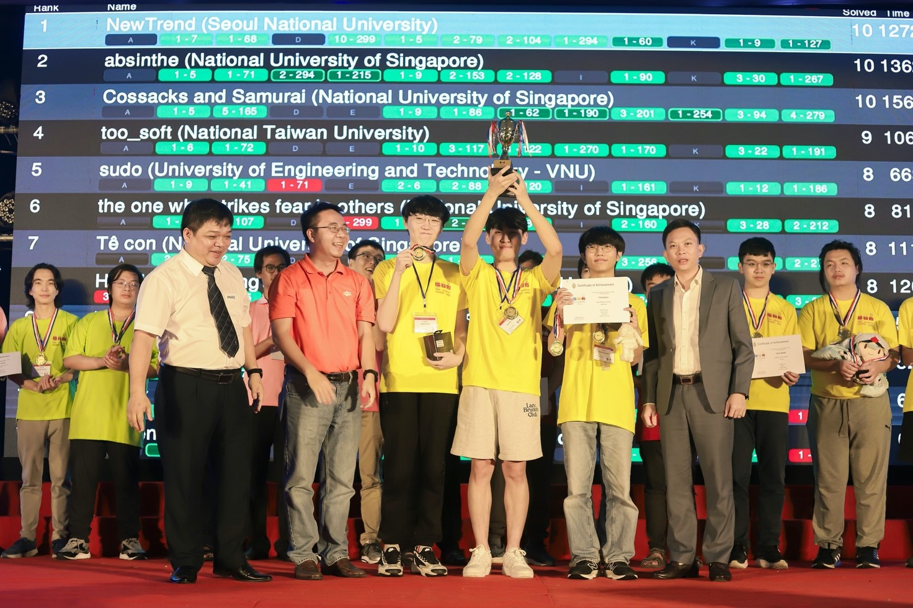

## Về kỳ thi OLP’23 & ICPC Asia Hue City 2023
Kỳ thi Olympic Tin học Sinh viên Việt Nam lần thứ 32, kỳ thi PROCON Việt Nam và kỳ thi Lập trình sinh viên quốc tế ICPC Khu vực Châu Á - TP. Huế năm 2023 được tổ chức tại trường Đại học Khoa học - Đại học Huế vào ngày 05 - 08/12/2023 vừa qua. Kỳ thi năm nay quy tụ gần 700 coders xuất sắc nhất đến từ 78 trường đại học, cao đẳng, học viện trên khắp cả nước; cùng với đó là 20 đội tuyển ICPC Quốc tế tài năng đến từ Singapore, Hàn Quốc, Indonesia, Thái Lan, Philippines và Đài Loan.

Đặc biệt, đối với ICPC, kỳ thi ICPC Khu vực Châu Á - TP. Huế năm 2023 sẽ chọn ra top 10 đội xuất sắc nhất tranh tài tại kỳ thi ICPC Asia Pacific Champion lần đầu tiên được tổ chức tại Hà Nội vào tháng 03/2024, hướng đến kỳ thi ICPC World Finals 2024 được tổ chức tại Kazakhstan.

Đề thi năm nay được đông đảo các bạn thí sinh và các thầy cô huấn luyện viên đánh giá cao, ở việc chất lượng đề thi được đầu tư vô cùng tỉ mỉ và độ khó được phân bố hợp lý. Cùng với đó, hệ thống thi cũng nhận được những phản hồi tích cực từ các bạn thí sinh, kể cả những bạn thí sinh trong nước và những đội tuyển quốc tế.

Bên cạnh những phút giây thi đấu căng thẳng, các bạn thí sinh cùng huấn luyện viên đã có cơ hội tham gia buổi giao lưu giới thiệu công nghệ Teck Trek với những chủ đề hot như BlockChain, Web 3, Phygital, hay AI-ChatGPT. Tại đây, các bạn đã được trực tiếp gặp gỡ và giao lưu với các doanh nghiệp cùng với các tiền bối đi trước, là những “cựu binh” OLP-ICPC (ExIO) với nhiều năm kinh nghiệm trong lĩnh vực lập trình thi đấu cũng như lĩnh vực công nghệ. Đồng thời, các bạn coders còn có những phút giây đáng nhớ trong chuyến tham quan Đại Nội Huế được diễn ra sau kỳ thi.

## VNOI tại kỳ thi OLP’23 & ICPC Asia Hue City 2023
VNOI rất vinh dự và tự hào khi được đồng hành hỗ trợ xuyên suốt kỳ thi. Cùng với đó, đây là năm thứ ba nền tảng VNOJ của VNOI được tin tưởng và sử dụng làm nền tảng tổ chức ICPC Khu vực Châu Á (site thi tại Việt Nam) và Olympic Tin học Sinh viên Việt Nam.

Đặc biệt, kỳ thi ICPC Asia Hue City 2023 là năm đầu tiên máy ảo được ban tổ chức ICPC Việt Nam đưa vào sử dụng. Đây là hệ thống máy thi được thiết kế bởi VNOI dựa trên hệ thống máy thi chính thức của ICPC World Finals 2023, với một vài tính năng mới được phát triển riêng dành cho các kỳ thi ICPC tại Việt Nam như:
VPN: Các máy thí sinh đều sẽ được kết nối tới hệ thống thi cũng như các dịch vụ khác thuộc ICPC thông qua VPN, bao gồm trang thi chính thức, máy in, etc.
Livestream: Màn hình các thí sinh sẽ được ghi lại và phát trực tiếp khi cần thiết, phục vụ cho quá trình livestream, tái hiện khoảnh khắc của thí sinh, cũng như hỗ trợ cho ban tổ chức, coach và khán giả theo dõi được từng bước đi của thí sinh trong giờ thi.
Client máy in: Thay vì sử dụng bảng lệnh cũ, việc in bài nay đã được tích hợp vào client của VNOI.

VNOI rất vui và tự hào khi nhìn chung hệ thống máy thi đã hoạt động vô cùng trơn tru và hiệu quả trong suốt thời gian diễn ra kỳ thi, cũng như mang lại trải nghiệm tốt đến với các bạn thí sinh.

## Kết quả kỳ thi OLP’23 & ICPC Asia Hue City 2023
Trải qua những ngày thi vô cùng cam go và căng thẳng, chủ nhân cho những ngôi vị danh giá đã lộ diện. 

Đối với ICPC, chủ nhân của chức Vô địch đã thuộc về đội NewTrend, một đội tuyển vô cùng xuất sắc đến từ Đại học Quốc gia Seoul (Hàn Quốc). Đặc biệt, kỳ thi đã diễn ra vô cùng gay cấn và căng thẳng, khi những vị trí đầu trong bảng xếp hạng liên tục được thay đổi chủ nhân. Hơn thế nữa, sau khi đóng băng, bảng xếp hạng càng trở nên nhộn nhịp hơn bao giờ hết. Đáng nói, đội Vô địch đã có chiến thắng cực kỳ ngoạn mục và ngoài sức tưởng tượng khi AC bài cuối cùng ở phút thứ 299/300, chỉ vài tích tắc trước khi kỳ thi kết thúc.

Còn đối với phần thi Olympic Tin học Sinh viên, chủ nhân của ngôi vị dẫn đầu các bảng thi như sau:
Vô địch bảng Siêu Cup: Trần Xuân Bách - Trường Đại học Công nghệ, Đại học Quốc gia Hà Nội; đặc biệt, Xuân Bách cũng chính là chủ nhân của tấm Huy chương Vàng IOI 2022 và Huy chương Bạc IOI 2023.
Vô địch bảng Chuyên Tin: Song Đồng Gia Phúc - Trường Đại học Khoa học Tự nhiên, Đại học Quốc gia Thành phố Hồ Chí Minh. Trước khi kết quả được công bố, VNOI đã có cơ hội được gặp và phỏng vấn Gia Phúc, bạn đã có những chia sẻ rất khiêm tốn và chân thành: “Mình đánh giá rất cao về chất lượng lẫn độ khó của đề thi năm nay, việc chia subtask của các bài toán là chìa khóa giúp mình có những hướng đi đúng đắn. Mình biết rằng cuộc thi năm nay sẽ quy tụ rất nhiều thí sinh xuất sắc nên mình chỉ có một mục tiêu nho nhỏ là đạt được giải số”. Nói thêm, trường Đại học Khoa học Tự nhiên - Đại học Quốc gia Thành phố Hồ Chí Minh cũng là trường giành được ngôi vị Nhất Đồng đội bảng Chuyên Tin trong cuộc thi.
Vô địch bảng Không Chuyên & Cao Đẳng: Trịnh Nguyễn Hoàng Vũ - Trường Đại học Công nghiệp Thành phố Hồ Chí Minh. Trường Đại học Công nghiệp Thành phố Hồ Chí Minh là một đại diện mới trong kỳ thi Olympic Tin học Sinh viên cũng như ICPC những năm gần đây, đặc biệt trường đã rất xuất sắc giành được giải Nhất Đồng đội bảng Không Chuyên trong kỳ thi năm nay.

Ngoài những giải thưởng kể trên, ban tổ chức kỳ thi còn trao thêm những giải thưởng dành cho các bạn nữ sinh xuất sắc ở các khối thi. Cụ thể, bạn Phạm Thị Hoài Thu (Đại học Bách khoa Hà Nội) ở khối Chuyên Tin và bạn Phạm Thị Hà Thư (Trường Đại học Kinh tế Quốc dân) ở khối Không Chuyên đã xuất sắc giành được giải thưởng này khi giành được giải Nhất ở khối thi của mình.

