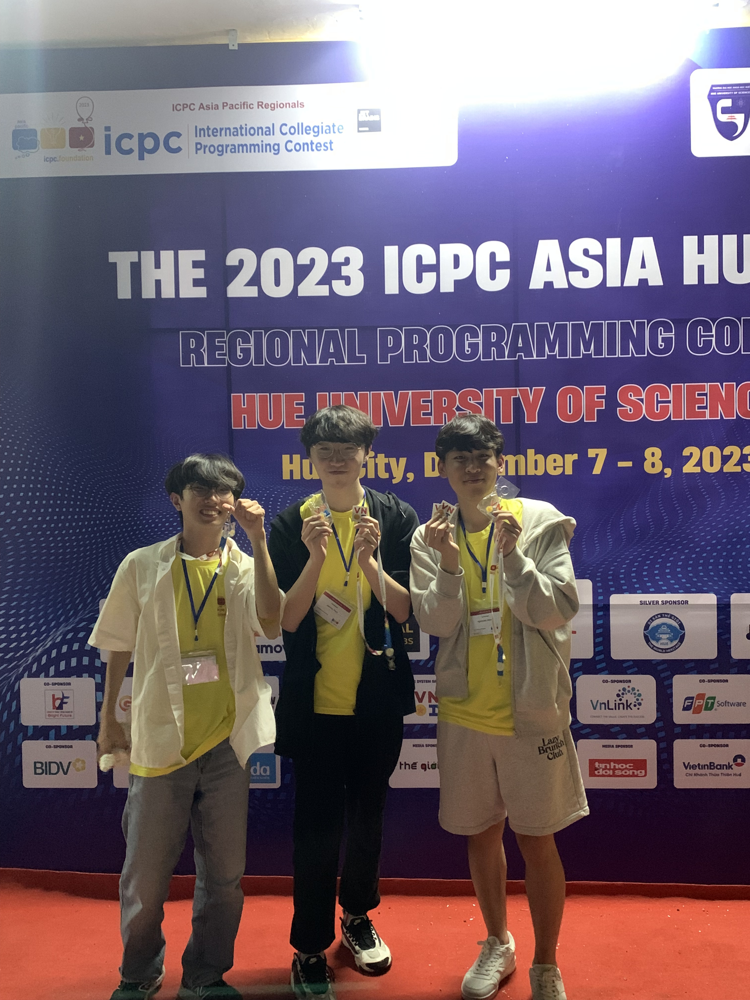
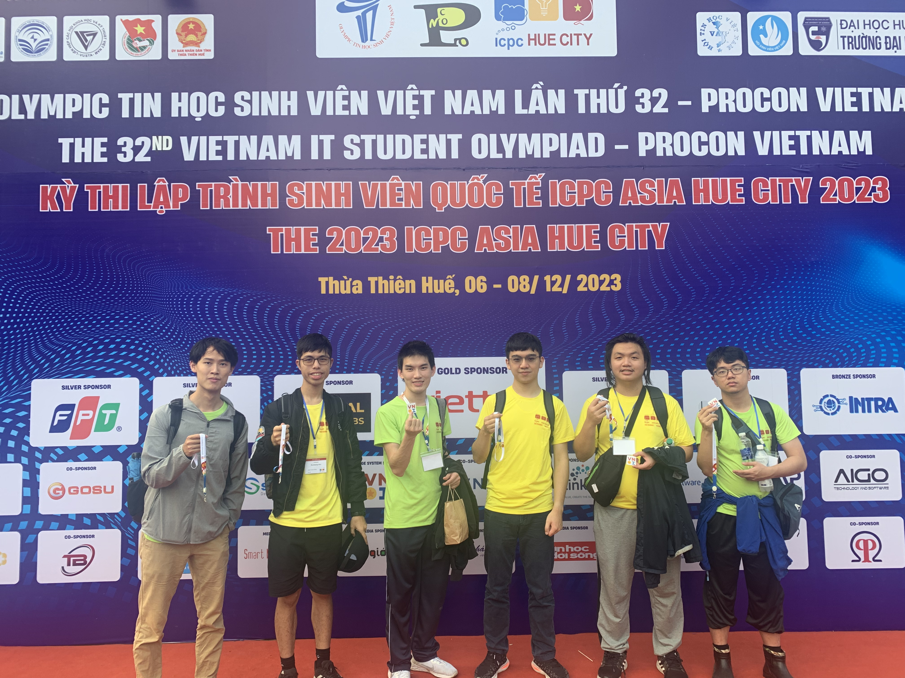
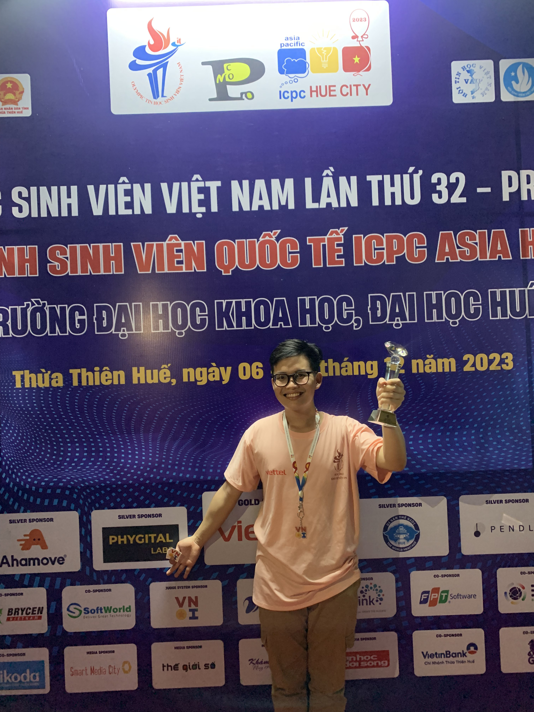
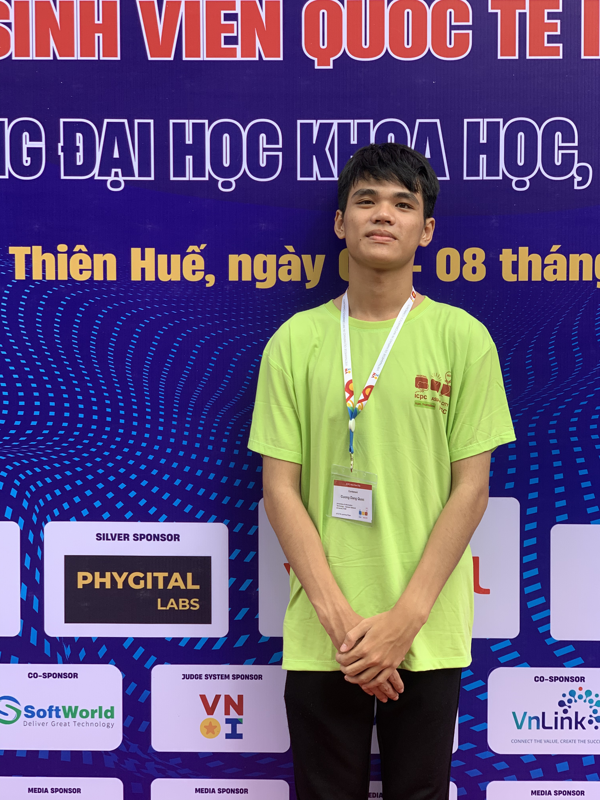
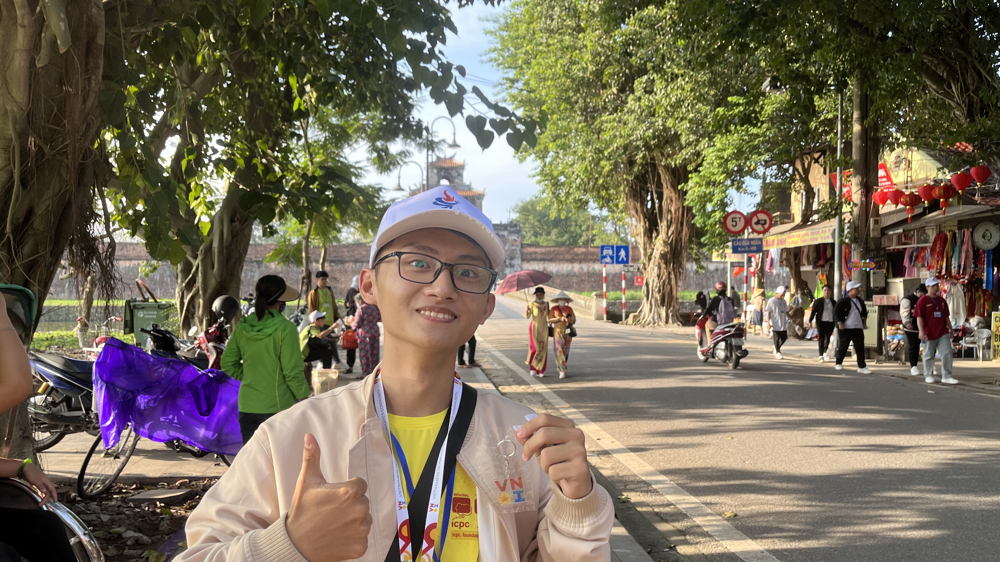
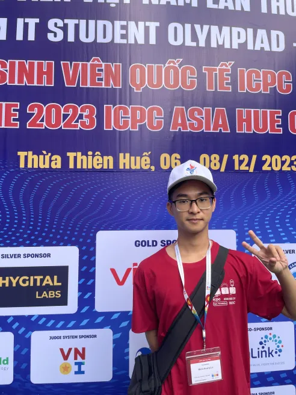
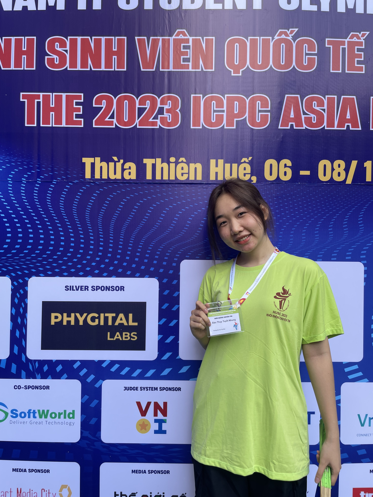
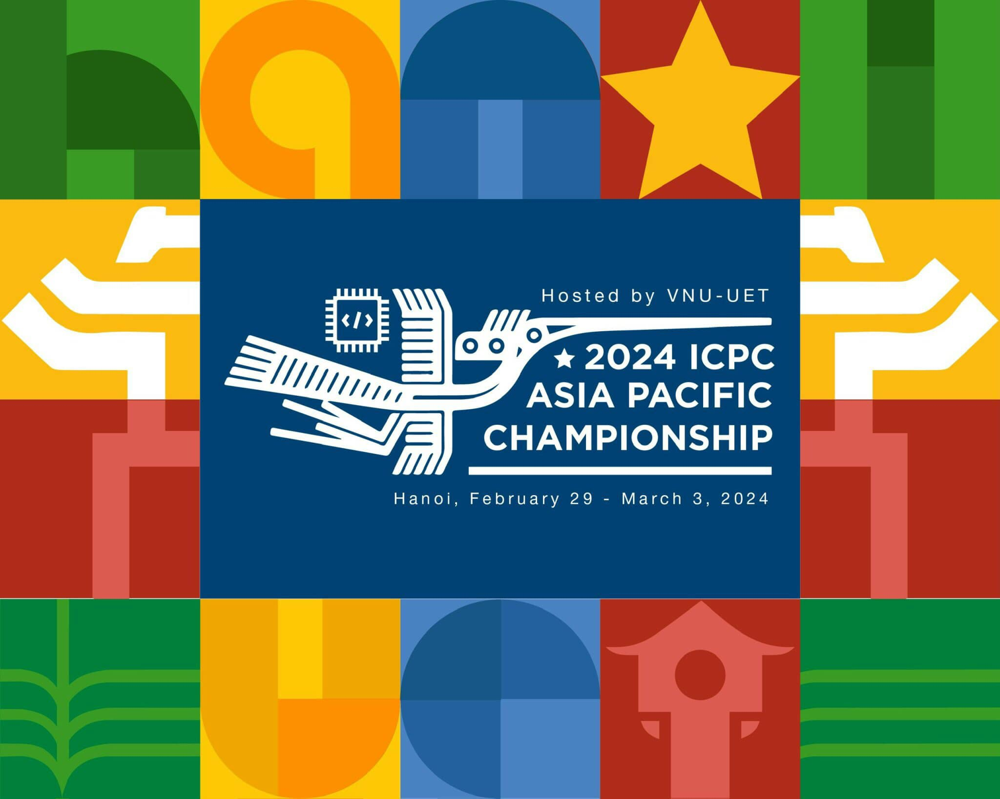
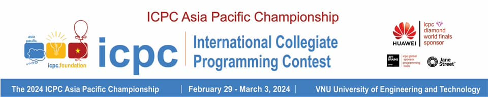

## Về kỳ thi OLP’23 & ICPC Asia Hue City 2023
Kỳ thi Olympic Tin học Sinh viên Việt Nam lần thứ 32, kỳ thi PROCON Việt Nam và kỳ thi Lập trình sinh viên quốc tế ICPC Khu vực Châu Á - TP. Huế năm 2023 được tổ chức tại trường Đại học Khoa học - Đại học Huế vào ngày 05 - 08/12/2023 vừa qua. Kỳ thi năm nay quy tụ gần 700 coders xuất sắc nhất đến từ 78 trường đại học, cao đẳng, học viện trên khắp cả nước; cùng với đó là 20 đội tuyển ICPC Quốc tế tài năng đến từ Singapore, Hàn Quốc, Indonesia, Thái Lan, Philippines và Đài Loan.

Đặc biệt, đối với ICPC, kỳ thi ICPC Khu vực Châu Á - TP. Huế năm 2023 sẽ chọn ra top 10 đội xuất sắc nhất tranh tài tại kỳ thi ICPC Asia Pacific Champion lần đầu tiên được tổ chức tại Hà Nội vào tháng 03/2024, hướng đến kỳ thi ICPC World Finals 2024 được tổ chức tại Kazakhstan.

Đề thi năm nay được đông đảo các bạn thí sinh và các thầy cô huấn luyện viên đánh giá cao, ở việc chất lượng đề thi được đầu tư vô cùng tỉ mỉ và độ khó được phân bố hợp lý. Cùng với đó, hệ thống thi cũng nhận được những phản hồi tích cực từ các bạn thí sinh, kể cả những bạn thí sinh trong nước và những đội tuyển quốc tế.

Bên cạnh những phút giây thi đấu căng thẳng, các bạn thí sinh cùng huấn luyện viên đã có cơ hội tham gia buổi giao lưu giới thiệu công nghệ Teck Trek với những chủ đề hot như BlockChain, Web 3, Phygital, hay AI-ChatGPT. Tại đây, các bạn đã được trực tiếp gặp gỡ và giao lưu với các doanh nghiệp cùng với các tiền bối đi trước, là những “cựu binh” OLP-ICPC (ExIO) với nhiều năm kinh nghiệm trong lĩnh vực lập trình thi đấu cũng như lĩnh vực công nghệ. Đồng thời, các bạn coders còn có những phút giây đáng nhớ trong chuyến tham quan Đại Nội Huế được diễn ra sau kỳ thi.

## VNOI tại kỳ thi OLP’23 & ICPC Asia Hue City 2023
VNOI rất vinh dự và tự hào khi được đồng hành hỗ trợ xuyên suốt kỳ thi. Cùng với đó, đây là năm thứ ba nền tảng VNOJ của VNOI được tin tưởng và sử dụng làm nền tảng tổ chức ICPC Khu vực Châu Á (site thi tại Việt Nam) và Olympic Tin học Sinh viên Việt Nam.

Đặc biệt, kỳ thi ICPC Asia Hue City 2023 là năm đầu tiên máy ảo được ban tổ chức ICPC Việt Nam đưa vào sử dụng. Đây là hệ thống máy thi được thiết kế bởi VNOI dựa trên hệ thống máy thi chính thức của ICPC World Finals 2023, với một vài tính năng mới được phát triển riêng dành cho các kỳ thi ICPC tại Việt Nam như:
- VPN: Các máy thí sinh đều sẽ được kết nối tới hệ thống thi cũng như các dịch vụ khác thuộc ICPC thông qua VPN, bao gồm trang thi chính thức, máy in, etc.
- Livestream: Màn hình các thí sinh sẽ được ghi lại và phát trực tiếp khi cần thiết, phục vụ cho quá trình livestream, tái hiện khoảnh khắc của thí sinh, cũng như hỗ trợ cho ban tổ chức, coach và khán giả theo dõi được từng bước đi của thí sinh trong giờ thi.
- Client máy in: Thay vì sử dụng bảng lệnh cũ, việc in bài nay đã được tích hợp vào client của VNOI.

VNOI rất vui và tự hào khi nhìn chung hệ thống máy thi đã hoạt động vô cùng trơn tru và hiệu quả trong suốt thời gian diễn ra kỳ thi, cũng như mang lại trải nghiệm tốt đến với các bạn thí sinh.

## Kết quả kỳ thi OLP’23 & ICPC Asia Hue City 2023
Trải qua những ngày thi vô cùng cam go và căng thẳng, chủ nhân cho những ngôi vị danh giá đã lộ diện. 

Đối với ICPC, chủ nhân của chức Vô địch đã thuộc về đội NewTrend, một đội tuyển vô cùng xuất sắc đến từ Đại học Quốc gia Seoul (Hàn Quốc). Đặc biệt, kỳ thi đã diễn ra vô cùng gay cấn và căng thẳng, khi những vị trí đầu trong bảng xếp hạng liên tục được thay đổi chủ nhân. Hơn thế nữa, sau khi đóng băng, bảng xếp hạng càng trở nên nhộn nhịp hơn bao giờ hết. Đáng nói, đội Vô địch đã có chiến thắng cực kỳ ngoạn mục và ngoài sức tưởng tượng khi AC bài cuối cùng ở phút thứ 299/300, chỉ vài tích tắc trước khi kỳ thi kết thúc.

Còn đối với phần thi Olympic Tin học Sinh viên, chủ nhân của ngôi vị dẫn đầu các bảng thi như sau:
- Vô địch bảng Siêu Cup: Trần Xuân Bách - Trường Đại học Công nghệ, Đại học Quốc gia Hà Nội; đặc biệt, Xuân Bách cũng chính là chủ nhân của tấm Huy chương Vàng IOI 2022 và Huy chương Bạc IOI 2023.
- Vô địch bảng Chuyên Tin: Song Đồng Gia Phúc - Trường Đại học Khoa học Tự nhiên, Đại học Quốc gia Thành phố Hồ Chí Minh. Nói thêm, trường Đại học Khoa học Tự nhiên - Đại học Quốc gia Thành phố Hồ Chí Minh cũng là trường giành được ngôi vị Nhất Đồng đội bảng Chuyên Tin trong cuộc thi.
- Vô địch bảng Không Chuyên & Cao Đẳng: Trịnh Nguyễn Hoàng Vũ - Trường Đại học Công nghiệp Thành phố Hồ Chí Minh. Trường Đại học Công nghiệp Thành phố Hồ Chí Minh là một đại diện mới trong kỳ thi Olympic Tin học Sinh viên cũng như ICPC những năm gần đây, đặc biệt trường đã rất xuất sắc giành được giải Nhất Đồng đội bảng Không Chuyên trong kỳ thi năm nay.

Ngoài những giải thưởng kể trên, ban tổ chức kỳ thi còn trao thêm những giải thưởng dành cho các bạn nữ sinh xuất sắc ở các khối thi. Cụ thể, bạn Phạm Thị Hoài Thu (Đại học Bách khoa Hà Nội) ở khối Chuyên Tin và bạn Phạm Thị Hà Thư (Trường Đại học Kinh tế Quốc dân) ở khối Không Chuyên đã xuất sắc giành được giải thưởng này khi giành được giải Nhất ở khối thi của mình.

## Cảm xúc của thí sinh sau kỳ thi
### NewTrend - Đại học Quốc Gia Seoul (Hàn Quốc)

**Q: Trước tiên, cảm xúc của các bạn như thế nào sau 5 tiếng đồng hồ thi đấu?** 

A: Tụi mình rất phấn khích. Tụi mình đã giải được thêm 2 bài nữa sau đóng băng. Vì giải được thêm bài sau đóng băng nên tụi mình phấn khích. 

**Q: Mọi người có lẽ cũng cảm nhận được khi thấy các bạn ở trong phòng thi.** 

A: Ừm, tụi mình tự tin rằng mình có thể vô địch cuộc thi lần này. 

**Q: Thậm chí lời giải cuối cùng của các bạn được chấm chỉ vài chục giây trước khi cuộc thi kết thúc. Các bạn có cảm nghĩ gì về đề thi năm nay?**

A: Mình nghĩ đề thi rất tuyệt vời. Các bài toán cũng khá khó để giải, và tụi mình cũng học được nhiều từ bộ đề này. Tụi mình bất ngờ vì một số bài năm nay khá lạ so với các bài của site Việt Nam trong 5 năm trở lại đây. 

**Q: Các bạn đánh giá bộ đề này như thế nào so với các Regional khác?**

A: Các bài lần này cũng đều thú vị như các Regional khác. Những bài thú vị nhất là những bài khó nhất. Dù tụi mình sau cùng không giải được nhưng tụi mình thấy khá hay. 

**Q: Thế còn VNOJ thì sao?**

A: Mình thấy rất tiện vì mình có thể copy-paste code để nộp (thay vì chọn file như DOMjudge). Mình cũng thích tốc độ chấm của VNOJ. Với DOMjudge, nhiều lúc tụi mình phải chờ vài phút để có kết quả. VNOJ thì rất nhanh nên tụi mình có thể nhanh chóng dự đoán sai sót trong bài làm. Nên là tụi mình thích VNOJ. 

**Q: Vậy còn môi trường máy thi của các bạn thì sao?**

A: Môi trường máy thi lần này khá giống ở Seoul Regional. Lúc in code ra giấy thì có hơi chậm hơn so với ở Seoul Regional, nhưng vậy là đủ nhanh rồi. 

**Q: Các bạn có gợi ý gì để chúng mình cải thiện không?**

A: Phòng thi hơi nhỏ. Tụi mình phải ngồi khá sát nhau. 

**Q: Trên thang 1-10, các bạn đánh giá cuộc thi lần này bao nhiêu điểm?**

A: 10/10 vì tụi mình đã có màn thể hiện tốt và đương nhiên cuộc thi vẫn được tổ chức rất tốt nha.

### too_soft & 1RZck - Đại học Quốc Gia Đài Loan

**Q: Sau 5 tiếng thi đấu thì các bạn cảm thấy như thế nào?**

A: Cơ thể tụi mình mệt mỏi và kiệt sức vì nghĩ bài trong thời gian dài. 

**Q: Các bạn nghĩ sao về đề thi năm nay?**

A: Tụi mình nghĩ đề thi rõ ràng và dễ đọc. Các bài có độ khó cân bằng, trái ngược với Regional tại Đài Loan. Chủ đề của và độ khó của các bài được thiết kế tốt. 

**Q: Các bạn có tham gia site Việt Nam các năm trước không?**

A: Không. Nhưng tụi mình có đọc đề năm ngoái của site Việt Nam. Tất nhiên thì đề năm nay khó hơn rồi. 

**Q: Các bạn thấy sao về môi trường máy thi?**

A: Tốt. Code được in khá nhanh. 

**Q: Vậy còn VNOJ?**

A: Tụi mình thấy kết quả chấm đủ nhanh. 

**Q: Trên thang 1-10, các bạn đánh giá cuộc thi lần này như thế nào?**

A: (nhiều thí sinh đưa ra đánh giá khác nhau, hầu hết 8, một vài 7, một 9) 

**Q: Các bạn có gợi ý gì để chúng mình cải thiện không ạ?**

A: Chắc là socola hoặc các loại bánh tương tự. Tụi mình không có nhiều thời gian để ăn uống, nên tụi mình muốn đồ ăn khối lượng nhỏ nhưng nhiều calo.

### Song Đồng Gia Phúc - Trường Đại học Khoa học Tự nhiên, Đại học Quốc gia Thành phố Hồ Chí Minh

“Mình đánh giá rất cao về chất lượng lẫn độ khó của đề thi năm nay, việc chia subtask của các bài toán là chìa khóa giúp mình có những hướng đi đúng đắn. Mình biết rằng cuộc thi năm nay sẽ quy tụ rất nhiều thí sinh xuất sắc nên mình chỉ có một mục tiêu nho nhỏ là đạt được giải số”. 

### Lê Ngọc Bảo Anh - Trường Đại học Bách khoa, Đại học Đà Nẵng 

“Đến với cuộc thi lần này mình không đặt nặng kết quả, chỉ mong đạt được kết quả cao nhất. Đối với mình, máy ảo của kỳ thi rất xịn và tốt, không gặp bất kỳ trục trặc gì; theo thang điểm 10 thì mình đánh giá 8 điểm vì có phần khác một chút so với máy ảo đã được đăng lên trước đó.”

### Đặng Quốc Cường - Trường Đại học Công nghệ Thông tin, Đại học Quốc gia Thành phố Hồ Chí Minh 

“Mình là sinh viên năm nhất nên không đặt nặng vấn đề thành tích, tham gia để trải nghiệm và học hỏi kinh nghiệm là chính. Mình thấy rằng kỳ thi được đầu tư rất là công phu và mọi thứ được chuẩn bị rất kỹ lưỡng.”

### Phan Khắc Duy Long - Trường Đại học Công nghệ Thành phố Hồ Chí Minh 

“Đây là lần đầu tiên mình được thử sức ở kỳ thi này nên mình cảm thấy đề tương đối khó và có phần khó hơn xíu so với các năm. Đây cũng là lần đầu mình được tiếp xúc với máy ảo thi nhưng cũng dễ làm quen. Mình thấy rằng máy chấm tương đối nhanh và ổn định.”

### Lê Minh Hoàng - Trường Đại học Khoa học Tự nhiên, Đại học Quốc gia Thành phố Hồ Chí Minh 

“Mình thấy rằng đề thi và các test không có bất kỳ vấn đề gì, máy thi hoạt động tốt. Về máy ảo, năm ngoái mình lần đầu tiếp xúc nên có phần bỡ ngỡ, còn năm nay mình đã làm quen và dùng tốt hơn; lúc đầu mình hơi gặp khó khăn trong việc kết nối Internet nhưng đã được các anh chị hỗ trợ.”

### Đào Thụy Tuyết Nhung - Trường Đại học Sài Gòn 

“Đến với kỳ thi lần này, mình hy vọng sẽ học hỏi được thêm nhiều kiến thức và có thêm nhiều trải nghiệm. Mình không đặt nặng thành tích vì bản thân khác chuyên ngành Công nghệ thông tin. Mình thấy rằng máy ảo rất tiện và không gặp bất kỳ trục trặc nào, mình đánh giá 10/10 điểm.” 

## Hướng đến The 2023-2024 ICPC Asia Pacific Championship 
VNOI hân hạnh và tự hào khi trở thành đơn vị tin cậy cung cấp hệ thống thi cho kỳ thi lần này với việc không xảy ra sự cố kỹ thuật trong giờ thi. Nhận được những phản hồi tích cực đến từ thí sinh và ban tổ chức là động lực để VNOI phát triển hệ thống thi ngày càng hoàn thiện nhằm đem đến những trải nghiệm thi tốt nhất cho thí sinh qua từng năm. Đây chính là bước đệm vững chắc để VNOI hướng tới The 2023-2024 ICPC Asia Pacific Championship. 

Nối tiếp những thành công của ICPC Asia Hue City 2023 vừa diễn ra, nhằm chọn ra những đội thi xuất sắc đại diện Asia Pacific tham dự Chung kết ICPC toàn cầu năm 2024 tại Kazakhstan, các thi sinh phải cạnh tranh Ngôi vị Vô địch và 16 suất tham dự ICPC World Finals qua Chung kết ICPC Asia Pacific diễn ra vào tháng 3/2024. 

Với thể thức mới được áp dụng từ kỳ ICPC năm nay, Hà Nội chính thức trở thành địa điểm đầu tiên được đăng cai tổ chức Chung kết ICPC Asia Pacific 2024 phối hợp với ICPC Việt Nam và ICPC Asia Pacific. Kỳ thi sẽ được tổ chức trực tiếp thi đấu trong 5 tiếng từ 9h00-14h00 tại Khu thi ICPC tại Trường Đại học Công nghệ, ĐHQG Hà Nội trên Hệ thống chuẩn Quốc tế ICPC được ICPC Toàn cầu và Asia Pacific chỉ định và vận hành, phần mềm giám sát thi đấu của Việt Nam do VNOI vận hành.