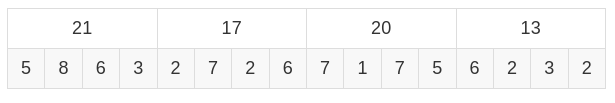
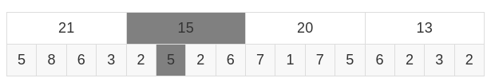
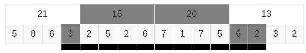
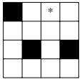
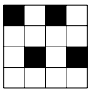
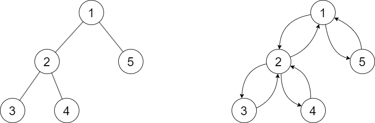
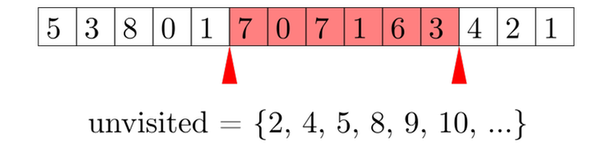

## Lời nói đầu
*Chia căn, một kĩ thuật thú vị, thiên biến vạn hóa qua từng bài tập.*

Những kĩ thuật, thuật toán vận dụng các tính chất của phép căn thường được gọi chung là chia căn. Bài viết được biên soạn nhằm mang đến cho bạn đọc cái nhìn chi tiết nhất về chia căn và những vấn đề liên quan.

Các kĩ thuật được trình bài sẽ đi kèm một vài bài toán ví dụ, được đưa vào giúp bạn đọc dễ hình dung về ứng dụng của kĩ thuật hơn. Chia căn có thể không phải lời giải tối ưu nhất cho bài toán ví dụ. Cài đặt mẫu được cài đặt bằng ngôn ngữ C++.

## 0. Xử lí truy vấn online và offline
Bài viết sẽ nhắc tới hai khái niệm này tương đối nhiều, nên xin phép bạn đọc được giải thích hai khái niệm này.

Hai khái niệm thường được sử dụng trong các bài toán xử lí truy vấn. Cụ thể:
- Xử lí offline: Ta có thể đọc vào tất cả các truy vấn. Sau đó có thể xử lí tuần tự từng truy vấn một hoặc có thể xử lí các truy vấn theo một thứ tự hợp lí khác để giải quyết bài toán hiệu quả.
- Xử lí online:
  - Ta không thể đọc được vào toàn bộ các truy vấn. Thông tin về các truy vấn sẽ được mã hóa, cần xử lí được truy vấn trước đó để giải mã. 
  - Ví dụ khi xử lí truy vấn cần số nguyên $x$, đề bài sẽ cho số nguyên $y$ và $x$ được tính bằng công thức $x = y + \text{ans}$ với $\text{ans}$ là kết quả của truy vấn trước đó. Các truy vấn hoàn toàn bị phụ thuộc vào các truy vấn trước, không có cách nào ngoài việc xử lí tuần tự các truy vấn.

## 1. Chia căn dựa vào phân tích tổng số nguyên dương

Có nhận xét: Nếu số nguyên dương $n$ được tách thành tổng của các số nguyên dương, thì tồn tại không quá $\mathcal{O}(\sqrt n)$ số nguyên dương khác nhau. Vì để cực đại số lượng số khác nhau, ta sẽ chọn những số nhỏ nhất có thể: $1,2,3,...$ Nếu chọn các số nguyên từ $1$ đến $k$, tổng của chúng là $\frac{k(k+1)}{2}$. Vậy nên số lượng giá trị khác nhau không vượt quá $k \le \sqrt{2 \times n}$. Dưới đây là một số bài toán sử dụng tính chất này.

### [Bài toán 1: Codeforces 221D - Little Elephant and Array](https://codeforces.com/problemset/problem/221/D)
#### Tóm tắt đề bài:
Cho mảng $a$ gồm $n \le 10^5$ phần tử, giá trị các phần tử $\le n$. Có $m \le 10^5$ truy vấn $(l,r)$, hãy đếm số lượng giá trị $x$ xuất hiện đúng $x$ lần nằm trong đoạn $a_l,a_{l+1},...,a_r$.

#### Nhận xét:
Để một giá trị $x$ xuất hiện đúng $x$ lần trong một truy vấn nào đó, thì số lần xuất hiện của giá trị này trong mảng $a$ chắc chắn không nhỏ hơn $x$. Ta chỉ quan tâm những giá trị này.

Số lượng giá trị ta cần quan tâm nhiều nhất khi: Có đúng giá trị $1$ xuất hiện $1$ lần, giá trị $2$ xuất hiện $2$ lần,.... Dễ thấy, số lượng giá trị cần quan tâm nhiều nhất là khoảng $\sqrt{2 \times n}$.

Từ đây, trong mỗi truy vấn, ta chỉ cần lần lượt kiểm tra số lần xuất hiện của những giá trị này trong đoạn $a_l,a_{l+1},...,a_r$.

### Bài toán 2:
#### Đề bài:
Cho tập $S$ gồm $n$ xâu khác nhau $S = \{S_1,S_2,...,S_n\}$ có tổng độ dài là $m$ và một xâu mục tiêu $T$. Hỏi có bao nhiêu cách để có thể ghép được xâu $T$ từ $n$ xâu đã cho. Một xâu có thể được sử dụng nhiều lần.

Giới hạn:
- $1 \le n,m \le 10^5$.
- $|T| \le 10^5$.

#### Quy hoạch động:
Có thể sử dụng quy hoạch động để giải bài toán này: Hàm mục tiêu là $\text{count}(i)$, là số lượng cách để ghép được tiền tố $T[0...i]$.

Xin phép bạn đọc không trình bày lời giải quy hoạch động có độ phức tạp $\mathcal{O}(|T|^2)$ hoặc $\mathcal{O}(|T| \times n)$.

Để giải bài toán hiệu quả hơn, nhận xét là có tối đa $\mathcal{O}(\sqrt m)$ độ dài xâu khác nhau trong tâp $S$. Tiếp theo, sử dụng thuật toán  [hash](https://vnoi.info/wiki/algo/string/hash.md) để tính tập $H$ gồm toàn bộ các giá trị hash của các xâu trong $S$. Ta tính được $\text{count}(i)$ bằng cách xét hết các giá trị $p$ mà có tồn tại xâu độ dài $p$ trong tập $S$, tính giá trị hash của xâu con $T[i - p + 1...i]$ rồi kiểm tra xem nó có tồn tại trong $H$ hay không. Ta thu được thuật toán với độ phức tạp $\mathcal{O}(|T| \times \sqrt m)$.

### Bài toán 3:
#### Đề bài:
Cho $n$ vật có khối lượng lần lượt là $w_1, w_2,...,w_n$ và $w_1+w_2+...+w_n=m$. Hãy kiểm tra xem có thể chọn một số vật sao cho tổng khối lượng của chúng là $k$ không?

#### Quy hoạch động cái túi:
Dễ thấy đây là bài quy hoạch động cái túi điển hình có thể giải được trong độ phức tạp thời gian là $\mathcal{O}(n \times m)$.

Để làm tốt hơn, ta có nhận xét đầu tiên là có không quá $\mathcal{O}({\sqrt m})$ khối lượng các nhau, phân các vật có cùng khối lượng vào cùng một nhóm.

Vẫn sử dụng quy hoạch động cái túi: Hàm mục tiêu của ta sẽ là $\text{possible}(i,p)$ là $\text{true}$ hoặc $\text{false}$ tương ứng với sau khi xét xong $i$ nhóm khối lượng đầu tiên, có thể tạo ra được khối lượng $p$ không?

Để chuyển nhãn: $\text{possible}(i,p) = \text{true}$ khi tồn tại $0 \le x \le c_i$ sao cho $\text{possible}(i - 1,p - x \times W_i) = \text{true}$, với $W_i$ là khối lượng của từng vật nhóm $i$ và $c_i$ là số lượng vật trong nhóm $i$. Cài đặt khéo léo để có thể xử lí mỗi nhóm với độ phức tạp thời gian $\mathcal{O}(n)$, ta thu được thuật toán có độ phức tạp $\mathcal{O}(n \times \sqrt m)$.


## 2. Thuật toán Mo
### [Codeforces 86D - Powerful array](https://codeforces.com/problemset/problem/86/D)

#### Tóm tắt đề bài:
Cho mảng $a$ gồm $n \le 2 \times 10^5$ phần tử nguyên dương có giá trị $\le 10^6$. Cho $q \le 2 \times 10^5$ truy vấn $l,r$. Xét đoạn con $a_l,a_{l+1},...,a_r$, với $K_s$ là số lần xuất hiện của giá trị $s$ trong đoạn, **sức mạnh** của đoạn con này là tổng của tất cả các tích $K_s \times K_s \times s$. Với mỗi truy vấn, hãy tính sức mạnh của mảng con đã cho.

#### Thuật toán ngây thơ:
Với mỗi truy vấn, ta dùng vòng lặp để lặp qua từng phần tử $a_l,a_{l+1},...,a_r$ nhằm mục đích đếm số lần xuất hiện của từng giá trị sử dụng mảng đếm. Cuối cùng tính sức mạnh dựa vào mảng đếm hoặc các cấu trúc dữ liệu như `std::unordered_map`. Thuật toán này là không đủ tốt với độ phức tạp $\mathcal{O}(n \times q)$.

#### Thuật toán cải tiến:
Trước tiên ta sẽ cải tiến thuật toán một chút, thay vì tính lại toàn bộ thông tin với từng truy vấn, ta lợi dụng thông tin đã tính ở truy vấn trước đó để giảm số phần tử phải xét.

Ví dụ, nếu trước đó ta xử lí truy vấn $[3, 7]$ và truy vấn kế tiếp là $[1, 6]$, ta nhận thấy hai đoạn con này có chung đoạn $[3, 6]$, ta chỉ phải thêm phần tử $1, 2$ và xóa phần tử $7$ trong mảng đếm, cùng lúc đó tính lại đáp án. Phương pháp này so với khởi tạo lại mảng đếm và đếm lại từ đầu thì có tốt hơn.

Một cách tổng quát, nếu truy vấn trước đó là $[l_i,r_i]$, truy vấn sau là $[l_{i+1},r_{i+1}]$:
- Nếu $l_i < l_{i+1}$, ta cần xóa đoạn $a[l_i,l_i+1,...,l_{i+1} - 1]$.
- Nếu $l_{i+1} < l_i$, ta cần thêm đoạn $a[l_{i+1},l_{i+1}+1,...,l_{i} - 1]$.

Tương tự:
- Nếu $r_i < r_{i+1}$, ta cần thêm đoạn $a[r_i + 1, r_i + 2,...,r_{i+1}]$.
- Nếu $r_{i+1} < r_i$, ta cần xóa đoạn $a[r_i + 1, r_i + 2,...,r_{i+1}]$.

Vậy số lượng phần tử cần thêm/xóa là giữa hai truy vấn là $|l_{i+1}-l_i|+|r_{i+1}-r_i|$. Và số lần cần thêm/xóa qua toàn bộ các truy vấn là: $\sum_{i=1}^{q-1}|l_{i+1}-l_i|+|r_{i+1}-r_i|$.

Nhưng độ phức tạp trong trường hợp tệ nhất của thuật toán trên vẫn là $\mathcal{O}(n \times q)$. Ví dụ với bộ test với $n,q = 2 \times 10^5$ và các truy vấn cố tình được sinh như sau:
$$q_1=[1,1]$$

$$q_2=[200000, 200000]$$

$$q_3=[2,2]$$

$$q_4=[199999, 199999]$$

$$...$$

Có thể thấy khoảng cách giữa hai đầu mút giữa hai truy vấn là rất lớn.

#### Thuật toán Mo:

Dựa vào thực tế là bài toán có thể xử lí offline, ta có cách sắp xếp các truy vấn để đảm bảo độ phức tạp thời gian nằm trong giới hạn cho phép trong mọi trường hợp. Đó chính là mấu chốt của **thuật toán Mo**:
- Chọn hằng số $S$, hằng số này mang giá trị bao nhiêu sẽ được trình bày sau. Ta chia $S$ chỉ số liên tiếp vào một nhóm. Nói cách khác, chỉ số thứ $i$ sẽ được chia vào nhóm $\lfloor \frac{i}{S} \rfloor$. Như vậy ta sẽ có $\frac{n}{S}$ nhóm. Chú ý là $n$ không nhất thiết phải chia hết cho $S$.
- Tiếp theo các truy vấn sẽ được sắp xếp như sau: Với hai truy vấn, nếu đầu mút trái của hai truy vấn nằm ở hai nhóm khác nhau, truy vấn nào có đầu mút trái nhỏ hơn sẽ đứng trước. Ngược lại trong trường hợp đầu mút trái nằm ở cùng một nhóm, truy vấn nào đó đầu mút phải nhỏ hơn sẽ đứng trước. Dưới đây là hàm so sánh khi sắp xếp các truy vấn viết bằng C++:
```cpp
struct query{
    int l, r;  // hai đầu mút của truy vấn
    int id;    // chỉ số của truy vấn, vì sau khi sắp xếp ta sẽ mất thứ tự ban đầu
}

bool cmp(const query &a, const query &b){
    if(a.l / S != b.l / S) // nếu đầu mút trái của hai truy vấn thuộc hai nhóm khác nhau
        return a.l < b.l;  // sắp xếp dựa trên đầu mút trái
       
    // ngược lại sắp xếp dựa trên đầu mút phải
    return a.r < b.r;
}
```

Đánh giá độ phức tạp thuật toán:
- Số lần di chuyển đầu mút trái (từ $l_i$ đến $l_{i+1}$):
  + Nếu $l_i$ và $l_{i+1}$ thuộc cùng một nhóm: Số bước di chuyển là không quá $S$. Vậy độ phức tạp khi di chuyển đầu mút trái thuộc cùng một nhóm là $\mathcal{O}(S \times q)$.
  + Nếu $l_i$ và $l_{i+1}$ khác nhóm: Do đầu nhóm của đầu mút trái đã được sắp xếp không giảm, nên số lần xảy ra trường hợp này không vượt quá số nhóm là $\frac{n}{S}$. Một lần di chuyển có độ phức tạp $\mathcal{O}(n)$, nên tổng độ phức tạp là $\mathcal{O}({\frac{n}{S} \times n})$. Thực tế nếu đánh giá chặt chẽ, tổng độ phức tạp chỉ là $\mathcal{O}(n)$.
- Số lần di chuyển đầu mút phải (từ $r_i$ đến $r_{i+1}$):
  + Nếu $l_i$ và $l_{i+1}$ thuộc cùng một nhóm: Do đầu mút phải được sắp xếp tăng dần nên độ phức tạp khi di chuyển đầu mút phải với các truy vấn có đầu mút trái nằm cùng nhóm là $\mathcal{O}(n)$. Có $\frac{n}{S}$ nhóm, nên tổng độ phức tạp là $\mathcal{O}(\frac{n}{S} \times n)$.
  + Nếu $l_i$ và $l_{i+1}$ khác nhóm: Việc đổi nhóm không xảy ra quá $\frac{n}{S}$ lần nên không có quá $\frac{n}{S}$ lần những truy vấn này xảy ra và độ phức tạp khi di chuyển đầu mút phải là $\mathcal{O}(n)$, nên tổng độ phức tạp là $\mathcal{O} (\frac{n}{S} \times n)$.
- Độ phức tạp cuối cùng là $\mathcal{O}(n + S \times q + 2 \times \frac{n^2}{S})$. Khi đó độ phức tạp nhỏ nhất khi $S \times q + 2 \times \frac{n^2}{S}$ nhỏ nhất, đồng nghĩa với việc $S \times q = 2 \times \frac{n^2}{S}$ theo [bất đẳng thức AM-GM](https://en.wikipedia.org/wiki/AM%E2%80%93GM_inequality#).
- Từ đây ta chọn $S = \sqrt{2 \times \frac{n^2}{q}}$ là tối ưu. Thuật toán có độ phức tạp cuối cùng là $\mathcal{O}(n \times \sqrt q)$.

#### Cài đặt mẫu
Phần cài đặt còn lại có thể như sau:
```cpp
// Tham số value là giá trị cần thêm hoặc xóa
// Tham số delta là 1 tương ứng với thêm, -1 là xóa

long long current_answer = 0;

void update(long long value, int delta){
    current_answer -= cnt[value] * cnt[value] * value * delta;
    cnt[val] += delta;
    current_answer += cnt[value] * cnt[value] * value * delta;
}

int main(){
    //...
    
    sort(q + 1, q + Q + 1, cmp);

    int l = 1, r = 0;
    for(int i = 1; i <= Q; i++){
        while(l < q[i].l) update(a[l++], -1);
        while(l > q[i].l) update(a[--l], 1);
        while(r < q[i].r) update(a[++r], 1);
        while(r > q[i].r) update(a[r--], -1);
        ans[q[i].id] = current_answer;
    }
    
    //...
}
```

### Bài tập:
- [VNOJ - D-Query](https://oj.vnoi.info/problem/dquery)
- [Codeforces 877E - Ann and books](https://codeforces.com/contest/877/problem/F)
- [MarisaOJ - Tần suất](https://marisaoj.com/problem/261)
- [Codeforces 617E - XOR and Favorite Number](https://codeforces.com/problemset/problem/617/E)

## 3. Chia block
Đây là một kĩ thuật cũng thường được sử dụng để xử lí truy vấn trên mảng. Khác với thuật toán Mo, phương pháp chia căn xử lí truy vấn cập nhật và trả lời truy vấn online dễ dàng hơn.

### [Bài toán 1: VNOJ - Point update, range query](https://oj.vnoi.info/problem/sqrt_a)
#### Tóm tắt đề bài:
Cho mảng $a$ gồm $n$ phần tử nguyên. Cho $q$ truy vấn thuộc một trong hai dạng:
- `1 i x`: Gán $a_i=x$.
- `2 l r`: Tính tổng các phần tử  $a_l,a_{l+1},...,a_r$.

Giới hạn:
- $1 \le n,q \le 10^5$
- $1 \le x \le 10^9$
- $1 \le l \le r \le n$

#### Thuật toán ngây thơ:
Ngoài thuật toán trâu nhất có thể, ta có thể xây dựng mảng cộng dồn cho các phần tử trong mảng. Với mỗi truy vấn cập nhật, ta sẽ xây dựng lại mảng cộng dồn với độ phức tạp thời gian $\mathcal{O}(n)$. Mỗi truy vấn tính tổng, ta có thể trả lời truy vấn với độ phức tạp thời gian $\mathcal{O}(1)$. Độ phức tạp của cả bài toán là $\mathcal{O}(n \times q)$.

Vấn đề của thuật toán này thời gian cập nhật lại mảng quá lâu, trong khi trả lời truy vấn lại rất tốc độ. Ta cần tìm cách cân bằng lại độ phức tạp thời gian của hai loại truy vấn này.

#### Chia block:
Chọn một hằng số $S = \sqrt n$, tương tự như thuật toán Mo, ta chia các phần tử thành nhóm $S$ phần tử liên tiếp, như vậy sẽ có $\frac{n}{S} = \sqrt n$ nhóm. Nói cách khác, phần tử thứ $i$ thuộc nhóm $\lfloor \frac{i}{S} \rfloor$:

$$\underbrace{a_0 \; a_1 \ldots a_{S-1}}_{\text{Group 0}} \;\underbrace{a_S \; a_{S+1} \ldots a_{2 \times S-1}}_{\text{Group 1}}\ldots\underbrace{a_{t \times S} \; a_{t \times S+1} \ldots a_{t \times S-1}}_{\text{Group t}} \ldots$$

Ví dụ với dãy $a$ có $n=16$ phần tử, ta chọn $S=4$ và chia thành dãy thành $4$ block.



Xử lí truy vấn cập nhật $(i,x)$: Ta chỉ cần thay đổi $a_i$ cũng như tổng của các phần tử trong block chứa $a_i$. Độ phức tạp của thao tác này là $\mathcal{O}(1)$. Ví dụ phần tử mang giá trị $7$ được cập nhật thành $5$, thì tổng của block đó cũng được cập nhật thành $15$.



Xử lí truy vấn tính tổng $(l,r)$: Ta tính tổng những block nằm gọn trong đoạn truy vấn và một số phần tử lẻ ra ở hai bên. Như ví dụ, tổng của đoạn truy vấn là $3 + (15) + (20) + 6 + 2 = 46$



Có không quá $\sqrt n$ block, và số lượng phần tử thừa ra hai bên không vượt quá $2 \times \sqrt n$ nên truy vấn tính tổng cùa độ phức tạp $\mathcal{O}(\sqrt n)$.

Độ phức tạp của bài toán là $\mathcal{O}(q \times \sqrt n)$.


#### Cài đặt:
Phần khởi tạo: Thực hiện tính trước block của từng chỉ số, vì phép chia chạy lâu hơn những toán tử khác.
```cpp
int B[maxN];
int lazy[maxN], sum[maxN];
int n, q;


void init(){ 
    for(int i = 0; i < n; i++){
        B[i] = i / S;
        sum[B[i]] += a[i];
    }
}
```
Truy vấn cập nhật:
```cpp
void update(int i, int x){
    sum[B[i]] -= a[i];
    a[i] = x;
    sum[B[i]] += a[i];
}
```
Truy vấn tính tổng:
```cpp
int sum(int l, int r){
    int answer = 0;
    
    // Tính tổng những phần thừa hai bên
    for(int i = max(l, B[l] * S); i < B[l] * (S + 1); i++){
        answer += a[i];
    }
    for(int i = B[r] * S; i < min(r + 1, B[r] * (S + 1)); i++){
        answer += a[i];
    }
    
    // Tính tổng những block nằm hoàn toàn trong truy vấn
    for(int i = B[l] + 1; i < B[r]; i++){
        answer += sum[i];
    }
    
    return answer;
}
```

### [Bài toán 2: MarisaOJ - Yếu vị](https://marisaoj.com/problem/532)

#### Tóm tắt đề bài:
Cho một mảng $A$ gồm $n$ phần tử nguyên dương. Cho $q$ truy vấn có dạng $(l,r)$, hãy tìm số lần xuất hiện của phần tử xuất hiện nhiều nhất (số yếu vị) trong đoạn $A_l,A_{l+1},...,A_r$. **Các truy vấn phải xử lí online.**

Giới hạn:
- $1 \le n,q,a_i \le 2 \times 10^5$.

#### Chia block:
Ở bài toán này, ta cũng chia mảng đã cho thành $T = \frac{n}{S}$ block liên tiếp, mỗi block gồm $S$ phần tử.

Với bài toán 1, ta tính tổng của các số trong từng block. Trong các truy vấn, ta lại cộng tổng của từng block lại.

Ở bài toán này, ta cũng có thể dễ dàng tìm được giá trị xuất hiện nhiều nhất trong một block cùng số lần xuất hiện của nó. Nhưng liệu có tồn tại cách để kết hợp đáp án các block lại một cách hiệu quả?

Vì vậy, ta sẽ có cách tiếp cận khác.

Định nghĩa $\text{mode}(i,j)$ giá trị xuất hiện nhiều nhất trong các **block** $i,i+1,...,j$. Ta sẽ tính trước toàn bộ $\text{mode}(i,j)$ với $1 \le i < j \le T$.

Nếu truy vấn $l,r$ bao toàn bộ các block $k,k+1,...,p$. Có thể khẳng định trị xuất hiện nhiều nhất trong đoạn $A_{l...r}$ sẽ là $\text{mode}(k,p)$ hoặc một giá trị nằm trong phần thừa ở hai bên. 
> Chứng minh: Giả sử giá trị xuất hiện nhiều nhất là $x$ không phải $\text{mode}(k,p)$ cũng như không nằm trong phần thừa, thì $x$ chắc chắn chỉ xuất hiện trong các block $k,k+1,...,p$. Nhưng điều này đồng nghĩa với việc $x$ chính là $\text{mode}(k,p)$. Vậy có thể kết luận điều này không xảy ra!

Như vậy có nhiều nhất $2 \times S + 1$ ứng viên cho số yếu vị của đoạn $A_{l...r}$, nhiệm vụ còn lại là kiểm tra lần lượt từng giá trị này, đếm số lần xuất hiện trong đoạn truy vấn, và chọn ra giá trị xuất hiện nhiều nhất. Đếm số lần xuất hiện của một giá trị trên một đoạn con liên tiếp là bài toán cơ bản sử dụng tìm kiếm nhị phân.

Với thuật toán này, phần tính trước $\text{mode}$ có độ phức tạp $\mathcal{O}(n \times T)$ và phần truy vấn có độ phức tạp $\mathcal{O}(q \times S \times \log n)$. Nhận thấy chênh lệch về độ phức tạp thời gian giữa hai thao tác, không nhất thiết chọn $S = \sqrt n$ để đạt được độ phức tạp tổng thể tốt nhất.

Bài toán cũng tồn tại lời giải với độ phức tạp $\mathcal{O}((n + q) \sqrt n)$.

### Nhận xét:
Nhìn chung các bài toán sử dụng kĩ thuật chia block đều quy về việc xử lí được các block nguyên và phần thừa hai bên. Kĩ thuật có phần linh hoạt hơn thuật toán Mo do có thể hỗ trợ các thao tác cập nhật, cũng như trả lời được các truy vấn online.

### Bài tập:
- [VNOJ - Inversion counting](https://oj.vnoi.info/problem/sqrt_f)
- [VNOJ - Minimum distance](https://oj.vnoi.info/problem/sqrt_h)
- [VNOJ - Vua Kẹo](https://oj.vnoi.info/problem/sqrt_g)
- [Codeforces 13E - Holes](https://codeforces.com/problemset/problem/13/E)
- [Codechef - FNCS](https://www.codechef.com/problems/FNCS)


## 4. Chia "nặng" và "nhẹ"
Kĩ thuật chia các "đối tượng", ở đây có thể là các truy vấn, đỉnh, xâu,..., thành hai nhóm "nặng" và "nhẹ" để có cách xử lí phù hợp.

Một nhận xét quan trọng thường được sử dụng trong kĩ thuật này: Nếu ta phân tích số nguyên dương $n$ thành tổng của các số nguyên dương khác (không nhất thiết phải đôi một phân biệt), có không quá $\sqrt n$ số có giá trị lớn hơn hoặc bằng $\sqrt n$.

### [Bài toán 1: MarisaOJ - Truy vấn cây](https://marisaoj.com/problem/260)
#### Tóm tắt đề bài:
Cho cây gồm $n$ đỉnh, trên mỗi đỉnh là giá trị $0$. Cho $q$ truy vấn thuộc một trong hai dạng:
- `1 u d`: Tăng các giá trị trên các đỉnh kề với $u$ thêm $d$.
- `2 u`: Tìm giá trị trên đỉnh $u$.

Giới hạn:
- $1 \le n,q \le 10^5$.
- $1 \le u \le n$.
- $1 \le d \le 10^9$.

#### Thuật toán ngây thơ:
Thuật toán đơn giản nhất chính là với mỗi truy vấn cập nhật, duyệt qua toàn bộ đỉnh kề của $u$ và tăng giá trị trên các đỉnh này. Trong trường hợp tệ nhất, thuật toán có độ phức tạp $\mathcal{O}(n \times q)$.

Vậy trường hợp tốt hơn thì sao? Đó là khi số lượng đỉnh kề, hay còn gọi là bậc, của $u$ không quá nhiều.

#### Chia "nặng" và "nhẹ":
Từ đây phân loại các đỉnh vào hai nhóm:
- **Nặng** gồm các đỉnh có bậc lớn hơn $\sqrt n$.
- **Nhẹ** gồm các đỉnh còn lại, bậc nhỏ hơn hoặc bằng $\sqrt n$.

Để xử lí các truy vấn có đỉnh nhẹ, ta hoàn toàn có thể sử dụng thuật toán ngây thơ ở trên do số lượng đỉnh kề nhỏ. Thao tác xử lí những truy vấn đỉnh nhẹ có độ phức tạp $\mathcal{O}(\sqrt n)$.

Để xử lí các truy vấn đỉnh nặng, ta có nhận xét: Tổng bậc của $n$ đỉnh là $2 \times (n - 1)$. Lí do vì với mỗi cạnh sẽ làm tăng giá trị tổng này lên $2$. Từ đây ta suy ra được số lượng đỉnh nặng sẽ không vượt quá $\sqrt{2 \times n}$.

Với mỗi truy vấn cập nhật đỉnh nặng $u$, ta sẽ sử dụng mảng $\text{lazy}$ và tăng $\text{lazy}_u$ lên $d$ để đánh dấu đỉnh này đã được cập nhật thêm $d$. Thao tác xử lí cập nhật đỉnh nặng có độ phức tạp $\mathcal{O}(1)$.

Với các truy vấn trả lời giá trị trên đỉnh $u$, ngoài các giá trị đã được cập nhật trực tiếp qua các truy vấn đỉnh nhẹ, cần tính tổng $\text{lazy}_v$ với $v$ là các đỉnh kề của $u$. Dĩ nhiên khi tính tổng $\text{lazy}$, chỉ cần quan tâm đến các đỉnh $v$ nặng, mà có không quá $\sqrt{2 \times n}$ đỉnh nặng nên các truy vấn trả lời có thể xử lí trong độ phức tạp $\mathcal{O}(\sqrt n)$.

### [Bài toán 2: Codeforces 1207F - Remainder Problem](https://codeforces.com/contest/1207/problem/F)

#### Tóm tắt đề bài:
Cho mảng $a$ gồm $500000$ số nguyên được đánh số từ $1$ đến $500000$. Ban đầu tất cả các phần tử đều là $0$.

Cho $q \le 5 \times 10^5$ truy vấn thuộc một trong hai dạng:
- `1 x y`: Tăng $a_x$ lên $y$.
- `2 x y`: Tính tổng các phần tử trong mảng mà có chỉ số chia $x$ dư $y$.

#### Thuật toán ngây thơ:
Với loại truy vấn đầu tiên, chỉ đơn giản phần tử có chỉ số $x$ lên $y$.

Trong truy vấn thứ hai, ta sẽ xét toàn bộ các chỉ số thỏa mãn (khoảng $\frac{500000}{x}$ chỉ số) để tính tổng. Có thể thấy khi $x$ đủ lớn thì truy vấn sẽ chạy tương đối nhanh.

#### Chia "nặng" và "nhẹ":
Đặt $S = \sqrt {500000}$.

Từ đây phân loại các truy vấn vào hai nhóm:
- **Nặng** gồm các truy vấn có $x$ lớn hơn $S$. Các truy vấn này dễ dàng có thể được xử lí bằng thuật toán ngây thơ ở trên. Độ phức tạp thời gian là $\mathcal{O}(q \times S)$.
- **Nhẹ** gồm các truy vấn còn lại, có $x$ nhỏ hơn hoặc bằng $S$.

Để xử lí các truy vấn nhẹ, ta sẽ lưu $\text{sum}(d, m)$ với $1 \le m \le S, 0 \le d < m$ là tổng của những chỉ số chia $m$ dư $d$. Khi thực hiện cập nhật vị trí $i$, với từng $1 \le m' \le m$, ta cập nhật lại $\text{sum}(i \mod m', m')$. Còn khi truy vấn, nếu $x \le S$ thì in ra $\text{sum}(y,x)$.

Thuật toán có độ phức tạp $\mathcal{O}((n + q) \times S)$.

### Nhận xét:
Khi chia các đối tượng ra thành "nặng" và "nhẹ", ta sẽ cần hai cách xử lí khác nhau. Thông thường một trong số chúng sẽ là thuật toán ngây thơ. Từ đây ta có hướng suy nghĩ để tìm ra lời giải trong dạng bài tập này: Tìm ra thuật toán vô cùng ngây thơ, trong trường hợp nào thì nó hiệu quả, và trong trường hợp không hiệu quả thì ta cần có cách giải quyết khác là gì?

### Bài tập:
- [VNOJ - DeMen100ns và thành phố](https://oj.vnoi.info/problem/sqrt2_e)
- [MarisaOJ - Đỉnh gần nhất](https://marisaoj.com/problem/264)
- [Codechef - KOL15C](https://www.codechef.com/problems/KOL15C)
- [MarisaOJ - Màu thống trị](https://marisaoj.com/problem/281)
- [MarisaOJ - Đếm xâu 3](https://marisaoj.com/problem/258)
- [VNOJ - Demen và những truy vấn lẻ](https://oj.vnoi.info/problem/sqrt2_h)
- [VNOJ - Subset sums](https://oj.vnoi.info/problem/sqrt2_f)

## 5. Chia căn truy vấn
Các thao tác cập nhật xuất hiện rất nhiều trong các bài toán xử lí truy vấn. Đôi khi, việc xử lí thao tác cập nhật khá khó, hoặc thậm chí không tồn tại cách cập nhật trực tiếp một cách hiệu quả. Đây chính là lúc kĩ thuật chia căn truy vấn tỏa sáng!

Kĩ thuật sẽ chia các truy vấn thành một số nhóm nhỏ, và sẽ chỉ thực hiện cập nhật cấu trúc (mảng, cây,...) sau khi xét xong một nhóm truy vấn.

### Bài toán 1:
#### Đề bài:
Cho một bảng hình chữ nhật gồm $n$ ô. Ban đầu các ô trong bảng đều có màu trắng ngoại trừ một ô. Thực hiện $n - 1$ truy vấn, mỗi truy vấn bạn cần tính khoảng cách từ một ô trắng được chỉ định tới ô đen gần nhất, rồi tô đen ô trắng đó.

Ví dụ với bảng sau:




Khoảng cách từ ô trắng mang dấu *\** đến ô đen gần nhất là $2$, vì có thể đi sang bên trái hai bước để đến một ô đen. Sau đó tô đen ô này:




#### Chia căn truy vấn:
Ta có $q$ truy vấn, và sẽ chia chúng thành các nhóm $\sqrt n$ truy vấn liên tiếp: $[1, 2,...,\sqrt n], [\sqrt n+1,\sqrt n+2...,2 \times \sqrt n],...$

Khi xử lí hết một nhóm truy vấn, ta mới thực hiện tô đen những ô này trên bảng. Từ đây ta có hai trường hợp.
- Với những ô đen đã được tô trên bảng: Thực hiện thuật toán BFS đa nguồn để tính với mỗi ô trắng khoảng cách gần nhất tới một ô đen. Thao tác này có độ phức tạp $\mathcal{O}(n)$.
- Với những ô đen chưa được tô nhưng nằm trước truy vấn đang xét: Chỉ cần xét toàn bộ những ô đen này và chọn ra ô có khoảng cách nhỏ nhất. Do có không quá $\sqrt n$ ô đen cần xét nên độ phức tạp của thao tác này là $\mathcal{O}(\sqrt n)$.

Ta thực hiện thao tác thứ nhất $\sqrt n$ lần, và với mỗi truy vấn thực hiện thao tác thứ hai, lời giải này có độ phức tạp $\mathcal{O}(n \sqrt n)$.

### [Bài toán 2: VNOJ - Dynamic connectivity](https://oj.vnoi.info/problem/sqrt2_a)
#### Tóm tắt đề bài:
Cho đồ thị gồm $n$ đỉnh và $m$ cạnh. Cho $q$ truy vấn thuộc các dạng sau:
- `1 u v`: Thêm cạnh giữa đỉnh $u$ và $v$.
- `2 u v`: Xóa cạnh giữa đỉnh $u$ và $v$, đảm bảo tồn tại cạnh nối $u$ và $v$.

Hãy đếm số lượng thành phần liên thông trong đồ thị sau mỗi truy vấn.

Giới hạn:
- $1 \le n,m,q \le 10^5$

#### Chia căn truy vấn:
Nếu không có truy vấn xóa cạnh, có thể xử lí bài toán tương đối nhanh gọn với cấu trúc dữ liệu [Disjoint Set Union](https://vnoi.info/wiki/algo/data-structures/disjoint-set.md).

DSU không hỗ trợ truy vấn xóa cạnh, nên ta chia các truy vấn thành các nhóm $\sqrt q$ truy vấn.

Lần lượt xử lí các nhóm truy vấn. Trước khi xử lí đến nhóm thứ $p$, ta dựng DSU, lần lượt thêm các cạnh thỏa mãn các điều kiện:
- Tồn tại trong đồ thị khi thực hiện hết các truy vấn trước nhóm $p$.
- Không tồn tại truy vấn xóa cạnh này trong nhóm $p$. Sở dĩ phải thêm điều kiện này để tránh thao tác xóa rất khó thực hiện. Ngược lại, thao tác thêm thì rất dễ.

Bắt đầu xử lí lần lượt từng truy vấn trong nhóm $p$: Xét những truy vấn nằm trước nó và thuộc nhóm $p$ để tìm ra những cạnh phải thêm. Không tồn tại cạnh phải xóa, vì trong DSU không có cạnh nào phải xóa được thêm vào.

Ta đánh chỉ số cho các thành phần liên thông trong DSU, gọi $\text{index}_a$ là chỉ số của đỉnh thành phần liên thông chứa đỉnh $a$. Khi xét thêm cạnh $(u,v)$, không trực tiếp thêm vào DSU, mà ta tạo một đồ thị mới và nối hai đỉnh $\text{index}_u$ và $\text{index}_v$.

Dễ thấy đáp án cho mỗi truy vấn lúc này là: (số thành phần liên thông trong DSU - số đỉnh trong đồ thị mới + số thành phần liên thông trong đồ thị mới). Độ phức tạp thời gian của bài toán đủ tốt.

### Nhận xét:
Bằng cách chia căn truy vấn, các bài toán đều được giải với các cách làm đơn giản và gần gũi hơn. Việc cập nhật lại cả cấu trúc tuy có độ phức tạp lớn nhưng không cần thực hiện nhiều, thu được một thuật toán khá hiệu quả.

### Bài tập:
- [VNOJ - Minimum Distance](https://oj.vnoi.info/problem/sqrt2_d)
- [Codeforces 455D - Serega and Fun](https://codeforces.com/contest/455/problem/D)
- [Codeforces 1619H - Permutation and Queries](https://codeforces.com/contest/1619/problem/H)
- [VNOJ - Line queries](https://oj.vnoi.info/problem/sqrt2_b)
- [Codeforces 487D - Conveyor Belts](https://codeforces.com/contest/487/problem/D)

## Mở rộng
## 0. Chọn hằng số phù hợp
Như đã nói ở trên, việc lựa chọn hằng số phù hợp sẽ ảnh hưởng rất lớn đến độ phức tạp thời gian, không gian. Ví dụ mỗi truy vấn phải xử lí hai thao tác có độ phức tạp lần lượt là $\mathcal{O}(\frac{n}{S})$ và $\mathcal{O}(\log n \times S)$, chọn $S = \sqrt \frac{n}{\log n}$ sẽ cho ta độ phức tạp của hai thao tác là $\mathcal{O}(\sqrt{n \times \log n}).$

Tuy nhiên không phải hằng số trên lí thuyết này sẽ cho ra thời gian chạy tốt nhất. Lấy ví dụ bài toán [Codeforces 86D - Powerful array](https://codeforces.com/problemset/problem/86/D) được trình bày ở phần thuật toán Mo. Trên lí thuyết việc lựa chọn $S = \sqrt{2 \times \frac{n^2}{q}}$ cho ra độ phức tạp thời gian tốt nhất. Để kiểm chứng, người viết đã sử dụng cùng một code và thử một số hằng số $S$ khác nhau, nộp bài sử dụng C++17:

$$
\begin{array}{|l|l|}
\hline
S & Time\\ 
\hline
& \\ 
\sqrt \frac{n^2}{q}   & 4086 ms  \\

\hline
& \\ 
\sqrt{2 \times \frac{n^2}{q}} & 3618 ms\\

\hline
& \\ 
\sqrt{3 \times \frac{n^2}{q}}  & 3462 ms \\

\hline
& \\ 
2 \times \sqrt \frac{n^2}{q} & 3118 ms \\

\hline
& \\ 
\sqrt{5 \times \frac{n^2}{q}} & 2620 ms \\
\hline
\end{array}$$

Có thể thấy việc chọn $S=\sqrt{5 \times \frac{n^2}{q}}$ khiến code chạy nhanh hơn đáng kể. Thời gian chạy của code phụ thuộc vào nhiều yếu tố nên khá khó tính được chính xác hằng số $S$ phù hợp.

Thay vào đó, ta có thể sinh một số test và chạy thử nghiệm với một vài hằng số $S$ khác nhau. Sau đó chọn ra giá trị $S$ cho thời gian chạy tốt nhất.

## 1. Thuật toán Mo có truy vấn cập nhật
Như ta đã biết thuật toán Mo bình thường như trình bày ở trên sẽ không hỗ trợ truy vấn cập nhật. Nhưng có thể điều chỉnh lại thuật toán một chút để có thể xử lí được truy vấn cập nhật.

### [Bài toán: VNOJ - Point Update Range Query](https://oj.vnoi.info/problem/sqrt_a)
Cho mảng $a$ gồm $n$ phần tử nguyên. Cho $q$ truy vấn thuộc một trong hai dạng:
- `1 i x`: Gán $a_i=x$.
- `2 l r`: Tính tổng các phần tử  $a_l,a_{l+1},...,a_r$.

Giới hạn:
- $1 \le n,q \le 10^5$
- $1 \le x \le 10^9$
- $1 \le l \le r \le n$


### Thuật toán Mo:
Nếu nói thuật toán Mo không xử lí được truy vấn cập nhật thì cũng không hoàn toàn đúng, chỉ là độ phức tạp thời gian khá tệ.

Khi chuyển từ truy vấn trả lời này sang truy vấn trả lời khác, sẽ có những truy vấn cập nhật nằm giữa những truy vấn này trong thứ tự đọc vào ban đầu. Vì vậy, nên ta phải thực hiện những truy vấn cập nhật, hoặc đảo ngược lại những truy vấn cập nhật nằm ở giữa chúng.

Số lượng truy vấn cập nhật giữa hai truy vấn trả lời vẫn có thể lên tới $\mathcal{O}(n)$.

Tương tự như thuật toán Mo, ta sẽ có cách để sắp xếp lại các truy vấn để đảm bảo việc tổng số lần cập nhật hoặc đảo ngược cập nhật giữa các truy vấn là chấp nhận được.

### Thuật toán Mo có truy vấn cập nhật:
Tương tự thuật toán Mo, ta sẽ chia $S$ chỉ số liên tiếp vào một nhóm. Ta sắp xếp các truy vấn với các tiêu chí lần lượt như sau:
- Chỉ số nhóm của đầu mút trái.
- Sau đó đến chỉ số nhóm của đầu mút phải. 
- Và cuối cùng là số lượng truy vấn cập nhật nằm trước truy vấn này.

```cpp
struct query{
    // t là số lượng truy vấn cập nhật đứng trước truy vấn này
    int l, r, t;
    int id;
}

// Sắp xếp theo <l / S, r / S, t>
bool cmp(const query &a, const query &b){
    if(a.l / S != b.l / S)
        return a.l < b.l;
    else if(a.r / S != b.r / S)
        return a.r < b.r;
    return a.t < b.t;
}
```

Phân tích độ phức tạp thuật toán:
- Độ phức tạp của việc di chuyển đầu mút trái và phải, như phân tích ở phần **thuật toán Mo** ở trên, là $\mathcal{O}(n + S \times q + 2 \times \frac{n^2}{S})$.
- Với cách sắp xếp như trên, ta xét những  truy vấn có đầu mút trái nằm trong cùng một nhóm, đồng thời đầu mút phải cũng nằm cùng một nhóm, chúng có thứ tự được sắp xếp tăng dần. Vậy nên xử lí các truy vấn trong cũng một nhóm này sẽ có độ phức tạp $\mathcal{O}(q)$. Tổng độ phức tạp là $\mathcal{O}(q \times (\frac{n}{S})^2)$.
- Nếu chọn $S = n^{\frac{2}{3}}$, ta thu được thuật toán có độ phức tạp $\mathcal{O}(q \times n^{\frac{2}{3}})$.

### Cài đặt:
Cách cài đặt tương đối giống với cài đặt thuật toán Mo bình thường, chỉ cần thêm thao tác xử lí các truy vấn cập nhật.

```cpp
const int maxN = 2e5 + 5;

struct query{
    int l, r, t, id;
}

// Lưu lại thông tin cập nhật: Sau khi thực hiện truy vấn này, a[index] = old sẽ trở thành a[index] = next. Lưu lại như vậy nhằm mục đích thuận tiện khi đảo ngược truy vấn.
struct update{
    int index, old, next;
};

vector<update> update_queries;
vector<query> queries;

int n, q;
int a[maxN], b[maxN], ans[maxN];
int S = 0;
int l = 0, r = -1, t = -1;

bool cmp(const query &a, const query &b){
    if(a.l / S != b.l / S)
        return a.l < b.l;
    else if(a.r / S != b.r / S)
        return a.r < b.r;
    return a.id < b.id;
}

void run_update(int i, int x){
    // Nếu i nằm trong [l, r], việc cập nhật sẽ ảnh hưởng đến đáp án
    if(l <= i && i <= r){
        sum -= a[i];
        sum += x;
    }
    a[i] = x;
}

signed main(){
    ios_base::sync_with_stdio(false); cin.tie(0); cout.tie(0);

    cin >> n >> q;
    for(int i = 1; i <= n; i++){
        cin >> a[i];
        b[i] = a[i];
    }

    S = pow(n, 2. / 3.) + 1;

    for(int i = 1; i <= q; i++){
        int t, u, v;
        cin >> t >> u >> v;

        if(t == 1){
            update_queries.push_back({u, b[u], v});
            b[u] = v;
        }else{
            queries.push_back({u, v, (int)update_queries.size() - 1, i});
        }
    }

	sort(queries.begin(), queries.end(), cmp);

    for(query &q : queries){
        // Truy vấn cập nhật
        while(t < q.t) t++, run_update(update_queries[t].index, update_queries[t].next);
        
        // Đảo ngược truy vấn cập nhật
        while(t > q.t) run_update(update_queries[t].index, update_queries[t].old), t--;

        while (l > q.l) sum += a[--l];
        while (r < q.r) sum += a[++r];
        while (l < q.l) sum -= a[l++];
        while (r > q.r) sum -= a[r--];	

        ans[q.id] = sum;
    }
}
```

### Bài tập
- [MarisaOJ - Tắc kè](https://marisaoj.com/problem/379)
- [SPOJ - XXXXXXXX](https://www.spoj.com/problems/XXXXXXXX/)

## 2. Thuật toán Mo trên cây

### [Bài toán: SPOJ COT2 - Count on a tree 2](https://www.spoj.com/problems/COT2/)

Cho một cây có $n$ đỉnh. Trên mỗi đỉnh $u$ gán giá trị $a_u$. Cho $q$ truy vấn có dạng $(u,v)$, hãy đếm số lượng giá trị khác nhau nằm trên đường đi từ đỉnh $u$ đến đỉnh $v$.

### Euler tour
Trước khi đến với thuật toán Mo trên cây, bạn đọc cần nắm rõ về [Euler tour](https://vnoi.info/wiki/algo/graph-theory/euler-tour-on-tree.md). Nếu bài toàn yêu cầu truy vấn trên cây con, ta có thể dễ dàng trải phẳng cây con đó thành một đoạn liên tiếp trên mảng với Euler tour, từ đó áp dụng trực tiếp thuật toán Mo. Xử lí truy vấn đường đi sẽ cần áp dụng khác một chút.

Để phục vụ cho phần trình bày thuật toán bên dưới, ta vẫn nhắc lại một số định nghĩa.



Với $\text{ST}_u$ là thời điểm bắt đầu duyệt DFS cây con gốc $u$ và $\text{EN}_u$ là thời điểm hoàn thành duyệt cây con gốc $u$. Ta có thứ tự:
$$\text{ST}_1 = 1 ;\ \text{EN}_1 = 10$$
$$\text{ST}_2 = 2 ;\ \text{EN}_2 = 7$$
$$\text{ST}_3 = 3 ;\ \text{EN}_3 = 4$$
$$\text{ST}_4 = 5 ;\ \text{EN}_4 = 6$$
$$\text{ST}_5 = 8 ;\ \text{EN}_5 = 9$$
$$\text{E}=\{1,2,3,3,4,4,2,5,5,1\}$$

Để tính được $\text{ST}$ và $\text{EN}$ ta có thể cài đặt như sau:
```cpp
int time;

void dfs(int u){
    st[u] = ++time;

    for(int v : adj[u]){
        if(v != u){
            dfs(v);
        }
    }

    en[u] = ++time;
}
```

### Thuật toán Mo trên cây
Ta có một tính chất quan trọng: Nếu $v$ nằm trong cây con gốc $u$ thì $\text{ST}_u \le \text{ST}_v \le \text{EN}_v \le \text{EN}_u$.

Để xử lí truy vấn đường đi từ $u$ đến $v$, gọi $d$ là tổ tiên chung gần nhất (LCA) của $u$ và $v$. Không mất tính tổng quát, giả sử $\text{ST}_u \le \text{ST}_v$. Xét các đỉnh $x$ nằm trên đường đi từ $u$ đến $v$:

#### Trường hợp 1: $d = u$
Dễ thấy $x$ phải nằm trong cây con gốc $u$, đồng thời $v$ cũng phải nằm trong cây con gốc $x$. Từ nhận xét ở trên ta thu được:

$\;\;\; \text{ST}_u \le \text{ST}_x \le \text{EN}_x \le \text{EN}_u$

$\;\;\; \text{ST}_x \le \text{ST}_v \le \text{EN}_v \le \text{EN}_x$

$\;\;\; \Rightarrow \text{ST}_u \le \text{ST}_x \le \text{ST}_v \le \text{EN}_v \le \text{EN}_x$

Từ đây có thể thấy rằng, nếu xét đoạn $[\text{ST}_u, \text{ST}_v]$ trên thứ tự $\text{E}$ thì các đỉnh $x$ nằm trên đường đi từ $u$ đến $v$ chỉ xuất hiện đúng một lần ở vị trí $\text{ST}_x$.

#### Trường hợp 2: $d \neq u$
- Trường hợp 2.1: Đỉnh $x$ là tổ tiên của $u$ và $x \neq d$.
  - $\text{ST}_x \le \text{ST}_u \le \text{EN}_u \le \text{EN}_x$.
  - Do $\text{ST}_u \le \text{ST}_v$, thời điểm duyệt xong cây con gốc $x$, ta chắc chắn chưa duyệt đến đỉnh $v$ nên $\text{EN}_x < \text{ST}_v$.
  - Từ đây suy ra $\text{ST}_x < \text{EN}_u \le \text{EN}_x < \text{ST}_v$.
- Trường hợp 2.2: Đỉnh $x$ là tổ tiên của $v$ và $x \neq d$.
  - $\text{ST}_x \le \text{ST}_v \le \text{EN}_v \le \text{EN}_x$
  - Do $\text{ST}_u \le \text{ST}_v$, thời điểm duyệt đến đỉnh $x$ thì chắc chắn đã duyệt xong cây con gốc $u$ nên $\text{EN}_u < \text{ST}_x$.
  - Từ đây suy ra $\text{EN}_u < \text{ST}_x \le \text{ST}_v < \text{EN}_x$.

- Kết hợp hai trường hợp, ta sẽ có được đoạn cần xét là $[\text{EN}_u, \text{ST}_v]$, trên thứ tự $\text{E}$ thì đỉnh $x$ xuất hiện một lần ở vị trí $\text{EN}_x$ trong trường hợp 2.1, và ở $\text{ST}_x$ trong trường hợp 2.2. Với đỉnh $d$, dễ thấy $\text{ST}_d < \text{EN}_u < \text{ST}_v < \text{EN}_d$ nên đỉnh $d$ không xuất hiện lần nào trong đoạn này, vì vậy cần xét riêng đỉnh $d$.

Bây giờ ta đã ánh xạ được các truy vấn $(u,v)$ về một đoạn liên tiếp trên $\text{E}$. Những đỉnh trên đường đi từ $u$ đến $v$ sẽ xuất hiện **một** lần trong đoạn này. Khi cài đặt thuật toán Mo, lúc thêm/xóa các đỉnh, ta dễ dàng có thể kiểm soát số lượng của các đỉnh để biết đỉnh nào đang nằm trên đường đi.

### Bài tập
- [Codeforces 100962F](https://codeforces.com/gym/100962/)
- [VNOJ - Primitive queries](https://oj.vnoi.info/problem/sqrt_e): Bài toán áp dụng cả thuật toán Mo có truy vấn cập nhật.

## 3. Bỏ $\log$ trong thuật toán Mo
Các bài toán sử dụng thuật toán Mo thường được kết hợp với các cấu trúc dữ liệu. Việc lựa chọn cấu trúc dữ liệu phù hợp sẽ ảnh hưởng rất nhiều đến độ phức tạp cuối cùng của lời giải.

### Bài toán
Cho mảng $a$ gồm $n$ phần tử. Cho $q$ truy vấn dạng $(l,r)$, hãy tìm MEX (minimal excluded elements) của $a_l,a_{l+1},...,a_r$. Có thể trả lời các truy vấn offline.

Giới hạn:
- $1 \le n \le 10^5$.
- $0 \le a_i \le n$.

### Thuật toán Mo
Ta sẽ lưu một tập hợp (có thể cài dặt bằng `std::set`) những giá trị hiện đang **không tồn tại** trong đoạn đang xét. Đồng thời sẽ sử dụng thêm một mảng đếm để đếm số lượng của mỗi giá trị để thêm xóa tập hợp cho phù hợp.



Do sử dụng `std::set` nên thuật toán có độ phức tạp $\mathcal{O}(n \times \sqrt q \times \log n)$, tương đối tệ. Phân tích kĩ hơn:
- Thêm một phần tử: Độ phức tạp $\mathcal{O}(\log n)$, thực hiện $\mathcal{O}(n \times \sqrt q)$ lần.
- Xóa một phần tử:  Độ phức tạp $\mathcal{O}(\log n)$, thực hiện $\mathcal{O}(n \times \sqrt q)$ lần.
- Lấy ra giá trị nhỏ nhất trong `std::set`: Độ phức tạp $\mathcal{O}(1)$, thực hiện $q$ lần.

Có thể thấy các thao tác thêm xóa cần thực hiện nhiều hơn nhưng lại có độ phức tạp lớn hơn, ngược lại thao tác tìm giá trị nhỏ nhất lại chạy rất nhanh trong khi thực hiện rất ít lần.

### Cấu trúc dữ liệu chia căn
Thay vì sử dụng `set::set`, ta sẽ chia căn một lần nữa. Ta cần quan tâm đến các giá trị $0,1,2,3...,n$, chia chúng thành các nhóm mỗi nhóm $\sqrt n$ phần tử. Với mỗi nhóm ta sẽ lưu số lượng giá trị đang tồn tại trong nhóm này.

Với thao tác thêm, xóa phần tử, ta chỉ cần cập nhật lại giá trị trong mảng đếm và trong nhóm. Hai thao tác có thể được xử lí trong độ phức tạp $\mathcal{O}(1)$.

Với thao tác tìm MEX, duyệt lần lượt qua $\sqrt n$ nhóm và tìm ra nhóm đầu tiên không có đầy đủ các giá trị. Sau đó lại duyệt lần lượt các giá trị trong nhóm này để tìm giá trị không xuất hiện. Thao tác này có độ phức tạp $\sqrt n$.

Vậy thuật toán mới có độ phức tạp $\mathcal{O}(n \times \sqrt q + q \times \sqrt n)$.

### Bài tập
- [MarisaOJ - Truy vấn đoạn](https://marisaoj.com/problem/504)
- [Codeforces 940F - Machine Learning](https://codeforces.com/problemset/problem/940/F): Bài toán áp dụng cả thuật toán Mo có truy vấn cập nhật.

## Danh sách bài tập
- [VNOJ - Educational SQRT Contest 1](https://oj.vnoi.info/contest/sqrt)
- [VNOJ - Educational SQRT Contest 2](https://oj.vnoi.info/contest/sqrt2)
- [MarisaOJ - Chia căn](https://marisaoj.com/module/44)
- [USACO - Square Root Decomposition](https://usaco.guide/plat/sqrt)

## Bài đọc thêm
- [Codeforces - An alternative sorting order for Mo's algorithm](https://codeforces.com/blog/entry/61203): Một cách sắp xếp các truy vấn trong thuật toán Mo để tối ưu hóa thời gian.
- [https://codeforces.com/blog/entry/68271](https://codeforces.com/blog/entry/68271): Một cách cài đặt thuật toán Mo trên cây khác.
- [CP Algorithm - Sqrt tree](https://cp-algorithms.com/data_structures/sqrt-tree.html).

## Lời bạt
Bài viết tới đây xin được kết thúc. Qua các kĩ thuật chia căn phổ biến (và cũng như không phổ biến) được trình bày ở bên trên, có thể thấy có rất nhiều kĩ thuật, thuật toán khác nhau được áp dụng cùng để giải những bài tập chia căn.
Người viết đã cố gắng trình bày chi tiết nhất về những kĩ thuật chia căn phổ biến (cũng như không phổ biến). Hi vọng những độc giả lần đầu tiếp cận với kĩ thuật này học thêm được những kiến thức bổ ích. Và cũng hi vọng những độc giả đã quen với chia căn có thêm những góc nhìn mới đầy thú vị về kĩ thuật này!

## Tham khảo
- [VNOI Wiki - Chia căn (sqrt decomposition) và ứng dụng: Phần 1](https://vnoi.info/wiki/algo/data-structures/sqrt-decomposition.md)
- [Competitive Programmer’s Handbook](https://cses.fi/book/book.pdf)
- [Codeforces - Mo's Algorithm (with update and without update, now you can understand both](https://codeforces.com/blog/entry/72690)
- [Codeforces - [Tutorial] Collection of little techniques](https://codeforces.com/blog/entry/100910)
- [Codeforces - Mo's Algorithm on Trees [Tutorial]](https://codeforces.com/blog/entry/43230)