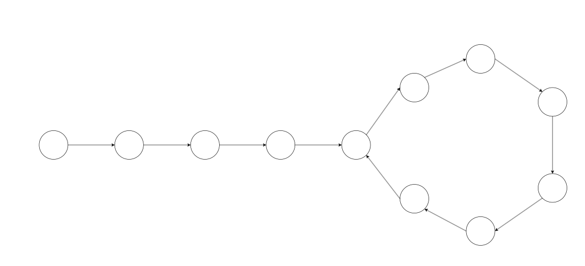
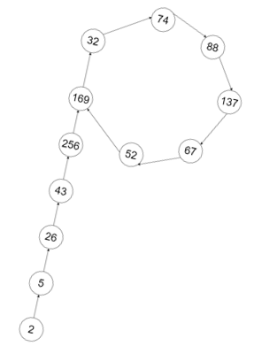
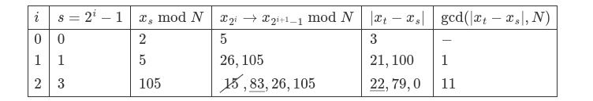

Phân tích một số nguyên ra thừa số nguyên tố từ lâu đã là một vấn đề quan trọng trong ngành Khoa học máy tính. Đã có rất nhiều thuật toán được đưa ra nhằm tối ưu việc phân tích. Nhưng đôi khi, những thuật toán rất phức tạp lại đến từ những điều rất đơn giản trong đời sống.
Vậy chúng ta cùng tìm hiểu xem, làm sao chỉ từ câu chuyện "Rùa và Thỏ", các nhà toán học lại tìm được một thuật toán phân tích số nguyên hiệu quả nha.
## Câu chuyện "Rùa và Thỏ"
Bài toán dưới đây này thực tế bắt nguồn từ truyện ngụ ngôn *"Rùa và Thỏ"* của *Aesop*:
>Rùa và Thỏ cùng thi chạy quanh một vòng sân. Thỏ chạy nhanh gấp $2$ lần rùa. Vậy nếu cùng xuất phát và chạy liên tục, Thỏ có gặp Rùa không? Nếu có thì gặp nhau ở đâu?
>
Câu trả lời vô cùng đơn giản: Khi Rùa chạy được $1$ vòng, Thỏ đã chạy được tròn $2$ vòng và chúng sẽ gặp nhau tại chính vị trí đã cùng xuất phát.

Từ bài toán trên, người ta lật lại vấn đề rằng: Nếu cho Rùa và Thỏ chạy đường thẳng, thì dù cho chạy nhanh gấp đôi Rùa nhưng Thỏ chẳng bao giờ Thỏ gặp được Rùa cả. Nói cách khác, chỉ khi đi vào đường vòng thì Rùa và Thỏ chạm mặt nhau được!

Từ đó, năm 1967, Floyd đã sử dụng một thuật toán tìm chu trình (đường vòng) trên đồ thị như sau (tạm gọi là [**Thuật toán Floyd**](https://en.wikipedia.org/wiki/Cycle_detection#Floyd's_tortoise_and_hare)):
>Cho một đồ thị đơn, hữu hạn đỉnh. Mỗi đỉnh $u$ có tối đa một đường đi có hướng đến đỉnh $f(u)$ (nếu có).
Sử dụng hai con trỏ "Rùa" và "Thỏ" cùng xuất phát. Mỗi bước, Rùa đi $1$ đỉnh, còn Thỏ đi $2$ đỉnh. Nếu Thỏ gặp Rùa thì đường chúng đã đi có chu trình. Nếu không tồn tại chu trình, Thỏ sẽ đến "đích" trước.




**Ta có mã giả của thuật toán như sau:**
```python
function floyd(f, x0):
    tortoise = f(x0)
    hare = f(f(x0))
    while tortoise != hare:
        tortoise = f(tortoise)
        hare = f(f(hare))
    return (tortoise, hare)
```

## Bài toán tìm chu kỳ của dãy
**Bài toán:** Cho đa thức đa thức hệ số nguyên dương khác hằng $f(x)$ và số nguyên $P$.
Tìm một chu kỳ của dãy số $(x_n \bmod P)$ với $(x_n)$ được xác định như sau:


$\begin{cases}
x_0 > 0\\
x_n = f(x_{n-1}), n \ge 1
\end{cases}$


**Lời giải:**
- Xét dãy $(u_n)$ với  $u_n = x_n \bmod P$. Suy ra $u_{n+1} = f(u_n) \bmod P$
- Do dãy $(u_n)$ vô hạn nhưng chỉ nhận $P$ giá trị: $0, 1, \ldots, P-1$ nên theo *Nguyên lý Dirichlet* tồn tại hai số nguyên $0 \le s, t \le P$ phân biệt sao cho:
$$u_s = u_t$$
Suy ra $x_s \equiv x_t \pmod P$ $\implies f(x_s) \equiv f(x_t) \pmod P$
$\implies x_{s+1} \equiv x_{t+1} \pmod P$ hay $u_{s+1} = u_{t+1}$.
Tiếp tục suy diễn, ta được $u_{s+2} = u_{t+2}, \;\ldots$
Hay nói cách khác dãy $(u_n)$ tuần hoàn.
- Nếu coi $u_0, u_1, \;\ldots$ là một dãy cái đỉnh với các cạnh đến hướng từ $u_i$ đến $u_{i+1}=f(u_n) \bmod P$, sử dụng thuật toán Floyd ở trên, ta luôn tìm $s, t$ thỏa $u_s = u_t$ chính là vị trí của Rùa và Thỏ khi gặp nhau.

Minh họa cho trường hợp $p = 317$, $x_0 = 2$ và $f(x) = (x^2 + 1) \bmod 2206637$:



Bảng dưới đây là minh họa cho thuật toán Floyd trong trường hợp trên:
$$
\begin{array}{|l|l|l|l|l|l|}
\hline
i & $Rua$ & $Tho$  & $Rua mod 317$ & $Tho mod 317$ \\
\hline
0   & 2       & 2       & 2       & 2     \\
1   & 5       & 26      & 5       & 26    \\
2   & 26      & 458330  & 26      & 265   \\
3   & 677     & 1671573 & 43      & 32    \\
4   & 458330  & 641379  & 265     & 88    \\
5   & 1166412 & 351937  & 169     & 67    \\
6   & 1671573 & 1264682 & 32      & 169   \\
7   & 2193080 & 2088470 & 74      & 74    \\
\hline
\end{array}$$

## Bài toán phân tích số nguyên
Từ đầu bài viết đến giờ, chúng ta vẫn chỉ quanh quẩn với các chu trình, vậy chúng có ứng dụng thế nào vào việc phân tích một số nguyên ra thừa số nguyên tố?

Năm $1975$, *John Pollard* đã đề xuất một thuật toán phân tích thừa số nguyên tố như sau:

Xét số nguyên dương $N$. Chúng ta luôn cố gắng tách $N = P \cdot Q$ với $1 < P \le Q < N$ rồi từ đó lặp lại việc tách với $P$ và $Q$ đến khi số cần tách là số nguyên tố.

Giả sử trong $k$ số ngẫu nhiên $x_1, x_2, \dotsb, x_k$ lấy từ nửa khoảng $[0; N-1)$, tồn tại hai số $s, t$ mà $x_s \equiv x_t \pmod P$, ta suy ra:
$$P \mid \gcd \left( |x_s-x_t|, N \right)$$

- *Nhưng mục đích của chúng ta là tìm $P$ cơ mà?*
Chúng ta tìm $x_s, x_t$ rồi suy ra $P$ chính là $\gcd \left( |x_s-x_t|, N \right)$ đấy! Tất nhiên là phải tìm đến khi $P > 1$ rồi.
- *Liệu có luôn tồn tại $x_s, x_t$?*
Theo nguyên lý Dirichlet thì ta lấy $k=N+1$ thì luôn tìm được $x_s, x_t$ để $P > 1$.
- *Vậy $x_s, x_t$ lấy đâu ra?*
Chính là từ bài toán tìm chu kỳ của dãy số bên trên.
- *Làm sao sinh được dãy $(x_n)$ mà $x_i$ nằm trong $[0; N-1)$? Lấy đa thức $f$ thế nào?*
Đây chính là điểm đột phá của thuật toán khi *John Pollard* đề nghị sử dụng các hàm có dạng $f(x) = (x^2+c) \bmod N$ với $c$ là số nguyên dương bất kỳ để sinh dãy $(x_n)$ ngẫu nhiên với giá trị nằm trong $[0; N-1)$.
- *Nhỡ $x_s=x_t$ thì sao?*
Đơn giản thôi, chọn hằng số $c$ khác cho $f(x)$.

Ta mô tả [**Thuật toán Rho**](https://en.wikipedia.org/wiki/Pollard%27s_rho_algorithm) như sau:
>Sử dụng hàm $f(x) = (x^2+c) \bmod P$ để sinh dãy $(x_n)$ đến khi tìm được $x_s \equiv x_t \pmod P$ thỏa mãn $P =\gcd \left( |x_s-x_t|, N \right) > 1$.

>Khi này $P$ là một ước của $N$. Tiếp tục phân tích $P$ và $\frac{N}{P}$ đến khi không phân tích được nữa.


Một điều thú vị là nhìn hình dưới đây chắc các bạn cùng hiểu tại sao *John Pollard* lại đặt tên *"Thuật toán $\rho$ (Rho)"*:


Bảng minh họa cho **Thuật toán Rho** trong trường hợp trên:

$$
\begin{array}{|l|l|l|l|l|l|}
\hline
i   & $Rua$     & $Tho$     & \gcd(|Tho-Rua|, N) \\
\hline
0   & 2       & 2       & -        \\
1   & 5       & 26      & 1        \\
2   & 26      & 458330  & 1        \\
3   & 677     & 1671573 & 1        \\
4   & 458330  & 641379  & 1        \\
5   & 1166412 & 351937  & 1        \\
6   & 1671573 & 1264682 & 1        \\
7   & 2193080 & 2088470 & 317      \\
\hline
\end{array}$$

**Cài đặt tìm một ước của $N$ bằng C++:**
```cpp!
// CP-Algorithms
long long mult(long long a, long long b, long long mod) {
    return (__int128)a * b % mod;
}

long long f(long long x, long long c, long long mod) {
    return (mult(x, x, mod) + c) % mod;
}

long long rho(long long n, long long x0, long long c) {
    long long tortoise = x0, hare = x0, g = 1;
    while (g == 1) {
        tortoise = f(tortoise, c, n);
        hare = f(hare, c, n);
        hare = f(hare, c, n);
        g = gcd(abs(tortoise - hare), n);
    }
    return g;
}
```

## Độ phức tạp thuật toán
### Thuật toán Floyd
Gọi $\lambda$ là độ dài chu trình và $\mu$ là vị trí đầu tiên xuất hiện chu trình. Khi đó *thuật toán FLoyd* có độ phức tạp thời gian $O(\lambda+\mu)$ và không gian $O(1)$.

Tuy nhiên làm sao ước chừng được $O(\lambda+\mu)$ so với $N$? Hay nói cách khác, chọn ít nhất bao nhiêu số để xuất hiện chu kỳ?

Nếu để ý, chúng ta có một bài toán hoàn toàn tương tự gọi là [**Nghịch lý ngày sinh nhật (The birthday paradox):**](https://en.wikipedia.org/wiki/Birthday_problem)
> Trong một năm có $d$ ngày, xác suất để trong $k$ người ngẫu nhiên có hai người trùng ngày sinh nhật là bao nhiêu?
>- Nếu $k>d$ thì xác suất là $1$ theo nguyên lý Dirichlet.
>- Nếu $k \le d$, sử dụng bao hàm và loại trừ, ta được kết quả là: 


$P(k, d) = 1 - 1 \times \left(1-\frac{1}{d}\right) \times\left(1-\frac{2}{d}\right) \times \ldots \times\left(1-\frac{k-1}{d}\right)\\
= \frac{k! \times C_{d}^{k}}{d^k}$

Trong bài toán hiện tại, $k$ số cần chọn chính là $k$ người, còn ước số $P$ muốn tìm chính là $d$ ngày trong năm.

Giả sử $k$ nhỏ hơn nhiều so với $P$ đang tìm. Khi này theo phép khai triển Taylor, $1-\frac{i}{P} \sim e^{-\frac{i}{P}}$ hay:
$P(k, P) \sim 1 - \prod\limits_{i=0}^{k-1} e^{-\frac{i}{P}} \sim 1-e^{-\frac{k^2}{2P}}$

$\implies$ Nếu lấy khoảng $k=4\sqrt{P}$ phần tử thì từ $(x_i)$ sẽ lấy được hai số có cùng số dư khi chia cho $P$ với xác suất $99.97\%$. Như vậy, nếu xét ước $P$ của $N$ mà nhỏ hơn $\sqrt{N}$ thì số phần tử cần lấy khoảng $4\sqrt[4]{N}$.

Nói tóm lại, $(\lambda + \mu) \sim 4\sqrt[4]{N}$ hay $O(\lambda + \mu) \sim O\left(\sqrt[4]{N}\right)$.

### Tìm một ước của $N$
Mỗi bước tìm chu kỳ của dãy số ta sinh ra, ta tính $\gcd(|x_s - x_t|, N)$ một lần. Tổng cộng ta gọi hàm $\gcd$ trên khoảng $O\left(\sqrt[4]{N}\right)$ lần nên độ phức tạp để tìm một ước của $N$ là $O(\sqrt[4]{N} \log N)$.


Để đảm bảo xác suất trong thuật toán tìm ước, ta cần bỏ các ước nhỏ (Ví dụ $2, 3, 5, 7, 11, 13, 17, 19$) của $N$ trước khi phân tích. 
Cũng để đảm bảo tìm được một ước $1<P<N$ thì ta cần kiểm tra tính nguyên tố của $N$ với [**kiểm tra Rabin-Miller**](https://vnoi.info/wiki/algo/algebra/primality_check.md#3-thu%E1%BA%ADt-to%C3%A1n-rabin-miller) trong độ phức tạp $O(\log^2 N)$.


Độ phức tạp toàn bộ thuật toán khi phân tích đến nay vẫn là bài toán mở <small>(do tính ngẫu nhiên khi chọn hàm $f(x)=(x^2+c) \bmod N$)</small>, nhưng người ta vẫn cho rằng: **Thuật toán phân tích $N$ có cùng tiệm cận độ phức tạp thời gian với thuật toán Rho.** Trong trường hợp này, độ phức tạp thời gian của thuật toán phân tích là $O(\sqrt[4]{N} \log N)$. Còn độ phức tạp không gian là $O(\log N)$ (sử dụng để lưu kết quả phân tích).

## Cải tiến của Brent
Năm $1980$, Brent đã cải tiến **Thuật toán Rho** tìm ước sử dụng một cách tìm chu trình khác (tạm gọi là [**Thuật toán Brent**](https://en.wikipedia.org/wiki/Cycle_detection#Brent's_algorithm)).

Gọi $\lambda$ là độ dài chu trình và $\mu$ là vị trí đầu tiên xuất hiện chu trình.
Vẫn ý tưởng sử dụng hai con trỏ, nhưng ta sẽ tìm $\text{power}$ là lũy thừa nhỏ nhất của $2$ mà lớn hơn $\lambda$ và $\mu$. Sau đó, ta sẽ tìm $x_s, x_t$ bằng cách xuất phát từ $x_s=\text{power}$ tìm $x_t$.

**Mô tả:** Duyệt $i$ từ $1$:
- Cho Rùa chạy đến $x_{2^i-1}$
- Cho Thỏ chạy từ $x_{2^i}$ đến $x_{2^{i+1}-1}$ xem có tồn tại giá trị bằng Rùa không. Nếu tồn tại thì kết thúc thuật toán.

**Mã giả bước tìm chu trình:**     
```python
// CP- Algorithms
function brent(f, x0):
    tortoise = x0
    hare = f(x0)
    power = 1
    while tortoise != hare:
        tortoise = hare
        repeat power times:
            hare = f(hare)
            if tortoise == hare:
                break
        power *= 2
    return (tortoise, hare)
```
Để tăng tốc thuật toán, chúng ta có thể thấy rằng:
- Không cần xét $x_s-x_t$ nếu $s < t < \frac{3s}{2}$ (vòng lặp trước không tìm được nên chu kỳ phải lớn hơn $\text{power}/2$).
$\implies$ *Loại được khoảng 50\% số trường hợp*

- Nếu $\gcd(u_{t+1} u_{t+2} \cdots, N) > 1$ thì chắc chắn một trong các số $u_{t+1}, u_{t+2}, \;\ldots$ sẽ thỏa mãn $\gcd(u_j, N) > 1$ (dễ dàng chứng minh bằng phản chứng).
$\implies$ *Ta không cần gọi $\gcd(u, N)$ mỗi bước Thỏ chạy mà gọi theo mỗi bước Rùa chạy hay khoảng $\log (\lambda+ \mu)$* lần.
- Sau cùng, ta vẫn cần một lần duyệt $\lambda$ bước để tìm vị trí Thỏ gặp Rùa và sử dụng hàm $\gcd(u,N)$ mỗi bước.
$\implies$ *Cả thuật toán gọi $\gcd(u, N)$ khoảng $\lambda + \log (\lambda+ \mu) \sim \sqrt[4]N$* lần.

ĐPT của **Thuật toán Brent** vẫn là $O \left( \sqrt[4] N \log N\right)$.
Tuy nhiên **Thuật toán Brent** lại có số lần sử dụng $f(x)$ ít hơn **Thuật toán Floyd** rất nhiều nên đã tăng tốc thuật toán tìm chu trình khoảng $36\%$ và thuật toán phân tích số nguyên khoảng $24\%$ - [theo Brent](https://en.wikipedia.org/wiki/Cycle_detection#Brent's_algorithm).
<br/>
Bảng dưới đây là minh họa cho **Thuật toán Brent** với $N = 143$, $x_0 = 2$ và $c = 1$.
Dãy số: $2, 5, 26, 105, 15, 83, 26, 105, \ldots$ Ở bước $i=2$, ta không xét $15$ do $s < t < \frac{3s}{2}$



**Code C++ minh họa:**
    
```cpp
// CP-Algorithms
long long brent(long long n, long long x0, long long c) {
    long long tortoise = x0, g = 1, q = 1;
    long long hare, xs;
    int m = 128, l = 1;
    while (g == 1) {
        hare = tortoise;
        for (int i = 1; i < l; i++)
            tortoise = f(tortoise, c, n);
        int k = 0;
        while (k < l && g == 1) {
            xs = tortoise;
            for (int i = 0; i < m && i < l - k; i++) {
                tortoise = f(tortoise, c, n);
                q = mult(q, abs(hare - tortoise), n);
            }
            g = gcd(q, n); k += m;
        }
        l *= 2;
    }
    if (g == n) {
        do {
            xs = f(xs, c, n);
            g = gcd(abs(xs - hare), n);
        } while (g == 1);
    }
    return g;
}
```

# Cài đặt thuật toán phân tích $N$
Dưới đây là code được tham khảo từ [Code RR](https://github.com/ngthanhtrung23/ACM_Notebook_new/blob/master/Math/NumberTheory/Pollard_factorize.h) . Code đã xét trước các nhân tử $2, 3, 5, 7, 11, 13, 17, 19$ trước khi sử dụng **Thuật toán Rho Pollard** với **cải tiến của Brent**.
Như đã nói ở trên, các nhà nghiên cứu ước lượng thuật toán có độ phức tạp:
- Thời gian: $O\left(\sqrt[4]N \log N\right)$ (chưa có chứng minh).
- Không gian: $O(\log N)$ (để lưu kết quả phân tích).

Code đã vượt qua $100$ test với $N \le 10^{18}$ trong khoảng $100\text{ms}$ tại [Library Checker - Factorize](https://judge.yosupo.jp/problem/factorize).

    
```cpp
#include <bits/stdc++.h>
using namespace std;
using ll = long long;
using ull = unsigned long long;
using ld = long double;
ll mult(ll x, ll y, ll md) {
    ull q = (ld)x * y / md;
    ll res = ((ull)x * y - q * md);
    if (res >= md) res -= md;
    if (res < 0) res += md;
    return res;
}

ll powMod(ll x, ll p, ll md) {
    if (p == 0) return 1;
    if (p & 1) return mult(x, powMod(x, p - 1, md), md);
    return powMod(mult(x, x, md), p / 2, md);
}

bool checkMillerRabin(ll x, ll md, ll s, int k) {
    x = powMod(x, s, md);
    if (x == 1) return true;
    while (k--) {
        if (x == md - 1) return true;
        x = mult(x, x, md);
        if (x == 1) return false;
    }
    return false;
}
bool isPrime(ll x) {
    if (x == 2 || x == 3 || x == 5 || x == 7) return true;
    if (x % 2 == 0 || x % 3 == 0 || x % 5 == 0 || x % 7 == 0) return false;
    if (x < 121) return x > 1;
    ll s = x - 1;
    int k = 0;
    while (s % 2 == 0) {
        s >>= 1;
        k++;
    }
    if (x < 1LL << 32) {
        for (ll z : {2, 7, 61}) {
            if (!checkMillerRabin(z, x, s, k)) return false;
        }
    } else {
        for (ll z : {2, 325, 9375, 28178, 450775, 9780504, 1795265022}) {
            if (!checkMillerRabin(z, x, s, k)) return false;
        }
    }
    return true;
}

ll gcd(ll x, ll y) { return y == 0 ? x : gcd(y, x % y); }

mt19937_64 rng(chrono::steady_clock::now().time_since_epoch().count());
long long get_rand(long long r) {
    return uniform_int_distribution<long long>(0, r - 1)(rng);
}

void pollard(ll x, vector<ll> &ans) {
    if (isPrime(x)) {
        ans.push_back(x);
        return;
    }
    ll c = 1;
    while (true) {
        c = 1 + get_rand(x - 1);
        auto f = [&](ll y) {
            ll res = mult(y, y, x) + c;
            if (res >= x) res -= x;
            return res;
        };
        ll y = 2;
        int B = 100;
        int len = 1;
        ll g = 1;
        while (g == 1) {
            ll z = y;
            for (int i = 0; i < len; i++) {
                z = f(z);
            }
            ll zs = -1;
            int lft = len;
            while (g == 1 && lft > 0) {
                zs = z;
                ll p = 1;
                for (int i = 0; i < B && i < lft; i++) {
                    p = mult(p, abs(z - y), x);
                    z = f(z);
                }
                g = gcd(p, x);
                lft -= B;
            }
            if (g == 1) {
                y = z;
                len <<= 1;
                continue;
            }
            if (g == x) {
                g = 1;
                z = zs;
                while (g == 1) {
                    g = gcd(abs(z - y), x);
                    z = f(z);
                }
            }
            if (g == x) break;
            assert(g != 1);
            pollard(g, ans);
            pollard(x / g, ans);
            return;
        }
    }
}
// return list of all prime factors of x (can have duplicates)
vector<ll> factorize(ll x) {
    vector<ll> ans;
    for (ll p : {2, 3, 5, 7, 11, 13, 17, 19}) {
        while (x % p == 0) {
            x /= p;
            ans.push_back(p);
        }
    }
    if (x != 1) {
        pollard(x, ans);
    }
    sort(ans.begin(), ans.end());
    return ans;
}
// return pairs of (p, k) where x = product(p^k)
vector<pair<ll, int>> factorize_pk(ll x) {
    auto ps = factorize(x);
    ll last = -1, cnt = 0;
    vector<pair<ll, int>> res;
    for (auto p : ps) {
        if (p == last)
            ++cnt;
        else {
            if (last > 0) res.emplace_back(last, cnt);
            last = p;
            cnt = 1;
        }
    }
    if (cnt > 0) {
        res.emplace_back(last, cnt);
    }
    return res;
}
```

# Luyện tập
- [SPOJ - FACT0](https://www.spoj.com/problems/FACT0/)
- [Library Checker - Factorize](https://judge.yosupo.jp/problem/factorize)
- [SPOJ - FACT1](https://www.spoj.com/problems/FACT1/)
- [SPOJ - FACT2](https://www.spoj.com/problems/FACT2/)

# Nguồn tham khảo
- [Wikipedia](https://en.wikipedia.org/wiki/Main_Page)
- [CP-Algorithms - Integer factorization](https://cp-algorithms.com/algebra/factorization.html)
- [Giải thuật Pollard Rho](https://www.giaithuatlaptrinh.com/?p=393)


