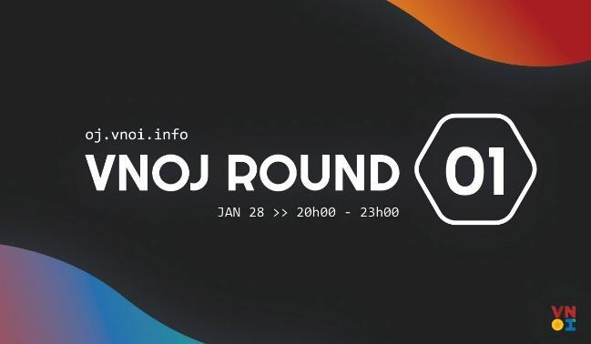

## VNOI Cup 2023

Năm 2023 là năm thứ hai VNOI Cup được tổ chức. VNOI Cup 2023 đã quy tụ đông đảo các bạn thí sinh trên khắp cả nước tham gia, trong số đó có những thí sinh có profile rất “khủng”. Chặng đua năm nay bao gồm 03 vòng loại online diễn ra trên nền tảng VNOJ; thông qua đó đã chọn ra 12 thí sinh xuất sắc nhất tham gia thi đấu Chung kết tại trường THPT Chuyên Hạ Long.

Ngay từ vòng loại đầu tiên, cuộc thi đã diễn ra vô cùng gay cấn và sôi động với 1369 thí sinh, là số lượng thí sinh lớn nhất trong tất cả các kỳ thi đã từng tổ chức trên hệ thống VNOJ. Vòng loại thứ hai và vòng loại thứ ba cũng đầy kịch tính khi thứ hạng trên bảng xếp hạng được thay đổi liên tục, những màn rượt đuổi điểm số diễn ra vô cùng căng thẳng và quyết liệt, không khí rất gay cấn và nghẹt thở. Sau ba vòng thi, 10 thí sinh xuất sắc xuất hiện tại vòng Chung kết bao gồm Trần Xuân Bách, Phạm Quốc Hùng, Lê Ngọc Bảo Anh, Nguyễn Tấn Sỹ Nguyên, Trương Văn Quốc Bảo, Nguyễn Vũ Đăng Huy, Vũ Hoàng Kiên, Lê Hoàng Nam, Nguyễn Đức Thắng và Đỗ Đình Đắc. Dựa trên đề cử từ cộng đồng, hai thí sinh còn lại góp mặt tại vòng Chung kết là Hoàng Ngọc Bảo Khuê và Nguyễn Chí Thanh.

Vòng Chung kết đã diễn ra cực kỳ gay cấn và cực kỳ quyết liệt, khi cục diện bảng xếp hạng bắt đầu thay đổi vào những khoảng thời gian cuối của vòng thi. Chung cuộc, ba vị trí đầu tiên của vòng Chung kết VNOI Cup 2023 đã thuộc về ba cái tên mới: Nguyễn Đức Thắng (17 tuổi) là chủ nhân của chiếc cup vô địch VNOI Cup mùa thứ hai. Lê Hoàng Nam (17 tuổi) đã giành được cup bạc và Lê Ngọc Bảo Anh (18 tuổi) với cup đồng.

## Đồng hành với ICPC và Olympic Tin học Sinh viên Việt Nam 2023

Đây là năm thứ ba VNOI được tin tưởng, nền tảng VNOJ được sử dụng làm nền tảng tổ chức ICPC Asia Regional (site thi tại Việt Nam). Đặc biệt, kỳ thi ICPC Asia Hue City 2023 đánh dấu lần đầu tiên máy ảo do VNOI phát triển được đưa vào sử dụng tại ICPC Vietnam. Đây là hệ thống máy thi được thiết kế bởi đội ngũ kỹ thuật của VNOI dựa trên hệ thống máy thi chính thức của ICPC World Finals 2023, với một vài tính năng mới được phát triển riêng dành cho các kỳ thi ICPC tại Việt Nam, trong đó có thể kể đến:

Máy ảo sử dụng VPN, các máy thí sinh đều sẽ được kết nối tới hệ thống thi và các dịch vụ khác thuộc ICPC thông qua VPN, bao gồm trang thi chính thức, máy in, …

Màn hình các thí sinh sẽ được ghi lại và phát trực tiếp khi cần thiết, phục vụ cho quá trình livestream, tái hiện khoảnh khắc của thí sinh, cũng như hỗ trợ cho ban tổ chức, coach và khán giả theo dõi được từng bước đi của thí sinh trong giờ thi.

VNOI rất vui và tự hào khi hệ thống máy thi đã hoạt động vô cùng trơn tru hiệu quả trong suốt thời gian diễn ra kỳ thi, từ đó mang lại trải nghiệm tốt đến với các bạn thí sinh trong và ngoài nước.

## VNOI và các dự án cộng đồng 2023

### Bedao Contest

Bedao Contest là một dự án được thành lập vào đầu năm 2020 nhằm mục đích tổ chức các kỳ thi, tạo ra sân chơi cho những bạn trẻ yêu thuật toán và coding. Bedao và VNOI chính thức bắt tay vào tháng 8/2021 và sáp nhập như hiện nay.

Trong năm 2023, Bedao Contest tiếp tục phát huy tinh thần của dự án, các bài tập của Bedao ngày càng được đầu tư về cả chất lượng lẫn số lượng. Các contest của 
Bedao đa dạng chủ đề và độ khó, từ Bedao Mini Contest đến Bedao Regular Contest và Bedao Grand Contest. Đặc biệt nhất, Bedao Contest ra mắt series Bedao OI nhằm cho các thí sinh có trải nghiệm thi giống với các kỳ thi chính thức khác. 

### Dự án sinh test các kỳ thi chính thức

Dự án sinh test các kỳ thi chính thức được khởi động từ đầu năm 2022, tiếp nối Thư viện đề thi VNOI. Dự án này được triển khai với mục đích giúp các bạn ôn luyện và giải các đề thi từ các kỳ thi Tin học chính thức như Học sinh giỏi Quốc gia, Chọn đội tuyển Olympic, Olympic Truyền thống 30/4, Duyên hải Bắc bộ, Học sinh giỏi Thành phố/Tỉnh trên cả nước, …

Sau một thời gian dài vắng bóng, trong năm vừa qua, dự án đã quay trở lại với những đề thi chất lượng. Đặc biệt trong đó có thể kể đến đề thi Chọn đội tuyển Olympic năm 2018 và đề thi Chọn đội tuyển Olympic năm 2023. Một điều chưa có tiền lệ, đó là các bộ đề Chọn đội tuyển Olympic Tin học - VNTST chưa bao giờ được đăng công khai, cũng như có bộ test hoàn chỉnh trên bất cứ nền tảng nào. Đây chính là điểm nổi bật nhất trong dự án này của VNOI.

### External Setters

Đây là một dự án tổ chức các kỳ thi chính thức (tính rating) trên VNOJ bên cạnh Bedao Contest, trong đó các bài tập sẽ do cộng đồng đóng góp hoặc Ban ra đề sẽ là các thành viên trong cộng đồng VNOI và có tài khoản trên hệ thống VNOJ.

Ngày 28/01/2024, VNOJ Round 01 đã được tổ chức; đánh dấu bước phát triển của dự án External Setters.

Có thể nói sự hưởng ứng, tham gia của hơn 600 thí sinh chính là “quả ngọt” của Ban ra đề, cũng là thành công bước đầu của dự án. Đây cũng chính là động lực để dự án External Setter tiếp tục được thực hiện, hứa hẹn sẽ có nhiều VNOJ Round hơn nữa.

### Phát triển VNOJ

Trong năm 2023, để phục vụ cho nhu cầu luyện tập cho các kỳ thi HSGQG, ICPC và
Olympic Tin học Sinh Viên, VNOI đã nâng cấp công suất của máy chấm lên gấp đôi. 

VNOI đã có đề nghị và được admin vjudge cho phép, hỗ trợ tích hợp VNOJ với
Virtual Judge. Điều này cho phép các thầy cô cũng như các bạn học sinh, sinh
viên có thể sử dụng các tính năng tuyệt vời, một trong số đó là việc mashup bài
tập cho các training contests và luyện tập tích hợp các OJ nổi tiếng chỉ với
một tài khoản.

### Chữa đề HSGQG 2023 – 2024

Trong ba năm trở lại đây, VNOI luôn duy trì việc chữa đề thi HSGQG môn Tin học, lời giải cho các bài tập được trình bày trong buổi chữa đề được dày công chuẩn bị bởi đội ngũ chuyên môn của VNOI.

Đặc biệt, các buổi chữa bài có sự góp mặt của dàn khách mời khủng với nhiều thành tích đáng nể trong giới lập trình thi đấu.

### Các dự án cộng đồng khác

Bên cạnh các dự án nổi bật nêu trên, trong năm qua VNOI vẫn duy trì các dự án như VNOI Educational Contests, VNOI Wiki, ... Rất nhiều bài viết chất lượng về các chủ đề trong Tin học đã được xuất bản bởi đội ngũ VNOI Wiki, nhiều kỹ thuật, thuật toán được đưa tới cộng đồng theo dự án Educational Contests nhằm tạo nên môi trường học tập lành mạnh cho các bạn trẻ đam mê Tin học ở Việt Nam.

### Tình nguyện viên tại VNOI
Để duy trì các dự án phục vụ cộng đồng, VNOI rất cần sự giúp đỡ của các bạn Tình nguyện viên trong mọi khía cạnh: Chuyên môn, kỹ thuật, truyền thông, ...Trong năm 2023, VNOI đã kết thúc và cấp giấy chứng nhận cho các bạn Tình nguyện viên thế hệ thứ 2, đồng thời chiêu mộ các bạn Tình nguyện viên thế hệ thứ 3.

Nhằm gắn kết tình cảm giữa Tình nguyện viên với nhau và với Câu lạc bộ, các hoạt động giao lưu trực tuyến được VNOI tổ chức thường xuyên. Hoạt động giao lưu trực tiếp cũng được tổ chức vào một số dịp đặc biệt tại hai thành phố lớn là Hà Nội và Thành phố Hồ Chí Minh.

Bên cạnh đó, VNOI thường xuyên tổ chức các buổi talkshow cho các bạn tình nguyện viên tham gia và tương tác các khách mời có tầm ảnh hưởng lớn trong giới lập trình nói riêng và ngành CNTT nói chung như Lê Yên Thanh (CEO Phenikaa MaaS), Nguyễn Thành Trung (tác giả của các bài viết Code cùng RR), Lê Xuân Mạnh (CTO Kyber Network), Lê Đôn Khuê (Technical Lead tại Be), …. Ngoài ra, các bạn tình nguyện viên còn có cơ hội kết nối và trao đổi riêng với các khách mời đặc biệt này.

VNOI cũng chú trọng đến những phần thưởng cho những bạn tình nguyện viên đã có một kỳ làm việc đầy nỗ lực. Chính vì thế, trong năm vừa qua VNOI đã phát hành nhiều merchandise độc quyền như dây đeo, áo, móc khóa, sticker, bao lì xì, … được trao tận tay đến các bạn tình nguyện viên nhân dịp trước Tết. 

Những hoạt động của VNOI đều có dấu ấn đậm nét đến từ các bạn tình nguyện viên đều đã và đang âm thầm đóng góp chung cho nền Tin học nước nhà. Những dự án của VNOI sẽ không thành công nếu không có sự giúp sức và ủng hộ đến từ các bạn. VNOI hy vọng rằng tinh thần của Tình nguyện viên VNOI vẫn sẽ duy trì trong những năm tiếp theo.

