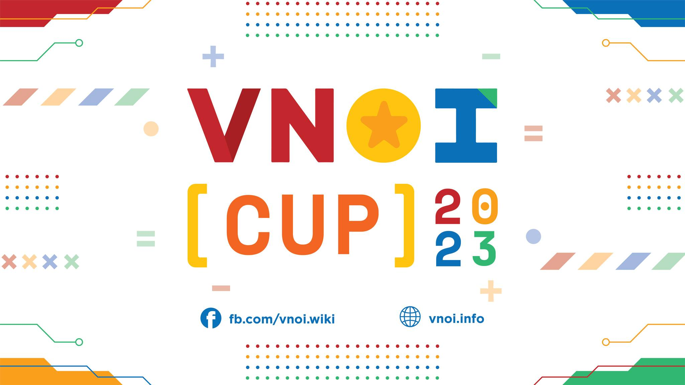

## Đôi nét về VNOI Cup 2023

VNOI Cup 2023 là cuộc thi dành cho các cá nhân đang là học sinh, sinh viên, hoặc đã tốt nghiệp và đang theo học hoặc làm việc ở Việt Nam cũng như mọi nơi trên toàn thế giới. Đặc biệt, VNOI Cup 2023 không giới hạn độ tuổi của thí sinh tham dự.

Chặng đua bao gồm 03 vòng loại online diễn ra trên nền tảng VNOJ vào các ngày 13/05, 27/05 và 10/06; thông qua đó chọn ra 12 thí sinh xuất sắc nhất thi đấu Chung kết vào ngày 21, 22/07 tại trường THPT Chuyên Hạ Long (Quảng Ninh).

Bên cạnh những giải thưởng lên tới hàng chục triệu đồng tại vòng Chung kết, các bạn đạt thành tích xuất sắc ở tại các vòng loại còn có cơ hội nhận được 150 áo VNOI Cup 2023 được thiết kế độc quyền cho kì thi. 

Với tiêu chí tìm kiếm các coders tài năng trên khắp cả nước, VNOI CUP 2023 chờ đón những cá nhân có đam mê và năng lực để cùng nhau tạo nên một cuộc thi lập trình đầy sôi động và ý nghĩa. Cuộc thi đề cao tính cạnh tranh đến từ bộ đề, chính vì vậy để chuẩn bị những vòng thi chất lượng và đầy tính cạnh tranh, rất cần đến sự chuẩn bị miệt mài và tỉ mỉ của đội ngũ ra đề có trình độ chuyên môn cao.

## Ban ra đề VNOI Cup 2023
    

- Đặng Đoàn Đức Trung: Trưởng ban ra đề VNOI CUP 2023 - ICPC World Finalist 2023, 2022, 2021, 2020, Max 2871 Codeforces;
- Trần Quang Lộc: trưởng ban ra đề ICPC Asia HCMC 2022, Coordinator Codeforces, Max 2546 Codeforces;
- Nguyễn Đinh Quang Minh: ICPC World Finalist 2018, 2021, Max 2726 Codeforces;
- Hồ Ngọc Vĩnh Phát: ICPC World Finalist 2023, 2022, HCB IOI 2021, Max 2345 Codeforces;
- Phạm Tuấn Nghĩa: ICPC World Finalist 2022, 2020, Max 2412 Codeforces;
- Nguyễn Diệp Xuân Quang: ICPC World Finalist 2020, 2021, HCB APIO 2017, Max 2446 Codeforces;
- Nguyễn Tuấn Tài: Max 2221 Codeforces, giải Ba HSGQG 2022;
- Nguyễn Hoàng Vũ: HCB IOI 2021, Max 2204 Codeforces;
- Phạm Xuân Trung: VNOI CUP 2022 Finalist, giải Nhất HSGQG 2022, Max 2259 Codeforces.

## Ba vòng loại VNOI Cup 2023

Ngay từ vòng loại đầu tiên, cuộc thi đã diễn ra vô cùng gay cấn và sôi động với 1369 thí sinh, con số kỷ lục trong tất cả các kỳ thi đã từng tổ chức trên hệ thống VNOJ trước đó. Với kinh nghiệm chinh chiến từ nhiều cuộc thi lớn trong và ngoài nước, Trần Xuân Bách (fextivity) đã dành chiến thắng lội ngược dòng ngoạn mục qua việc AC toàn bộ 06 bài ở phút thứ 143, chỉ 07 phút trước khi vòng thi kết thúc. Sau vòng loại thứ nhất này, bên cạnh Trần Xuân Bách, gương mặt xuất sắc góp mặt tại vòng Chung kết chính là Phạm Quốc Hùng (hollwo_pelw). Đáng nói, Trần Xuân Bách và Phạm Quốc Hùng cũng là hai thí sinh từng góp mặt trong Chung kết VNOI Cup 2022. 

Vòng loại thứ hai cũng đầy kịch tính khi thứ hạng trên bảng xếp hạng được thay đổi liên tục. Tại vòng này, hai chủ nhân xuất sắc của tấm vé tham dự vòng Chung kết đã gọi tên Lê Ngọc Bảo Anh (BaoJiaoPisu) và Nguyễn Tấn Sỹ Nguyên (flashmt). Cả hai đã có những màn rượt đuổi điểm số vô cùng căng thẳng và quyết liệt và cùng kết thúc với đồng số điểm 9500/12000. 

Đến với vòng loại cuối cùng, vòng loại quyết định chủ nhân của 6/8 tấm vé còn lại tiến đến vòng Chung kết VNOI Cup 2023 tại Thành phố Hạ Long, không khí càng trở nên gay cấn và nghẹt thở hơn bao giờ hết. Sau những giờ phút thi đấu căng thẳng và quyết liệt, những tấm vé tiếp theo đã thuộc về 03 thí sinh dẫn đầu bảng xếp hạng vòng loại thứ ba - Trương Văn Quốc Bảo (BJoozz), Nguyễn Vũ Đăng Huy (Hollowed), Vũ Hoàng Kiên (BROnekton); cùng với đó là 03 thí sinh có xếp hạng cao nhất tại bảng tổng điểm ba vòng loại - Lê Hoàng Nam (noobcoder), Nguyễn Đức Thắng (marvinthang), Đỗ Đình Đắc (6aren).

## Vòng Chung kết VNOI Cup 2023

Bên cạnh 10 thí sinh được chọn từ các vòng loại của cuộc thi, dựa trên đề cử từ cộng đồng, Ban tổ chức đã chọn ra 02 gương mặt xuất sắc cuối cùng tham dự vòng chung kết VNOI Cup 2023, chính là Hoàng Ngọc Bảo Khuê (Khuepr123) và Nguyễn Chí Thanh (flashhh).

Đặc biệt, trong vòng Chung kết VNOI Cup 2023, Nguyễn Tấn Sỹ Nguyên là thí sinh duy nhất ở độ tuổi 30+ xuất sắc dành được tấm vé tham dự. Bên cạnh đó, vòng thi mang tính quyết định này cũng quy tụ 2/4 thành viên của đội tuyển IOI 2023, chính là Trần Xuân Bách và Nguyễn Đức Thắng; cũng chính là hai gương mặt đã mang về 02 Huy chương Bạc cho đoàn Việt Nam trong kỳ thi IOI 2023. 

Ngoài ra, Vòng Chung kết còn có sự góp mặt của các thí sinh đến từ Bảng mở rộng - bảng đấu dành cho mọi thí sinh mong muốn có cơ hội cọ sát trực tiếp tại địa điểm thi của các thí sinh chính thức

Vòng Chung kết đã diễn ra cực kỳ gay cấn và cực kỳ quyết liệt, khi cục diện bảng xếp hạng bắt đầu thay đổi vào những khoảng thời gian cuối của vòng thi. Chung cuộc, ba vị trí đầu tiên của vòng Chung kết VNOI Cup 2023 đã thuộc về ba cái tên mới:

- Nguyễn Đức Thắng (Trường THPT Chuyên Hùng Vương, Phú Thọ) - là chủ nhân của chiếc cup vô địch VNOI Cup mùa thứ hai, cùng với phần thưởng trị giá 20 triệu VNĐ.
- Lê Hoàng Nam (Trường THPT Chuyên Sư Phạm, Hà Nội) - giành cup Bạc VNOI Cup 2023, cùng với phần thưởng trị giá 15 triệu VNĐ.
- Lê Ngọc Bảo Anh (Trường THPT Chuyên Lê Quý Đôn, Đà Nẵng) - giành cup Đồng VNOI Cup 2023, cùng với phần thưởng trị giá 10 triệu VNĐ.

Có thể nói, VNOI Cup 2023 quy tụ đông đảo các thí sinh với profile rất “khủng” ở nhiều thế hệ khác nhau, từ những đàn anh kỳ cựu nhưng vẫn còn rất nhiều nhiệt huyết đối với lập trình thi đấu, đến những bạn trẻ là những trụ cột tương lai của nền tin học nước nhà. Đây chính là dịp để thế hệ coder trẻ có thể giao lưu, cọ xát và học hỏi kinh nghiệm quý báu từ những tiền bối đi trước, những coder đã có kinh nghiệm dày dặn trong mảng lập trình thi đấu lẫn lĩnh vực công nghệ. Như vậy, VNOI Cup 2023 đã trôi qua và để lại nhiều dấu ấn khó quên, cùng nhau hẹn gặp lại tại VNOI Cup 2024 thật sôi động, bùng cháy và kịch tính hơn nhé!

