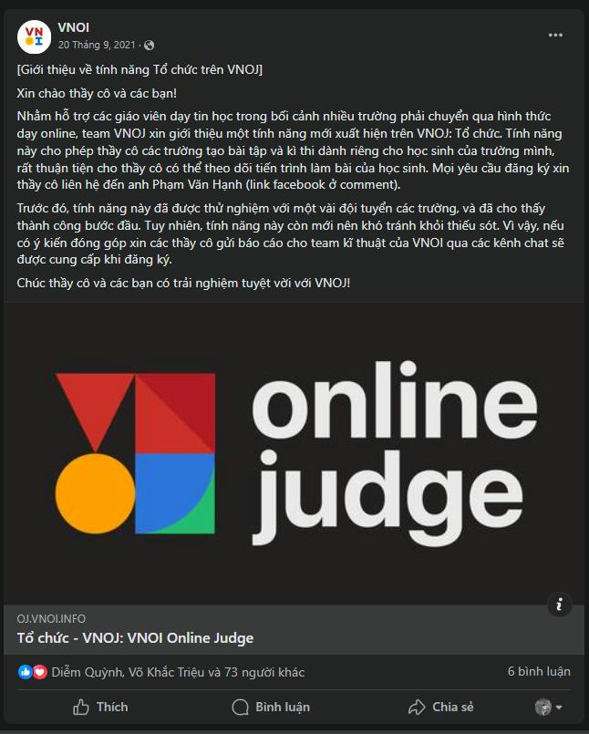

## Lịch sử phát triển

Quay trở lại năm 2007, đây là thời kỳ Internet phát triển mạnh tại Việt Nam, cùng khoảng thời gian đó trên thế giới xuất hiện nhiều Online Judge như SPOJ, UVa, … Ấp ủ ý tưởng về một trình chấm trực tuyến cho các bạn học sinh, sinh viên Việt Nam, nhóm các sinh viên bao gồm Ngô Minh Đức, Khúc Anh Tuấn và Nguyễn Minh Hiếu đã lập ra VOJ với sự hỗ trợ của ban quản trị SPOJ và nằm dưới sự quản lý của Diễn đàn tin học Việt Nam (VNOI), hiện nay hệ thống VOJ vẫn còn hoạt động tại tên miền <https://vn.spoj.com/>

Sau khi ra đời, VOJ là nơi lưu trữ dữ liệu về bài tập của nhiều cuộc thi quan trọng như ACM ICPC, HSGQG, … và nhiều bài tập hay, bổ ích từ đóng góp của các thầy cô, các bạn học sinh, sinh viên Chuyên Tin.

Tuy nhiên, sau nhiều năm hoạt động, hệ thống VOJ dần thể hiện những điểm yếu so với các hệ thống mới, bao gồm việc khó sử dụng hơn, xuất hiện nhiều lỗi với các bài tập cũ, dẫn tới bài bị ẩn và không thể chấm được. Vì vậy vào ngày 01/04/2017, ban quản trị VNOI quyết định chuyển các bài tập từ VOJ sang hệ thống Codeforces, một hệ thống chấm bài được phát triển và duy trì bởi Mikhail Mirzayanov cùng cộng sự. 

Tới ngày 03/04/2020 việc tải các bài tập lên hệ thống Codeforces đã chính thức hoàn tất. Ngoài những bài đã có trên hệ thống VOJ, ban quản trị còn bổ sung thêm dữ liệu cho một số các kỳ thi như VOI 2017, VOI 2018, VNOI Online, … Hiện nay [nhóm Codeforces VNOI](<https://codeforces.com/group/FLVn1Sc504/>) vẫn còn trực tuyến, tuy nhiên các bài tập tại đây không còn được cập nhật, bổ sung.

Ngày 28/02/2021, Đại hội thành lập Câu lạc bộ Olympic Tin học Việt Nam (VNOI) đã được diễn ra dưới sự tham dự và chỉ đạo của đại diện hội Tin học Việt Nam (VAIP), đánh dấu thời khắc VNOI trở thành một nhánh của Hội. Kế thừa nhiệm vụ của Diễn đàn Tin học, BCH Câu lạc bộ nhận thấy những bất cập khi sử dụng hệ thống chấm của nước ngoài: Khó sử dụng với người Việt (do giao diện tiếng Anh), khó quảng bá tới tất cả các bạn học sinh, …, và quan trọng nhất là dữ liệu về các bài tập đều thuộc về các kỳ thi có quy mô tại Việt Nam. Mong muốn phát triển một hệ thống chấm bài trực tuyến của người Việt, cho người Việt và do người Việt, đồng thời cũng vì mục đích giữ dữ liệu quan trọng ở lại trong nước, BCH Câu lạc bộ đội ngũ kỹ thuật của VNOI đã tìm hiểu, phát triển và cho ra mắt hệ thống VNOJ – VNOI Online Judge.

Hệ thống VNOJ – VNOI Online Judge được phát triển dựa trên DMOJ – một hệ thống chấm bài mã nguồn mở. Hiện nay, VNOJ vẫn đang hoạt động tại tên miền <https://oj.vnoi.info>, các bài tập và kỳ thi trên hệ thống vẫn được cập nhật thường xuyên, liên tục. Trong số đó, nhiều kỳ thi mang thương hiệu của VNOI đã được tổ chức thành công như Bedao Contest, VNOI CUP, …. 

## Các tính năng nổi bật của VNOJ

Được thiết kế theo “phong cách” Việt Nam dựa trên nền tảng DMOJ, hệ thống VNOJ có giao diện rất thân thiện và dễ sử dụng, người dùng có thể chuyển đổi qua lại giữa giao diện Tiếng Việt và Tiếng Anh một cách nhanh chóng. Hệ thống điểm số cũng được thiết kế lại để tạo thuận lợi cho người dùng trong việc tự theo dõi, tự đánh giá thông qua quá trình luyện tập. 

Với đội ngũ kỹ thuật có năng lực và tận tâm, VNOJ – VNOI Online Judge hoạt động vô cùng ổn định và bảo mật để phục vụ lượng lớn lượt sử dụng của cộng đồng. Đặc biệt trong năm 2023, VNOI đã nâng cấp công suất của máy chấm lên gấp đôi nhằm đáp ứng nhu cầu của đông đảo các bạn trẻ yêu lập trình trong quá trình ôn tập trước thềm các kỳ thi lớn như VOI, ICPC, và Olympic Tin học Sinh viên. Tính đến ngày 28/01/2024, VNOJ đã tiếp nhận và xử lí 4744496 lượt nộp bài, tương ứng khoảng 4688 lượt nộp bài trong một ngày.

Vào tháng 9 năm 2021, khi dịch Covid 19 bùng phát mạnh mẽ tại Việt Nam, nhiều trường phải chuyển qua hình thức dạy online; VNOI đã phát triển và cho ra mắt tính năng Tổ chức. Tính năng này cho phép thầy cô các trường tạo bài tập và kì thi dành riêng cho học sinh của trường mình, đồng thời chức năng Tổ chức cũng cung cấp một bảng điểm nội bộ giúp các thầy cô có thể theo dõi quá trình luyện tập của học sinh. Ngoài ra, để tạo thuận lợi cho các thầy cô, VNOJ hỗ trợ tạo kỳ thi theo nhiều chuẩn, trong đó có định dạng của phần mềm Themis, phần mềm chấm thi chính thức của Bộ Giáo dục và Đào tạo.

## Một số dấu mốc quan trọng

Tháng 02/2021, VNOJ – VNOI Online Judge chính thức ra mắt cộng đồng Tin học Việt Nam.  VNOI công bố, giới thiệu VNOJ vào ngày 07/04/2021 trên fanpage của Câu lạc bộ.

Năm tháng sau, vào tháng 07/2021, VNOI và Free Contest chính thức hợp tác, theo đó tài nguyên của các kỳ Free Contest sẽ được tải lên VNOJ để phục vụ nhu cầu luyện tập sau khi thi của các bạn thí sinh. Cùng khoảng thời gian ấy, vào tháng 08/2021, VNOI và Bedao chính thức hợp tác, các kỳ thi của Bedao sẽ được tổ chức trên nền tảng VNOJ – VNOI Online Judge dưới sự hỗ trợ của đội ngũ kỹ thuật và đội ngũ chuyên môn của VNOI.

Trong năm vừa qua, với sự hỗ trợ của Xu Han (admin Virtual Judge), VNOI đã tích hợp VNOJ với Virtual Judge. Điều này nhằm hướng đến các tính năng tuyệt vời mà các thầy cô cũng như các bạn học sinh, sinh viên có thể sử dụng, bao gồm việc tạo các tập bài tập đến từ các OJ nổi tiếng chỉ với một tài khoản. Bên cạnh đó, điều này cũng chứng tỏ khát vọng đưa phong trào Tin học của Việt Nam ra quốc tế của VNOI.

Được hội Tin học Việt Nam tin tưởng giao nhiệm vụ, trong ba năm trở lại đây, VNOJ luôn được lựa chọn là hệ thống chấm bài chính thức cho các kỳ thi ICPC và Olympic Tin học Sinh viên, đặc biệt là ICPC Quốc gia và ICPC Khu vực. Là đơn vị duy nhất cung cấp phần mềm hệ thống thi, Câu lạc bộ VNOI tự hào đã hoàn thành tốt nhiệm vụ, chưa từng xảy ra sự cố kỹ thuật trong thời gian thi, từ đó góp phần vào sự thành công của ICPC Khu vực và khẳng định được năng lực tổ chức của nước chủ nhà đăng cai.

