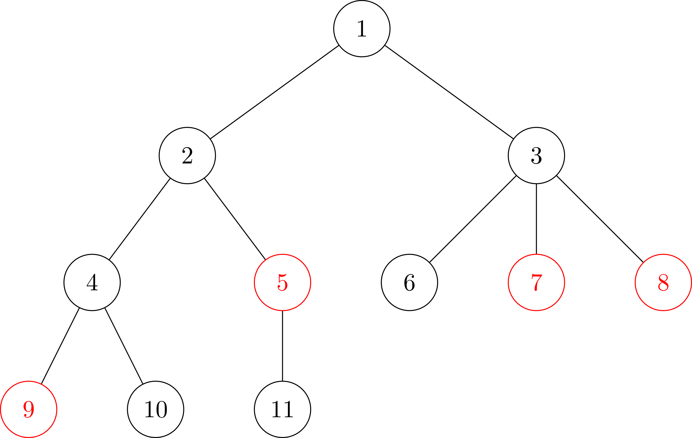
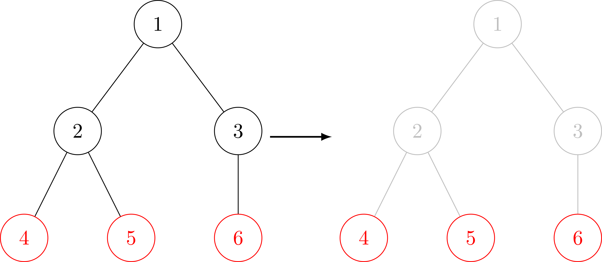
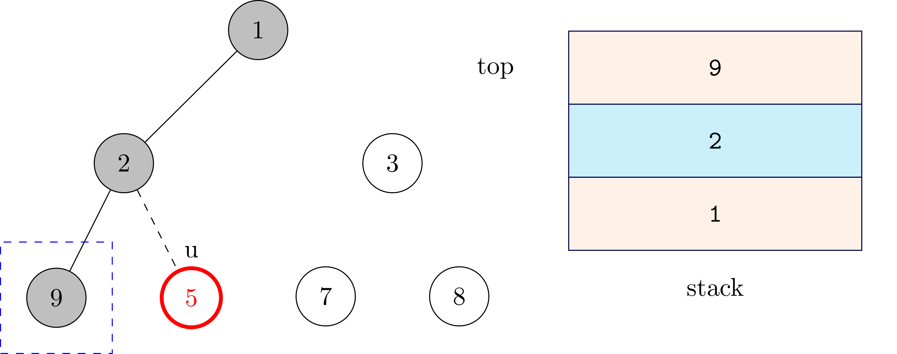

## Mở đầu

### Giới thiệu về Auxiliary Tree

Auxiliary tree hay cây phụ (còn được biết đến với cái tên virtual tree - cây ảo) là một kĩ thuật để giải quyết một lớp các bài toán liên quan đến truy vấn trên một tập các đỉnh của một cây cho trước.

Đối với các bài toán truy vấn trên cây thông thường, có thể coi như một truy vấn và truy vấn trên toàn bộ cây thì thường sẽ dùng các kĩ thuật như centroid decomposition, quy hoạch động trên cây, DSU on tree để giải quyết. Nếu vẫn giữ nguyên cách hỏi của bài toán nhưng lúc này chia ra làm $Q$ truy vấn, mỗi truy vấn chỉ yêu cầu tính toán trên một tập các đỉnh cho trước thì đây là kĩ thuật giúp bạn xây dựng một cây phụ được tạo ra từ tập các đỉnh trong truy vấn cùng với một số đỉnh bổ sung khác (đồng nghĩa với việc bỏ đi các đỉnh không cần thiết trong cây ban đầu), sau đó chỉ cần giải bình thường như trong trường hợp truy vấn trên toàn bộ cây.

Để hình dung rõ hơn thì sau đây là hình minh hoạ cây phụ được sinh ra từ cây ban đầu:




Trong đó các đỉnh màu đỏ là các đỉnh cần truy vấn, các đỉnh màu xanh là các đỉnh phụ được thêm. Nếu bạn cảm thấy mơ hồ thì cũng đừng lo lắng, ở phần còn lại của bài viết, mình sẽ tập trung vào việc giải thích cũng như cách xây dựng cây phụ, sau đó là cài đặt mẫu và các bài tập ví dụ.

### Các kiến thức cần biết

Để hiểu rõ bài viết này, bạn đọc nên có kiến thức về những nội dung sau:
- Cây, các phép duyệt cơ bản (DFS, BFS).
- Lowest common ancestor (LCA).

### Dạng bài toán

Hãy cùng xem qua bài toán đơn giản sau:

**Bài toán:** cho một cây có $N$ đỉnh $(1 \le N \le 2 \cdot 10^5)$. Hãy tính tổng khoảng cách của tất cả các cặp đỉnh trong cây. Cụ thể hơn, hãy tính:
$$\sum\limits_{u = 1}^{n}{\sum\limits_{v = u + 1}^{n}{\text{dist}(u, v)}}$$ trong đó $\text{dist}(u, v)$ là khoảng cách giữa hai đỉnh $u, v$.

Đây là một bài toán quen thuộc và có thể giải quyết dễ dàng bằng DFS. Sau đây là phiên bản khó hơn một chút:

**Phiên bản khó hơn:** có tổng cộng $Q$ truy vấn, truy vấn thứ $i$ bao gồm $k_i$ đỉnh (tổng các $k_i$ không vượt quá $2 \cdot 10^5$), yêu cầu hãy tính tổng khoảng cách của tất cả các cặp đỉnh trong số $k_i$ đỉnh này.

Với phiên bản có nhiều truy vấn, ta không thể DFS trên toàn bộ cây cho mỗi truy vấn. Tuy nhiên có một ràng buộc quan trọng là tổng $k_i \le 2 \cdot 10^5$. Do đó nếu với mỗi truy vấn, nếu tìm được cách loại bỏ các đỉnh không cần thiết để giảm số lượng đỉnh của cây thì bài toán đã được giải quyết.

## Cách xây dựng cây phụ

Cây phụ được tạo thành từ các đỉnh truy vấn, cùng với LCA của tất cả các cặp đỉnh này, các đỉnh còn lại sẽ không ảnh hưởng gì sẽ được bỏ qua. Lí do có thêm các đỉnh LCA là vì để đảm bảo các đỉnh kết nối với nhau, ngoài ra số lượng đỉnh LCA phân biệt sẽ không vượt quá số lượng đỉnh truy vấn và mối quan hệ giữa các đỉnh (quan hệ tiền bối - hậu duệ) sẽ được giữ nguyên so với cây ban đầu.



Quá trình xây dựng cây phụ sẽ bao gồm hai công đoạn chính:
1. Thêm các đỉnh bổ sung (các đỉnh LCA).
2. Xây dựng các cạnh của cây.

### Thêm các đỉnh bổ sung

Một tính chất quan trọng làm tiền đề giúp ta xây dựng được cây phụ đó là mặc dù số lượng cặp đỉnh là rất lớn nhưng số lượng đỉnh LCA phân biệt là không nhiều.

**Định lí 1:** Giả sử số lượng đỉnh truy vấn là $k$, khi đó số lượng các đỉnh LCA được thêm không vượt quá $k - 1$.

**Chứng minh:** sắp xếp các đỉnh truy vấn tăng dần theo thứ tự thăm trong phép duyệt DFS (danh sách $A$). Xét hai đỉnh $u, v$. Có ba trường hợp xảy ra:
1. $u$ hoặc $v$ là tiền bối của đỉnh còn lại, khi đó số lượng đỉnh LCA không đổi.
2. $u$ và $v$ đứng kề nhau trong danh sách $A$: thêm LCA của $u$ và $v$ vào cây, số lượng đỉnh LCA tăng $1$. Vì chỉ có tối đa $k - 1$ cặp $(u, v)$ như vậy nên số lượng đỉnh LCA tăng tối đa là $k - 1$.
3. $u$ và $v$ không đứng kề nhau: giả sử $u$ đứng trước $v$ trong danh sách $A$. Kí hiệu $T_u$ là cây con gốc $u$ trong cây ban đầu, xét đỉnh $u' \in A$ là đỉnh cuối cùng trong $T_u$ và đỉnh $v' \in A$ là đỉnh đầu tiên không nằm trong $T_u$ nhưng nằm trong LCA của $u$ và $v$, đỉnh $v'$ luôn tồn tại vì $v$ là đỉnh không thuộc $T_u$. Dễ thấy thứ tự nằm trong $A$ của các đỉnh là $u \leq u' < v' \leq v$ và LCA của $u'$ và $v'$ cũng chính là LCA của $u$ và $v$. Trong trường hợp này, số lượng đỉnh LCA không thay đổi. Hình minh hoạ (số trên mỗi đỉnh là thứ tự duyệt DFS):


**Kết luận:** số lượng đỉnh LCA được thêm sẽ không vượt quá $k - 1$ và để tìm tất cả các đỉnh LCA, ta chỉ đơn giản lấy LCA của mọi cặp đỉnh $u, v$ kề nhau trong $A$. Như vậy kích thước của cây phụ là $\mathcal{O}(2k - 1) = \mathcal{O}(k)$.

Một ví dụ về trường hợp số đỉnh LCA bằng $k - 1$:


### Xây dựng các cạnh

Bước tiếp theo sau khi đã thêm các đỉnh bổ sung (các đỉnh LCA) là xây dựng các cạnh của cây.

Sau đây là minh hoạ thuật toán cho cây phụ ở đầu bài viết:


Chú thích:
- Đỉnh màu đỏ: các đỉnh truy vấn.
- Đỉnh màu xanh: các đỉnh LCA.
- Giá trị trên đầu mỗi đỉnh biểu thị thứ tự thăm trong phép duyệt DFS.


Thuật toán bao gồm các bước sau:
- Sắp xếp các đỉnh cần truy vấn cùng với các đỉnh LCA tăng dần theo thứ tự thăm trong phép duyệt DFS.
- Thêm đỉnh có thứ tự thăm nhỏ nhất vào stack (gốc của cây phụ), trong trường hợp này là đỉnh $1$ trên hình.
- Lần lượt xét qua các đỉnh còn lại (giả sử đỉnh đang xét là $u$):
    - Nếu đỉnh ở đầu stack là tiền bối của $u$ thì đỉnh này sẽ là cha trực tiếp của $u$ trong cây phụ (lí do là vì các đỉnh được duyệt theo thứ tự tăng dần trong phép duyệt DFS) do đó ta thêm cạnh nối giữa $u$ và đỉnh ở đầu stack, thêm $u$ vào stack. Ở hình minh hoạ bên dưới, do đỉnh $2$ là tiền bối của đỉnh $u = 9$ nên ta thêm cạnh nối giữa $2$ và $9$.
    
    - Ngược lại, ta biết rằng một tiền bối gần với $u$ nhất sẽ nằm trong stack (đỉnh này luôn tồn tại do LCA của $u$ luôn được xét trước $u$) nên ta sẽ lấy phần tử ra khỏi stack cho đến khi phần tử ở đỉnh stack là tiền bối của $u$. Hình minh hoạ:
    
    trong trường hợp này, tiền bối gần nhất của đỉnh $u = 5$ là đỉnh $2$, các đỉnh được lấy ra khỏi stack gồm $\{9\}$, ta thêm cạnh nối giữa $2$, $5$ và thêm đỉnh $5$ vào stack.


Trọng số của các cạnh trong cây phụ bằng khoảng cách của hai đỉnh trong cây ban đầu. 

Cuối cùng ta được cây phụ như sau:
    

## Cài đặt mẫu

Tiếp sau đây sẽ là cài đặt mẫu cho bài toán ở đầu bài viết, được chia thành các bước như sau.

### Tiền xử lí

Đầu tiên ta sẽ thực hiện DFS trên cây ban đầu để xác định thứ tự thăm cũng như tìm cha của mỗi đỉnh.

Chú thích:
- `tin[u]`: thứ tự thăm của đỉnh $u$ trong phép duyệt DFS.
- `anc[j][i]`: bảng thưa lưu cha thứ $2^j$ của đỉnh $i$.
- `adj[u]`: danh sách các đỉnh kề với $u$ trong cây ban đầu.
- `tout[u]`: thứ tự thăm của đỉnh con cuối cùng trong cây con gốc $u$.
- `depth[u]`: độ sâu của đỉnh $u$.

```cpp
void dfs(int u, int prev = -1) {
    tin[u] = timer++;
    anc[0][u] = prev;
    for (int v : adj[u]) {
        if (v != prev) {
            depth[v] = depth[u] + 1;
            dfs(v, u);
        }
    }
    tout[u] = timer - 1;
}

void preprocess() {
    dfs(0);
    for (int j = 1; j < LOG; ++j) {
        for (int i = 0; i < n; ++i) {
            anc[j][i] = (anc[j - 1][i] != -1 ? anc[j - 1][anc[j - 1][i]] : -1);
        }
    }
}
```

### Định nghĩa các hàm trợ giúp

Tiếp theo là một số hàm để tìm LCA và hỗ trợ cho việc xây dựng cây phụ ở bước tiếp theo.

Chú thích:
- Hàm `is_ancestor`: kiểm tra xem $u$ có phải là tổ tiên của $v$ hay không.
- Hàm `lca`: tìm LCA của hai đỉnh $u, v$.
- Hàm `comp`: so sánh $u, v$ theo thứ tự thăm trong phép duyệt DFS.

```cpp
bool is_ancestor(int u, int v) {
    return tin[u] <= tin[v] && tin[v] <= tout[u];
}

int lca(int u, int v) {
    if (is_ancestor(u, v)) return u;
    if (is_ancestor(v, u)) return v;
    for (int i = LOG - 1; i >= 0; --i) {
        int pu = anc[i][u];
        if (pu != -1 && !is_ancestor(pu, v)) u = pu;
    }
    u = anc[0][u];
    assert(is_ancestor(u, v));
    return u;
}

bool comp(int u, int v) {
    return tin[u] < tin[v];
}
```

### Xây dựng cây phụ

Ở bước xây dựng này sẽ bao gồm ba công đoạn chính:
- Sắp xếp các đỉnh tăng dần theo thứ tự thăm trong phép duyệt DFS.
- Thêm các đỉnh LCA vào tập đỉnh.
- Tiếp tục sắp xếp các đỉnh theo thứ tự tăng dần trong phép duyệt DFS, thêm đỉnh gốc vào stack (đỉnh đầu tiên), sau đó duyệt qua từng đỉnh còn lại và thêm các cạnh tương ứng.

Chú thích:
- `aux_adj[u]`: danh sách các đỉnh kề với $u$ trong cây phụ.

```cpp
int build_auxiliary_tree(vector<int> &vers) {
    int sz = (int) vers.size();

    // thêm các đỉnh LCA.
    sort(vers.begin(), vers.end(), comp);
    for (int i = 0; i < sz - 1; ++i) {
        int new_vertex = lca(vers[i], vers[i + 1]);
        vers.push_back(new_vertex);
    }

    sort(vers.begin(), vers.end(), comp);
    
    // loại bỏ các đỉnh bị trùng.
    vers.erase(unique(vers.begin(), vers.end()), vers.end());

    // thêm các cạnh.
    vector<int> stack;
    int aux_root = vers[0];
    stack.push_back(aux_root);
    for (int i = 1; i < (int) vers.size(); ++i) {
        int u = vers[i];
        while (!stack.empty() && !is_ancestor(stack.back(), u)) stack.pop_back();
        assert(!stack.empty());
        int last = stack.back();
        aux_adj[last].push_back(u);

        stack.push_back(u);
    }
    return aux_root;
}
```

Hàm này sẽ trả về đỉnh gốc của cây phụ.

### Trả lời truy vấn

Phần còn lại đó là trả lời truy vấn trên mỗi cây phụ xây dựng được. Sau đây là lời giải tham khảo.

**Lời giải:** trên cây phụ xây dựng được, để tính tổng khoảng cách của các đỉnh thì với mỗi cạnh ta sẽ đếm lượng đóng góp của cạnh đó vào đáp án (hay số lượng đường đi mà đi qua cạnh này). Đáp án là tổng đóng góp của các cạnh.

Chú thích:
- `cnt_important[u]`: lưu số lượng đỉnh có nằm trong các đỉnh truy vấn của cây con gốc $u$.

```cpp
long long dfs2(int u) {
    long long ans = 0;
    for (int v : aux_adj[u]) {
        ans += dfs2(v);
        cnt_important[u] += cnt_important[v];
    }
    for (int v : aux_adj[u]) {
        int dist = depth[v] - depth[u];
        ans += 1LL * dist * cnt_important[v] * (k - cnt_important[v]);
    }
    return ans;
}

void solve() {
    cin >> q;
    for (int qc = 0; qc < q; ++qc) {
        cin >> k;
        vector<int> vers(k);
        for (int i = 0; i < k; ++i) {
            cin >> vers[i];
            --vers[i];
            cnt_important[vers[i]] = 1;
        }
        int aux_root = build_auxiliary_tree(vers);
        long long sum = dfs2(aux_root);
        cout << sum << '\n';

        for (int ver : vers) {
            aux_adj[ver].clear();
            cnt_important[ver] = 0;
        }
    }
}
```

### Code hoàn chỉnh

Dưới đây là code hoàn chỉnh cho bài toán ở đầu bài viết, bao gồm các hàm đã được giải thích ở trên theo trình tự.

```cpp
#include <bits/stdc++.h>
using namespace std;

const int N = (int) 2e5;
const int LOG = 21;
vector<int> adj[N], aux_adj[N];
int depth[N], tin[N], tout[N];
int cnt_important[N];
int anc[LOG][N];
int timer;
int n, q, k;

void dfs(int u, int prev = -1) {
    tin[u] = timer++;
    anc[0][u] = prev;
    for (int v : adj[u]) {
        if (v != prev) {
            depth[v] = depth[u] + 1;
            dfs(v, u);
        }
    }
    tout[u] = timer - 1;
}

void preprocess() {
    dfs(0);
    for (int j = 1; j < LOG; ++j) {
        for (int i = 0; i < n; ++i) {
            anc[j][i] = (anc[j - 1][i] != -1 ? anc[j - 1][anc[j - 1][i]] : -1);
        }
    }
}

bool is_ancestor(int u, int v) {
    return tin[u] <= tin[v] && tin[v] <= tout[u];
}

int lca(int u, int v) {
    if (is_ancestor(u, v)) return u;
    if (is_ancestor(v, u)) return v;
    for (int i = LOG - 1; i >= 0; --i) {
        int pu = anc[i][u];
        if (pu != -1 && !is_ancestor(pu, v)) u = pu;
    }
    u = anc[0][u];
    assert(is_ancestor(u, v));
    return u;
}

bool comp(int u, int v) {
    return tin[u] < tin[v];
}

void read_input() {
    cin >> n;
    for (int i = 0; i < n - 1; ++i) {
        int u, v;
        cin >> u >> v;
        --u; --v;
        adj[u].push_back(v);
        adj[v].push_back(u);
    }
}

int build_auxiliary_tree(vector<int> &vers) {
    int sz = (int) vers.size();

    sort(vers.begin(), vers.end(), comp);
    for (int i = 0; i < sz - 1; ++i) {
        int new_vertex = lca(vers[i], vers[i + 1]);
        vers.push_back(new_vertex);
    }

    sort(vers.begin(), vers.end(), comp);
    vers.erase(unique(vers.begin(), vers.end()), vers.end());

    vector<int> stack;
    int aux_root = vers[0];
    stack.push_back(aux_root);
    for (int i = 1; i < (int) vers.size(); ++i) {
        int u = vers[i];
        while (!stack.empty() && !is_ancestor(stack.back(), u)) stack.pop_back();
        assert(!stack.empty());
        int last = stack.back();
        aux_adj[last].push_back(u);

        stack.push_back(u);
    }
    return aux_root;
}

long long dfs2(int u) {
    long long ans = 0;
    for (int v : aux_adj[u]) {
        ans += dfs2(v);
        cnt_important[u] += cnt_important[v];
    }
    for (int v : aux_adj[u]) {
        int dist = depth[v] - depth[u];
        ans += 1LL * dist * cnt_important[v] * (k - cnt_important[v]);
    }
    return ans;
}

void solve() {
    cin >> q;
    for (int qc = 0; qc < q; ++qc) {
        cin >> k;
        vector<int> vers(k);
        for (int i = 0; i < k; ++i) {
            cin >> vers[i];
            --vers[i];
            cnt_important[vers[i]] = 1;
        }
        int aux_root = build_auxiliary_tree(vers);
        long long sum = dfs2(aux_root);
        cout << sum << '\n';

        for (int ver : vers) {
            aux_adj[ver].clear();
            cnt_important[ver] = 0;
        }
    }
}

int main() {
    cin.tie(nullptr)->sync_with_stdio(false);
    read_input();
    preprocess();
    solve();

    return 0;
}
```

**Độ phức tạp:** $\mathcal{O}(N\log{N})$ cho bước tiền xử lí và $\mathcal{O}(k_i\log{k_i})$ cho mỗi truy vấn. Vì tổng các $k_i$ không vượt quá $N$ nên độ phức tạp cuối cùng là $\mathcal{O}(N\log{N})$.

## Các bài tập ví dụ

### [Codeforces - 1702G2](https://codeforces.com/contest/1702/problem/G2)

#### Tóm tắt đề bài

Cho một cây có $n$ đỉnh. Một tập các đỉnh được gọi là *passable* nếu tồn tại một đường đi đi qua tất cả các đỉnh, không có cạnh nào đi qua hai lần và đường đi này có thể đi qua các đỉnh khác (không nằm trong tập đỉnh).

Có $q$ truy vấn. Mỗi truy vấn được cho bởi một tập các đỉnh, yêu cầu hãy xác định xem tập đỉnh này có là *passable* hay không.

#### Giới hạn

- $1 \le n \le 2 \cdot 10^5$.
- $1 \le q \le 10^5$.
- Tổng số lượng đỉnh trong các truy vấn không vượt quá $2 \cdot 10^5$.

#### Lời giải

Nhận xét rằng một tập các đỉnh là *passable* khi mỗi đỉnh chỉ có tối đa một con hoặc tối đa hai con trong trường hợp đó là đỉnh gốc.

Với mỗi truy vấn, ta sẽ xây dựng cây phụ và kiểm tra xem cây phụ được tạo thành có là *passable* hay không.

Chứng minh tính đúng đắn:
- Nếu một tập đỉnh là *passable* thì việc thêm các đỉnh LCA sẽ không thay đổi đáp án do các đỉnh LCA được thêm cũng sẽ nằm trên đường đi.
- Nếu một tập đỉnh không phải là *passable* thì việc thêm các đỉnh LCA cũng không thể khiến các đỉnh trở nên *passable*.

#### Cài đặt mẫu

Thay đổi lại hàm `solve` như sau:
```cpp
void solve() {
    cin >> q;
    for (int qc = 0; qc < q; ++qc) {
        cin >> k;
        vector<int> vers(k);
        for (int i = 0; i < k; ++i) {
            cin >> vers[i];
            --vers[i];
        }
        int aux_root = build_auxiliary_tree(vers);
        bool passable = (int) aux_adj[aux_root].size() <= 2;
        for (int i = 1; i < (int) vers.size(); ++i) {
            if ((int) aux_adj[vers[i]].size() > 1) {
                passable = false;
                break;
            }
        }
        cout << (passable ? "YES" : "NO") << '\n';

        // reset lại giá trị cho các truy vấn tiếp theo
        for (int ver : vers) {
            aux_adj[ver].clear();
        }
    }
}
```

**Độ phức tạp:** do chỉ duyệt qua các đỉnh trong cây phụ nên độ phức tạp vẫn là $\mathcal{O}(N\log{N})$.

### [Codechef - YATP](https://www.codechef.com/DEC21A/problems/YATP)

Tiếp theo ta sẽ đến với bài mà mỗi cạnh trong cây đều có trọng số.

#### Tóm tắt đề bài

Cho một cây có $N$ đỉnh, mỗi cạnh đều có một trọng số, với đỉnh gốc là đỉnh $1$.

Định nghĩa $g(u, v)$ là trọng số của cạnh có trọng số lớn nhất trên đường đi từ $u$ đến $v$.

Có $Q$ truy vấn, mỗi truy vấn được cho bởi $K$ đỉnh phân biệt $v_1, v_2, \ldots, v_K$, yêu cầu hãy tính tổng giá trị hàm $g$ đối với mọi cặp đỉnh trong tập các đỉnh đã cho.

#### Giới hạn

- $10 \le N \le 10^5$.
- $1 \le Q \le 3 \cdot 10^4$.
- Tổng các giá trị $K_i$ không vượt quá $1.5 \cdot 10^6$.

#### Lời giải

Đầu tiên xây dựng cây phụ với trọng số của cạnh $u, v$ là $g(u, v)$, có thể dễ dàng tính thông qua bảng thưa và nhảy nhị phân (sẽ không được trình bày cụ thể tại đây).

Trên cây phụ, tính toán đóng góp của mỗi cạnh vào đáp án như sau: sắp xếp các cạnh tăng dần theo trọng số, dùng DSU để lần lượt thêm các cạnh, khi một cạnh nối hai thành phần liên thông khác nhau thì luôn đảm bảo trọng số ở các thành phần liên thông không vượt quá trọng số của cạnh hiện tại, do đó chỉ cần đếm số đường đi đi qua cạnh này.

#### Cài đặt mẫu

Định nghĩa struct `DSU`:

```cpp
struct Dsu {
    int n;
    vector<int> par, sz, cnt_important;
    Dsu() {}
    Dsu(int _n): n(_n), par(n), sz(n), cnt_important(n) {
        for (int i = 0; i < n; ++i) {
            par[i] = i; sz[i] = 1;
        }
    }
    void reset(int u) {
        par[u] = u;
        sz[u] = 1;
    }
    int find(int v) {
        while (v != par[v]) {
            v = par[v] = par[par[v]];
        }
        return v;
    }
    long long unite(int u, int v, int w) {
        u = find(u);
        v = find(v);
        assert(u != v);
        if (sz[u] < sz[v]) swap(u, v);
        sz[u] += sz[v];
        par[v] = u;
        
        // tính lượng đóng góp của cạnh (u, v).
        long long res = 1LL * w * cnt_important[u] * cnt_important[v];
        cnt_important[u] += cnt_important[v];
        return res;
    }
} dsu;
```

Thay đổi hàm `solve` như sau:
```cpp
void solve() {
    dsu = Dsu(n);
    for (int qc = 0; qc < q; ++qc) {
        cin >> k;
        vector<int> vers(k);
        for (int i = 0; i < k; ++i) {
            cin >> vers[i];
            --vers[i];
            dsu.cnt_important[vers[i]] = 1;
        }

        build_auxiliary_tree(vers);

        vector<array<int, 3>> edges;
        for (int u : vers) {
            for (auto [v, w] : aux_adj[u]) {
                edges.push_back({u, v, w});
            }
        }
  
        // sắp xếp các đỉnh tăng dần theo trọng số
        sort(edges.begin(), edges.end(), [](auto a, auto b) {
            return a[2] < b[2];
        });
        long long res = 0;
        for (auto [u, v, w] : edges) {
            res += dsu.unite(u, v, w);
        }
        cout << res << '\n';

        // reset lại giá trị cho các truy vấn tiếp theo
        for (int ver : vers) {
            aux_adj[ver].clear();
            dsu.cnt_important[ver] = 0;
            dsu.reset(ver);
        }
    }
}
```

**Độ phức tạp:** độ phức tạp là $\mathcal{O}(N\log{N})$.

## Lời kết

Trong bài viết này, chúng ta đã tìm hiểu về kĩ thuật Auxiliary Tree, được áp dụng để giải quyết các bài toán liên quan đến truy vấn trên một tập đỉnh của cây. Hi vọng rằng bài viết này giúp bạn có cái nhìn tổng quan về Auxiliary Tree và vận dụng để giải quyết các bài toán tương tự.

## Bài tập vận dụng

  - [Codechef - Chef and Pairs](https://www.codechef.com/problems/PAIRCNT)
  - [Hackerrank HourRank 15 - Kitty's Calculations on a Tree](https://www.hackerrank.com/contests/hourrank-15/challenges/kittys-calculations-on-a-tree/problem)
  - [Codechef - Adjacent Leaves](https://www.codechef.com/problems/ADJLEAF2)
  - [Codeforces round 614 - D](https://codeforces.com/contest/1292/problem/D) 
  - [Codeforces round 339 - D](https://codeforces.com/contest/613/problem/D)

## Tham khảo

- https://codeforces.com/blog/entry/76955
- https://blog.sengxian.com/algorithms/virtual-tree
- https://oi-wiki.org/graph/virtual-tree/
