*Xin chào Kuroni, cảm ơn bạn đã nhận lời tham gia phỏng vấn tạp chí VNOI 2024, được biết bạn là người rất nổi tiếng và sâu sắc, rất mong qua buổi phỏng vấn này có thể đem đến cho độc giả sâu hơn cái nhìn về bạn và những trải nghiệm của bạn trong hành trình đến với Lập trình thi đấu.
 Kuroni là một trong những người hiếm hoi đạt được thành công trên nhiều lĩnh vực. Hiện tại bạn là người giữ mức rating cao nhất Việt Nam và là một người làm đề vô cùng nổi tiếng trên Codeforces, bảo chứng cho những bộ đề hay trên trang web này. Ngoài ra bạn cũng đạt được học bổng toàn phần bậc Tiến sĩ về Toán kinh tế ở trường đại học bên Mỹ. Bên cạnh việc học, bạn là một gamer rất khủng với việc tham dự OSU World Cup nữa. Qua buổi phỏng vấn lần này, bọn mình hi vọng bạn có thể chia sẻ đến cho độc giả những kinh nghiệm cũng như bí quyết để bạn có thể toàn diện trong nhiều lĩnh vực như thế.*
 
### Bạn có xuất phát điểm cấp 2 là học sinh chuyên Toán, sau đó lên cấp 3 bạn học ở trường Phổ Thông Năng Khiếu. Nổi bật nhất bạn đã từng tham gia Entropy (kì thi ‘Đường lên đỉnh Olympia’ của trường PTNK), không biết lý do gì đã chuyển bạn từ Toán sang Tin, mà lại không chuyển từ Toán sang một con đường thú vị không kém là thi Olympia?

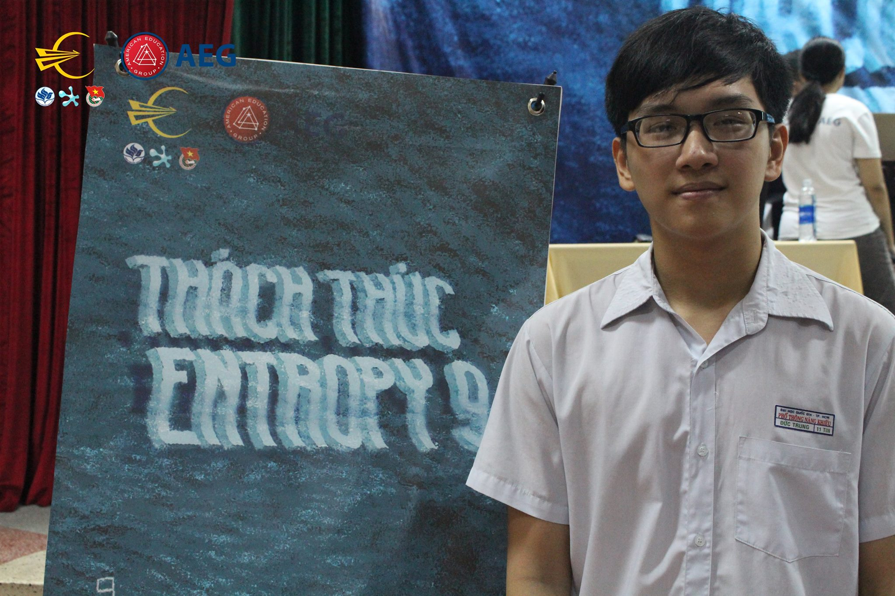

Thật ra thì lý do việc mình chuyển từ Toán sang Tin với lý do mình không thi Olympia là hai cái…hoàn toàn khác nhau. Việc mình quyết định rẽ hướng sang Tin là do sau cấp 2 mình dần mất hứng thú với việc làm Toán thi HSG nữa, căn bản cũng tại hồi đó mình kém hình lắm. Đến tận bây giờ khi sang Mỹ mình cũng vẫn kém hình không kém. Còn việc mình không thi Olympia thì thật ra là lúc mình thi Entropy cũng là lúc mình đang trong giai đoạn thi vào đội tuyển Tin của trường, thế nên sau khi thi xong Entropy thầy Hùng có bảo đùa mình là ‘May quá, thằng này không thắng Entropy, không thì nó thi Olympia mất rồi’, cũng từ đó mình không thi Olympia luôn. Kể ra thì ước mơ từ nhỏ của mình là được đứng ở cầu truyền hình một lần, nên khi không được thi thì mình cũng tiếc, nhưng nghĩ lại thì từ việc đó mình mới có những trải nghiệm như thi HSGQG, TST nên từ một góc nhìn khác thì nó vẫn tốt.

### Được biết thì bạn bắt đầu thi VOI từ lớp 11 và được thi TST. Vậy lúc đó kết quả của bạn như thế nào?

Đợt đó mình thi thì được rank 4 chung cuộc, ở thời điểm đó thì mình là thí sinh lớp 11 có thứ hạng cao nhất ở TST. Ngoài ra, đấy cũng là thứ hạng của mình năm lớp 12 luôn. Điểm đặc biệt là ở cả hai năm, ngày thi đầu tiên mình đều nằm ngoài top 15 và ở ngày 2 mình bứt lên được rank 4. 

Có thể các bạn độc giả chưa biết thì có một ‘lời nguyền’ cứ thí sinh nào được rank 4 TST thì sẽ đều không đậu vào đội tuyển IOI và từ đó đến giờ thì vẫn chưa ai phá được.

### Lớp 11 đã được rank 4 TST thì cũng là một kết quả rất tốt, không biết hồi đó bạn có bí quyết hay cách thức luyện tập nào để đạt được rank cao như vậy không?

Hồi đấy thì mình có một kỹ năng mình vô cùng tự hào đấy là mình có thể code các bài cấu trúc dữ liệu khó mà không bị lỗi quá nhiều. Mình nhớ năm ấy thi TST ngày 2 thì có một bài thuần cấu trúc dữ liệu, đấy là bài yêu cầu thí sinh phải code cấu trúc dữ liệu dạng persistent. Mình có nghĩ ra và code được bài đấy trong giờ, nhờ bài này nên mình bứt lên được hạng 4. Hôm đấy chỉ có 2 thí sinh AC được bài này là mình với anh Nhật (Hoàng Xuân Nhật - IOI 2018). Điều này cũng bởi vì hầu hết năm lớp 10, 11 mình đều cày các bài cấu trúc dữ liệu nên tạo cho mình lợi thế rất nhiều.

### Với vòng TST bạn được rank 4, vậy khi thi APIO đã có khó khăn nào khiến bạn không đủ điểm để đậu đội tuyển IOI?

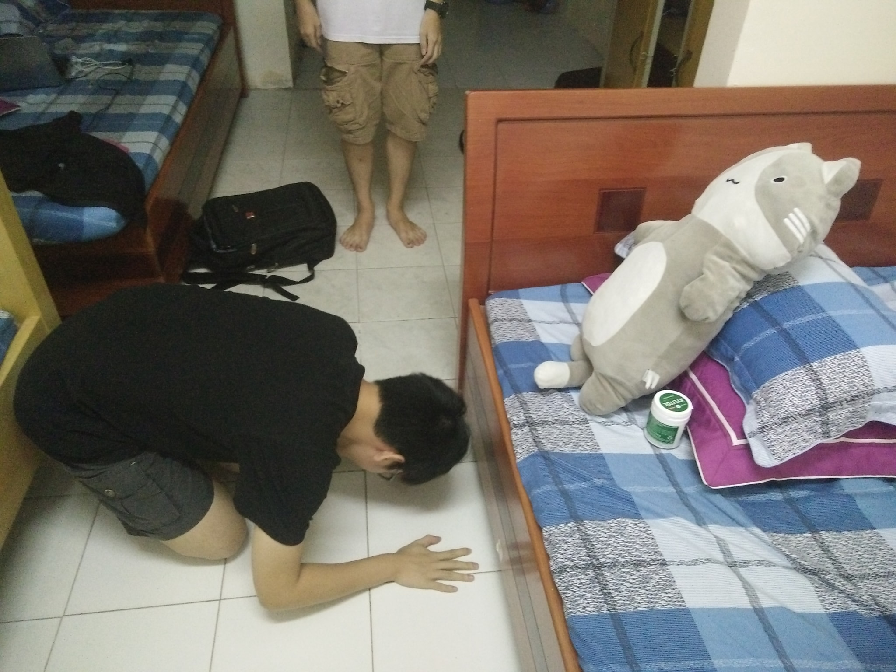

Thật ra năm đấy mình không đậu cũng là một việc hiển nhiên, một phần vì năm ấy đề cực kỳ khó, anh Thắng (Phạm Đức Thắng - IOI 2018) thi APIO cao nhất đoàn Việt Nam cũng chưa được đến 200 điểm. Đề năm ấy mình đánh giá khá là khó nghĩ, mà năm mình lớp 11 thì khả năng nghĩ thuật của mình cũng chưa chín muồi nên việc thất bại cũng không phải không ngờ tới được.

### Bạn đã có thay đổi gì về chiến thuật để tiếp tục đạt được rank 4 TST ở năm thi tiếp theo không?

Thật ra mình cũng không rõ mình đã thay đổi điều gì, nhưng mình nhớ khá rõ sau kì thi TST lớp 11 thì mình bắt đầu luyện tập nhiều hơn đề OI. Trước đấy thì mình chỉ có làm đề trên Codeforces thôi nên do thời đó Codeforces bài tập đòi hỏi phải code khá nhiều nên mình cũng code khá khỏe. Sau đó, năm lớp 12 mình cố gắng phát triển khả năng nghĩ bài bằng cách luyện tập các đề OI ở các nước khác. Trong thời gian này mình cũng cố gắng học nhiều thuật toán hơn thay vì như trước đó chỉ làm những bài cấu trúc dữ liệu. Lúc này cũng là khởi điểm mình bắt đầu đi làm problemsetter trên các trang OJ, khi tạo đề thì cũng đòi hỏi mình phải biết nhiều thuật toán và nhiều hướng nghĩ khác nhau, chính vì thế giai đoạn này mình tập trung để nâng cao tư duy khá nhiều.

### Vậy sau đó với kỳ thi APIO năm lớp 12, bạn đã có trải nghiệm như thế nào?

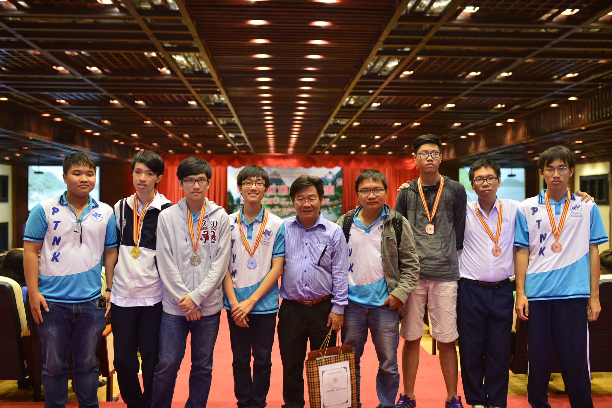

Trước khi thi TST thì thầy Hùng cũng nói với mình là làm gì cũng được nhưng đừng để rank 4. Lúc đấy mình cũng nghĩ là nếu mình thi tốt thì sẽ phá được lời nguyền "rank 4" này, không thì cả thế giới sẽ biết mình là "Chú Tư". Thi xong TST khi biết mình vẫn giữ rank như năm ngoái thì mình có khóc với anh Hạnh thì anh ý cũng cười cười không biết ám chỉ gì (cười) 

### Kuroni có một điểm khá đặc biệt khác với các bạn trong miền Nam đấy là bạn đi du học ngay khi tốt nghiệp cấp 3 với một trường rất tốt ở Mỹ - trường Purdue. Bạn có thể chia sẻ về cách bạn chuẩn bị hồ sơ đi du học được không?

Thật ra gia đình mình cũng có điều kiện hơn một tí nên từ sớm mình đã được tư vấn và học SAT, mình đã học SAT từ rất sớm là đầu năm lớp 11. Điều này cũng vì gia đình đã định hướng mình đi du học từ đầu cấp 3 thế nên ngay từ trước khi vào lớp 12 là mình đã thi xong SAT và chuẩn bị viết luận rồi. Mình cứ thế chuẩn bị hồ sơ liên tục từ lúc mình học đội tuyển ở trường đến lúc mình thi TST năm lớp 12 và ngay khi tốt nghiệp là mình đã sẵn sàng để đi du học rồi. Chính vì thế nên mình cũng không cần mất 1 năm làm hồ sơ như các bạn khác.

### Thành tích học thuật của bạn rất khủng nhưng vẫn có thời gian để học SAT và chuẩn bị hồ sơ du học, không biết bí quyết nào giúp bạn có thể duy trì những việc này?

Mình học đội tuyển thì trên trường mình cày nhiều chứ về nhà cũng không nhiều lắm, chắc chắn là mình không cày nhiều bằng một số bạn mình biết được như bạn Khoa (Nguyễn Ngọc Đăng Khoa, IOI - 2023), mình nhìn profile Codeforces bạn này là mình biết mình không thể cày nhiều như bạn này ở hồi đó được (cười)

Nếu mà nói thì hồi cấp 3 mình cũng như bao học sinh bình thường khác, mình không thể dành hết thời gian cho CP được mà sẽ có nhiều hoạt động khác nữa. Hồi đấy thì ngoài CP mình có học thêm SAT và chơi game, thật sự thì mình khá…lười học SAT, hồi đó mình chỉ đơn giản là lên làm bài của trung tâm giao và về nhà làm thêm các dạng là hết rồi. Mình cảm thấy cách mình phân bố thời gian không hiệu quả bằng các bạn khác nhưng đối với mình thì nó vừa đủ để cân bằng việc học CP và chuẩn bị hồ sơ du học cùng một lúc. 

### Ngay từ lúc bạn còn chưa qua Mỹ đã vô cùng nổi tiếng trong cộng đồng CP thế giới. Mình thấy có bạn và zscoder có điểm chung là đều nổi tiếng rất bất ngờ. Theo bạn điều gì đã làm bạn nổi tiếng như vậy?

Hồi đó mình có tham gia server Discord ‘AC’, một server nước ngoài khá là nổi tiếng trong giới CP. Mình đã tham gia và giao lưu trên đấy khá thường xuyên, nhưng mình nghĩ việc mình đột nhiên nổi tiếng như vậy cũng là từ việc mình tham gia tổ chức các contest trên Codeforces. Từ hồi lớp 11 mình đã tổ chức contest rồi nhưng mình thấy nó cũng không tốt lắm, mãi đến năm lớp 12 thì mình tổ chức một contest nữa được đánh giá khá là cao. Từ lúc đó mình bắt đầu kết nối đến các bạn nước ngoài trên Codeforces có rating cao và cùng chí hướng để ra lò một số series contest khá là hay, cũng từ đó mọi người biết đến tên mình nhiều hơn và đánh giá khá cao chất lượng các contest mình làm. Có một kỉ niệm mình rất nhớ và tự hào đấy là đợt ICPC World Finals ở Dhaka, ông Mike (founder Codeforces) đã chào mình và bảo mình làm thêm contest đi (cười). 
Đầu đuôi câu chuyện lúc đấy là mình có bắt gặp Mike và xin chụp hình cùng, ông ý có hỏi tên mình và mình trả lời, sau đó mình không ngờ tới được là ông ý nói như này: ‘Oh, I remember you, you made very good contests, please make more contests’. (cười)

Lúc đấy có hai điểm mình chú ý đấy là mình rất hãnh diện vì Mike nhớ đến mình là một người làm contest hay, thứ hai là Mike nhớ là mình không làm contest từ rất lâu rồi, khoảng chừng là 2 năm. Thế nên lúc đó mình cảm thấy rất là vui vì có trùm của một contest như thế nhớ đến.

### Lý do gì mà bạn nghỉ làm những contest trên Codeforces mà chuyển sang làm những contest cho Việt Nam không?

Lý do mình ngưng làm contest có lẽ là do bị burnout thôi, lúc đấy mình khá là bí ý tưởng và đúng là trong quãng thời gian đó mình tổ chức các contest khá là liên tục nên đến một lúc bị bí ý tưởng thì cũng là dĩ nhiên. Việc mình chuyển hướng sang làm contest cho cộng đồng Việt Nam cũng tại vì phần lớn mình được mời làm coordinator cho VNOI CUP 2023. Khoảnh khắc mình được mời làm vai trò đó là mình đã bí ý tưởng được 2 năm rồi nên mình cũng khá tự ti, nhưng sau đó mình khá ngạc nhiên là sau khi đảm nhận một vị trí quan trọng như vậy thì mình có cảm hứng và ý tưởng tạo đề lại. Mình cảm ơn VNOI nhiều vì đã tạo động lực cho mình quay lại việc tổ chức các contest. Tiết lộ một chút thì mình đang cùng bạn mofk (Nguyễn Đinh Quang Minh - max rating CF 2726)  làm một contest Div 1 trên Codeforces và nếu điều này thành hiện thực thì Kuroni x Mofk Cup sẽ được làm trên Codeforces chứ không phải là VNOJ (cười).

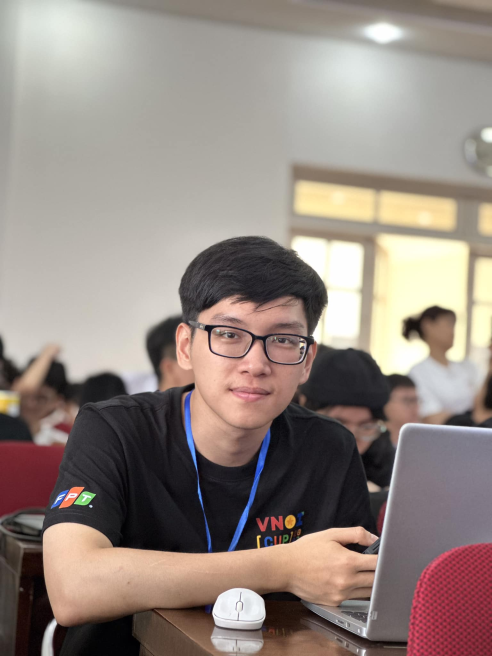

*Dành cho các bạn chưa biết thì đề VNOI CUP 2023 được đánh giá là một bộ đề chất lượng và cực kỳ hay, rất nhiều bạn thích và tín nhiệm với bạn Kuroni là trưởng ban ra đề*

### Sau khi học cấp 3 và chuyển sang Mỹ, thời gian đầu bạn có gặp trở ngại gì không?

Mình cảm thấy mình may mắn ở chỗ mình hòa nhập văn hóa ở Mỹ khá hợp. Thực sự thì lúc đấy mình cũng đang trong giai đoạn nổi loạn nữa nên suy nghĩ của mình lúc đấy là luôn thích được đi khám phá và không muốn ở nhà. Lúc đấy mình nghĩ đơn giản là nếu mình không hòa nhập được cộng đồng ở đây thì mình lại quay trở về nhà, mình thấy nó không hợp lý với suy nghĩ của mình lúc đấy nên mọi chuyện sau đó diễn ra rất là tốt. Một ấn tượng của mình trong thời gian đầu ở đây là mình được thầy Ninghui Li - thầy coach ICPC ở Purdue để ý, do là vì trên Codeforces mình có đổi thông tin trường học của mình thành Purdue, chính vì thế mình có tên trong danh sách của trường ở trên Codeforces. Vì vậy ngay từ tuần thứ hai của năm nhất mình đã được thầy dẫn dắt và làm trợ giảng cho một số lớp học của thầy. Từ đó mình cũng được kết nối với rất nhiều bạn đam mê CP ở Purdue. Trong số đó có một cái tên cũng khá nổi tiếng với cộng đồng Codeforces là bạn Monogon (max rating CF 2705). 

### Bạn đã từng đủ điều kiện tham dự 2 ICPC World Finals năm 2020 và 2021 nhưng phải tới năm 2022 thì mới có giá trị do là 2 kỳ thi kia bị ảnh hưởng bởi Covid 19. Bạn có thể chia sẻ về điều này được không?

Đúng là như vậy, mình có được tham dự kỳ thi ICPC World Finals tổ chức ở Nga nhưng mình không đi được do bị ảnh hưởng từ Covid. Lý do trực tiếp do mình không đi được là vì Visa mình hết hạn nên không thể quay lại Mỹ. Vì thế khả năng mình về Việt Nam để gia hạn Visa và quay lại Mỹ là khá thấp do lệnh hạn chế đi lại ở các nước nên mình quyết định không đi. 

*Có một sự thật thú vị rằng bạn Kuroni là người đầu tiên trên thế giới đủ điều kiện tham dự ICPC World Finals tận 4 lần. Lần gần nhất bạn Kuroni thực sự tham gia là ICPC World Finals 2022 ở Dhaka, Bangladesh*

### Kuroni đạt được rank 17 ICPC World Finals 2022, một rank khá là cao ở một kỳ thi đẳng cấp. Vậy quá trình luyện tập của bạn cho kỳ thi này là như thế nào?

Năm đầu tiên ở trên đại học của mình là khoảng cỡ 2020 thì đương nhiên lúc đó mình hướng tới ICPC World Finals ở Nga rồi, lúc đó thì mình luyện tập rất nhiều, hơn cả lúc mình học cấp 3. Một phần cũng là vì mình khá cay do hồi đó trượt đội IOI, có một khoảng thời gian cỡ 3-4 tháng liên tiếp mà mỗi ngày mình sẽ chọn ra 1 bài độ khó 2700 bất kỳ trên Codeforces và cố gắng giải nó trong 3-4 tiếng, thậm chí có một số ngày đỉnh điểm mình giải đến 2-3 bài 2700 cơ. Ngoài ra mình còn luyện riêng với đội ICPC nữa, thường thì bọn mình sẽ chọn ra một bộ đề Regional nào đấy và mỗi một tuần lại làm với nhau 1 lần, mỗi lần tụi mình gặp nhau như thế thì sẽ dành ra 5 tiếng để làm và 2-3 tiếng để thảo luận về lời giải cũng như chiến thuật sau khi làm xong. Không biết may hay rủi nhưng Monogon là một số ít trong những bạn mình biết như Bùi Hồng Đức (IOI 2019, 2020) rất thích code những bài hình, nên là đợt đó mình gần như không quan tâm đến việc code những bài hình mà cứ quăng hết cho Monogon. 

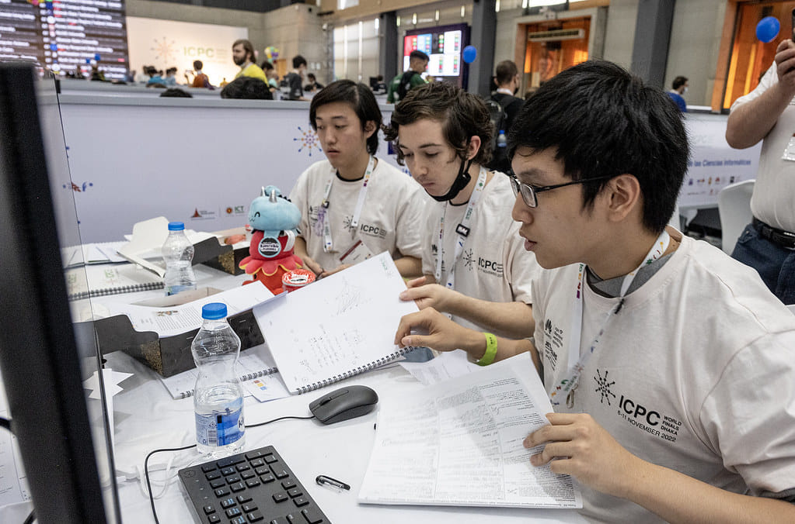

Nhưng khi sang quãng thời gian 2020 - 2021 và 2021 - 2022 thì là một khoảng trầm không chỉ trong hành trình CP của mình mà trong cuộc đời mình luôn. Hai năm đó cũng là hai năm cao điểm nhất của dịch Covid 19, tinh thần mình hồi đó cũng khá bất ổn và nếu các bạn để ý trên Codeforces của mình thì mình có một khoảng nghĩ hơn 1 năm rưỡi đến 2 năm mà mình không có hoạt động nào nhiều trên Codeforces như trước. Mình có nhớ một bạn đăng blog trên Codeforces hỏi tại sao mình lại ngưng hoạt động trên Codeforces lâu như thế, blog viết cũng dài và lượt upvote cũng khá cao, cũng nhờ đợt này mà mình mới biết mình nổi tiếng trong cộng đồng đến thế. 

Đến giữa năm 2022 thì có vẻ Covid tốt hơn dần nên mình có thể ra ngoài và giao lưu với bạn bè nhiều hơn, đợt đấy thì mình có gặp bạn ToMo ở Purdue (Nguyễn Thành Minh - hai lần tham gia APIO 2018, 2019) - một người ôn TST chung với mình. Sau này thì mình với bạn ý ở chung luôn, trong quãng thời gian này thì mình tìm lại cảm hứng với CP, lâu lâu ăn tối thì mình với bạn ý lôi bài trên Codeforces ra và thảo luận với nhau, các chủ đề bọn mình thảo luận nhiều khi không chỉ mỗi CP mà còn là toán nữa, nhiều lúc ToMo nói ra 1 tràng toán xong mình ngồi nghe (cười)

Kể từ đó mình tập trung cày CP để hướng đến ICPC World Finals ở Dhaka, lúc này mình phải làm những bài khó hơn tầm rating 3000 và những bài trên trang AtCoder. Trùng với khoảng thời gian này thì mình theo đuổi hướng nghiên cứu nên mình cũng khai thác những góc nhìn rộng hơn và bao quát chứ không chỉ ở trong CP, may mắn là mình cũng học được một kỹ năng khá quan trọng liên quan đến chủ đề ‘Tối ưu hàm lồi’, mình cũng đóng góp một bài trên VNOI Wiki liên quan đến chủ đề này. 

### Được biết thì do Covid nên ICPC World Finals ở Dhaka bị dời lại khá là sâu, lúc đó đồng đội của bạn là Monogon cũng đã đi làm rồi nên không dành nhiều thời gian cho CP được nữa, vậy lúc đó cách làm việc của cả đội cũng như chiến thuật có bị thay đổi không? 

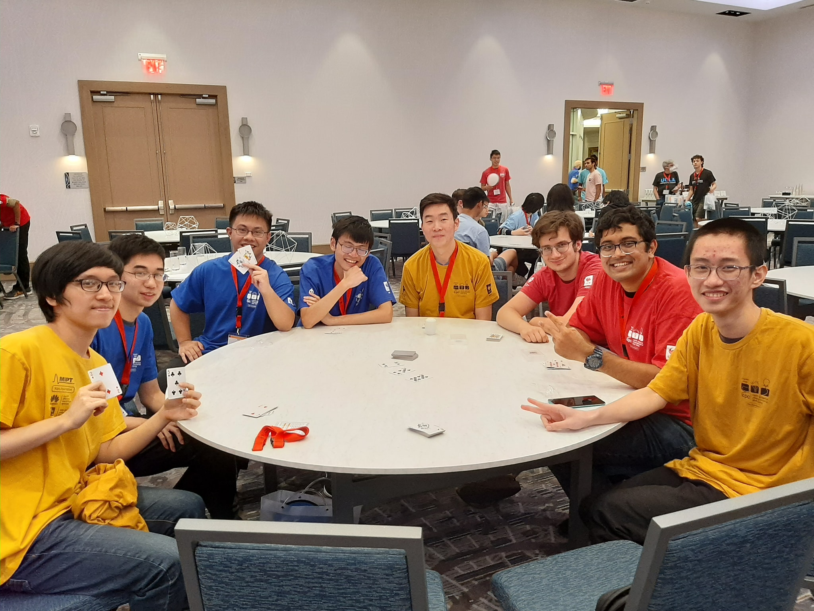

Có một điều mình khá hối hận là không tái hợp với team sớm hơn để luyện tập cho ICPC World Finals. Cũng vì thế nên là trong lúc thi bọn mình cũng gặp một số trở ngại, Monogon với mình không còn kết hợp nhuần nhuyễn như hồi năm 2020 nữa, nhưng về cơ bản thì cái luồng làm việc của team vẫn được giữ nguyên như đọc bài, nghĩ bài, debug, ….Trong đó thì mình vẫn đảm nhiệm hầu hết các bài, quan trọng nhất vẫn là các bài cấu trúc dữ liệu cùng với những dạng như quy hoạch động hay các bài thiên hướng như đề Codeforces. Phần còn lại như các bài hình này nọ thì Monogon sẽ làm, các bài toán thì sẽ đưa cho bạn Richard Li - đồng đội còn lại của mình. Bạn là một người có khả năng làm toán khá là tốt nhưng buồn một cái là bạn code bug kinh khủng (cười). Thế nên team mình cho bạn ý một vai trò nghĩ bài và sẽ đọc lời giải cho mình hoặc Monogon code. Đợt bọn mình thi thì cả team code một bài và mình bug xong debug không ra nên đưa lại cho các bạn debug, cả team cũng không ai debug ra thế nên là bài đầu tiên bọn mình AC là phải sau 60 phút đầu tiên, một khởi đầu cũng khá là chậm so với các team khác. 

### Khi kỳ thi kết thúc thì mình cũng thấy ở bạn một sự thất vọng nhẹ mặc dù rank tương đối cao nhưng mình nghĩ bạn cũng có hy vọng khá cao vào việc dành được huy chương. Vậy kết quả năm ấy có ảnh hưởng đến bạn như nào cho việc chuẩn bị WF sắp tới?

Mình sẽ ví World Finals năm ấy như APIO thứ hai của mình thế thôi. Mình cảm thấy mình đã có thực lực và thời điểm cũng chín muồi nhưng mình lại để vụt mất trong tầm tay, thế nên từ sau WF đấy mình cũng làm bài nhiều hơn, tuy không thường xuyên như hồi năm nhất đại học. Nếu các bạn để ý thì mình cũng làm CF thường xuyên lại rồi, cứ 2-3 tháng mình lại tham gia thi một contest. Ngoài ra thì mình cũng làm nhiều bài hình trở lại vì lúc này team mình cũng thiếu đi bạn Monogon, cũng không đến nỗi thích bài hình lắm nhưng mình đã quen với việc làm bài hình và nghĩ ra code. 

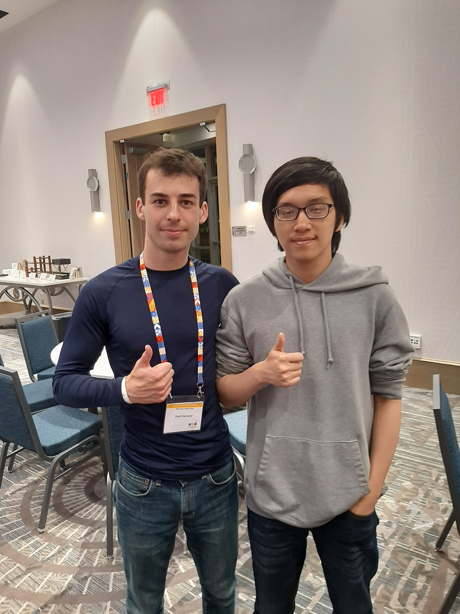

Theo mình thấy thì việc có kĩ năng làm những bài hình là một trong những cái quan trọng nhất mình đã học kể từ sau WF ở Dhaka. Bởi vì thiếu Monogon rồi thì đối với mình như thiếu một bạn ‘nhân tố X’ ấy, bạn ấy như kiểu code hình full-time luôn nên là một sự mất mát rất lớn đối với mình . 

Như mình cũng đã chia sẻ thì mình cũng bắt đầu tạo bài trở lại và kết nối nhiều hơn với cộng đồng Tin học Việt Nam. Mình cũng có nhiều bạn để bàn bài cùng, mình thấy việc thảo luận về các bài với các bạn giỏi là một cách rất nhanh để phát triển. Những năm đầu là với Monogon và các bạn trong server ‘AC’, những năm gần đây thì là bạn Bách (Trần Xuân Bách - IOI 2022, 2023), bạn Kiên (Vũ Hoàng Kiên - IOI 2019, 2020), bạn Vũ (Nguyễn Hoàng Vũ - IOI 2021), anh Quang (Nguyễn Diệp Xuân Quang - IOI 2017), bạn Phát (Hồ Ngọc Vĩnh Phát - IOI 2021), mofk, … cùng rất nhiều bạn nữa trong VNOI. Mình khá ngạc nhiên là qua ICPC WF mình không làm thường xuyên CF nữa nhưng từ những việc này mình vẫn nâng cao khả năng của mình ở CP lên được. 

### Bạn có mục tiêu và kỳ vọng gì cho ICPC World Finals 2023 lần này?

Như có một lần mình chia sẻ, là mình sẽ luôn đặt mục tiêu cao hơn khả năng hiện tại của mình, thì mục tiêu lần này của mình là Gold Medal, đồng nghĩa cũng là trong top 4 (cười).

Có thể đối với nhiều người thì việc WF 2023 bị dời là một tin không hay, nhưng đối với mình lại là một điều may mắn. Đấy là sau WF 2022 thì mình cũng bắt đầu luyện tập lại khá là trễ nên cũng nghĩ là sẽ không đủ thời gian để luyện tập đạt được mục tiêu. Tới khi nghe tin dời lại thì mình nghĩ đây là ý trời bảo mình giành huy chương, thế nên mục tiêu của mình tiếp tục sẽ là ‘Chú Tư’ cơ mà không ở Việt Nam nữa mà là ‘Chú Tư’ thế giới luôn (cười)

### Mình cũng thấy bạn đã rục rịch luyện tập lại với team khá là căng, vậy bạn có mục tiêu đạt LGM (Legendary Grandmaster - rating CF 3000) trước ICPC WF không? 

Đây cũng là mục tiêu của mình trong năm 2023 nhưng nó đã không thực hiện được dù hai contest cuối của năm 2023 mình cũng thi và được cộng điểm. Hiện tại thì mình cũng kết hợp làm trên nhiều OJ khác, điển hình là mình đang làm lại các dạng bài OI để nâng cao khả năng nghĩ của mình ở trong giờ thi tiếp, mình cũng có mong muốn là được LGM, nhưng trước hay sau LGM thì mình không dám chắc. Mình có thể tiết lộ là ở NAC (kỳ thi ICPC Regional ở Bắc Mỹ) mình cũng đã gặp tourist (max rating CF 3979). Mình nói chuyện với tourist thì tourist bảo rằng nếu mình đặt mục tiêu LGM thì hầu hết các bạn sau khi đạt được sẽ không có ý chí để luyện tập nữa. Mình bây giờ mình cũng đang phân vân là không biết mình nên đặt mục tiêu LGM trước hay sau World Finals, nhưng mà mình sẽ nhắm có skill LGM trước World Finals.

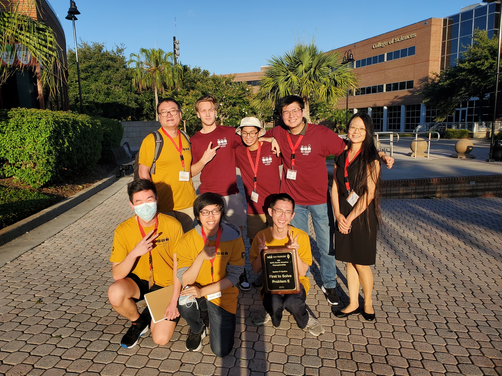

*World Finals được dời tầm khoảng tháng 4, tức bạn còn khoảng 3 tháng để chuẩn bị. Tất cả mọi người đề rất mong được chứng kiến Kuroni tỏa sáng ở WF lần này. Từ câu chuyện của Kuroni thì chúng ta có thể thấy có rất nhiều sự luyện tập và tính toán chiến thuật để đạt được đến đẳng cấp của bạn Kuroni và đồng hành với đó là còn là sự đam mê để có thể duy trì ở cấp độ như vậy. Nếu xét ở khía cạnh CP thì bạn Kuroni rất là khủng, tuy nhiên, cái điểm khác biệt giữa bạn Kuroni so với nhiều người khủng CP mình biết là bạn có thể khủng về những thứ khác, cụ thể là nghiên cứu. Có rất nhiều người khủng CP nhưng họ ngại bước ra vùng an toàn của mình và họ chỉ tập trung vào CP. Tuy nhiên CP giỏi thì tốt nhưng không cũng không thể xem đấy là công việc được trừ khi bạn là tourist.*

### Khi biết rằng định hướng của Kuroni theo nghiên cứu và có nguyện vọng học lên tiến sĩ thì mình đã rất bất ngờ. Vì vốn là người quen biết Kuroni lâu năm nên phong cách của Kuroni mình không nghĩ sẽ theo hướng nghiên cứu. Bạn có thể chia sẻ quá trình học đại học của khi đến cuối lại quyết định đi nghiên cứu, dù trước đó đã có intern ở Meta được không?

Một phần do duyên, một phần do giai đoạn nổi loạn của mình đã đề cập trước đó, nhưng không liên quan đến vấn đề ở với gia đình mà ở đây liên quan đến software engineering. Khi mình học năm 2 thì mình có học một lớp ‘Thiết kế thuật toán’ ở trường Purdue, mình có gặp thầy Alex Psomas  do đang là năm Covid nên mình cũng không đến lớp hay nghe giảng online và mình chỉ nhớ lớp đó mình qua rất dễ, mình chỉ cần vào làm bài tập về nhà thi thôi là được A+. Lớp đấy cũng không có quá nhiều ký ức với mình, nhưng cái kí ức mà mình ấn tượng là sau khi được A+ lớp đấy thì thầy đã trực tiếp liên lạc với mình và hỏi mời mình học lớp của thầy là lớp ‘Thuật toán trong kinh tế’. Tất nhiên lúc đấy mình năm 2, việc được một giáo sư của 1 trường rất to mời mình học lớp của thầy thì tất nhiên mình không thể nào từ chối được. Và sau khi mình học lớp đấy, mình phát hiện ra có rất nhiều thuật toán mà ngoài CP cực kì thú vị. Trước đây mình chưa từng nghĩ là kinh tế là một thứ mình sẽ đam mê, nhưng sau khi học lớp đấy thì mình thấy sự giao thoa giữa thuật toán và kinh tế rất là hay, nó bao hàm rất nhiều yếu tố khác nhau, không chỉ liên quan đến kinh tế vi mô, kinh tế vĩ mô mà còn là các chủ đề rất là tổng quát trong Computer Science bao gồm độ phức tạp của thuật toán, thiết kế các thuật toán khác nhau. Trong đó cũng có ‘Convex Optimization’ cũng  là 1 nhánh của Computer Science và nghiên cứu rất nhiều về việc tối ưu những hàm lồi, khi biết được ý tưởng của cái này thì mình mới nhận ra đã được  áp dụng rất là nhiều. 

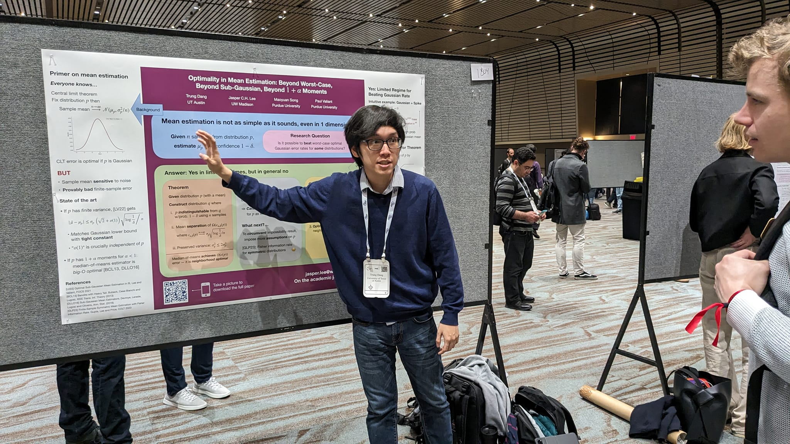

Trong CP thì các bạn có thể biết ‘Convex Hull Trick’ hay ‘Alien Trick’, là một trong những áp dụng rất cao của ‘Convex Optimization’ trong CP. Mình nhớ có dịp mình đọc một thuật toán luồng cực kì hay mà được áp dụng cho 1 bài toán kinh tế và mình cảm thấy là ‘Oh não to quá!’, chính khoảnh khắc đấy mình quyết định là mình phải suy xét xem bản thân xem có hợp nghiên cứu hay không, tại vì trước đây điểm mạnh của mình là code khỏe nhưng thực sự mình lại thích nghĩ bài hơn. Mình nhận ra hướng nghiên cứu là một nghề cho phép mình nghĩ bài mà có thể kiếm ra tiền và cho phép bản thân có thể thử. Sau đó mình cũng liên lạc nhiều hơn với thầy và cùng thầy nghiên cứu, rồi mọi thứ diễn ra rất suôn sẻ và sau khoảng 1 năm thì thầy với mình có chung bài nghiên cứu. Hiện tại thì mình cũng đang làm với 1 thầy khác, tuy nhiên câu chuyện đó lại rất buồn cười nên mình sẽ kể sau. 

Còn về lý do mình lại không theo hướng đi làm công ty dù mình có intern Meta thì mình cảm thấy trong lúc intern Facebook cũng khá là hay nhưng lại không hay bằng việc mình theo nghiên cứu, như mình nói mình thích ngồi nghĩ bài hơn là ngồi code. Ở Meta thì việc intern của mình không phải là dễ, hầu hết thời gian là mình phải ngồi thiết kế các hệ thống khác nhau và nó không phải cái mình thích nghĩ, như mình nói là mình thích ngồi nghĩ các vấn đề phức tạp hơn mà không nhất thiết phải code nó ra. Tất nhiên mình biết đi con đường học cao học có 1 cái trở ngại rất là lớn đó là mình sẽ cực kì nghèo trong vòng 6 năm tới nhưng sau khi cân đo các điểm mạnh và điểm yếu thì mình quyết định là thà vừa đủ sống trong vòng 6 năm tới nhưng được theo đuổi con đường mình đam mê hơn là code và bị ‘burnout’ sau khoảng 4 năm nữa.

*Mình cũng cảm thấy đúng, trong trường hợp này thì đâu đó chọn công việc mình thích nhưng ít tiền hơn là chọn công việc mình không thích nhưng nhiều tiền. Mặc dù bạn Kuroni có thể đi làm ở các công ty Quant Trading để kiếm thật nhiều tiền. Việc từ chối làm một công việc rất nhiều tiền để đi học cao học là việc không phải ai cũng làm được, rất hiếm có.*

### Bạn có thể trình bày hướng nghiên cứu của bạn và tại sao nó quan trọng?

Mình sẽ nói về nghiên cứu trong quá trình mình học Tiến sĩ. Thật ra nó cũng là quá trình nghiên cứu liên tục từ đại học thôi. Mình đang nghiên cứu về giao thoa giữa kinh tế và thuật toán. Với một bài toán cơ bản như này: giả sử bạn muốn bán 1 món đồ, thì có 1 cách là đấu giá, nhưng cách bạn đấu giá ảnh hưởng rất nhiều đến hành động của các tham gia, tức là nếu bạn đấu giá và chọn người thắng cuối cùng không hợp lý hoặc cái giá cuối cùng không hợp lý thì bắt đầu sẽ có những hành vi gian lận như người tham gia đấu giá bắt đầu đi tìm hiểu, cơ cấu và điều khiển giá thị trường, tất nhiên là người đấu giá lại không muốn như thế. 

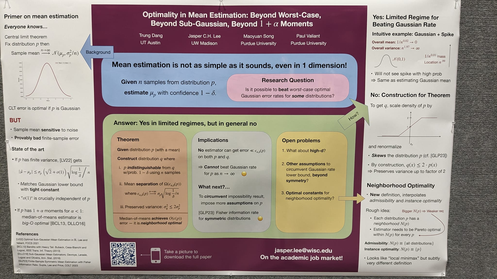

Điều này liên quan đến chủ đề nghiên cứu của mình, mình sẽ tiếp cận thị trường và quan sát thấy có những người đấu giá theo cách khác nhau, đấu giá những món đồ khác nhau, và mình sẽ thiết kế format đấu giá sao cho không cho phép người tham gia thao túng thị trường hay thay đổi chiến thuật của người đấu giá (incentive compatibility) và cho phép thu lợi nhuận nhiều nhất cho người bán đấu giá từ người tham gia (revenue optimization). 

Về cơ bản trong phạm vi bài toán này chính là sự giao thoa giữa thuật toán và kinh tế, gọi là ‘mechanism design’. Thật ra nó chính là ‘algorithm design’ nhưng kết hợp thêm yếu tố ‘kích thích’ (incentive) vào trong đó, để có thể thiết kế một thuật toán làm cho tất cả đối tượng đều cảm thấy hài lòng. Nghiên cứu này đã đi theo mình từ năm 3 đại học đến bây giờ và mình vẫn tiếp tục nghiên cứu về vấn đề này.

### Hẳn các bạn độc giả cũng rất tò mò về cuộc sống của một người theo học Tiến sĩ ở Mỹ, vậy Kuroni có thể chia sẻ về cách bạn viết nghiên cứu cả mấy chục đến trăm trang để nộp và xuất hiện ở các hội nghị được không?

Mình cảm thấy cuộc sống của mình khá thoải mái. Buổi sáng mình sẽ đọc các bài nghiên cứu với 2 mục đích chính. Thứ nhất là để cập nhật kiến thức của mình về những nghiên cứu khác. Thật sự thì những nghiên cứu của mình khá là thuần toán, kiểu áp dụng và mình cũng không code nhiều. Thứ hai rất là quan trọng đấy là để mình có thể học những cách chứng minh của người ta, xem người ta dùng những kĩ thuật nào để chứng minh. Ví dụ như vừa rồi mình vừa đọc một kỹ thuật rất là hay, và đang thử áp dụng vào project hiện tại của mình. Tất nhiên là mình vừa học hai học kỳ thôi nên cuộc sống của mình cũng chưa có nhiều điều mới, mình cũng tranh thủ để mở rộng các chủ đề mình có thể theo đuổi qua việc đọc thêm các bài nghiên cứu và trao đổi với những đồng nghiệp trong lúc nghiên cứu để có thể cùng hợp tác chung trong tương lai. 
Đương nhiên quá trình này đòi hỏi mình sẽ phải nghĩ rất nhiều, hầu hết quá trình nghiên cứu của mình sẽ cứ chầm chậm và đột nhiên khám phá ra một hướng giải có thể ra kết quả và tiếp tục theo đuổi hướng đi đó để ra hướng giải cuối cùng. Và ít nhất 2 bài nghiên cứu mình đã viết xong đều theo xu hướng này cả, cụ thể hơn thì mình hầu hết sẽ tốn tầm vài tháng nhưng chỉ tốn 2 tuần gần cuối để ra hết ý tưởng cuối cùng của bài nghiên cứu. 
Việc mình viết paper thì mình tự nhận không phải người viết paper tốt nhất trên thế giới, tuy nhiên thầy Alex Psomas của mình viết cực kỳ hay luôn nên mình học cách viết paper của thầy. Khi viết mà nới ra vài chục trang thật ra cũng khá tự nhiên, những cái paper của mình hầu hết nội dung khá là nhiều, mỗi cái chứng minh của mình đã tốn nửa trang đến 1 trang rồi, và có một số chứng minh hoặc những định lý dài mình phải dùng đến những bổ đề khác để chứng minh thì phải kéo dài 5-6 trang. Tất nhiên rằng một project nghiên cứu mình làm thì không chỉ giải một bài mà mình phải giải rất nhiều khía cạnh khác nhau của bài toán nên sẽ có rất nhiều phần để xây dựng nên bài toán tổng quát nên việc mà ra được khoảng 20-30 trang liên tiếp thì nó cũng không quá lạ với mình và mình nghĩ đó không phải là do cách viết của bản thân mà đấy chỉ là hệ quả tự nhiên do nội dung mình quá nhiều mà thôi

### Bạn có thể chia sẻ qua 2 paper mà bạn đề cập trước đó đã được xuất bản rồi không?

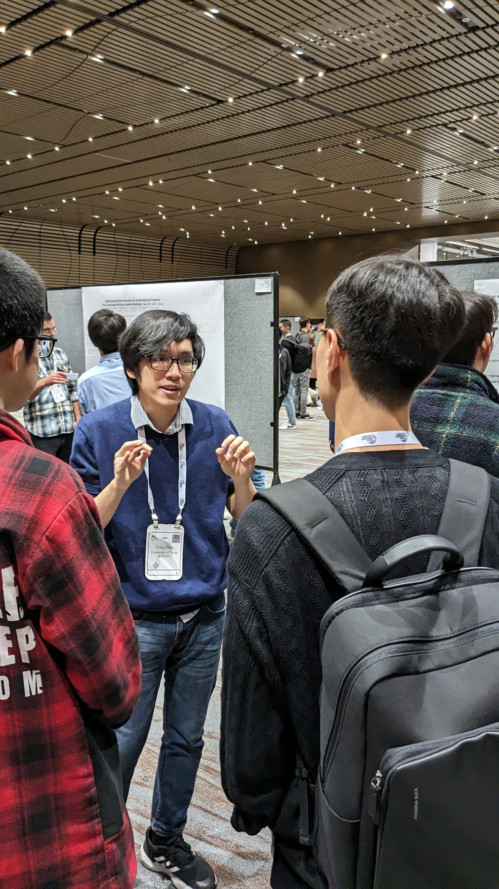

Thật ra thì một paper đã được xuất bản và một paper thì mình đang gửi đi (cười). Và mình mong paper kia sẽ được đăng trên một hội nghị hay diễn đàn nào đó trước khi tạp chí ra mắt. Còn paper kia thì đã được đăng ở hội nghị NeurIPS - một hội nghị về AI rất là lớn. Lý do paper mình được đăng tại hội nghị đó là do mình nghiên cứu về lý thuyết về học máy, cụ thể là bài toán ‘Mean Estimation’: từ nhiều mẫu từ một phân phối ngẫu nhiên nào đấy, bạn sẽ tính toán lại giá trị trung bình hay giá trị kỳ vọng của phân phối ban đầu là bao nhiêu, thật ra bài toán này nghe rất là đơn giản đúng không, nó kiểu như một bài áp dụng lý thuyết xác suất thống kê cơ bản. Tuy nhiên nó phức tạp hơn rất là nhiều, tính trung bình cộng không phải lúc nào cũng là cách tốt nhất, và có một thấy ở Purdue là thầy Paul Valiant  có một chuỗi các bài nghiên cứu rất là nổi tiếng về ‘Mean Estimation’, về cơ bản thì thầy giải được cho cái trường hợp mà phân phối của bạn chỉ tạo ra 1 số duy nhất, trong trường hợp có 2 chiều thì nó sẽ khác. Cùng với thầy, mình đã chứng minh được bài toán này khó nhất là ở phân phối chuẩn. Điều này khá ngạc nhiên vì mọi người thường nghĩ phân phối chuẩn là một cái phân phối cực kỳ đẹp, nó thường là trường hợp tốt nhất (best case) cho các bài toán nghiên cứu, nên việc mình chứng minh như thế là mình đã khép lại bài toán khi mà đã chứng minh được cận trên và cận dưới của bài toán này. Để cho dễ tưởng tượng thì paper của mình như chứng minh bài toán này có một thuật toán $O(n^2)$ và không thể làm bài toán này tốt hơn $O(n^2)$.

Cái paper thứ 2 của mình với thầy Alex Psomas là một bài toán khá là dễ thương. Khi mà bạn đi mua điện thoại, cách để bạn biết nó tốt hay không là nhìn giá, giá thì thường được định do nhà sản xuất hoặc thị trường đặt, nên về cơ bản thì giá chỉ là ‘noisy sample’. Kiểu như một chiếc điện thoại có hiệu suất được đánh giá là 2 triệu đồng nhưng lại được bán là 2 triệu 500 nghìn đồng, tức nhiều tiền hơn so với hiệu năng thật của điện thoại này. Lúc này, bạn sẽ tham khảo thị trường có n điện thoại với những cái giá khác nhau, tất nhiên bạn sẽ muốn mua điện thoại có cái hiệu năng tốt nhất so với túi tiền hiện tại. Theo xu hướng thì bạn sẽ mua điện thoại đắt nhất mà bạn có thể trả được, nhưng giả sử, trước mắt bạn có 2 cái điện thoại với giá 15 triệu đồng và 14 triệu 999 nghìn đồng, lúc này bạn không thể mua điện thoại 15tr một cách ngẫu nhiên mà phải so sánh thêm. Vậy nên bài toán của mình sẽ cho giá tiền mà nhà sản xuất rao bán của những chiếc điện thoại này và kèm với những ‘noisy sample’ so với giá trị thật mà điện thoại đem lại và mình cần phải tìm một thuật toán mà cho ra chiếc điện thoại có giá tiền niêm yết sát với giá trị thật nhất mà đem lại hiệu năng cao nhất. 

Mình cảm thấy bài toán này rất là hay mà vẫn chưa có paper nào nghiên cứu thật là kĩ về vấn đề này nên mình với thầy đã nghiên cứu về vấn đề này. Trong bài toán này thì mình cũng đã tìm được một thuật toán rất là hay để giải quyết, mình có thể biểu diễn ‘noisy value’ bằng phương sai của số tiền niêm yết so với giá trị thật, lúc này mình sẽ không quan tâm các điện thoại có phương sai to và ở những ở điện thoại còn lại mình sẽ chỉ chọn những cái có giá tiền cao nhất vì đương nhiên những điện thoại có phương sai to sẽ không liên quan quá nhiều đến giá trị thật của chiếc điện thoại đem lại, chính vì thế những điện thoại có phương sai nhỏ khả năng sẽ phản ảnh chất lượng tốt nhất. Thuật toán này nghe có vẻ đúng nhưng mình không chỉ đề xuất ra nó mà còn chứng minh nó tốt luôn (cười)

*Con đường chứng minh thuật toán ‘nghe nó đúng’ đến ‘đúng hẳn’ là một con đường rất là dài.*

Đây là nghiên cứu mình cảm thấy hãnh diện nhất bởi vì mình phải tốn một năm để ra được cái paper như thế. Hướng chứng minh bài toán này thật sự rất lằng nhằng tuy lúc miêu tả thuật toán thì lại rất tự nhiên.

### Mình thấy ở Kuroni có một khía cạnh nữa mà rất ít bạn có thể nhận ra tầm quan trọng của nó là việc duy trì sức khỏe, tinh thần cũng như sức bền để làm việc ở cường độ cao như vậy trong thời gian dài?

Đầu tiên để có sức bền thì mình nghĩ bạn phải có đam mê trước đã. Mình nghĩ điều quan trọng để duy trì công việc ở cường độ cao là phải có đam mê, giữ được đam mê đó bằng việc trải nghiệm nhiều khía cạnh khác nhau trong cuộc sống. Mình không chỉ dành cả ngày của mình với việc nghiên cứu mà mình cũng có một lối sống sinh hoạt cũng khá là tốt, ngay từ hôm qua mình đăng trên Twitter là mình vừa đi một concert. Việc chuyển giữa các hoạt động khác nhau như thế giúp cho mình không chán bất cứ hoạt động nào cả mà có thể cho mình thích tất cả mọi thứ cùng lúc được. Tất nhiên mình cũng không phải người đi concert quá là nhiều, nhưng nếu mình đi 1-2 lần trong nhiều tháng thì mình cảm thấy tinh thần của mình tốt hơn rất là nhiều. Bên cạnh đó mình còn duy trì tinh thần của mình qua việc đi chơi với bạn bè, rủ các bạn nấu ăn, có thể các bạn không biết chứ mình nấu ăn rất là ngon, đăng Twitter là lúc nào cũng nhiều like cực kì luôn (cười)

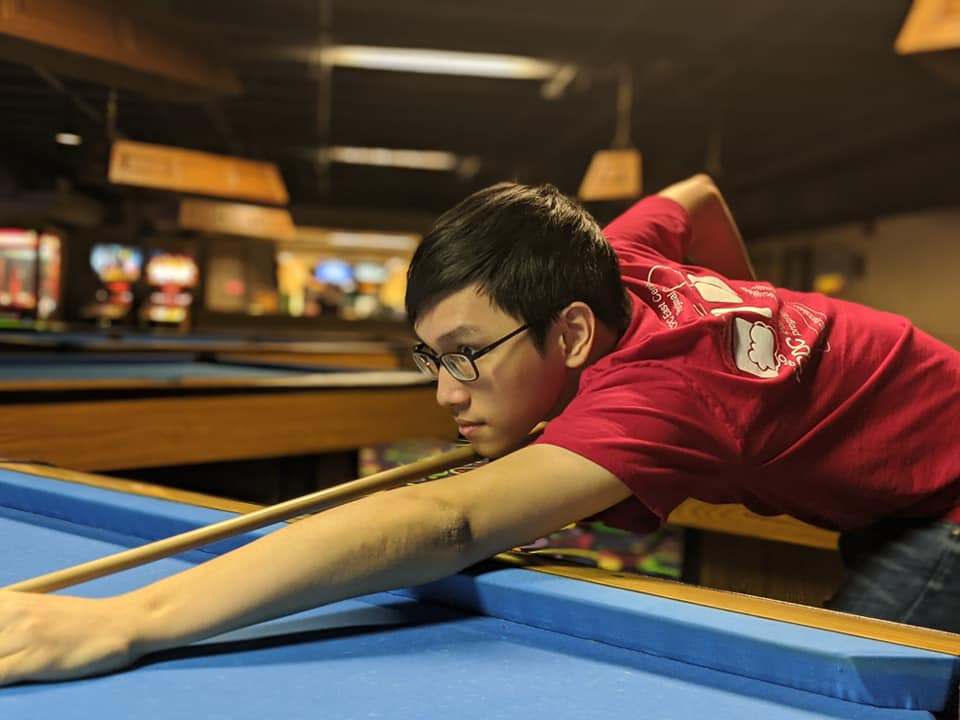

*Nếu các bạn không biết thì Kuroni là người thường xuyên đăng ảnh đồ ăn lúc đêm muộn trên kênh chat Discord của VNOI. Đúng là một tội ác*

Đúng rồi, thế nên việc mình làm nhiều thứ song song với việc nghiên cứu khiến mình không bao giờ thấy chán cả, mình không phải lúc nào cũng chỉ làm một việc duy nhất trong một thời điểm và mình liên tục thay đổi các hoạt động, thế nên mình thấy đấy cũng là bí kíp để mình không bị ‘burnout’ trong việc nghiên cứu. 

Bên cạnh đó mình còn duy trì việc tập thể dục, mình cảm thấy việc đi tập thể dục khá là quan trọng. Hồi xưa ba mẹ mình nói thì mình chả bao giờ nghe đâu, mãi khi mình chứng kiến trong quãng thời gian dịch Covid mình thê thảm như thế nào thì mình mới bắt đầu đi bộ, đánh cầu lông tuy mình cũng chả phải là người đánh cầu lồng hay lắm, nhưng sau khi chơi thì mình cảm thấy yêu đời hơn rất là nhiều.

*Những phần Kuroni vừa chia sẻ là những điều khá là quan trọng, đã có rất nhiều người mất một thời gian khá dài để nhận ra những điều đấy. Theo mình thấy sau Covid thì khá nhiều bạn bị burnout nên mình mong sau những chia sẻ của bạn Kuroni thì các độc giả có thể thấy tầm quan trọng của việc nuôi dưỡng những sở thích khác nhau để dễ dàng hoán đổi, không bị burnout khi stress và đặc biệt hơn là thói quen duy trì tập thể dục*

### Để kết thúc phần chia sẻ, Kuroni có thể chia sẻ những dự định của mình trong năm 2024 được không?

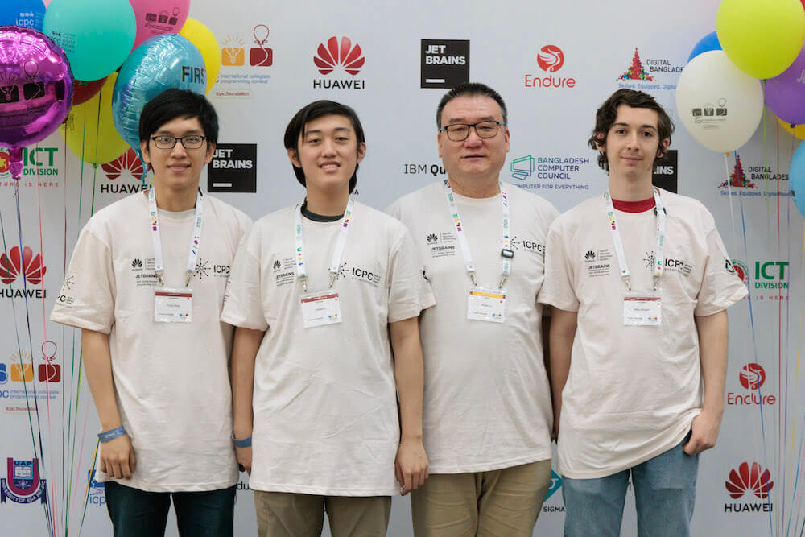

Bên cạnh việc đạt HCV, làm ‘Chú Tư’ của thế giới một lần ở kỳ ICPC World Finals tới thì mình sẽ tiếp tục tổ chức các contest Codeforces tiếp và đương nhiên là lên LGM Codeforces. Mình không rõ sẽ cố gắng lên trước hay sau WF nhưng chắc chắn là trong khoảng nửa đầu của năm 2024. Về nghiên cứu thì mình mong muốn project hiện tại của mình sẽ thuận lợi và có thêm một paper nữa ở UT Austin. Thật ra bản thân mình cũng là một Swifty, một fan của Taylor Swift cũng đã lâu, phải cỡ 13-14 năm rồi nên mình cũng mong sẽ giật được một vé tour thì cũng khá là hay. Đợt rồi thì mình không may mắn có đủ tiền để đi Eras Tour nhưng mình mong muốn là sẽ được đi Taylor Swift tour một lần trong đời trước khi Taylor Swift giải nghệ. Ngoài ra thì mình muốn chơi hay hơn ở các môn thể thao, gặp nhiều bạn tốt, mở rộng mối quan hệ với không chỉ ở cộng đồng CP mà cả ở những cộng đồng khác. 

### Cảm ơn Kuroni đã có phần chia sẻ vô cùng tâm huyết, chúc bạn sớm đạt được những dự định của bản thân trong năm 2024!

