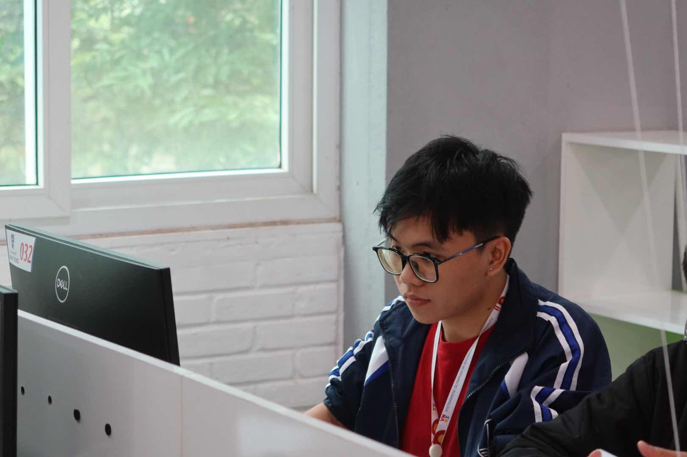
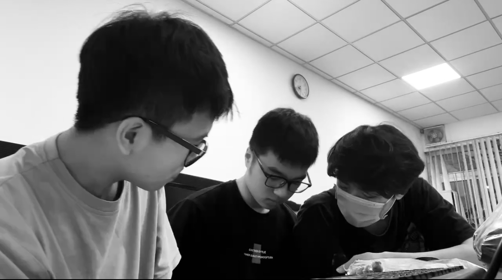
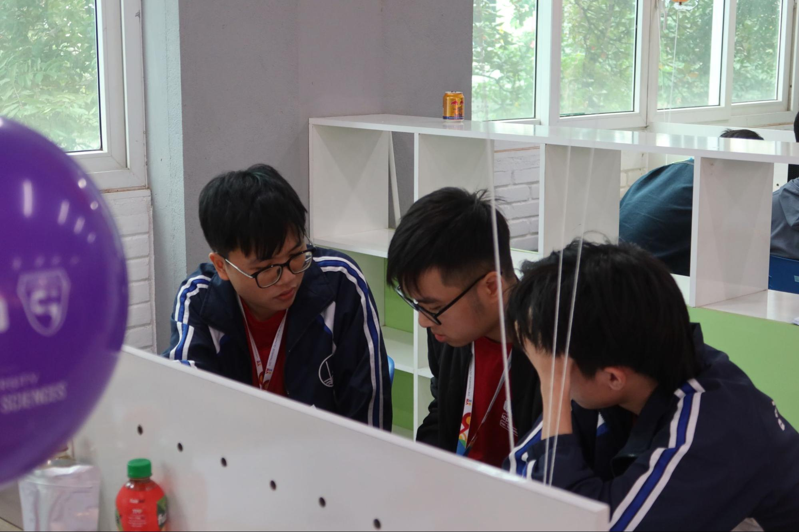

### Chào tất cả các bạn, hôm nay mình rất là vinh dự khi được phỏng vấn bạn Hoàng Quốc Việt, ‘trùm’ của một team nhiều thành viên nhất trong VNOI - team Bedao. Bạn có thể giới thiệu sơ lược về bản thân được không?

Xin chào mọi người, em là Hoàng Quốc Việt, nếu mọi người để ý thì tên của em trùng với tên đường ở ngoài Hà Nội. Hiện em đang học ở Trường Đại học Công nghệ, ĐHQGHN (UET) và cũng đã gắn bó với VNOI từ kỳ TNV gen 2. Sở thích của em thì ngoài chơi game như nhiều bạn khác thì em còn rất thích đá bóng nữa ạ. Ngoài ra, em cũng chơi nhiều game ạ, ai rủ em chơi gì thì em chơi nấy. Do em đang ở cùng bạn Vũ (Nguyễn Hoàng Vũ - IOI 2021) nên em hay chơi Liên Minh với bạn ý, trước đây khi ở cùng với các bạn khác thì em chơi Valorant.

### Vậy còn về sở thích đá bóng thì bạn có hay đi đá bóng thường xuyên không?

Em đi đá bóng khá thường xuyên ạ, thường thì 1-2 tuần em đá 1 lần. Em đá thì hay ‘lên công về thở’ nên đá tiền đạo. Tuy làm tiền đạo nhưng em cũng không hay ghi bàn lắm, cơ mà em cũng thường chọn vị trí để mở ra nhiều cơ hội cho đồng đội có những đường chuyền thuận lợi ạ.

### Bạn là một trong số những bạn không xuất phát từ những thành phố hay tỉnh lớn nhưng lại có hoạt động trong CP vô cùng ấn tượng như giải Nhì HSGQG. Bạn có thể chia sẻ hành trình thi HSGQG của bạn nhân dịp Bộ Giáo Dục vừa công bố kết quả kỳ thi HSGQG năm học 2023 - 2024 được không?

Năm nay thì tỉnh Hưng Yên cũng tự hào khi có một giải Nhì ạ, về hành trình thi HSGQG thì em có xuất phát khá chậm so với các bạn khủng là phải đến khi lớp 10 em mới được tiếp cận CP. Sau đó lớp 11 thì em có đậu đội tuyển tỉnh để thi QG và được giải Khuyến khích do hồi đấy code thuật trâu chưa tốt nên em cũng bị bug và mất nhiều điểm. Khi em lớp 12 thì đề thi năm đó ‘may mắn’ là có bài hình nên nhiều bạn toang nhưng em lại làm tốt nên được giải Nhì. Cụ thể là ở bài hình năm đấy em trâu được cỡ 60% bài. Từ đợt đấy nên em rút ra kinh nghiệm khi đi thi HSGQG đấy là đi thi không nhất thiết phải là người giỏi nhất, chỉ cần cẩn thận thôi thì ắt sẽ giải cao.

### Việc từ giải Khuyến khích lên giải Nhì là vô cùng ấn tượng, bạn có thể chia sẻ quá trình luyện tập của bạn để có bước nhảy vọt như thế được không? 

Đợt em thi năm lớp 12 thì ảnh hưởng bởi dịch Covid khá là nặng nên khá ít hoạt động trên trường. Hầu hết thời gian chủ yếu là em học online nên em chủ động nhắn tin và hỏi bài các bạn khác, do có sự giúp đỡ của các bạn nên em khi làm bài cũng có được nhiều kiến thức hơn. Điển hình là em cũng hỏi bạn Trung (Phạm Xuân Trung - giải Nhất HSGQG năm 2021 - 2022) khá nhiều về bài luồng hay các bài khó để từ đó em học hỏi từ bạn nhiều hướng giải và suy nghĩ kĩ hơn, code cũng cẩn thận hơn nữa. Theo em thấy trong một kỳ thi có nhiều người khủng như thi HSGQG thì không thể vào thi mà dành thời gian nghĩ cả giờ được mà phải cố gắng cắn trâu để dành được nhiều điểm nhất có thể. 

### Trong hành trình đến với VOI như thế, bạn thường luyện tập trên những nền tảng nào để nâng cao khả năng code trâu của mình?

Hồi đấy trừ làm những bài dễ ra thì em làm cũng khá nhiều bài Codeforces, nếu tính cả bài dễ thì từ trước đến giờ em làm cũng phải khoảng gần 2000 bài. Sau khi VNOJ có thêm nhiều nội dung mới thì em có chuyển sang làm, ví dụ như Bedao Contest, các dự án sinh test kì thi chính thức.

### Năm lớp 12 bạn được giải Nhì như thế thì có phải chuẩn bị để thi tốt nghiệp không hay được vào thẳng Vòng 2 (TST)? 

Đợt đấy lấy top 32 thì em khoảng top 40-50 nên em không vào được Vòng 2. Sau khi thi xong thì em quay sang thi tốt nghiệp, để cho dễ thì em học khối KHXH nên từ lớp Toán em được chuyển sang lớp Văn để học cùng các bạn nên là lúc đấy em còn muốn thi tốt nghiệp hơn cả TST. Ngoài ra, do thời gian học đội tuyển thì em tiếp xúc hầu hết là con trai, nên khi chuyển xuống lớp Văn học thì cũng bù đắp cho quãng thời gian đó thôi ạ. Thật ra có một số câu chuyện mà khi học đội tuyển em cũng không biết được, nên khi về lại lớp học thì em cũng có cơ hội kết nối lại với các bạn cùng lớp và làm quen thêm được nhiều bạn mới, em nghĩ đấy cũng là trải nghiệm khá là khác so với thi TST. 

### Bạn có thể chia sẻ quá trình nhập học đại học của bạn được không? Gia đình bạn có ủng hộ những quyết định của bạn không?

Sau thi tốt nghiệp thì em cũng được tuyển thẳng vào UET do có giải QG nên sau đó em có chọn ngành CNTT (CN1) ạ. Theo em được nghe thì ngành này được ít người biết đến so với ngành Khoa học máy tính của UET, do nghe qua học CNTT thì người ta tưởng là đi cài win dạo, nhưng mà theo em quan sát được thì có rất nhiều người khủng vào ngành này nên em cũng vào luôn. Về trường thì nhiều người khi hỏi UET thì họ không biết là trường nào, họ còn hỏi lại có phải là Học viện Bưu chính Viễn thông (PTIT) không nên em thấy trường rất ít được nhiều người biết tới. Nhưng em may mắn là có mẹ hoàn toàn ủng hộ em, nên mọi quyết định em đều tự tìm hiểu còn gia đình chỉ đứng sau ủng hộ em thôi ạ. Việc em chọn UET mà không chọn những trường khác như Bách Khoa Hà Nội (HUST) thì chắc chắn do sợ môn đại cương rồi. Nhưng mà đấy cũng không phải lý do chính mà là em vào UET để thi ICPC do em được biết trường rất đầu tư vào ICPC, nên nhiều bạn mạnh vào trường cũng giúp em có thể thoải mái lập team hơn, ngay trước khi vào UET là em đã có team rồi ạ.

### Kỳ thi ở Huế là năm thứ 2 bạn thi ICPC, bạn có thể kể về hành trình luyện tập và thi ICPC của bạn trong 2 năm qua được không?

Năm nhất thì bọn em làm bài nhiều hơn thì lại không được thi ICPC Regional ở TPHCM, qua năm hai thì bọn em cũng làm nhiều bài nhưng không làm nhiều như kỳ vọng, thế thì năm đấy lại được thi ICPC Regional ở Huế. Thật ra cũng do thiên thời, địa lợi, nhân hóa nữa ạ, do năm đó UET lấy số đội tham dự cũng nhiều nên đội được tham dự. Trong lúc train thì bọn em có xoay vai trò của nhau, nhất là vị trí leader khi mà mọi người sẽ thay phiên ‘chỉ đạo’ trong từng buổi luyện tập. Mỗi buổi như thế team sẽ cùng nhau làm 5 tiếng và sau đó thảo luận về bài và cùng nhau giải lại những bài chưa làm được. Việc luyện tập thì làm một mình sẽ chủ động thời gian hơn nhưng theo em thấy thì sẽ không có tinh thần như khi làm chung với team vì nhiều lúc có một số chỗ mình cần hỏi thì không có ngay đồng đội ngay cạnh để giải đáp được. Cường độ luyện tập thì bọn em sẽ làm theo team 1 tuần/1 lần, còn làm cá nhân thì tùy thời gian biểu của mỗi người mà bọn em làm bài trên Codeforces thôi ạ. 

### Bạn có kỉ niệm gì ở lần tham gia thi ICPC Regional ở Huế không? 

Kỉ niệm em nhớ nhất chắc là món chè heo quay, em không biết tại sao có món đấy tồn tại nhưng em thấy ăn cũng được. Để tưởng tượng thì món đấy như lấy bột canh trộn với đường xong cho thêm bánh như há cảo vào trong chè để ăn cùng. Ngoài ra ở Huế thì em thấy nhiều cảnh đẹp, con người cũng thân thiện, hơi xui một chút mấy hôm thi thì trúng mấy hôm trời mưa thôi ạ.

### Bạn có thể chia sẻ bí quyết cân bằng giữa việc ăn chơi, việc học trên trường và thi ICPC được không? Trong quá trình cân bằng bạn có gặp trở ngại nào không?

Theo em thì mình không cố cân bằng những việc này thì mình không cần cân bằng, em chỉ đơn giản xem những việc này là hoạt động thường ngày diễn ra tự nhiên thôi ạ. Như em chọn tuần nào train ICPC thì tuần đấy sẽ ít việc để làm trên lớp hơn, những ngày đi chơi thì em quyết định sẽ không học trong ngày hôm đấy để hôm sau học bù nhiều hơn. Công việc trong VNOI thì em sẽ sắp xếp từ trước nên em thấy mọi thứ nó là một phần của cuộc sống em luôn, lúc đấy em thấy mọi việc cân bằng sẽ dễ hơn.

### Hiện tại thì Việt đang quản lý team Bedao và xuất bản rất nhiều chuỗi contest vô cùng chất lượng trên VNOJ, không biết quá trình từ một TNV lên ‘trùm’ của team Bedao thì như thế nào?

Đầu tiên khi tham gia vào VNOI em có nguyện vọng là đóng góp cho cộng đồng từ chính những bài tập mình đề xuất lên trang. Sau đấy thì team Bedao có nhu cầu tuyển những coordinator (người tổ chức kỳ thi) cho các contest sắp tới nên em trở thành ứng cử viên cho vị trí này, để được đề xuất thì từ trước đến giờ em luôn thấy mình hoàn thành các công việc đúng hạn, tích cực đóng góp cho team nên được mọi người ưu ái. Khi đảm nhiệm vị trí này thì em vẫn duy trì trách nhiệm của một TNV và giám sát các công việc để đảm bảo đúng hạn. Ngoài ra có một số contest toàn bộ bài đều do em tự đề xuất nên phần nào cũng thấy tự hào khi mình đóng góp một phần không nhỏ trong cộng đồng. Theo em thấy dù ở bất cứ vị trí nào thì mình vẫn phải luôn giữ vững tinh thần và trách nhiệm với công việc, trong mọi tình huống thì luôn phải chủ động tại cơ hội sẽ luôn đến với mình, chỉ là có thể mình chưa nhận ra để nắm bắt thôi.

### Mình nghĩ việc duy trì trách nhiệm và luôn chủ động trong công việc là khá khó, theo bạn làm cách nào để duy trì tinh thần này?

Trước hết thì việc tham gia vào CLB phải thực sự là đam mê của mình chứ không chỉ tham gia và nhận việc. Khi có tinh thần đó thì mình sẽ xem những công việc và hoạt động đấy trở nên thân quen hơn, nhiều thứ trong đó trở thành một phần của cuộc sống và mọi người trong CLB như gia đình của mình vậy. Từ đó em có thể đóng góp hết tài năng cũng như trí lực của mình nên em sẽ có thể chủ động hơn để đảm nhận những vai trò khác nhau trong công việc.

### Là một người vô cùng nhiệt huyết và tận tâm với công việc, bạn có thể giới thiệu qua những công việc trong team Bedao được không? Có bao giờ bạn gặp áp lực về chất lượng contest bị mọi người phản ánh không?

Em thấy có một quan điểm khá đúng là khi càng đảm nhận những vai trò cao hơn thì việc của mình sẽ càng ít đi nhưng theo với đó thì trách nhiệm sẽ càng nhiều. Hàng tuần thì việc làm của em cũng không nhiều làm, thường thì trước mỗi tuần em sẽ sắp xếp trước công việc và thời hạn cho các bạn hoàn thành, sau đó đôn đốc các bạn coordinator hoàn thiện những contest đang làm, các bạn coordinator sẽ đốc thúc các bạn chuẩn bị bài tập đã được giao. Chẳng hạn như contest VNOJ Round 1 vừa qua thì em cũng là người đứng ra quản lý đầu việc cho các bạn, thường thì các việc này dành cho coordinator nhưng do contest đầu tiên nên em muốn đảm bảo chất lượng tốt. Ngoài ra thì em còn duy trì thói quen nghĩ ra những ý tưởng mới cho hoạt động của VNOI và team Bedao. 

### Với quãng thời gian đóng góp nhiều như vậy, theo bạn điều gì xứng đáng để bạn nhận lại sau khi đóng góp rất nhiều cho cộng đồng?

Điều em thấy xứng đáng nhất là số lượng thí sinh quan tâm đến contest trên VNOJ ngày càng tăng, hiện tại các contest duy trì ổn định ở mức 500-700 người, trước đó thì con số này đôi khi chỉ là khoảng 100-200 thôi. Ngoài ra thì các bạn coordinator ngày càng độc lập và trưởng thành hơn trong các quyết định của mình, theo em thấy thì việc đóng góp cho team Bedao là một mối quan hệ win-win, mình cho đi cộng đồng những contest chất lượng và đổi lại là những kỹ năng trước đó mình chưa bao giờ có. Sau khi cân nhắc như vậy thì em thấy công sức của mình rất là xứng đáng khi có thể đưa bản thân và mọi người cùng phát triển.

### Bạn có trải nghiệm thú vị hay đáng nhớ nào khi làm ở vị trí này không?

Trải nghiệm đáng nhớ chắc là em ‘dí deadline’ các bạn nhiều contest liên tục, đến nỗi mà mỗi ngày một deadline. Theo em thấy ‘dí deadline’ cũng là một nghệ thuật khi mình nhiều lúc phải nhắc khéo các bạn, thay vì báo sắp đến deadline thì em sẽ bảo em tạo xong contest thông báo trên VNOJ rồi. Khi đó các bạn sẽ lên VNOJ kiểm tra và so sánh lại tiến độ công việc của mình với tiến độ chung của mọi người. Nhiều trường hợp em sẽ nhắn tin riêng để chia sẻ công việc với bạn ý, vì thường team Bedao sẽ phân bố các đầu việc hợp lý cho các bạn, không để một bạn đảm nhận nhiều việc quá và một bạn khác thì ít việc quá. Em nghĩ nếu xây dựng môi trường lành mạnh như thế thì các bạn cũng được tạo điều kiện để hoàn thành sớm các công việc. 

### Bạn cảm thấy trong quãng thời gian dẫn dắt team Bedao thì bạn học được những gì?

Em cũng học được cách giao tiếp cũng như diễn đạt cho mọi người, mình không thể giao tiếp mà chỉ mình hiểu được mà cần diễn đạt rõ ràng để các bạn cùng tiếp nhận. Trước đó thì em bị đánh giá là diễn đạt hơi kém nhưng sau quá trình làm ở Bedao một thời gian dài thì em thấy mình tự tin trong giao tiếp hơn rất nhiều. Ngoài ra thì em còn học một kỹ năng nữa, người xưa hay gọi là ‘Binh pháp Tôn Tử’, đấy là kỹ năng nhận xét và đánh giá công việc của người khác. Ta sẽ phải quan sát điểm mạnh và điểm yếu của mỗi người để đặt vào vị trí bạn có thể phát huy được tối đa điểm mạnh của mình, như bạn nào vốn giỏi ra đề thì mình sẽ khuyến khích bạn ra đề nhiều hơn, bạn nào giỏi làm tester thì sẽ không cho bạn ý ra đề nhiều mà cho các bạn ý kiểm tra bài tập nhiều hơn, cũng từ đấy mình phát hiện ra những bạn làm việc trách nhiệm để đề cử lên coordinator. 

### Về tương lai của team Bedao thì bạn có dự tính gì để duy trì Bedao Contest là chuỗi contest chất lượng và uy tín nhất?

Em thấy ở bất cứ môi trường thi cử nào thì sự công bằng nên luôn đặt lên hàng đầu, team Bedao sẽ luôn giữ vững sự công bằng đấy bằng cách mạnh tay loại bỏ những trường hợp chép code hay cố tình gian lận. Sau khi giữ vững sự công bằng thì Bedao sẽ có uy tín nhất định, lúc này em sẽ chú trọng vào nâng cao chất lượng bộ đề. Bộ đề hiện tại thì vẫn có những điểm yếu nhất định, vẫn tồn tại những bài test yếu, đề sai, … nhưng trong tương lai thì team Bedao sẽ cố loại bỏ những điều ấy để hướng tới các contest hoàn hảo hơn. Ngoài ra em cũng mong muốn VNOJ duy trì tốc độ chấm bài nhanh trong các kỳ thi để đảm bảo các thí sinh có trải nghiệm thi tốt nhất. 

### Bạn có những dự định nào dành cho Bedao mà ngay cả các bạn trong VNOI cũng không biết không?

Em có thể tiết lộ là em đang ấp ủ chuyện xem xét các bạn tình nguyện viên nhiệt huyết lên làm Coordinator một vài contest để các bạn thể hiện khả năng quản lý của mình. Điều này nó hơi chuyên môn một chút nên em cũng không chia sẻ nhiều.

### Đến với phần cuối, bạn có thể chia sẻ về những dự định cho tương lai, về ngành học và nghề nghiệp bạn muốn theo đuổi được không? Có công ty nào bạn mơ ước vào làm không? Theo bạn, một công ty lý tưởng theo bạn cần hội tụ những yếu tố nào? 

Em hiện đang tham gia khá nhiều các workshop liên quan đến định hướng nghề nghiệp như Blockchain và Software Engineering. Em cũng muốn thử sức ở lĩnh vực nào liên quan nhiều đến tài chính một chút tại em thấy tư duy tài chính cũng khá hay, giúp bản thân suy nghĩ mạch lạc hơn. Ước mơ xa hơn của em là được làm startup, nhưng công ty lý tưởng để vào làm thì em cũng có một số cái tên như Pendle Finance, Dytechlab. Em cũng chưa đi làm nhưng dưới góc nhìn của em thì một công việc lý tưởng phải là nơi em thật sự đam mê, luôn sẵn sàng cống hiến hay thức đêm nếu có nhiệm vụ quan trọng. Đấy sẽ là nơi em ở được là một phần của công ty chứ không phải làm cho xong việc rồi nghỉ.

*Cảm ơn bạn đã nhận lời và tham gia phỏng vấn ngày hôm nay. Chúc bạn một năm mới nhiều sức khỏe, ngày càng phát triển Bedao và sớm kiếm được thực tập ở các công ty lớn!*
