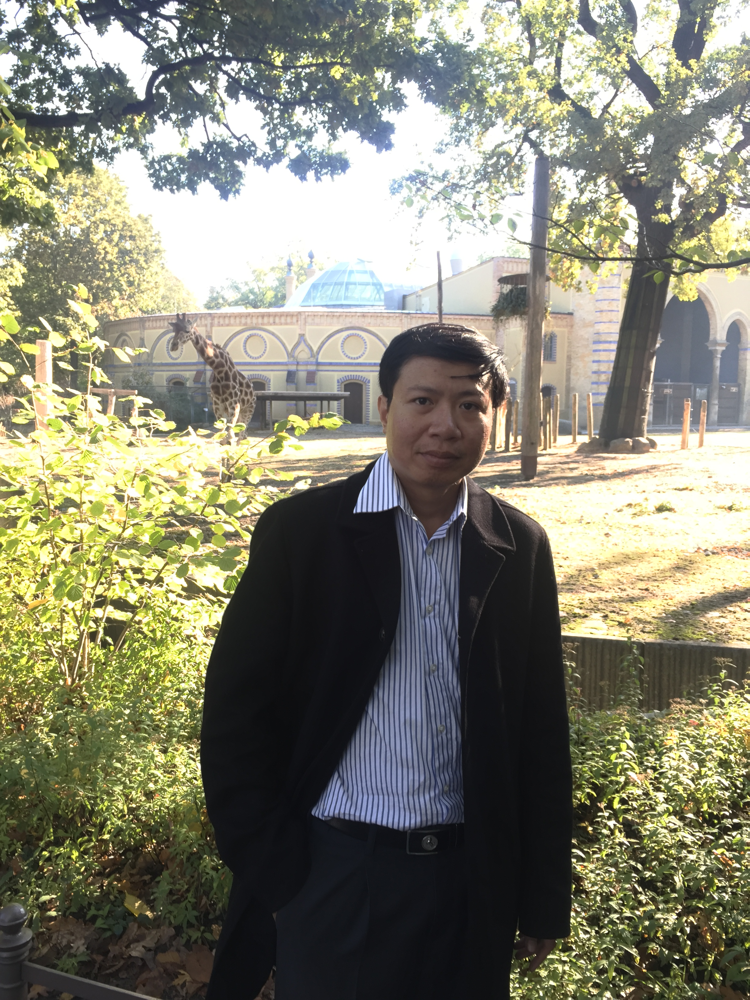

*Đầu tiên thì rất cảm ơn thầy hôm nay đã nhận lời phỏng vấn cho tạp chí VNOI số Tết!
Thầy là người mà tất cả các bạn rất mong muốn được phỏng vấn. Còn gì tuyệt vời hơn khi được phỏng vấn một “huyền thoại”, với không chỉ một, mà là hai nghiên cứu đã thay đổi nền Tin học Việt Nam – Sách “Giải thuật và Lập trình” và phần mềm chấm thi Themis mà các bạn bây giờ vẫn hay dùng. Kì thi Học sinh giỏi Quốc gia vẫn còn dùng Themis, và có thể sẽ còn được sử dụng dài dài.*

### Thầy là một trong những giáo viên dạy Tin thuộc những thế hệ đầu, vậy thì cơ duyên nào đưa thầy đến với môn Tin học?
Câu này nếu trả lời thì sẽ dài lắm! Từ khi mình học cấp 2, mình cũng biết Tin học là gì rồi. Hồi ấy, mình học Tin trong trong tiết Kĩ thuật. Tiết học chán lắm, mình chả có tí cảm hứng nào cả! Lên cấp 3, khi mình gặp người thầy đúng chuyên môn thì khác biệt thật, thầy không những dạy kiến thức, mà còn dạy những kĩ năng nghề nghiệp, và truyền cho mình cái đam mê nghề nghiệp nữa. Lúc đấy thì mình mới cảm thấy thích.

Nói thật thì thời xưa, bọn mình học 100% là đam mê, chứ không nhận được nhiều ưu đãi về lớp chuyên, giải Quốc Gia,... như các bạn bây giờ. Hồi mình thi Quốc Gia, không hề có tiêu chuẩn tuyển thẳng đại học! 100% là vô tư, thích thì học, không thích thì bỏ thôi.

Trong môi trường ấy, cũng may là các thầy cô hay khuyến khích, rằng “nếu em thích thì em cứ học giỏi môn này cái đã, các môn khác tính sau!”. Thật vậy, nếu như cứ gây sức ép học đều đều những môn còn lại, môn Tin chỉ học vài tiết một tuần thì chả thể nên cơm cháo gì được.

Mình tới với môn Tin học, đơn giản vì Tin học nó hấp dẫn! Nó không phải như môn Toán, các bài toán khó nhăn nhở trong các kì thi đâu. Mình thích những lúc các anh sinh viên đi làm các đồ án tốt nghiệp, các phần mềm đồ hoạ “chạy nhảy”, và những lúc mình làm ra được một phần mềm nào đó,  được người khác sử dụng. Có thể niềm vui ấy rất là đơn giản, nhưng mình cảm thấy nó thật sự có giá trị thực tiễn, khác với giải một bài toán, khi mà mình chỉ sướng được một lúc thôi thì đã phải chuyển sang bài khác rồi.
### Thầy có đề cập đến việc cảm thấy hứng thú khi viết ra phần mềm và được người khác dùng. Liệu nó có phải là lí do để thầy viết ra phần mềm chấm thi Themis – phần mềm đã thay đổi cách chúng ta dạy học ở Việt Nam hay không?

Trải qua quá trình làm nhiều phần mềm, có cái làm vì mong muốn cá nhân, cũng có những cái làm để bán nữa, mình có kinh nghiệm lập trình khá đáng kể.

Vào năm 2001, cộng đồng Tin học có hệ thống chấm tự động AMM2, nhưng khi chấm C\++ phải dịch file C\++ ra .EXE mới chấm được. Thế là mình bảo với cả Đông (thầy Đỗ Đức Đông), hay là "viết luôn một trình chấm đi!".

Đầu tiên thì mình cũng định viết cho vui thôi, nhưng mà sau đấy thì thầy Đông bảo: Nếu mà dùng được ổn định thế này, thì xin luôn dự án của Bộ đặt hàng luôn một thể!

Mình nghĩ Themis là một phần mềm khá đơn giản, nhưng yêu cầu lớn nhất của phần mềm đó thì phải chạy không được lỗi! Chạy chậm hay ít chức năng cũng được, nhưng một khi đã chấm thì phải chạy từ đầu tới cuối, không được ngừng giữa chừng hoặc có lỗi. Ngoài ra nó phải gọn nhẹ, dễ cài đặt trên máy xách tay để các thầy mang lên lớp trong điều kiện không có server và internet.

### Nhiều bạn thắc mắc thi bằng C++ bây giờ sẽ được chấm bằng bản C++14, không biết thông tin này có chính xác không ạ?
Thật ra giả sử có một thầy ra đề thi đòi hỏi một cách chấm riêng thì thầy có quyền được chấm theo kiểu của thầy, nên sẽ không có quy ước cố định. Khi viết chương trình tương tác với code của thí sinh, nếu lệch phiên bản C++, code hoàn toàn có thể bị dịch lỗi. Tuy vậy với những bài đặc thù như thế thường sẽ có đặc tả rõ ràng trong đề.

### Thầy mất khoảng bao lâu kể từ khi Themis ra bản đầu tiên để cho ra phần mềm có khả năng chạy ổn định, được đón nhận rộng rãi?
Phải mất khoảng một năm. Thực ra để thành hình sản phẩm thì mất có vài tuần thôi, nhưng mình với thầy Đông mang đi dạy khoảng một năm, thấy ổn định mới dám cho nghiệm thu và chấm ở VOI năm sau.

Một trong những đặc điểm hay ho của môn Tin học so với môn khác đó là chấm tự động. Chuyện mình đọc code rồi chấm gây ra nhiều sai sót, làm cho việc ra đề thiếu chặt chẽ. Mình đọc rất nhiều đề thi trong các kì thi cấp thấp, thì đề toàn đưa ra những dữ liệu đầu vào (input), dữ liệu đầu ra (output) không có ràng buộc input nào, nhìn có vẻ như là những người chấm có ý tưởng sẽ chạy chương trình bằng tay rồi chấm. Nhưng làm vậy thì trái với quy ước của một đề thi Tin học thuần tuý – có ràng buộc dữ liệu. Khi mà hội đồng chấm thi đòi hỏi phải nộp luôn bộ test khi ra đề, thì chắc chắn đề thi phải có những ràng buộc cơ bản như thế.

### Từ khi Themis trở thành trình chấm chính thức cho các cuộc thi (như kì thi HSGQG), thì thầy đã có những kỉ niệm khó quên nào chưa ạ? 

May là chưa có! Mình cũng gặp một số thắc mắc, nhưng cuối cùng lần ra thì cũng là do lỗi của thí sinh thôi. Chẳng hạn như, đôi lúc có những hành vi không xác định (undefined behaviour), lúc đó code chạy trên máy thì ổn, nhưng lúc chạy trên trình chấm, rồi thử chạy trên các trang như ideone, Codeforces thì nó cũng bị tình trạng giống như thế.

Thắc mắc nhiều nhất là khi Themis được đưa vào chấm chính thức bằng C\++11. Lúc đấy thì nhiều code C\++98 bị dịch lỗi. Thực ra thì trước khi tham gia bất kì cuộc thi nào, thí sinh phải biết quy tắc, “luật chơi” của kì thi đấy. Nhưng mà ở VOI, thì quy chế của Bộ chỉ nói là C++ thôi, không đề cập phiên bản nào, thế hệ bao nhiêu! Cho nên đôi khi, cần có một thứ phổ biến để giúp thí sinh hiểu rằng “nếu anh chấm ở nhà bằng phần mềm ấy không lỗi, thì tức là đi thi có thể dùng được các lệnh đó!”. Và Themis đã làm được điều ấy. Mình nghĩ Themis đã góp phần hạn chế bớt lỗi trong quá trình thi thật, khi Themis đã được phát hành rộng rãi cho tất cả mọi người đều có thể tiếp cận.

### Chuyện về những ngày đầu ra đấu trường quốc tế
Tin học là môn học hay, được dự đoán là một phần rất quan trọng trong nền giáo dục tương lai, do đó, năm 1987, Hội nghị UNESCO về giáo dục nêu đề xuất tổ chức kỳ thi tin học quốc tế (IOI) bên cạnh các môn Toán, Lý, Hóa, Sinh. Bulgaria đứng ra đăng cai IOI đầu tiên vào năm 1989. Hồi đấy,  Tin học đã được tiếp nhận tại Việt Nam, nhưng chỉ dạy cho một số sinh viên ở các khoa đặc biệt của trường đại học mà thôi. Ông Trần Hồng Quân (Bộ trưởng Bộ Giáo Dục từ năm 1987 đến năm 1997), gọi thầy Đàm (Nhà giáo nhân dân Hồ Sĩ Đàm - đồng tác giả bộ sách giáo khoa Chuyên Tin) lên và bảo: “Tôi cũng chả biết môn này là môn gì, nhưng mà thấy bảo môn này quan trọng lắm! Về nhóm cái đội đi thi Quốc tế đi!”. Thi thì, có thể giải ở những năm đầu không quan trọng đâu, chủ yếu để biết người ta học thế nào để mình học theo.

Thầy Đàm về kêu mãi 4 đứa theo chỉ tiêu tối đa đi thi quốc tế, nhưng gọi được có 3 người thôi. Ba người ấy học cấp tốc trong khoảng độ từ 3-4 tháng, về thì có huy chương Đồng. Xong rồi ngay từ những năm sau thì Việt Nam mình đã có Vàng, có Bạc. Đỉnh cao đến năm 1999 Việt Nam đứng #1 toàn đoàn. Bây giờ Việt Nam còn thiếu đúng chức vô địch IOI.
Sau IOI lần đầu, ông Quân bảo là: "Chưa học gì mà đã được huy chương Đồng, vậy thì triển khai học là ngon ngay". Do đó, ông yêu cầu thầy Đàm triển khai chương trình dạy tin học phổ thông.

Các thầy của Việt Nam có thể là những chuyên gia rất giỏi, nhưng viết chương trình lại là thách thức lớn, khi phải biết dạy cái gì trước, cái gì sau. Hơn nữa, các thầy không thể áp cái cách học của mình xuống học sinh phổ thông vì hầu hết các thầy học tin đều trong trạng thái đã là Tiến sĩ, Phó tiến sĩ, Thạc sĩ, Cử nhân các ngành Toán, Lý, Tối ưu hóa, Tự động hóa rồi. Hồi đấy thì chưa bỏ cấm vận, mình chỉ giao lưu với các nước thuộc khối Vác-sa-va (Warsaw) - các nước Xã hội Chủ nghĩa thôi. Nên các thầy phải đi xin tài liệu của Ba Lan, Nga, v.v, rồi sau đó thì trộn vào thành một cái chương trình, dạy ở một vài trường chuyên: trường chuyên Khoa học Tự nhiên, trường mình (Đại học Sư phạm), Đại học Bách khoa, trường chuyên Hà Nội – Amsterdam, thành phố Hồ chí Minh với trường Phổ thông Năng Khiếu, v.v. 

Học sinh của mình thì có cái hay: "nếu không thi, thì không học; còn một khi đã thi thì nó sẽ học và ông thầy cũng sẽ phải cố dạy!". Từ đó, nội dung học ngày càng được làm phong phú thêm và chuẩn hóa dần. Do vậy, chỉ có huy chương Đồng trong lần đầu tiên tham dự thì mang lại sự bất ngờ thôi, còn những năm sau, tính cạnh tranh được nâng cao, đề thi bắt đầu khó rồi.

Những năm đầu tiên, IOI vẫn có format chấm như các môn khác: học sinh trình bày thuật toán ra giấy; Chương trình có là được, không có thì cũng chả đến nỗi bị 0 điểm. Sau đó, mình phải dịch bài ra tiếng Anh, rồi từng nhóm chia nhau ra chấm. Trong ngày cuối cùng, trưởng đoàn phải đứng ra bảo vệ cho học sinh mình - tranh luận ở những điểm nào đang mấp mé giữa cho điểm hay không. Nói chung, việc chấm bài rất mệt mỏi, và hội đồng làm việc rất căng thẳng trong một khoảng thời gian dài.

Đến năm 1994, người ta cãi nhau “mệt rồi”. Thôi thì, anh làm sai cũng được, nhưng tôi có một bộ test, làm sai là một phần của cuộc chơi, anh cứ đúng test đó là được. Từ năm ấy, người ta bắt đầu chấm theo bộ test. Từ khi bắt đầu chấm bộ test, Việt Nam mình kết quả cũng có chiều hướng đi xuống; Có năm chỉ được 1 tới 2 huy chương Đồng. Nhưng mà ngay sau đấy, từ năm 1995 tới 1999, Việt Nam mình đứng nhất thế giới! 
Dù chấm bằng bộ test nhưng tính chất bài thì vẫn giữ nguyên, là các bài toán tối ưu. Các bài đó được chấm theo độ tốt, thí sinh không cần đưa ra đáp án chính xác tuyệt đối. Hồi đấy, đa số các bài đưa ra thì sẽ theo kiểu NP đầy đủ (NP-complete). Sau đỉnh cao 1999, không chỉ Việt Nam, rất nhiều nước khác bắt đầu dùng chiến thuật: không tập trung nghĩ thuật toán hoàn hảo cho một bài nào cả (subtask), bài nào cũng phải có code một phần nào đó. Đôi khi code ấy lại được điểm rất là cao, nhưng nói thẳng là thuật toán sai ấy! Bởi vì phải đưa ra đáp án gần đúng chứ không phải đáp án chỉ có một số, đúng chính xác như bây giờ.

Đến năm 2003 hay 2004, người ta mới bắt đầu chấm tuyệt đối – lệch một đơn vị cũng chết. Đến năm 2010, thì việc chấm đúng test nào được điểm test nấy cũng không công bằng – yếu tố may mắn còn nhiều quá. Vậy là IOI bắt đầu áp dụng format chấm theo bộ test cho từng subtask (batch) – phải đúng hết tất cả các test trong subtask đó thì mới ăn điểm.

### Giáo trình phổ thông môn Tin học những ngày đầu tiên
Ở các môn khác, người ta nhặt ra rồi nâng cao một vài kiến thức từ chương trình phổ thông đại chúng; Các kiến thức ấy trở thành chương trình chuyên. Còn với môn Tin thì ngược lại, chương trình chuyên có trước, sau đó được giảm tải đi, trở thành chương trình đại trà. Cho nên người ta hay phàn nàn về việc phần lập trình của chương trình phổ thông cũ khá nặng. Thật ra thì phần lập trình đâu có giảm tải. Nó chỉ có hai dạng: biết lập trình hoặc không biết lập trình thôi! Câu lệnh thì vẫn phải học đủ chứ giảm tải được lệnh gì!

Không dạy for với while thì lại không được!

Ngày xưa, thì trong sách lớp 11 dạy thế đấy! Trong Pascal có 3 vòng lặp: repeat, while với for. Tương tự cho C, có do..while, while với for. Hàm while là hàm tổng quát nhất, thì người ta dạy mỗi while còn hai cái kia thì lại bỏ! Tước bớt công cụ thì lập trình lại càng khó hơn chứ đâu có dễ hơn gì đâu!
Đôi khi bệnh thành tích hay học để thi, thì cũng có mặt tích cực: Khi mình đã đại diện cho một đơn vị nào đấy đi thi, thì mình phải có một sự nỗ lực cố gắng, và trong quá trình nỗ lực cố gắng ấy, thì mình mới thấy thích! Không có yêu cầu thành tích thì người ta chả học đâu, hoặc học mà không có định hướng, không có mục đích rõ ràng. Ông thầy cũng lười, vì môn của mình đâu có thi đâu mà phải ép các bạn học sinh nhiều vậy! 
Trong thể thao, một người không tập luyện bài bản gì vẫn có thể chạy, đánh bóng bàn, cầu lông, đá bóng, … nhưng vẫn phải có các động viên thành tích cao, thì người ta mới biết chơi thế nào là đúng kỹ thuật, tránh chấn thương, rồi ăn uống, ngủ nghỉ như thế nào để nâng cao thành tích… Trong Tin học cũng tương tự thế, chỉ những thí sinh CP mới biết kỷ luật nghiêm ngặt khi chấm bằng test, biết cách hạn chế các lỗi tràn hay hành vi không xác định…

Còn bệnh thành tích nó cũng có mặt tiêu cực, ngoài những thứ mà báo đài hay đề cập thì trong môn Tin học, có xu hướng không học/không dạy những kiến thức không xuất hiện hoặc ít xuất hiện trong các bài thi cho dù đó là những giá trị cốt lõi. Chẳng hạn nhiều bạn “ngại” học con trỏ, “từ chối” học lập trình hướng đối tượng, sẵn sàng code bẩn, code bắt test để che giấu lỗi…

Qua đấy mới thấy việc ra đề và làm test trách nhiệm cao đến thế nào: Không chỉ là để phân loại trao giải mà còn để định hướng việc học cho các thế hệ sau nữa. Làm thiếu trách nhiệm sẽ đẩy việc học xa rời các giá trị cốt lõi mà tập trung vào các kỹ năng vô bổ.

### Quan sát tin học Việt Nam một thời gian, trình độ các bạn từ khi Codeforces được phổ cập thì bắt đầu tăng rất nhiều. Các kĩ thuật vào những năm ngày xưa được liệt vào dạng cao cấp như Segment Tree, Chia căn, ... thì bây giờ được xem là thuật phổ thông! 
Ngày xưa mấy thuật này phải tự chế ra! Thường thì các thuật ấy không có trong sách vở chính thống hoặc có nhưng khó tìm sách mà đọc lắm. Đa số các trường hợp là nhờ một người nào đấy làm bài rồi tự chế ra, sau đó truyền lại thế thôi chứ nó không phổ biến rộng.

### Thầy thấy rằng trong 5 năm trở lại đây thì Tin học Việt Nam đang ở mức nào? Trình độ chung các bạn như thế nào?
Mình nghĩ rằng gần đây các bạn cũng có mặt giỏi hơn, nhưng cũng có mặt dở hơn. Tất nhiên thì ở đỉnh cao, sóng sau sẽ luôn lớn hơn sóng trước. Nhưng so với ngày xưa, thì bây giờ khi các bạn học cơ sở, các bạn phụ thuộc vào Internet và ChatGPT nhiều quá! Học những cái ABC mà đã bị phụ thuộc vào những thứ đấy, thì các bạn sẽ không học được những thứ DEF rồi XYZ. Những viên gạch, những bước chân đầu tiên, thì mình phải tự bước đi! Phải tự bước đi, để tự vấp ngã, tự đứng dậy. Những bước đi có người dắt chỉ là học động tác, bạn phải tự đi thì mới biết cách lấy thăng bằng, và cái chi tiết đó tuy là nhỏ nhưng không ai dạy được cả.

Mình thấy rất nhiều bạn như thế, kể cả là sinh viên. Tất nhiên thì những bài ở mức độ nhập môn ở đâu cũng có, ai cũng dạy như thế cả nên chắc chắn là tìm trên mạng sẽ có được code, và học thuộc rồi đi thi thì sẽ làm được thôi! Nhưng cái quan trọng là khi mình làm những bài đấy, thì mình phải tự làm, phải trải nghiệm những sai lầm, để biết cách sửa lỗi sai ấy và trưởng thành hơn. Nhiều bạn hiện tại hoàn toàn không có khả năng tự sửa chữa lỗi sai ấy, vì code đúng hết rồi thì lấy đâu mà sửa nữa! Thậm chí là chuyện chép code của nhau cũng thế, thay vì tự mình tư duy như hồi xưa, việc đầu tiên các bạn làm là search và chép code. Điều này làm cho tư duy của các bạn bị kém độ nhạy đi. Kiến thức học sinh bây giờ có thể được học nhiều hơn trước, nhưng độ nhạy bén trong suy nghĩ để vận dụng các kiến thức ấy không bằng các thế hệ xưa.

Ngay cả trong việc học C++, các bạn tập sử dụng các hàm trong thư viện sớm quá! Nếu ngay từ đầu mà đã nhảy vào dùng set, map, v.v, thì người ta sẽ không hiểu cái nguyên lý của các cấu trúc dữ liệu đó. Mà đôi khi, đích đến của việc học không phải là để cài bài tập, học là để hiểu nguyên lý! Đấy mới là cái bổ ích, là giá trị cốt lõi của khoa học máy tính. Thật ra để làm những thứ mà chỉ đơn thuần dùng set, map thì chả có phần mềm nào đòi hỏi bạn tự code bằng tay đâu!

Tỉ lệ thuận với sự phát triển của các phương tiện truyền thông, việc giao lưu hỏi bài trên các diễn đàn trở nên thuận tiện hơn. Nhưng nó cũng là cái thứ dở đấy! Ngày xưa, có những bài phải nghĩ vài tháng mới ra. Thậm chí, có những bài mà cho đến bây giờ vẫn nghĩ chưa ra. Nó ở cái mức IMPOSSIBLE ấy, bản thân người ra đề còn chưa tin là mình có được giải pháp tốt đâu. Thế nhưng mà qua quá trình xoay sở ấy, thì kĩ thuật và tư duy của mình sẽ lên khá đáng kể. 

Nói về chuyện chấm tự động, cho học sinh chấm tự động ngay từ đầu, mình nghĩ không phải là điều hay. Không cần nộp bài chấm tự động, đọc code, hack được code của thằng bạn hay bị hacked rồi phân tích xem vì sao test này lại hỏng… Cách học như thế sẽ mang lại năng lực học tập tích cực hơn nhiều, giúp việc học đỡ khô khan hơn. Mình nghĩ môn này học rất hay, nhưng mà do cách học nên một số bạn bị thụ động, dẫn đến nhanh chán. Tóm lại nếu như ngay từ đầu mà các bạn không chịu khó trải nghiệm khó khăn và vượt qua chúng, thì không thể đi xa được.

### ChatGPT thì gần như nó sẽ giải được hết các bài đơn giản hoặc cơ bản. Vấn đề là nếu chúng ta không nghĩ bài đấy thì sẽ không thể giải được các bài khó, sẽ chỉ mãi dậm chân tại chỗ.

Nó không phải là chỉ có các bạn học chương trình Tin học phổ thông đâu. Ngay cả trong lớp chuyên Tin, nếu như ngay từ đầu mà các bạn không chịu khó trải nghiệm khó khăn và vượt qua chúng, thì cũng chả đi được đến đâu. Sử dụng ChatGPT cho các bài đơn giản, nó sẽ đọc cả đề và solution chuẩn 100%! Nhưng nếu chúng ta không nghĩ bài đấy thì sẽ không thể giải được các bài D, E, F trong một cuộc thi trên Codeforces được, ta sẽ chỉ mãi giậm châm tại chỗ. ChatGPT nó làm mọi người lười suy nghĩ hơn.

Vấn đề của cách học này còn dính dáng tới chuyện về học toán nữa cơ. Cách học toán của các bạn hiện tại vẫn theo kiểu gần như tương tự: ngay cái lúc mà bạn học toán ở cấp cơ sở, thì các bạn đã phụ thuộc vào sách bài tập, lớp học thêm, các hệ thống AI, v.v, làm tư duy toán của các bạn khá là nông. Thậm chí là, nếu mình đọc thử đề thi toán các trường chuyên, hầu như là toàn các bài rất khó, thì các bạn giải tốt, nhưng đến những cái toán vô cùng cơ bản, thì chưa chắc các bạn đã nhớ và vận dụng tốt. Phải nói rằng người thầy dạy phải khéo lắm thì mới cảm thấy các bạn đang làm bài tốt, nhưng rất có thể đó là giá trị ảo dẫn tới đánh giá sai: tưởng các bạn giỏi vì làm được bài khó nên liên tục nâng cao mà không biết rằng các bạn đang mất cơ bản. 

Như đã nói, ChatGPT nó làm mọi người lười suy nghĩ hơn, và điều này rất nguy hiểm. Mình dạy những bài toán cơ bản: tìm kiếm nhị phân, sàng số nguyên tố,... Mình không phải chỉ dạy đơn thuần thuật toán đấy – nó chỉ là một phần rất nhỏ thôi, vì cái tư tưởng thuật toán và cách thức triển khai chương trình mới quan trọng, và qua việc mô phỏng đúng một thuật toán thì người học mới thấy được cái hay và phát triển tư duy giải quyết vấn đề. Ví dụ với sàng số nguyên tố, ngày xưa, ông tác giả dùng cái que, chọc một vài lỗ lên lá để sàng. Ta phải mô phỏng lại quá trình đấy, để các bạn thấy được cái hay của thuật toán, và tư duy của các bạn sẽ phát triển khác đi.

Những bài toán "lớp 1, 2" thì chắc bây giờ ChatGPT làm được hết rồi! Nhưng nếu anh không chịu học lớp 1, 2 thì chẳng thể lên được 3, 4; càng chẳng thể học tiếp lên cấp 3, Đại học, Thạc sĩ, Tiến sĩ rồi đi làm được. Những thứ cơ bản ấy, sớm muộn gì cũng phải học, mọi người cũng sẽ thuộc bảng cửu chương, và biết cộng trừ nhân chia. Có thể lớp 1 học không giỏi, nhưng mình nghĩ rằng một khi đã đến lớp 12 thì chắc ai cũng phải biết đọc, viết, cộng trừ hết rồi. Tóm tắt lại, phải biết cộng biết trừ rồi mới học cái khác. Mình nghĩ là học sinh phổ thông, khi bắt đầu học một môn mới, bạn có thể nhận thức hơi chậm và kỹ năng giải bài kém - nó chẳng nói lên điều gì. Chỉ cần bạn kiên trì, khắc phục được những điểm yếu của mình, thì bạn còn có thể tiến xa hơn những bạn “phát triển sớm” hoặc được học trước, nếu như bạn không bỏ qua những năng lực cần có của từng bài học. 

### Codeforces theo thầy đã thay đổi nền tin học Việt Nam như thế nào, khi trong 5 tới 7 năm gần đây là nền tảng lớn nhất, phổ biến nhất cho CP-er ở Việt Nam?
Các bài của Codeforces, đặc biệt là Div 2 và Div 3, nó tập cho các bạn đang nhập môn lập trình khả năng code nhanh và code chính xác. Ta cần một giải pháp đơn giản cho các bài đơn giản. Tất nhiên để làm được bài đấy thì dễ thôi, nhưng cần phải làm vừa nhanh, vừa chính xác. 

Có rất nhiều bài toán khó trên Codeforces là lắp ghép của những bài cơ bản. Với từng đoạn cơ bản, nếu bạn code vừa ngắn vừa đúng đắn, thì chương trình lớn sẽ dễ kiểm soát hơn. Ngược lại, ngay đoạn ngắn mà đã bug rồi, thì sẽ không thể viết được những chương trình phức tạp hơn. Cái đấy thầy nghĩ là cái lớn nhất mà Codeforces đóng góp được.

Còn Div 1, thì mình nghĩ nó chỉ dành cho những ông đi thi thôi, còn để học thì mình nghĩ rằng cứ cài Div 3, Div 2 lên khoảng độ Expert, Candidate Master gì đấy. Tuy nhiên thì Codeforces không dành cho những kiểu người già như mình, chân tay chậm rồi, không làm nhanh được. Mình làm bài chỉ để có vốn bài, xem xét xem có kĩ thuật gì hay để dạy nên có kỳ thi mình làm mỗi một bài, mà có khi còn sai.

Mình chỉ nói thêm chút là nhiều bạn quan trọng hóa hạng của các kỳ thi quá, kể cả Codeforces. Các kỳ thi vô thưởng vô phạt các bạn nên đặt việc học tập và rèn luyện chiến thuật thi lên trên hết. Không cần phải code quá vội hay ăn bớt quy trình kiểm thử. Hoặc chẳng hạn bạn dậm chân tại chỗ ở một mức lâu quá, kỳ thi nào cũng chỉ làm ABC, thế thì bạn thử một kỳ thi nào đó làm A, D hoặc chỉ D thôi đi, dành thời gian cho một bài nhiều hơn để dù không làm được, lúc đọc lời giải mình cũng ở trạng thái chủ động tiếp thu kiến thức. Thế mới đúng là thi để học và rút kinh nghiệm, nếu thi triền miên mà ở từng cuộc thi mình không thu được gì ngoài số điểm và ranking thì cuộc thi đó vô nghĩa.

### Có một sự thật khá nổi tiếng trong cộng đồng là thầy có tài khoản Codeforces. Là một trong rất ít giáo viên tham gia thi Codeforces, thầy có suy nghĩ như thế nào?

Khi mình làm việc với các bạn mới học đội tuyển thì mình cũng thi Codeforces. Mình có trao giải thưởng cho ông nào thi hạng cao hơn mình. Nói thế chứ thi mà hạng cao hơn thầy thì cũng không phải khó lắm! Chủ yếu vui là chính thôi!

Có một đoạn nữa, khi mà chuyển sang dạy C++, mình biết C++, nhưng để biết ở mức độ đi dạy được, thì phải thi bằng cái đấy xong mới biết mà dạy được. Nếu mà chỉ chuyển từ ngôn ngữ này sang ngôn ngữ kia theo kiểu ánh xạ 1:1 ấy, thì nó không phải là tư duy của một người đi thi – không thể làm nhanh được. Đợt đấy, rank của mình tụt thê thảm, cứ nhập nhằng mãi. Quãng thời gian đấy, hầu như kỳ thi nào mình cũng làm, đến mức độ học sinh tưởng mình cho nick đứa nào đó để tập cơ. Mình tập bằng một ngôn ngữ mới, thì nó thay đổi thói quen viết cũ, ngay cả trong cách trình bày chương trình. Phải tập đến độ Expert thì mới tự tin đi dạy được người khác. 

### Theo thầy thì so C++ với Python, Python có dễ học hơn C++ nhiều không?

Nói về ngôn ngữ lập trình, mình thấy ngôn ngữ nào cũng phải bỏ công học tất cả mọi cấu trúc điều khiển và đặc tả của ngôn ngữ đó. Mình không nghĩ là có ngôn ngữ nào dễ hơn hẳn cái kia. Còn nếu mà nói khó làm chủ, thì mình nghĩ rằng C++ là một trong những ngôn ngữ khó. C++ có quá nhiều kí hiệu, và càng về sau thì ngày càng mở rộng ngôn ngữ ra làm cho code rối rắm hơn, nổi bật là lambda function và các cách viết tắt thông dụng khác nữa. Lẽ ra thì C++ nên làm theo hướng thêm đặc tả nếu cần thôi, chứ ngôn ngữ đang chạy ổn thì cứ giữ nguyên một khoảng thời gian. C++ cứ 5 năm lại lên một đời, làm cho người ta chạy theo lâu lâu cũng thấy mệt.

Còn riêng về Python, thì mình không nghĩ đây là một ngôn ngữ dễ. Nó dễ theo cái nghĩa: nó viết những chương trình đầu tiên rất dễ. Ví dụ, nhập vào một số rồi in ra cái gì đó, nhập hai số in ra tổng, … rất dễ, chỉ cần gõ lệnh trực tiếp rồi chạy từng lệnh một, thay vì gõ cả chương trình rồi biên dịch, sửa lỗi cú pháp, v.v. Và người ta có cảm giác rằng nó dễ vì sống chết gì nó cũng chạy, chỉ là tới dòng mà mình viết sai thì nó dừng lại thế thôi. Vậy nên mình cũng chẳng hiểu căn cứ vào đâu để người ta nói Python dễ học. Có lẽ người ta cho rằng nó dễ học vì chép code trên mạng có nhiều.

Nói về chuyện thuật toán và cấu trúc dữ liệu, một trong những cái mà mình thấy rất là quan trọng là đánh giá độ phức tạp tính toán. Python không đánh giá được vì phép cộng, phép nhân của nó không phải là hằng số. Với những cái đấy, thì khi mình đánh giá độ phức tạp, lúc chạy thì nó sẽ 'rùa' hơn so với cái mình đã đánh giá. 

Khi mình đi dạy, mình chỉ ra rằng một thuật toán O($n^2$) sẽ chậm hơn O($n \log_2 n$), nhưng O($n \log_2 n$) thì phải dùng phép nhân ma trận, cần tính toán số lớn chẳng hạn. Khi đem hai code đi chạy thì code O($n \log_2 n$) lại chậm hơn code O($n^2$) đáng kể. Tự nhiên làm thế, người ta cũng mất lòng tin với lý thuyết được học. Nói đi cũng phải nói lại, ngôn ngữ biên dịch sẽ khá sát với độ phức tạp tính toán.

Nhưng nói chung, mình không nghĩ rằng học một ngôn ngữ lập trình là chuyện dễ. Vì ở ngoài kia, người ta có những lớp học cấp tốc, có những cuốn sách học ngôn ngữ nào đó trong vài tuần. Mình không nghĩ là nó sẽ được việc đâu! Nó phải có trải nghiệm, có sự luyện tập, phải làm từ từ thì nó mới có độ ngấm! Học có độ 3 tuần thì chỉ ở mức độ biết nó là gì thôi.

### Là một người code C++ thì thầy là người code theo phong cách những phiên bản mới nhất, hay theo kiểu truyền thống là C++11?
Mình code theo kiểu truyền thống. Vì thật sự, ngay cả những đặc tả trong C\++17, C\++20 thì mình cũng chưa biết hết đâu. Mình code theo kiểu: trông nó quen thuộc thì viết thôi. Thỉnh thoảng nổi hứng lên viết những lệnh trông ngầu ngầu một tí, chứ nó không phải là chuyện thường xuyên. Một khi mà mình viết một lệnh mà bản thân mình thấy đã khó nhìn, thì khi debug (sửa lỗi) nó sẽ mệt lắm.

### Còn về IDE, thì bây giờ thầy vẫn dùng gì? Thầy thấy các bạn trẻ bây giờ hay dùng VS Code, Sublime Text thì thầy cảm thấy thế nào?
Với C++ thì thầy vẫn dùng Codeblocks. Mình nghĩ là Codeblocks nó dở thật, hệ soạn thảo tích hợp nó hỗ trợ kém quá! Nếu có điều kiện thì nên dùng những phần mềm chuyên nghiệp, kết hợp debugger, unit test, version manager, v.v. 

Tuy nhiên mình lại thấy có rất nhiều bạn code thẳng bằng giao diện trên trang web nào đấy: Mở web, code thẳng vào đấy rồi nộp bài luôn. Mà mình lại chẳng thấy cách làm này được lợi ích gì cả. Nếu có lỗi thì nó gỡ kiểu gì? 

Người ta đã nghĩ ra IDE – một môi trường tích hợp cả soạn thảo, biên dịch và gỡ lỗi, thì nó phải có lí do của nó. Nếu bạn code trên ideone thì bạn đã bỏ qua những lợi ích mà nó cung cấp. Ngay cả chuyện đơn giản như việc nhập xuất từ file, tuy đề không cần nhập xuất từ file, các bạn lại có thói quen cứ chạy thử chương trình rồi lọc cọc gõ theo input mẫu. Mà input mẫu thì có phải lúc nào cũng ngắn đâu, cũng có những bài rất dài! Rồi khi chạy sai, rồi lại gõ input mẫu vào. Mình nghĩ rằng công đấy tốn sức hơn cả việc soạn một sẵn một file input. Nhiều khi mỗi lần chỉ gõ hết 5-10s thôi, nhưng mà phải gõ cả chục, cả trăm lần đó là thời gian đáng kể và gây ức chế. 

Cách làm đấy chỉ nhanh hơn ở những bài đơn giản có thể code ăn luôn. Chứ còn nó không hề nhanh hơn ở những bài sau này, khi mà chắc chắn ai cũng phải xoay sở một tí, phải debug rồi mới chạy được. Nhưng mình thấy rất nhiều bạn chẳng bao giờ làm file input. Như mình, khi thi Codeforces, nó bảo làm standard input/output (nhập xuất chuẩn qua màn hình console) nhưng chạy trên máy mình, mình vẫn làm sẵn file input ra đấy. Mình chẳng bao giờ chơi bài cứ chạy thử, rồi copy input mẫu đó vào. Mặc dù copy nó sẽ nhanh hơn gõ, nhưng nếu sang đề in giấy, đề Quốc gia là thôi chết rồi. Nhiều lúc ngồi gõ còn gõ sai nữa!

Mình chẳng hiểu vì sao nữa, bạn chỉ cần bỏ vài giây, có khi chưa tới một phút, trong việc làm sẵn một file input như thế nhưng các bạn vẫn không làm.

Chuyện chọn IDE cũng như vậy, quả thực rất là khó để dạy các bạn debug, bởi vì những bài đầu tiên thì nó không đáng để dạy những cái đấy. Khi mà bài khó lên, sẽ cần dùng debug nhưng lúc đó thì các bạn không có thói quen đặt break, while, step over, trace into, v.v, gì cả. Khi ấy tất cả mọi kỹ năng debug phụ thuộc vào console để in ra vài giá trị trung gian, thậm chí có những bạn đi thi VOI rồi mà vẫn debug theo kiểu chống mắt lên soi từng dòng code mà không hề chạy thử để khoanh vùng và cô lập lỗi. Dùng debugger kết hợp với in số liệu trong tiến trình cộng thêm assert, exception, v.v, mới là cách đúng và nếu các bạn theo nghề lập trình thì sớm muộn gì cũng phải học.

### Nhắc đến việc debug, em thấy rằng ở Việt Nam rất ít người dùng debugger, tất cả đều chọn phương án in hết. Thầy có dạy học sinh dùng debugger không hay cũng in ra hết màn hình để tìm lỗi?
Thật ra thì cái đấy có dạy được đâu. Mình nghĩ hồi xưa, khi mình học debugger thì trong tư tưởng của mình: nếu người làm ra phần mềm đã nghĩ ra cái này thì đây không phải là cái thứ vứt đi, nó đã tích hợp rồi thì chắc chắn phải là cái quan trọng! 

Cái thứ hai, là mình nhận ra hạn chế của trò soi code hay in màn hình nên mong muốn có một thứ giúp cho mình khoanh vùng lỗi dễ hơn. Mình đợi tới khi nào mình sinh bug, thì mình dùng thử nó xem sao! Lúc bấy giờ mới tra lại phím tắt các thứ, dần dần thì mình quen. Trò này kết hợp với việc in ra màn hình thì nó rất là lợi! Ví dụ, trong một vòng for từ 1 tới 1000000, i chạy đến 2, 3, 4 thì mới lỗi. Mình chạy đến i = 4 thì nó sinh lỗi, mình break, rồi đặt điều kiện ở i = 4, thế là gỡ thêm được! Chứ cứ để nó in ra màn hình thì nó sẽ rất là rối. Nếu in ra 1, 2 số thì được; hoặc trong đa số các bài thi Quốc gia thì vẫn có thể làm được, nhưng phải quen, thao tác nhanh.

Cũng phải thừa nhận có những người năng khiếu lập trình bẩm sinh. Họ code rất bẩn, rối rắm nhưng vẫn kiểm soát được và debug bằng mắt rất nhanh. Những thứ thực sự làm khó họ phải ở tầm các phần mềm hàng vạn dòng code trở lên và làm trong thời gian dài chứ không phải giới hạn vài trăm phút. Các kỳ thi không làm khó được những người này và khi họ livestream cũng phổ biến luôn cái thói quen debug bằng mắt ấy. Mình thì cho rằng nếu có năng khiếu bẩm sinh như vậy thì không cần học theo ai, còn nếu không thì cứ học theo đúng quy chuẩn phần mềm mà làm. Học làm giàu theo kiểu tỉ phú là cách phá sản nhanh nhất mà!

### Những năm gần đây, thành tích của Chuyên Sư Phạm bắt đầu đi lên. Thầy có cảm nhận gì về phẩm chất chung giữa các bạn đạt thành tích cao hay không?
Mỗi người một vẻ, không giống nhau tí nào. Nhưng có thể phân loại những bạn học toán tốt từ bé. Các bạn có thể hơi loạng choạng về mặt kĩ thuật lập trình, nhưng khi mà bạn đã khắc phục được, thì tư duy quản lí chương trình và triển khai thuật toán sẽ rất sáng sủa và tiến bộ nhanh. Loại thứ hai là những bạn ngược lại – kĩ thuật lập trình tương đối tốt và chịu khó tư duy sâu. Thứ 3 là loại mà giỏi bẩm sinh ở tầm... khủng, trước giờ không được học nhiều nhưng khi đam mê rồi thì tự học 100%, vai trò của thầy rất là ít.

Mình nghĩ là ở mức độ thi Quốc gia, cứ chăm chỉ luyện tập thì chắc chắn sẽ được giải. Đôi khi, chỉ cần chăm chỉ luyện tập, kiên trì, tiến bộ, tự nhận dạng lỗi sai của mình, tránh lặp đi lặp lại một lỗi nhiều lần thôi là đủ, không cần tư chất gì đặc biệt.

*Còn ví dụ nếu muốn vào vòng 2, thì phải có năng khiếu, có tư chất đặc biệt hơn đúng không ạ?*

Vòng 2 thì, mình nghĩ các bạn vào đội tuyển Quốc gia đi thi châu Á hay Quốc tế, thì phải có một số năng khiếu đặc biệt, ít nhất là trong việc thi cử. Cũng có những bạn học và thi xong rồi, có thể sở thích của bạn dẫn bạn đi làm dự án, chứ không dừng lại ở việc thi học sinh giỏi, làm những bài khó nhằn như vậy. Nói thật chứ, kể cả Quốc tế cũng thế, các bài ở tầm đỉnh cao, đôi khi nó lại xa rời thực tế. Nó không đề cao giá trị cốt lõi của môn học nữa, mà chỉ là những mẹo giải bài. Nhiều lúc thì có thể học đến đấy, các bạn không thích nữa, thì các bạn sẽ không vào Vòng 2. 

Còn để đạt giải Quốc gia, thì kĩ thuật là cái quan trọng nhất, không cần phải đầu óc đâu. Nghĩ ra cái gì, làm được cái đấy là sẽ có giải. Đa số các bạn đi thi Quốc gia không may mắn mà mất giải, thì thường sẽ có lỗi to đùng như sai tên file, ăn quả 0 điểm, v.v. Đó là rủi ro chứ không phải giỏi hay kém gì ở đây. Thứ hai, mình thấy đề thi Quốc tế, nó đã xa rời thực tế thì chớ, lại còn dài dòng, khó hiểu. Nó khác hẳn Codeforces, đề nó vẫn ở độ dài vừa phải, không dài quá. Còn đề Quốc gia thì ngay cái việc mình phân tích xem người ra đề yêu cầu mình cái gì, nó cũng đã lâu rồi. 

### Các bạn từ đoạn chưa biết gì, để dạy lên trình độ ổn thi Quốc gia, thì mình phải dạy đủ kiến thức thì sẽ thi được. Còn với thầy, làm thế nào để thầy phát huy được các bạn đã ngang tầm Quốc gia và muốn học lên, khi kiến thức không còn là vấn đề quá lớn nữa?

Đến lúc thi Quốc gia, những tuần cuối cùng, chủ yếu mình cho các bạn rút kinh nghiệm chiến thuật. Tất nhiên thì kiến thức thì muốn học bao nhiêu cũng được, nhưng việc chuẩn bị trước cách phản ứng trong phòng thi với từng trường hợp cụ thể thì sẽ tốt hơn. Ví dụ như lúc mình đọc đề và chả thấy bài nào mình làm được, thì chắc hẳn người khác cũng sẽ trong tình trạng như thế thôi! Mình muốn điểm số bằng bạn bằng bè thì phải đưa ra chiến thuật như thế nào, chứ nếu ngồi ngắm đề thì thôi chả làm gì được. Hoặc là đi thi, mình đọc bài nào cũng có phần làm được, thì mình sẽ nghĩ bao nhiêu lâu và triển khai code trong khoảng thời gian nào. Nếu mình có sự lường trước, thì mình sẽ chủ động hơn về mặt thời gian.

Đến đoạn thi Quốc tế, lúc đấy thì chỉ có thể điểm danh kiến thức cho các bạn: cái này bạn biết chưa, cái kia nên đọc ở đâu,... rồi động viên giữ gìn sức khoẻ thôi. Ở tầm Đội tuyển quốc gia trở đi, những gì thầy làm được thì đã làm hết rồi, không chỉ riêng thầy, mà còn là nhiều người thầy khác, và cả các anh chị thế hệ trước nữa. Nói về kiến thức, nếu mình nhồi thêm nữa thì cũng chả quan trọng lắm đâu.

### Trong suốt những năm thầy đi dạy đội Quốc gia, thầy có ấn tượng nào về một năm, hay một học sinh nào đó hay không?
Thật ra các bạn đi thi Quốc tế, ai cũng có cái giỏi riêng của họ cả. Kết quả có thể có những bạn được huy chương Vàng, Bạc, Đồng khác nhau do đề thi có thể không khai thác vào điểm mạnh của họ, nên kết quả khác nhau cũng dễ hiểu.

Như ngày xưa, vào năm 2011, mình đi sang Thái Lan với Linh (Nguyễn Vương Linh - IOI 2011). Linh có khả năng nghĩ rất nhanh nhưng nói thật thì Linh code không nhanh lắm đâu. Tuy vậy, Linh luôn ở trong trạng thái tự tin rằng mình sẽ đạt được kết quả khả quan. Năm đấy mình đi với cả Linh, Tuệ (Lê Khắc Minh Tuệ - IOI 2011), Nguyên (Nguyễn Tấn Sỹ Nguyên - IOI 2011) và Yến (Nguyễn Hoàng Yến - IOI 2011). Yến năm đấy đi thi, sợ nhất là vấn đề “run”. Trong lúc ôn luyện đội tuyển, Yến đã đi qua một thời gian căng thẳng dài. Đi thi thì Yến vẫn run, nhưng may là được huy chương. 

Kể cả một số bạn không đi thi Quốc tế, như Trung (Nguyễn Thành Trung - RR) mình cũng rất ấn tượng về kiến thức và lòng đam mê, v.v. Vòng TST thật ra nó cũng chỉ là một kì thi thôi, nên khó mà đánh giá được năng lực thực sự. Hồi xưa mình có một bạn mà mình rất là ưng – bạn Vũ (Phạm Quang Vũ), cũng đâu có đi thi Quốc tế đâu! 

Nói về thành công, nếu tính thống kê ra thì giải Quốc gia, Quốc tế nó chẳng nói lên điều gì. Tất nhiên về kiến thức kỹ năng thì các bạn thi CP sẽ khác hẳn so với các bạn còn lại. Nhưng thành công nó còn phụ thuộc môi trường và lĩnh vực làm việc sau này. Nhiều bạn còn đạt được thành công ở lĩnh vực khác, chứ không dừng lại ở Tin học nữa đâu. Đi thi là để học cái tư duy, cái tính tự học là nhiều hơn kiến thức như là cách cài Segment Tree!

Cái tinh thần không bỏ cuộc, sự quyết tâm cho những gì mà mình đã bỏ thời gian ra, chắc chắn là điều cần phải cổ vũ. Xã hội nói rằng trường Chuyên luyện gà chọi chỉ để đi thi là hoàn toàn không đúng! Nhìn vào ưu điểm của gà chọi, nó khoẻ hơn, sức bền cao hơn! Nếu không đem đi chọi, thì nó vẫn sẽ chạy nhanh hơn, nhảy xa hơn! Cũng như các bạn thi CP, dù không thi nữa thì niềm đam mê và tinh thần tự học, các kiến thức được trang bị luôn có ích với các bạn.

### Vì sao thầy quyết định tạo ra quyển sách đã đặt nền móng cho Lập trình Thi đấu?

Lúc đầu làm gì có sách đâu! Mỗi thầy dịch một ít sách của Ba Lan với Nga rồi tiện đâu dạy đấy. Đến năm 1994, mình tốt nghiệp cấp 3, vào khoa Toán của Đại học Sư phạm. Suốt 4 năm trời, mình có đả động gì tới cuộc thi học sinh giỏi đâu. Sau đấy, mình có hai lựa chọn: xin việc làm giáo viên Toán, hoặc tiếp tục làm công ty Tin học. Sau đấy, khối Chuyên gọi mình ở lại dạy, nên mình vẫn làm ở công ty bình thường và đi dạy học. Mình cảm thấy việc đi dạy khá hay, cũng như bản thân thật sự có ích nên mình tập trung đi dạy từ khoảng năm 2000. 

Nói tới chuyện sách, sau 4 năm không đả động gì tới Học sinh giỏi Tin, mình đâu biết kì thi đang bao gồm nội dung gì đâu. Sau hôm đó thì mình phải về học lại. Nếu có sưu tập đề, thì đa số các bài hồi mình thi sẽ theo dạng một trò chơi giữa hai người với nhau, hoặc là những bài NP-complete – đưa ra các giải pháp gần đúng, v.v. Lúc đó là năm 1998, đề bài đã khó lắm rồi. Các thầy cho các bạn chấm test ầm ầm. Lúc ấy, mình nhận ra rằng trình độ mình còn non hơn các bạn lớp 12 trong đội tuyển. Điều đó buộc mình phải học thôi! Cách học tốt nhất là cứ ghi ra các kiến thức đọc được, rồi dạy cho khoá mới. 

Sau đấy thì còn lộn xộn lắm. Đến năm 2002, mình đi làm nghiên cứu sinh ở Nhật Bản (JAIST - Viện Khoa học và Công nghệ Tiên tiến Nhật Bản), mình cũng không chắc là mình có về được không nên mình để free trên web dưới dạng file pdf. Mạng Internet lúc đấy thì vẫn chưa phổ biến. Nếu về sau này, bạn nào tiếp thu được kiến thức ấy, thì đỡ phải cày lại từ đầu, có thể bước tiếp. 

Hiện tại, mình cũng dự định viết lại vài chuyên đề, nhưng mà nói thật thì mình cũng lười rồi, ngồi lâu thì cũng mỏi lưng! Hồi ấy, khi mình viết những chuyên đề đó, mình phải chuẩn bị cả tuần thì mới dạy được các bạn đội tuyển một buổi. Tức là khi định dạy một chuyên đề nào đó, mình cần một tuần nghĩ bài với sự giúp đỡ của rất nhiều thầy khác, kể cả thầy cũ của mình: thầy Nghĩa, thầy Tùng, thầy Thành, v.v để cho đội tuyển “ăn đủ” kiến thức. Nếu chỉ có một người dạy đội tuyển, mỗi tuần cho ra học một buổi thì thở ra bằng tai mất thôi.

Cũng từ chuyện đấy, mình viết sách. Các chuyên đề đó ban đầu chỉ để dạy thôi, nhưng sau đó thì mình thấy trong nước dùng khá phổ biến. Mình nhận ra rằng môn Tin cần nhất là tài liệu – một học sinh sẽ không cần thầy, tự học vẫn được nếu như tài liệu đủ tốt, đưa ra một lộ trình rõ ràng để tự học. 
Về sau này, có các bài viết trên VNOI và các nguồn trong và ngoài nước, nhưng mình vẫn cảm thấy thiếu một cuốn sách để hệ thống lại đầy đủ. Từng topic một, từng chuyên đề thì sẽ có bài riêng; nhưng lắp ghép nó vào trong một bối cảnh chung – dạy cái này vào lúc nào, thì vẫn chưa có tài liệu nào như vậy. Mình cũng đang kì vọng nhưng mà vẫn chưa xong được.

### Vậy là thầy dự định sắp viết phần Giải thuật và Lập trình mới?

Thật ra quyển cũ có rất nhiều điểm mình không ưng ý, vì có những thứ mình đặt vào vị trí không hợp lí lắm trong chương trình. Ngoài ra, sách còn thiếu rất nhiều thứ so với tiêu chuẩn hiện tại cho kì thi Học sinh giỏi Quốc gia. Đúng là mình chưa hoàn toàn ưng ý vì mình đang viết giữa chừng ở bên này mà. Bây giờ thì cũng phải cố. Khi mình cố viết, thì coi như là mình có việc để làm. Chứ nếu đi dạy suốt, quanh đi quẩn lại các bài đã chuẩn bị trước thì cảm hứng nó không được tươi mới như lần dạy đầu tiên. 

### Code minh hoạ chắc sẽ được viết bằng C++ đúng không ạ?

Chắc là phải viết bằng C++. Nói chung sẽ rất khó để tổng hợp mọi thứ thuộc mạch cốt lõi của cấu trúc dữ liệu và giải thuật. Những kiến thức trong kì thi, đôi khi là những kiến thức rời rạc, không gắn vào đâu trong cái mạch chính này. Ngay cả câu chuyện về Segment Tree hay Fenwick Tree, khi thi cử, nó là những thứ rất phổ biến, nhưng để nói về vai trò trong mạch chính của khoa học máy tính, thì những thứ ấy là vớ vẩn. Cảm giác của mình, nó chỉ là mẹo cài đặt mà thôi.

Segment Tree thì ít nhất còn có tư tưởng chia để trị, tách tầng, lưu dữ liệu, v.v, còn Fenwick Tree thì đúng là mẹo cài đặt 100%, công nhận là học xong thì chỉ biết là: OK, cài như thế thôi!

Những sách về thuật toán, đôi khi code cài rất dở, cài theo mô hình rất kém. Nếu mình sao chép chang mô hình của nó ra như vậy, nó sẽ thành một thuật toán chậm. Đúng là code những sách đó rất là vụn.

### Thầy dự định sẽ xuất bản quyển sách vào năm  2024 hay năm 2025?
Chắc phải là ít nhất 1 năm, nên có lẽ vào năm 2025. Cũng phải tuỳ theo năm mới mình phải làm gì khác nữa. Nó cũng phụ thuộc vào công việc chính, thì mình phải đảm bảo cái đã. Một giáo trình khi ra đời, mình phải đem đi dạy thử đã, để biết chỗ nào giải thích loằng ngoằng, tìm cách chỉnh sửa. Như hồi xưa, mình rất ngại việc đọc chủ đề thành phần liên thông mạnh. Khi cài xong, mình vẫn chưa hiểu được bản chất tại sao Tarjan lại như thế! Lúc mình chưa làm chủ hoàn toàn, mình đi dạy cũng sẽ lởm khởm, càng giải thích lại càng rối.

### Thầy có biết đánh cờ vua không ạ?
Không, mình chỉ biết chơi cờ tướng

*Cờ tướng thì bình thường có máy tính hỗ trợ không ạ?*

Ngày xưa thì mình đánh được với máy vì máy đánh khá rập khuôn. Còn từ khi mà nó được học qua các thế cờ, thì ngay cả một kiện tướng cũng khó thắng lắm rồi. Bây giờ thì nó lại biết tự học, thì không có ai thắng nổi nó đâu! Thậm chí là trong ván của mình, thì máy còn chấp người đi trước 3 nước (không ăn quân) cũng thắng. Phải gọi là quá mạnh rồi!

### Nghe nói thầy có đam mê với các game, đặc biệt là game mô phỏng máy bay, xe tăng. Liệu điều đó có đúng hay không?

Máy bay thì mình thích từ bé. Ngày xưa, nhà mình ở gần bảo tàng không quân, chả có gì chơi, mẹ cứ hay dẫn ra đấy rồi nghe các chú hướng dẫn viên chém gió. Thế là thích máy bay! Cứ đi ra các quán, trên điện thoại mà có kiểu máy bay bắn bùm chíu, thì cũng thử bắn một cái. 

Mình hơi khác với các bạn, vì mình nhanh chán lắm! Phá đảo xong thì mình chán, đánh mãi không qua mình cũng chán. Chứ mình không theo kiểu chơi được game lâu như thằng em đồng hào của mình vẫn hay làm, chơi cả đêm í... Với những tựa game kiểu đấy, chắc là mình không có hứng thú rồi. Ngay cả việc tìm hiểu về các khái niệm trong game, chắc mình chả đủ khả năng hiểu. 

### Phim thì thầy yêu thích thể loại nào nhất?
Phim hình sự phá án gì đấy. Vừa xem vừa đoán là cái đoạn mình thích nhất. Phim hài cũng hay nhưng đa số mình xem hết rồi! Còn mấy loại vũ trụ Marvel hay DC thì mình không tham. Mình thấy hình ảnh đẹp thôi chứ nội dung thì chả có gì. 

*Thầy có gợi ý danh sách phim hình sự phá án cho các bạn cày dịp Tết này không?*

Mình thấy cái nào có vụ án mà khó đoán thì nó sẽ hay phết!

*Thầy tâm đắc với bộ nào nhất?*

Phải nhớ một cái tên thôi. Xem nhiều quá thì giờ lại quên béng mất tiêu đề phim … Nói chung thì mấy phim của Hàn Quốc, Trung Quốc, Mỹ, v.v, các phim cần mình phải đoán một chút, bí hiểm một tí. Chứ phim kinh dị thì mình cũng chả sợ. Mình có thể xem được ý nghĩa bên trong của phim kinh dị, chứ chỉ doạ ma thôi thì mình không thích. 

Mấy thể loại sướt mướt, tấu hài lê thê thì mình rút kinh nghiệm rồi. Ngày xưa thì người ta xem vì chẳng có lựa chọn gì khác, và mỗi tuần cũng chỉ có một tập đấy thôi. Chứ bây giờ thì mình có thể đợi hết cả 100 tập rồi xem một mạch, vừa xem vừa ăn tô phở thì tuyệt vời(!).

### Thể loại nghe nhạc yêu thích của thầy?

Lúc rảnh thì mình có nghe nhạc nhưng chỉ nghe nhạc không lời thôi. Bởi vì khi làm việc đêm, mình thường có hai màn hình. Màn hình đầu thì để phim, màn hình hai để hiện code. Thật ra khi xem phim, tình tiết của phim thường sẽ chậm, nên không cần tập trung xem phim. Chủ yếu là để có một cái tiếng nói bên cạnh giúp mình không buồn ngủ. Làm đêm thì kị nhất việc đi ra uống café sau khi ngáp một cái dài, và mãi chẳng thể tập trung được, lại lăn ra ngủ tiếp.

Nghe nhạc thì mình nghe tuỳ lúc, thường là trước khi đi ngủ. Chứ nghe một thể loại nhạc trong khoảng thời gian dài vài tiếng đồng hồ, nó rất là nhức đầu. Khi làm việc, nhất là làm việc một mình trong thời gian dài, nên để trong phòng có một ít tiếng động. Nếu trong phòng có TV, cứ bật lên nghe thời sự, nghe tới đâu cũng được. Phải có một tí tiếng ồn thì mới làm được việc, vì yên tĩnh tuyệt đối thì chỉ muốn ngủ thôi!

### Làm trong ngành lập trình, thầy có đam mê bộ môn phím cơ không?

Có chứ. Mình chỉ dùng Red Switch hoặc là Brown Switch thôi. Bàn phím cơ thì mình nghĩ rằng nó phải nhạy và ít tiếng ồn. Blue Switch thì tiếng ồn lớn quá, cũng làm mình mất tập trung và còn ảnh hưởng đến người bên cạnh. Giả sử trong phòng máy thi đội tuyển chẳng hạn, mỗi người mang một cái bàn phím rất ồn, thì tiếng gõ như mưa rào, nó ảnh hưởng đến phong độ mình rất nhiều. Mình có thể dùng một cái Red Switch, hay dùng bàn phím của máy xách tay – hành trình phím ngắn và âm thanh nhỏ hơn, cảm giác cái bàn phím đó gõ đỡ mệt và dễ nghe nhất. 

*Cảm ơn thầy đã nhận lời phỏng vấn cùng VNOI! Chúc thầy và gia đình năm mới mạnh khoẻ, hạnh phúc, để tiếp tục sự nghiệp trồng người của mình!*
