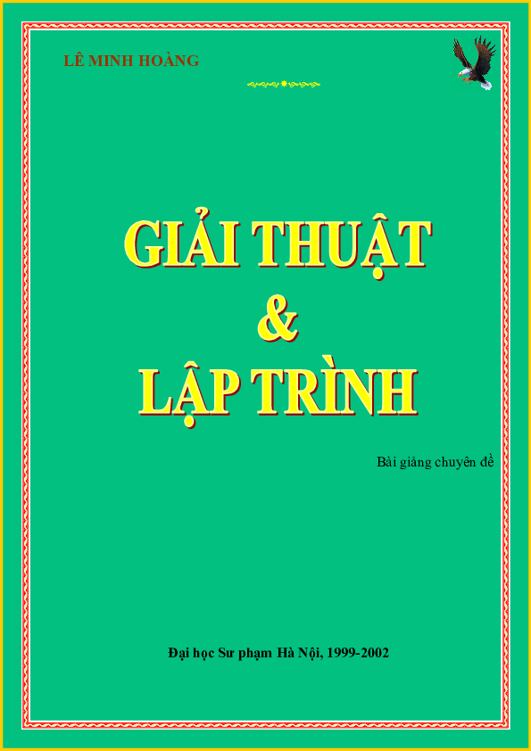

*Đầu tiên thì rất cảm ơn thầy hôm nay đã nhận lời phỏng vấn cho tạp chí VNOI số Tết!
Thầy là người mà tất cả các bạn rất mong muốn được phỏng vấn. Còn gì tuyệt vời hơn khi được phỏng vấn một “huyền thoại”, với không chỉ một, mà là hai nghiên cứu đã thay đổi nền Tin học Việt Nam – Sách “Giải thuật và Lập trình” và phần mềm chấm thi Themis mà các bạn bây giờ vẫn hay dùng. Kì thi Học sinh giỏi Quốc gia vẫn còn dùng Themis, và có thể sẽ còn được sử dụng dài dài.*

### Thầy là một trong những giáo viên dạy Tin đời đầu, vậy thì cơ duyên nào đưa thầy đến với môn Tin học?
Câu này nếu trả lời thì sẽ dài lắm! (cười). 
Thật ra thì hồi mình cấp 2, thì mình cũng biết Tin học là gì rồi. Nhưng hồi ấy thì học trong tiết Kĩ thuật thì nó chán lắm, chả có tí cảm hứng nào cả, thấy nó cũng chán lắm! Lên cấp 3, thì đúng là gặp người thầy đúng chuyên môn thì khác biệt thật. Thầy không những dạy kiến thức, mà còn dạy những kĩ năng nghề nghiệp, và truyền cho mình cái đam mê nghề nghiệp nữa. Lúc đấy thì mình cảm thấy thích.
Nói thật thì thời xưa, bọn mình học thì 100% là đam mê, chứ chả có một tí ưu đãi về lớp chuyên, giải Quốc Gia, … như các bạn bây giờ đâu. Chắc là các bạn không biết, chứ hồi mình thi Quốc Gia, không hề có tiêu chuẩn tuyển thẳng đại học đâu! 100% là vô tư, thích thì học, không thích thì bỏ thôi.
Trong môi trường ấy, cũng may là các thầy cô hay khuyến khích, rằng “nếu mày thích thì mày cứ học giỏi môn này cái đã, các môn khác tính sau!”. Thật vậy, nếu như cứ gây sức ép đều đều mà những môn còn lại chỉ học vài tiết một tuần thì chả thể đam mê được.
Mình nói thật, cái mà dẫn mình tới với môn Tin học, đơn giản vì Tin học nó hấp dẫn ấy! Nó không phải như mấy môn Toán, các bài toán khó nhăng nhở đi thi đâu. Cái mà mình cảm thấy thích là mấy lúc các anh sinh viên đi làm các đồ án tốt nghiệp, các phần mềm đồ hoạ “chạy nhảy”, và những lúc mình làm ra được một phần mềm nào đó, và được người khác sử dụng. Có thể nó rất là đơn giản, nhưng mình cảm thấy nó thật sự có giá trị thực tiễn, khác với giải một bài toán, khi mà mình chỉ sướng được một lúc thôi thì đã phải chuyển sang bài khác rồi.
### Thầy có nói tới việc viết ra phần mềm để người khác dùng thì nhìn nó thích thích (!). Liệu nó có phải là lí do để thầy viết ra phần mềm chấm thi Themis – app đã thay đổi cách chúng ta dạy học ở Việt Nam hay không?

Thật ra thì cũng qua quá trình làm các phần mềm như thế, có cả những cái làm cho vui, cũng có những cái để bán nữa. Do đó nên mình cũng có tí kinh nghiệm để lập trình.
Vào năm 2001, có hệ thống chấm tự động AM2, nhưng nó không chấm được C\++! Cứ phải dịch tay file C\++ ra Pascal, rồi mới chấm được. Lúc đầu mình định viết một tool để dịch, nhưng lại không có giao diện dòng lệnh để chèn code vào.
Thế là mình bảo với cả Đông (thầy Đỗ Đức Đông), hay là viết quách một trình chấm đi!
Đầu tiên thì mình cũng định viết cho vui thôi, nhưng mà sau đấy thì thầy Đông bảo: nếu mà dùng được ổn định thế này, thì xin luôn dự án của Bộ đặt hàng làm một cái.
Thật ra thì mình nghĩ nó là một phần mềm khá đơn giản, nhưng yêu cầu lớn nhất của phần mềm đó thì phải chạy không được lỗi! Chạy chậm hay gì cũng được, nhưng một khi đã chấm thì phải chạy từ đầu tới cuối, không được ngừng giữa chừng. Có thể ít chức năng cũng được, nhưng phải không lỗi!
Những năm đầu tiên, mình lấy nguyên form của AM2, và mọi người cũng mới chỉ chuyển sang C++ nên chưa quen. Năm 2013, Themis được đưa vào chấm chính thức. Lúc đấy thì rất nhiều bạn không học C\++11, thế là dịch lỗi! La trời lên. Vậy là mình phải thả một dòng lệnh để dịch C\++98 trong ấy.
Chắc giờ thì không ai dùng C++ 98 nữa nhỉ. Giờ thì các bạn dùng C\++17, C\++23 hết rồi!
Vì việc học để thi, thì thí sinh phải biết quy tắc, “luật chơi” của kì thi đấy. Nhưng mà ở mình, thì quy chế của Bộ chỉ nói là C++ thôi, lại chả nói C++ version nào, thế hệ bao nhiêu!  Cho nên đôi khi, có một thứ phổ biến, đó là “nếu anh chấm ở nhà bằng phần mềm ấy được, thì tức là đi thi có thể dùng được!”. Mình nghĩ nó cũng góp phần hạn chế bớt lỗi trong quá trình thi thật.
### Bây giờ thi C++ dùng bản C\++14. Thông tin này có thể công khai được trong phỏng vấn hay không ạ?
Thật ra thì, giả sử, nếu có mặt thầy, mà chương trình mẫu, hoặc test lại của thầy í, ví dụ, một bài tương tác chẳng hạn (interactive), mà thầy cần viết một hệ thống chấm riêng. Thầy có quyền được chấm theo kiểu của thầy, nên không có quy ước gì đâu.
Nếu mà viết cả một cái trình tương tác với phần mềm khác chẳng hạn, thì giả sử các chương trình C++ cũ khi nhét vào mà không chạy được thì nó lại toang.
### Thầy mất khoảng bao lâu kể từ khi Themis ra bản đầu tiên để cho ra phần mềm có khả năng chạy ổn định, được đón nhận rộng rãi?
Mất khoảng một năm. 
Một trong những đặc điểm hay ho của môn Tin học so với môn khác đó là chấm tự động. Chuyện mà mình đọc code rồi chấm gây ra nhiều sai sót, làm cho việc ra đề thiếu chặt chẽ. Mình đọc rất nhiều đề thi trong các kì thi cấp thấp, thì đề toàn đưa ra những input, output chả có ràng buộc dữ liệu to hay nhỏ gì cả. Có vẻ như là những người chấm có ý tưởng sẽ chạy chương trình bằng tay rồi chấm. Nhưng thế thì nó trái với quy ước của một đề thi Tin học thuần tuý – có ràng buộc dữ liệu, anh được cho vào input cái gì, anh phải output cái gì, v.v 
Khi mà hội đồng chấm thi đòi hỏi phải nộp luôn test khi ra đề, thì chắc chắn đề thi phải có những ràng buộc cơ bản như thế.
### Từ khi Themis trở thành trình chấm chính thức cho các cuộc thi (như kì thi HSGQG), thì thầy đã có những kỉ niệm dở khóc dở cười nào chưa ạ? 
MAY LÀ CHƯA CÓ (cười)! Mình cũng gặp một số thắc mắc, nhưng cuối cùng lần ra thì cũng là do lỗi của thí sinh thôi. Chẳng hạn như là, đôi lúc có những hành vi không xác định, thì code chạy trên máy thì ok, nhưng lúc chạy trên trình chấm, upload lên các trang như ideone, Codeforces thì nó cũng bị tình trạng giống như thế.

### Chuyện về những ngày đầu ra đấu trường quốc tế

Môn này cũng là cái môn hay, được dự đoán là môn học rất quan trọng của tương lai. Bulgaria đứng ra đăng cai vào năm 1989. 
Hồi đấy thì Tin học đã được tiếp nhận tại Việt Nam, nhưng chỉ dạy cho một số sinh viên ở các khoa đặc biệt của trường đại học mà thôi. Ông Trần Hồng Quân (bộ trưởng BGD), gọi thầy Đàm lên: “Tôi cũng chả biết môn này là môn gì, nhưng mà thấy nó bảo môn này quan trọng lắm! Về nhóm cái đội đi thi Quốc tế đi!”. Thi thì, có thể giải ở những năm đầu không quan trọng đâu, chủ yếu để biết người ta học thế nào để mình học theo.
Thầy Đàm về kêu gào khản cổ 4 đứa đi thi quốc tế, nhưng gọi được có 3 người thôi. Ba người ấy học cấp tốc trong khoảng độ từ 3-4 tháng, về thì có huy chương Đồng (!). Xong rồi ngay từ những năm sau thì Việt Nam mình đã có vàng, có bạc.
Sau năm đầu tiên, ông Trần Hồng Quân bảo là: chưa học gì mà đã được huy chương đồng, vậy thì triển khai học là ngon ngay. Từ nó mới bắt đầu triển khai chương trình.
Từ một lĩnh vực, có thể có một chuyên gia rất giỏi, nhưng đã đi dạy, thì phải biết dạy cái gì trước, cái gì sau. Hồi đấy thì chưa bỏ cấm vận, mình chỉ giao lưu với các nước thuộc khối Vác-sa-va (Warsaw) các nước Xã hội Chủ nghĩa thôi. Các thầy toàn đi xin tài liệu của Ba Lan, Nga, v.v, rồi sau đó thì trộn vào (!) thành một cái chương trình, dạy ở một vài trường chuyên: Khoa học Tự nhiên, trường mình (Đại học Sư phạm), Bách khoa, Hà Nội – Amsterdam. Trong kia thì có thành phố Hồ Chí Minh.
Học sinh của mình thì có cái hay: nếu nó không thi, thì nó không học; còn một khi đã thi thì nó sẽ học! Cho nên là chỉ có năm đầu tiên thì khá bất ngờ thôi, còn những năm sau thì tính cạnh tranh cao, đề thi bắt đầu khó rồi.
Những năm đầu tiên, đi thi Quốc tế thì vẫn chấm như các môn khác: học sinh trình bày thuật toán ra giấy, chương trình có là được, không có thì cũng chả đến nỗi bị 0 điểm. Sau đó, mình phải dịch bài ra tiếng Anh, rồi từng nhóm chia nhau ra chấm. Trong ngày cuối cùng, trưởng đoàn phải đứng ra bảo vệ cho học sinh mình ở những điểm nào đang mấp mé giữa cho điểm hay không. Nói chung rất là mệt, và hội đồng làm việc rất căng.
Đến năm 1994, người ta cãi nhau “mệt rồi”. Thôi thì, anh làm sai cũng được, nhưng tôi có một bộ test, làm sai là một phần của cuộc chơi, anh cứ đúng test đó là được. Từ năm ấy, người ta bắt đầu chấm test. Từ khi bắt đầu chấm test, Việt Nam mình kết quả cũng xuống. Hình như năm đó chỉ được 1, 2 HCĐ gì đấy. Nhưng mà ngay sau đấy, từ năm 1995 tới 1999, Việt Nam mình đứng nhất thế giới! 
Đoạn đấy thì chấm bằng test nhưng tính chất bài thì vẫn là các bài toán tối ưu. Các bài đó thì sẽ chấm theo độ tốt, anh không cần đưa ra đáp án chính xác tuyệt đối. Đa số các bài đưa ra thì sẽ theo kiểu: “Em hãy liệt kê đầy đủ … ”. Sau đỉnh cao 1999, không chỉ Việt Nam, rất nhiều nước khác bắt đầu dùng bài: đừng tập trung nghĩ thuật toán hoàn hảo cho một bài nào cả (subtask), bài nào cũng phải dí một cái gì đấy. Đôi khi cái đấy lại được điểm rất là cao. Có thể nói thẳng là thuật toán sai ấy! Bởi vì phải đưa ra đáp án chứ không phải đáp án chỉ có một số như bây giờ.

Đến năm 2003 hay 2004 gì đó, thì người ta mới bắt đầu chấm tuyệt đối – lệch một đơn vị cũng chết. Đến năm 2010, thì chơi test nào ăn test nấy thì cũng không công bằng – ăn may còn nhiều quá. Vậy là bắt đầu áp dụng bài chấm theo bộ test (batch) – phải đúng hết tất cả các test trong bộ thì mới ăn điểm.
Ở các môn khác, chương trình phổ thông đại chúng, người ta nhặt ra rồi nâng cao một vài kiến thức lên, trở thành chương trình chuyên. Còn với môn Tin thì ngược lại, chương trình chuyên có trước, sau đó nó giảm tải đi, trở thành chương trình đại trà. Cho nên người ta cứ kêu là phần lập trình của chương trình phổ thông cũ khá nặng. Thật ra thì phần lập trình đâu có giảm tải. Nó chỉ có hai dạng: biết lập trình hoặc không biết lập trình thôi! Câu lệnh thì vẫn phải học đủ chứ giảm tải được lệnh gì!
Không dạy for với while thì lại không được!
Ngày xưa, thì trong sách lớp 11 dạy thế đấy! Trong Pascal thì có 3 vòng lặp: repeat, while với for. Tương tự với C thì có do..while, while với for. Thì hàm while là tổng quát nhất, người ta dạy mỗi while còn hai cái kia thì lại bỏ! Tước bớt công cụ thì lập trình lại càng khó hơn chứ đâu có dễ hơn gì đâu!
Đôi khi thì bệnh thành tích thì nó có cái tích cực của nó. Không có yêu cầu thành tích thì người ta chả học đâu. Ví dụ như là Bách, mình đã đại diện cho một đơn vị nào đấy đi thi, thì mình phải có một sự nỗ lực cố gắng, và trong quá trình nỗ lực cố gắng ấy, thì mình mới thấy thích! Chứ hồi xưa, môn tin học, nếu mà không phải mấy trường chuyên, thì sẽ là một môn rất phụ, cũng vì lí do là người ta không thi.
Khi không thi, người ta sẽ không biết định hướng học như thế nào. Hơn nữa, không thi thì ông thầy cũng lười, vì môn của mình đâu có thi đâu mà phải ép các bạn học sinh nhiều vậy! 
Nếu mà các giải thể thao như đá bóng đường phố, chạy phong trào, … Chạy thì vẫn vui, nhưng vẫn phải có các động viên thành tích cao, thì người ta mới biết là chạy thế nào là đúng kỹ thuật, và làm thế nào để nâng cao thành tích, rồi ăn uống, ngủ nghỉ như thế nào, … Còn nếu mình chơi phong trào thì lại hoàn toàn là tuỳ hứng. Một trong những điển hình là môn đánh cờ. Mình đánh cho vui, mình đánh như thế nào cũng được đúng không? Nhưng gặp những giải lớn, thì phải sách vở, máy tính hỗ trợ phân tích đủ đường.

### Làm VNOI, em cũng quan sát tin học Việt Nam, trình độ các bạn từ khi Codeforces được phổ cập thì bắt đầu tăng, thậm chí là tăng dựng đứng luôn! Các kĩ thuật vào những năm ngày xưa được liệt vào dạng cao cấp như Segment Tree, Chia căn các thứ thì được gọi là đỉnh cao lắm rồi! Bây giờ thì các bạn nói là thuật phổ thông! 
Phải tự chế ra ấy! Thường thì các thuật ấy không có trong sách vở các thứ đâu, mà đa số là từ một người nào đấy làm bài rồi tự chế ra, sau đó truyền lại thế thôi chứ nó không phổ biến rộng đâu.
### Thầy thấy rằng trong 5 năm trở lại đây thì Tin học Việt Nam đang ở mức nào? Trình độ các bạn như thế nào?
Mình nghĩ rằng các bạn cũng có mặt giỏi hơn, nhưng cũng có mặt dở hơn (cười). Tất nhiên thì ở đỉnh cao, sóng sau sẽ luôn lớn hơn sóng trước. Nhưng so với ngày xưa, trên mặt bằng chung, khi các bạn học cơ sở, các bạn phụ thuộc vào Internet và ChatGPT nhiều quá! Học những cái ABC mà đã bị phụ thuộc vào những thứ đấy, thì các bạn sẽ không học được những thứ DEF rồi XYZ. Những viên gạch, những bước chân đầu tiên, thì mình phải tự bước đi! 
Mình thấy rất nhiều bạn, kể cả sinh viên, thì tất nhiên thì những bài ở mức độ nhập môn, thì ở đâu cũng có, ai cũng dạy như thế cả. Nên chắc chắn là search mạng sẽ có được code, và học thuộc rồi đi thi thì sẽ làm được thôi! Nhưng cái quan trọng là khi mình làm những bài đấy, thì mình phải tự làm, phải trải nghiệm những sai lầm, để biết cách sửa lỗi sai ấy và trưởng thành hơn. Các bạn hiện tại hoàn toàn không có khả năng tự sửa chữa lỗi sai ấy (vì code đúng hết rồi thì lấy đâu mà sửa nữa!). Thậm chí là chuyện chép code của nhau cũng thế. Thay vì tự mình tư duy như hồi xưa, các bạn có máy trước mặt, làm bài tập thể các thứ. Nó làm cho tư duy của bạn bị kém độ nhạy đi. Kiến thức có thể sẽ được tích luỹ nhiều hơn trước, nhưng độ nhạy bén trong suy nghĩ để vận dụng các kiến thức ấy sẽ không bằng các thế hệ xưa.

Ngay cả trong việc học C++, các bạn tập sử dụng các hàm trong thư viện sớm quá! Nếu ngay từ đầu mà đã nhảy vào dùng set, map các thứ thì người ta sẽ không hiểu cái nguyên lý của các cấu trúc dữ liệu đó. Mà đôi khi, mình học không phải là để cài bài tập, mình chỉ cần hiểu nguyên lý của nó thôi. Đấy mới là cái bổ ích, là giá trị cốt lõi của khoa học máy tính. Thật ra để làm những thứ mà chỉ đơn thuần dùng set, map thì chả có phần mềm nào đòi hỏi bạn tự code bằng tay đâu!
Bây giờ thì truyền thông, giao lưu hỏi bài trên các diễn đàn trở nên thuận tiện hơn. Nhưng nó cũng là cái thứ dở đấy! Ngày xưa, có những bài phải nghĩ vài tháng mới ra. Thậm chí, có những bài mà cho đến bây giờ vẫn nghĩ chưa ra. Nó ở cái mức IMPOSSIBLE ấy, bản thân người ra đề còn chưa tin là mình có được giải pháp tốt đâu. Thế nhưng mà qua quá trình xoay sở ấy, thì kĩ thuật và tư duy của mình sẽ lên khá đáng kể. 
Nói về chuyện chấm tự động, cho chấm tự động ngay từ đầu, mình nghĩ không phải là điều hay đâu! Xúm vào dí một test cho thằng bạn “chết”, dí một test cho mình “chết”, rồi lại ngồi phân tích xem vì sao test này lại hỏng như thế. Cách học như thế sẽ mang lại năng lực học tập tích cực hơn nhiều, giúp việc học đỡ khô khan hơn. Sở dĩ rằng mình nghĩ môn này học rất hay, nhưng mà do cách học nên mình bị thụ động, dẫn đến nhanh chán. Nó không phải là chỉ có các bạn học lớp thường mà có môn Tin đâu. Ngay cả trong lớp chuyên Tin, nếu như ngay từ đầu mà các bạn không chịu khó trải nghiệm khó khăn và vượt qua chúng, thì cũng chả đi được đến đâu.
### ChatGPT thì gần như các bài đơn giản, nó sẽ đọc cả đề và solution chuẩn 100%! Mà nếu chúng ta không nghĩ bài đấy thì sẽ không thể giải được các bài D, E, F Codeforces được, sẽ chỉ mãi giậm châm tại chỗ.

Vấn đề ở đây nó còn dính dáng tới chuyện về học toán nữa cơ. Cách học toán của các bạn hiện tại vẫn theo kiểu gần như tương tự. Tư duy toán của các bạn khá là nông. Thậm chí là, nếu mình đọc thử đề thi toán các trường chuyên, hầu như là toàn các bài rất khó, thì các bạn giải tốt. Nhưng đến những cái toán vô cùng cơ bản, thì chưa chắc các bạn đã nhớ và vận dụng tốt. Bởi vì trên thực tế, ngay cái lúc mà bạn học toán ở cấp cơ sở, thì các bạn đã phụ thuộc vào sách bài tập, lớp học thêm, các hệ thống trên mạng khá dày đặc, … Phải nói rằng người thầy dạy phải khéo lắm, cảm thấy các bạn đang làm bài tốt nhưng mà lại đánh giá sai, cuối cùng thì lại ra giá trị (điểm) ảo thôi, không phải là một đánh giá chính xác được.
ChatGPT nó làm mọi người lười suy nghĩ hơn.

Mình dạy những bài toán cơ bản: tìm kiếm nhị phân, sàng số nguyên tố, … Mình không phải chỉ dạy bản thân thuật toán đấy – nó chỉ là một phần rất nhỏ thôi, vì cái tư tưởng mới là quan trọng. Ví dụ, (với sàng số nguyên tố),  ngày xưa, ông ấy vẽ cái que, chọc một vài lỗ để sàng.  Ta phải mô phỏng lại quá trình đấy, để các bạn thấy được cái hay của việc đấy, và tư duy của các bạn sẽ phát triển khác đi.
Những bài toán lớp 1, 2 thì chắc bây giờ ChatGPT làm được hết rồi! Nhưng nếu anh không chịu học lớp 1, 2 thì chẳng thể lên được 3, 4; càng chẳng thể học tiếp lên cấp 3, Đại học, Thạc sĩ, Tiến sĩ rồi đi làm được. Những thứ cơ bản ấy, sớm muộn gì mọi người cũng sẽ thuộc bảng cửu chương, và biết cộng trừ nhân chia. Có thể lớp 1 học không giỏi, nhưng mình nghĩ rằng một khi đã đến lớp 12 thì chắc ai cũng phải biết đọc, viết, cộng trừ hết rồi. Tóm tắt lại, phải biết cộng biết trừ rồi mới học cái khác. Mình nghĩ là học sinh phổ thông, nếu nhận thức hơi chậm và học kém ở những lớp đầu cấp, thì nó chẳng nói lên điều gì. Chỉ cần bạn kiên trì, khắc phục được những điểm yếu của mình, thì bạn còn có thể tiến xa hơn những bạn “phát triển sớm”. 
### Codeforces theo thầy đã thay đổi nền tin học Việt Nam như thế nào, khi trong 5 tới 7 năm gần đây nó là nền tảng lớn nhất, phổ biến nhất cho CP-er ở Việt Nam?
Các bài của Codeforces, đặc biệt là div 2 và div 3, nó tập cho các bạn đang nhập môn lập trình khả năng code nhanh và code chính xác. Ta cần một giải pháp đơn giản cho các bài đơn giản. Tất nhiên để làm được bài đấy thì dễ thôi, nhưng cần phải làm vừa nhanh, lại cần chính xác. 
Có rất nhiều bài toán khó trên Codeforces là lắp ghép của những bài cơ bản. Với từng đoạn cơ bản, nếu bạn code vừa ngắn vừa đúng đắn, thì chương trình lớn sẽ dễ kiểm soát hơn. Ngược lại, ngay đoạn ngắn mà đã bug rồi, thì sẽ không thể viết được những chương trình phức tạp hơn. Cái đấy thầy nghĩ là cái lớn nhất mà Codeforces đóng góp được.
Còn Div 1, thì mình nghĩ nó chỉ dành cho những ông đi thi thôi. Vì mình nói thật, những bài trong Div 1 chủ yếu dành cho con dân chuẩn bị đi thi, chứ còn để học thì mình nghĩ rằng cứ cài Div 3, Div 2 là đủ rồi.
Div2 luyện lên khoảng độ Expert, Candidate Master gì đấy. Nó không dành cho những kiểu người già như mình, chân tay chậm rồi, không làm nhanh được í (cười). Làm bài chỉ để có vốn bài, xem xét xem có kĩ thuật gì hay để dạy không. Còn nếu mà đua tốc độ thì phải thi Div 1!
### Thầy có nói đến Expert và Candidate Master. Một cái fact khá nổi tiếng trong cộng đồng là thầy có nick Codeforces. Là một trong rất ít giáo viên tham gia thi Codeforces, thầy có suy nghĩ như thế nào?

Khi mình làm việc với các bạn mới học đội tuyển í, thì mình cũng thi (Codeforces). Mình có trao giải thưởng cho ông nào rank cao hơn mình. Nói thế chứ thi mà rank cao hơn thầy thì cũng không phải khó lắm! Chủ yếu vui là chính thôi!

Có một đoạn nữa, khi mà chuyển sang dạy C++, mình biết C++, nhưng để biết ở mức độ đi dạy được, thì phải thi bằng cái đấy xong mới biết mà dạy được. Nếu mà chỉ chuyển từ ngôn ngữ này sang ngôn ngữ kia theo kiểu ánh xạ 1:1 ấy, thì nó không phải là tư duy của một người đi thi – không thể làm nhanh được. Đợt đấy, nhìn trên biểu đồ thì mình tụt rank thê thảm, cứ nhập nhằng mãi. Đoạn đấy thì hầu như tuần nào cũng có, thì mình khi nào cũng phải tập. Mình tập bằng một ngôn ngữ mới, thì nó thay đổi thói quen viết cũ, ngay cả trong cách trình bày chương trình. Phải tập đến độ Expert thì mới tự tin đi dạy được người khác. 
Thật ra thì mình chỉ biết được kiểu giải phương trình bậc hai hay gì đấy thôi; nếu làm những cái phức tạp, ví dụ như là cần dùng đến con trỏ hay là các class, thì lúc đấy mình sẽ lúng túng, vì kí pháp của C++ không phải là dễ học cho lắm.

### Theo thầy thì so C++ với Python, Python có dễ học hơn C++ nhiều không?
Nói về ngôn ngữ lập trình, mình thấy ngôn ngữ nào cũng phải bỏ công học tất cả mọi thứ. Mình không nghĩ là có ngôn ngữ nào dễ hơn hẳn cái kia. Còn nếu mà nói khó, thì mình nghĩ rằng C++ là một trong những ngôn ngữ khó. C++ có quá nhiều kí hiệu, và càng về sau thì ngày càng mở rộng ngôn ngữ ra, lambda function rồi các thứ viết tắt í! Nó làm cho code rối rắm hơn. Lẽ ra thì C++ nên làm theo hướng thêm đặc tả nếu cần thôi, chứ ngôn ngữ đang chạy ổn thì cứ để đấy lâu lâu một chút. Đây thì cứ 5 năm lại lên một đời, làm cho người ta chạy theo lâu lâu cũng thấy mệt.
Còn riêng về Python, thì mình không nghĩ đây là một ngôn ngữ dễ. Nó dễ theo cái nghĩa: nó viết những chương trình đầu tiên rất dễ. Ví dụ, nhập vào một số rồi in ra cái gì đó, nhập hai số in ra tổng, … rất dễ, chỉ cần gõ lệnh trực tiếp rồi chạy từng lệnh một, thay vì gõ cả chương trình rồi compile. Và người ta có cảm giác rằng nó dễ vì sống chết gì nó cũng chạy, chỉ là tới dòng mà mình viết sai thì nó dừng lại thế thôi. Cho nên mình cũng chẳng hiểu căn cứ vào đâu để người ta nói Python dễ học.
Nói về chuyện thuật toán và cấu trúc dữ liệu, một trong những cái mà mình thấy rất là quan trọng là đánh giá độ phức tạp tính toán. Python không đánh giá được vì phép cộng, phép nhân của nó không phải là hằng số; Python sử dụng simulation. Nó không phải là hàm ở trong CPU. Với những cái đấy, thì khi mình đánh giá độ phức tạp, lúc chạy thì nó sẽ rùa hơn so với cái mình đã đánh giá. 
Khi mình đi dạy, mình chỉ ra rằng một thuật toán O($n^2$) sẽ chậm hơn O($n \log_2 n$). Nhưng ông O($n \log_2 n$) thì phải dùng phép nhân ma trận hay gì đấy, cần tính toán số lớn chẳng hạn. Khi đem hai code đi chạy thì nó lại chậm hơn code O($n^2$) đáng kể. Tự nhiên làm thế, người ta cũng mất lòng tin với lý thuyết được học. Nói thế thôi chứ ngôn ngữ biên dịch sẽ khá sát với độ phức tạp tính toán.
Nhưng nói chung, mình không nghĩ rằng học một ngôn ngữ lập trình là chuyện dễ. Vì ở ngoài kia, người ta có những lớp học cấp tốc, có những cuốn sách học ngôn ngữ nào đó trong vài tuần. Mình không nghĩ là nó sẽ được việc đâu! Nó phải có trải nghiệm, có sự luyện tập. Phải làm từ từ thì nó mới có độ ngấm! Học có độ 3 tuần thì chỉ ở mức độ biết nó là gì thôi.
### Là một người code C++ thì thầy là người code theo style chạy theo version mới nhất, hay theo kiểu truyền thống là C++11?
Mình code theo kiểu truyền thống. Vì thật sự, ngay cả những đặc tả trong C\++17, C\++20 thì mình cũng chưa biết hết đâu. Mình code theo kiểu: trông nó quen thuộc thì viết thôi. Thỉnh thoảng nổi hứng lên viết những lệnh trông ngầu ngầu một tí, chứ nó không phải là chuyện thường xuyên. Một khi mà mình viết một lệnh mà bản thân mình thấy đã khó nhìn, thì khi debug thì nó sẽ mệt lắm.
### Còn về IDE, thì bây giờ thầy vẫn dùng gì?
Với C++ thì thầy vẫn dùng Codeblocks.
### Thấy các bạn trẻ bây giờ hay dùng VS Code, Sublime Text là chính?
Mình nghĩ là Codeblocks nó dở thật, hệ soạn thảo tích hợp nó hỗ trợ kém quá! Nếu có điều kiện thì nên dùng những app chuyên nghiệp, kết hợp debugger các thứ. Có rất nhiều bạn code thẳng bằng giao diện trên trang web nào đấy, mà mình lại chẳng thấy nó được lợi ích gì cả. Nếu có lỗi thì nó gỡ kiểu gì? 
Mới học thì các bạn mở trang web nào đấy, code thẳng rồi nó chạy luôn!

Người ta đã nghĩ ra IDE – một môi trường tích hợp cả soạn thảo, biên dịch và gỡ lỗi, thì nó phải có lí do của nó. Nếu bạn code trên ideone thì bạn đã bỏ qua những lợi ích mà nó cung cấp. Ngay cả chuyện đơn giản như việc nhập xuất từ file, lẽ ra đề của mình không cần nhập xuất từ file, nhưng khi không yêu cầu nhập xuất file, các bạn lại có thói quen cứ chạy thử chương trình rồi lọc cọc gõ file input. Mà file input thì có phải lúc nào cũng ngắn đâu. Nó cũng có những bài rất dài! Rồi khi chạy sai, rồi lại dán file input vào. Mình nghĩ rằng công đấy tốn sức hơn cả việc soạn một file input.
Nhiều khi mỗi lần chỉ gõ hết 5-10s thôi, nhưng mà phải gõ cả chục, cả trăm lần thì chết, chết luôn!
Nó chỉ nhanh hơn trong trường hợp những bài đầu tiên, bạn code bạn ăn luôn. Chứ còn nó không hề nhanh hơn ở những bài sau này, khi mà chắc chắn ai cũng phải xoay sở một tí, phải debug rồi mới chạy được. Nhưng mình thấy rất nhiều bạn chẳng bao giờ làm file input.
Như mình, khi thi Codeforces, nó bảo làm standard input/output, nhưng chạy trên máy mình, mình vẫn làm sẵn file input ra đấy. Mình chẳng bao giờ chơi bài cứ chạy thử, rồi copy test đó vào. Mặc dù copy nó sẽ nhanh hơn gõ. Còn nếu mà đề in giấy …
Nếu là đề Quốc gia là thôi chết rồi. Ngồi gõ, còn có khi gõ sai nữa!
Mình chẳng hiểu vì sao nữa. Bạn chỉ cần bỏ vài giây, có khi chưa tới một phút, trong việc làm sẵn một file input như thế. Nhưng các bạn vẫn không làm.
Chuyện chọn IDE cũng như vậy. Quả thực rất là khó để dạy các bạn debug, bởi vì những bài đầu tiên thì nó không đáng để dạy những cái đấy. Khi mà bài khó lên, thì cần dùng debug. Nhưng lúc đó thì các bạn không có thói quen đặt break, while, … gì cả. Tất cả mọi thứ phụ thuộc vào console để in ra các kết quả trung gian thôi. Đấy cũng là một cách debug, nhưng nó không thể bằng trò mình chạy đến đâu, mình chặn đến đấy được.
### Nhắc đến việc debug, em thấy rằng ở Việt Nam rất ít người dùng debugger. VÔ CÙNG ÍT NGƯỜI! Tất cả đều in hết. Thầy có dạy học sinh dùng debugger không hay là in luôn?
Thật ra thì cái đấy có dạy được đâu. Mình nghĩ hồi xưa, mình học debugger như thế nào? Trong tư tưởng của mình thì nó (developer) đã nghĩ ra cái này thì nó không phải là cái thứ vứt đi. Nó đã tích hợp rồi thì chắc chắn phải là cái quan trọng! 
Cái thứ hai, thì mình muốn dùng thử nó. Mình đợi tới khi nào mình sinh bug, thì mình dùng thử nó xem sao! Lúc bấy giờ mới tra lại phím tắt các thứ. Dần dần thì mình quen. Trò này kết hợp với việc in ra màn hình thì nó rất là lợi! Ví dụ, trong một vòng for từ 1 tới 1000000, i chạy đến 2, 3, 4 thì mới lỗi. Mình chạy đến i = 4 thì nó sinh lỗi, mình break, rồi đặt điều kiện ở i = 4, thế là gỡ thêm được! Chứ để nó in ra màn hình thì nó sẽ rất là rối. Nếu in ra 1, 2 số thì được; trong đa số các bài thi Quốc gia, thì vẫn có thể làm được, nhưng phải quen, thao tác nhanh.

### Những năm gần đây, thành tích của Chuyên Sư Phạm bắt đầu đi lên. Thầy có cảm nhận gì về phẩm chất chung giữa các bạn đạt thành tích cao hay không?
Mỗi người một vẻ, không giống nhau tí nào. Nhưng có thể phân loại những bạn học toán tốt từ bé. Các bạn có thể hơi loạng choạng về mặt kĩ thuật lập trình, nhưng khi mà bạn đã khắc phục được, thì tư duy quản lí chương trình và triển khai thuật toán sẽ rất sáng sủa và tiến bộ nhanh. Loại thứ hai là những bạn ngược lại – kĩ thuật lập trình tương đối tốt và chịu khó học toán một tí, biết thêm các khái niệm, … Tất nhiên sẽ không giỏi như dân chuyên Toán, nhưng ít nhất những khái niệm cần thiết cho môn Tin học, kể cả toán cao cấp, thì các bạn vẫn có thể theo được. Thứ 3 là loại mà giỏi ở tầm … (khủng). 
Mình nghĩ là ở mức độ thi Quốc gia, cứ chăm chỉ luyện tập thì chắc chắn sẽ được giải. Đôi khi, chỉ cần chăm chỉ luyện tập, kiên trì, tiến bộ, tự nhận dạng lỗi sai của mình, tránh lặp đi lặp lại một lỗi nhiều lần thôi là đủ, không cần tư chất gì đặc biệt.
Còn ví dụ nếu muốn vào vòng 2, thì phải có năng khiếu, có tư chất đặc biệt hơn đúng không ạ?
Vòng 2 thì, mình nghĩ các bạn vào đội tuyển Quốc gia đi thi châu Á hay Quốc tế, thì phải có một số năng khiếu đặc biệt, ít nhất là trong việc thi cử. Cũng có những bạn học và thi xong rồi, có thể sở thích của bạn dẫn bạn đi làm dự án các thứ, chứ không dừng lại ở việc thi HSG, làm những bài khó nhằn như vậy. Nói thật chứ, kể cả Quốc tế cũng thế, các bài ở tầm đỉnh cao, đôi khi nó lại xa rời thực tế. Nó không đề cao giá trị cốt lõi của môn học nữa. Thì có thể học đến đấy, các bạn không thích nữa, thì các bạn sẽ không vào vòng 2. Còn để đạt giải Quốc gia, thì kĩ thuật là cái quan trọng nhất, không cần phải đầu óc đâu. Nghĩ ra cái gì, làm được cái đấy là sẽ có giải. 

Đa số các bạn đi thi Quốc gia không may mắn mà mất giải, thì thường sẽ có lỗi to đùng như sai tên file, ăn quả 0 điểm các thứ. Thì thôi, đó là rủi ro chứ không phải giỏi hay kém gì ở đây. Thứ hai, mình thấy đề thi Quốc tế, nó đã xa rời thực tế thì chứ, lại còn dài dòng, khó hiểu. Nó khác hẳn Codeforces, đề nó vẫn ở độ dài vừa phải, không dài quá. Thì ngay cái việc mình phân tích xem người ra đề yêu cầu mình cái gì, nó cũng đã lâu rồi. 
Các bạn từ đoạn chưa biết gì, để dạy lên trình độ ổn thi Quốc gia, thì mình phải dạy đủ kiến thức thì sẽ thi được. Còn với thầy, làm thế nào để thầy phát huy được các bạn đã ngang tầm Quốc gia và muốn học lên, khi kiến thức không còn là vấn đề quá lớn nữa?
Đến lúc thi Quốc gia, những tuần cuối cùng, chủ yếu mình cho các bạn rút kinh nghiệm chiến thuật. Tất nhiên thì kiến thức thì muốn học bao nhiêu cũng được. Nhưng việc chuẩn bị trước cách phản ứng trong phòng thi với từng trường hợp cụ thể thì sẽ tốt hơn. Ví dụ như lúc mình đọc đề và chả thấy bài nào mình làm được, thì chắc hẳn người khác cũng sẽ trong tình trạng như thế thôi! Mình muốn điểm số bằng bạn bằng bè thì phải đưa ra chiến thuật như thế nào, chứ nếu ngồi ngắm đề thì thôi chả làm gì được. Hoặc là đi thi, mình đọc bài nào cũng có phần làm được, thì mình sẽ nghĩ bao nhiêu lâu và triển khai code trong khoảng thời gian nào. Nếu mình có sự lường trước, thì mình sẽ chủ động hơn về mặt thời gian.
Đến đoạn thi Quốc tế, lúc đấy thì chỉ có thể điểm danh kiến thức cho các bạn: cái này mày biết chưa, cái kia nên đọc ở đâu, … rồi động viên giữ gìn sức khoẻ thôi. Ở tầm ĐTQG trở đi, những gì thầy làm được thì đã làm hết rồi. Không chỉ riêng thầy, mà còn là nhiều người thầy khác, và cả các anh chị thế hệ trước nữa. Nói về kiến thức, nếu mình nhồi thêm nữa thì cũng chả quan trọng lắm đâu.
### Trong suốt những năm thầy đi dạy đội Quốc gia, thầy có ấn tượng nào về một năm, hay một học sinh nào đó hay không?
Thật ra các bạn đi thi Quốc tế, ai cũng có cái giỏi riêng của họ cả. Kết quả có thể có những bạn được huy chương vàng, bạc, đồng khác nhau. Nhưng đề thi có thể không khai thác vào điểm mạnh của họ, nên kết quả khác nhau cũng dễ hiểu.
Như ngày xưa, vào năm 2011, mình đi sang Thái với Linh (Nguyễn Phương Linh). Linh có khả năng nghĩ rất nhanh. Nhưng nói thật thì Linh code không nhanh lắm đâu. Tuy vậy, Linh luôn ở trong trạng thái tự tin rằng mình sẽ đạt được kết quả khả quan. Năm đấy mình đi với cả Linh, Tuệ, Nguyên và Yến. Yến năm đấy đi thi, sợ nhất là vấn đề “run”. Trong lúc ôn luyện đội tuyển, Yến đã đi qua một thời gian căng thẳng dài. Đi thi thì vẫn run nữa, nhưng may là được huy chương. 
Kể cả không đi thi Quốc tế, như Chung, … thật ra nó cũng chỉ là một kì thi thôi, nên khó mà đánh giá được. Hồi xưa mình có một bạn mà mình rất là ưng – bạn Vũ (Phạm Quang Vũ). Cũng đâu có đi thi Quốc tế đâu! 
Nói về thành công, nếu tính thống kê ra thì giải Quốc gia, Quốc tế nó chẳng nói lên điều gì. Tất nhiên nó sẽ khác hẳn so với các bạn không thi Học sinh giỏi. Nhưng trong số những bạn đã từng thi, đạt giải Quốc gia hay đi xa hơn nữa chả nói lên gì về thành công sau này. Có thể sau này bạn thành công ở lĩnh vực khác, chứ không dừng lại ở Tin học nữa đâu.
**Đi thi là để học cái tư duy, cái tính tự học là nhiều hơn cái kiến thức như là cài Segment Tree!**
Cái tinh thần không bỏ cuộc, sự quyết tâm cho những gì mà mình đã bỏ thời gian ra, chắc chắn là điều cần phải cổ vũ. Nó không phải là chỉ có chuyện là trường Chuyên luyện gà chọi đâu! Nhìn vào ưu điểm của gà chọi, nó khoẻ hơn, sức bền cao hơn, nếu không đem đi chọi, thì nó vẫn sẽ chạy nhanh hơn, nhảy xa hơn!
### Vì sao thầy quyết định tạo ra quyển sách đã đặt nền móng cho Lập trình Thi đấu?
Đoạn đầu làm gì có sách đâu! Mỗi thầy dịch một ít sách của Ba Lan với Nga rồi tiện đâu dạy đấy. Đến năm 1994, mình tốt nghiệp cấp 3, vào khoa Toán của Đại học Sư phạm. Suốt 4 năm trời, mình có đả động gì tới cuộc thi học sinh giỏi đâu. Sau đấy, mình có hai lựa chọn: xin việc làm giáo viên Toán, hay tiếp tục làm công ti Tin học. 
Sau đấy, trường Chuyên gọi mình ở lại dạy cho vui, nên mình vẫn làm ở công ti bình thường và đi dạy học. Mình cảm thấy việc đi dạy khá hay, cũng như bản thân thật sự có ích. Nên mình tập trung đi dạy từ khoảng năm 2000. 

Nói tới chuyện sách, sau 4 năm không đả động gì tới Học sinh giỏi Tin, mình đâu biết kì thi đang thi gì đâu. Sau hôm đó thì mình phải về học lại. Nếu có sưu tập đề, thì đa số các bài hồi mình thi sẽ theo dạng một trò chơi giữa hai người với nhau, hoặc là những bài NP-complete – đưa ra các giải pháp gần đúng, … Đến khi mình đi dạy, thì đề bài nó đã khó lắm rồi. Hồi đó là năm 1998, thấy các thầy chấm test ầm ầm, mình nhận ra rằng trình độ mình còn non hơn các bạn lớp 12 trong đội tuyển. Điều đó buộc mình phải học thôi! Cách học tốt nhất là cứ ghi ra các kiến thức đọc được, rồi dạy cho khoá mới. 
Sau đấy thì còn lộn xộn lắm. Đến năm 2002, mình đi làm nghiên cứu sinh, mình cũng không chắc là mình có về được không. Mình quẳng lại quyển đấy, chuyển thành pdf, mạng thì vẫn chưa phổ biến. Nếu về sau này, bạn nào tiếp thu được kiến thức ấy, thì đỡ phải cày lại từ đầu, có thể bước tiếp. 
Bây giờ thì mình cũng dự định viết lại vài chuyên đề, nhưng mà nói thật thì cũng lười rồi (cười), ngồi lâu thì cũng mỏi lưng rồi! Chứ hồi ấy, khi mình viết những chuyên đề ấy, mình phải chuẩn bị cả tuần thì mới dạy được các bạn đội tuyển một buổi. Tức là khi định dạy một chuyên đề nào đó, mình cần một tuần nghĩ bài với sự giúp đỡ của rất nhiều thầy khác, kể cả thầy cũ của mình: thầy Nghĩa, thầy Tùng, cô Thành các thứ, … để cho đội tuyển “ăn đủ” kiến thức. Nếu chỉ có một người dạy đội tuyển, thì chắc chết mất, tuần cho ra học một buổi thì giật mình, thở ra bằng tai mất rồi.
Cũng từ chuyện đấy, mình viết sách. Lúc đầu chỉ để dạy thôi, nhưng sau đó thì thấy trong nước dùng khá phổ biến. Mình nhận ra rằng môn Tin cần nhất là tài liệu – một học sinh sẽ không cần thầy, tự học vẫn được nếu như tài liệu đủ tốt, đưa ra những phân tích chặt chẽ để nó học. 
Về sau này, có các bài viết trên VNOI các thứ ấy, nhưng mình vẫn cảm thấy thiếu một cuốn sách để hệ thống lại đầy đủ. Chứ từng topic một, từng chuyên đề thì sẽ có bài riêng; nhưng lắp ghép nó vào trong một bối cảnh chung – dạy cái này vào lúc nào, thì vẫn chưa có tài liệu nào như vậy. Mình cũng đang kì vọng nhưng mà vẫn chưa xong được.
### Vậy là sắp có phần Giải thuật và lập trình mới?

Thật ra quyển cũ có rất nhiều điểm mình không ưng ý, vì có những thứ mình đặt vào vị trí không hợp lí lắm trong chương trình. Ngoài ra, sách còn thiếu rất nhiều thứ so với tiêu chuẩn hiện tại cho kì thi Học sinh giỏi Quốc gia. Đúng là mình chưa hoàn toàn ưng ý vì mình đang viết giữa chừng ở bên này mà (cười). Bây giờ thì cũng phải cố . Khi mình cố viết, thì coi như là mình có việc để làm. Chứ bây giờ nghỉ dạy suốt, quanh đi quẩn lại các bài đã chuẩn bị trước thì cảm hứng nó không được tươi mới như lần dạy đầu tiên. 

### Code minh hoạ chắc sẽ được viết bằng C++ đúng không ạ?
Chắc là phải viết bằng C++. Nói chung sẽ rất khó để tổng hợp mọi thứ thuộc mạch cốt lõi của cấu trúc dữ liệu và giải thuật. Những kiến thức trong kì thi, đôi khi là những kiến thức rời rạc, không gắn vào đâu trong cái mạch chính này. Ngay cả câu chuyện về Segment Tree hay Fenwick Tree, khi thi cử, nó là những thứ rất phổ biến. Nhưng để nói về vai trò trong mạch chính của khoa học máy tính, thì những thứ ấy là vớ vẩn. Cảm giác của mình, nó chỉ là mẹo cài đặt mà thôi.
Fenwick Tree thì đúng là mẹo cài đặt, Segment Tree thì ít nhất còn có tư tưởng chia để trị, tách tầng, lưu dữ liệu này kia. Còn Fenwick Tree thì công nhận là học xong thì chỉ biết là: OK, cài như thế thôi!
Những sách về thuật toán, đôi khi code cài rất dở, cài theo mô hình rất kém. Nếu mình copy i chang mô hình của nó ra như vậy, nó sẽ thành một thuật toán chậm. Đúng là code sách đó rất là vụn.

Quyển sách sẽ xuất bản vào 2024 hay 2025?
Chắc phải là ít nhất 1 năm, nên có lẽ vào năm 2025.
### Mình có đặt KPI cho bản thân, “trước Tết năm tới” chẳng hạn?
Cũng phải tuỳ theo năm mới mình phải làm gì khác nữa. Nó cũng phụ thuộc vào công việc chính, thì mình phải đảm bảo cái đã. Một giáo trình khi ra đời, mình phải đem đi dạy thử đã, để biết chỗ nào giải thích loằng ngoằng, tìm cách chỉnh sửa, v.v 
Như hồi xưa, mình rất ớn việc đọc chủ đề thành phần liên thông mạnh. Khi cài xong, mình vẫn chưa hiểu được bản chất tại sao Tarjan lại như thế! Lúc mình chưa làm chủ hoàn toàn, mình đi dạy cũng sẽ lởm khởm, càng giải thích lại càng rối.

### Thầy có biết đánh cờ vua không ạ?
Không, mình chỉ biết chơi cờ tướng. 
### Cờ tướng thì bình thường có máy tính hỗ trợ không ạ?
Ngày xưa thì mình đánh được với máy vì máy đánh khá rập khuông. Còn từ khi mà nó được học qua các thế cờ, thì ngay cả một kiện tướng thì khó thắng lắm rồi. Bây giờ thì nó lại biết tự học, thì không có ai thắng nổi nó đâu! Thậm chí là trong ván của mình, thì máy chấp người đi trước 3 nước (không ăn quân). Phải gọi là quá mạnh rồi!
### Nghe nói thầy có đam mê với các game, đặc biệt là game mô phỏng máy bay, xe tăng. Liệu điều đó có đúng hay không?

Máy bay thì mình thích từ bé. 

Ngày xưa, nhà mình ở gần bảo tàng không quân, chả có gì chơi, mẹ cứ hay dẫn ra đấy rồi nghe các chú hướng dẫn viên chém gió. Thế là thích máy bay! Cứ đi ra các quán, trên điện thoại mà có kiểu máy bay bắn bùm chíu, thì cũng thử bắn một cái. Mình hơi khác với các bạn, vì mình nhanh chán lắm! Phá đảo xong thì mình chán, đánh mãi không qua mình cũng chán. Chứ mình không theo kiểu chơi được lâu như thằng em rể của mình vẫn hay làm, chơi cả đêm í… Nên gọi là thằng em “đồng hao” của mình chứ không phải là em rể. Em rể của vợ mình. Với những tựa game kiểu đấy, chắc là mình không có hứng thú rồi. Ngay cả việc tìm hiểu về các khái niệm trong game, chắc mình chả đủ khả năng kết thúc rồi. 

### Lúc rảnh thầy hay giải trí bằng cách nào?
Nói chung thì nghe nhạc là chính thôi.
### Phim thì thầy yêu thích thể loại nào?
Phim hình sự phá án gì đấy. Vừa xem vừa đoán là cái đoạn mình thích nhất. Phim hài cũng hay nhưng đa số mình xem hết rồi! Còn mấy loại vũ trụ Marvel hay DC thì mình không tham. Mình thấy hình ảnh đẹp thôi chứ nội dung thì chả có gì. 

### Thầy có gợi ý danh sách phim hình sự phá án cho các bạn cày dịp Tết này không?
Mình thấy cái nào có vụ án mà khó đoán thì nó sẽ hay phết!
### Thầy tâm đắc với bộ nào nhất?
Phải nhớ một cái tên thôi. Xem nhiều quá thì giờ lại quên bén mất tiêu đề phim … Nói chung thì mấy phim của Hàn Quốc, Trung Quốc, Mỹ các thứ, các phim cần mình phải đoán một chút, bí hiểm một tí. Chứ phim kinh dị thì mình xem mình cũng chả sợ. Mình có thể xem được ý nghĩa bên trong của phim kinh dị, chứ chỉ doạ ma thôi thì mình không thích. 

Mấy thể loại sướt mướt, tấu hài lê thê thì mình rút kinh nghiệm rồi. Ngày xưa thì người ta xem vì chẳng có lựa chọn gì khác, và mỗi tuần cũng chỉ có một tập đấy thôi. Chứ bây giờ thì mình có thể đợi hết cả 100 tập rồi xem một mạch, vừa xem vừa ăn tô phở thì tuyệt vời (cười).
Hình sự phá án, thì ngày trước em có xem một bộ rất nổi tiếng là bộ “Bằng chứng thép” . Những vụ án hình sự thì em thấy cũng có pha một chút kinh dị chèn lẫn sự kinh khủng dã man (vẫn không ngừng cười).

Phim hành động đại khái thì xem để giải trí thôi, chứ không cần phải nhớ lắm. Mình không phải là người làm nghệ thuật, nên mình xem phim nghệ thuật thì đôi khi mình không thấy hay. Quan trọng là mình xem được cốt truyện bên trong.
### Thể loại nghe nhạc yêu thích của thầy?

Mình chỉ nghe nhạc không lời thôi. Bởi vì khi làm việc đêm, mình thường có hai màn hình. Màn hình đầu thì để phim, màn hình hai show code. Thật ra khi xem phim, tình tiết của phim thường sẽ chậm, nên không cần tập trung xem phim. Chủ yếu là để có một cái tiếng nói bên cạnh giúp mình không buồn ngủ. Làm đêm thì kị nhất việc đi ra uống café sau khi ngáp một cái dài, và mãi chẳng thể tập trung được, lại lăn ra ngủ tiếp.
Nghe nhạc thì mình nghe tuỳ lúc, thường là trước khi đi ngủ. Chứ nghe một thể loại nhạc trong khoảng thời gian dài vài tiếng đồng hồ, nó rất là nhức đầu. Khi làm việc, nhất là làm việc một mình trong thời gian dài, nên để trong phòng có một ít tiếng động. Nếu trong phòng có TV, cứ bật lên nghe thời sự, nghe tới đâu cũng được. Phải có một tí tiếng ồn thì mới làm được việc, vì yên tĩnh tuyệt đối thì chỉ muốn ngủ thôi!
### Làm trong ngành lập trình, thầy có đam mê bộ môn phím cơ không ạ?
Có chứ. Mình chỉ dùng Red Switch hoặc là Brown Switch thôi. 
Bàn phím cơ thì mình nghĩ rằng nó phải nhạy và ít tiếng ồn. Blue Switch thì tiếng ồn lớn quá, cũng làm mình mất tập trung và còn ảnh hưởng đến người bên cạnh. Giả sử trong phòng máy thi đội tuyển chẳng hạn, mỗi người mang một cái bàn phím rất ồn, thì tiếng gõ như mưa rào, trong lúc đầu mình lại đang bí. Nó ảnh hưởng đến phong độ mình rất nhiều.
Mình có thể dùng một cái Red Switch, hay dùng bàn phím của máy xách tay – hành trình ngắn và âm thanh nhỏ hơn. Mình cảm giác các bàn phím đó gõ đỡ mệt và dễ nghe nhất. 

*Cảm ơn thầy đã nhận lời phỏng vấn cùng VNOI! Chúc thầy và gia đình năm mới mạnh khoẻ, hạnh phúc, để tiếp tục sự nghiệp trồng người của mình!*