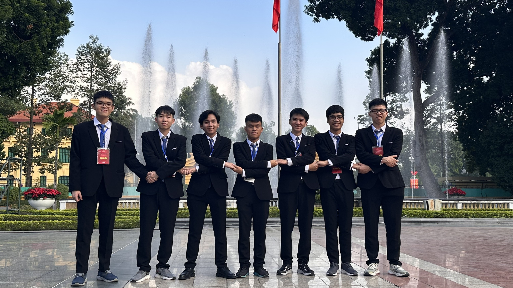
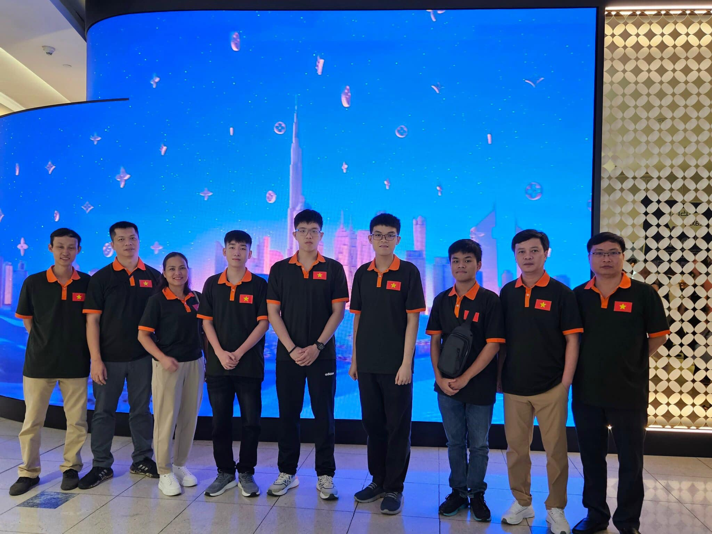
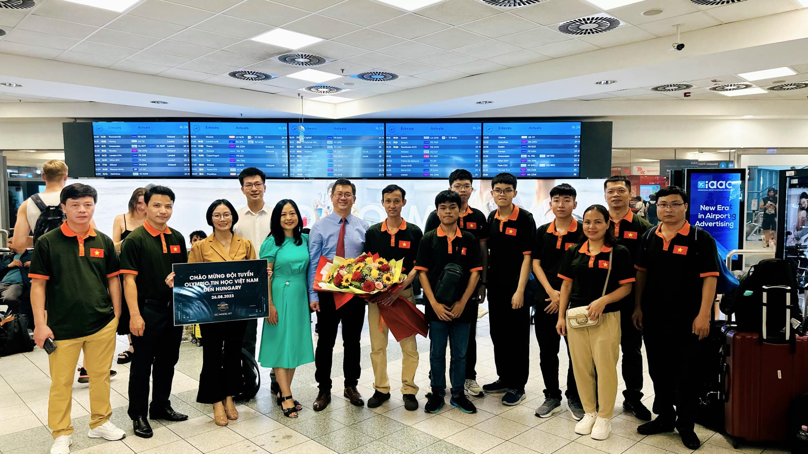
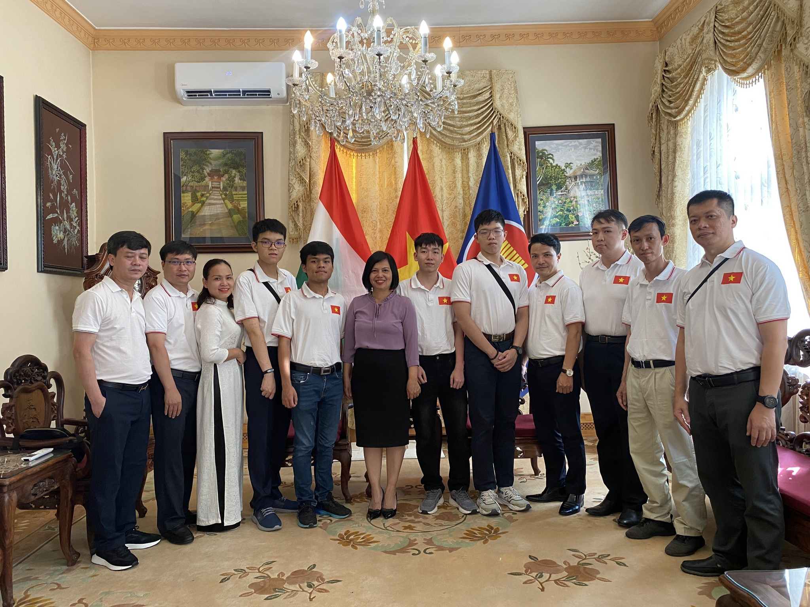
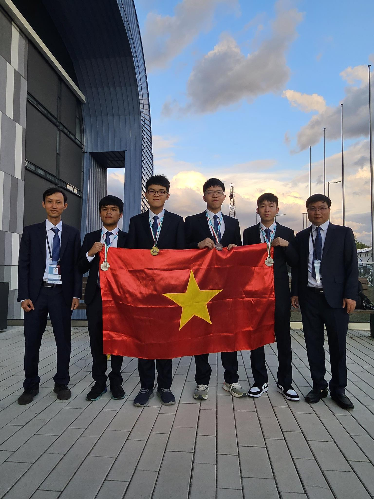

### Chào mọi người, hôm nay VNOI rất vinh dự khi được phỏng vấn bạn Thắng, một hiện tượng trong làng CP của năm 2023 khi các cuộc thi bạn tham gia đều đạt thành tích rất cao. Bạn có thể giới thiệu về bản thân được không?

Em là Nguyễn Đức Thắng, hiện đang là học sinh lớp 12 chuyên Toán, trường Trung học Phổ thông Chuyên Hùng Vương, tỉnh Phú Thọ. Vài năm trước, trường em cũng có một anh tên giống hệt em, cũng học chuyên Toán, và cũng nhất Quốc Gia Tin! Em thấy cái này trùng hợp quá mức luôn. Sở thích của em là xem bóng đá, thi thoảng cũng có ra sân đá cùng bạn bè cũng như chơi các game bóng đá như FC Online. Dạo này em cũng có một sở thích khác là chơi sudoku. Ngoài ra, em cũng thích xem phim (đặc biệt là những phim hành động như Mission Impossible, Điệp Viên 007 và Jason Bourne). Giải khối Rubik cũng là một phần đam mê của em ạ.

### Được biết bạn là một fan cuồng của Liverpool, bạn thích điều gì ở Liverpool?

Em là fan Liverpool từ năm 2018 - năm mà Liverpool thua chung kết Champions League với Real Madrid. Thông thường thì mọi người sẽ thích các đội vô địch, nhưng em lại ấn tượng với lối chơi Gegenpressing, điệu Rock rực lửa của Klopp rồi sau đó trở thành fan lúc nào không hay. Một câu nói em rất thích của Klopp đó là "I'm the normal one". Ngoài ra tinh thần máu lửa mà các cầu thủ, ban huấn luyện cũng như cổ động viên của họ mang đến luôn đem đến cho em rất nhiều cảm xúc. Đỉnh cao là năm 2019, nơi mà Liverpool đã có cuộc lội ngược dòng không tưởng trước Barca trên sân Anfield tại bán kết cúp C1. Em đã không thể tin vào mắt mình khi xem bàn thắng thứ tư "corner taken quickly" của Liverpool ở trận đấu hôm đó (lời bình luận nhắc tới việc Trent Alexander-Arnold đá quả phạt góc nhanh, đánh lừa hàng thủ Barca, kiến tạo cho Origi ghi bàn). Em khá buồn vì đây là mùa cuối của Klopp ở đây. Dù hiện tại đội vẫn dẫn đầu trên bảng xếp hạng, nhưng Liverpool vẫn chưa thể chắc chắn về một chức vô địch, bởi Man City vừa có Kevin De Bruyne và Erling Haaland trở lại sau chấn thương nên tình hình cũng khó lường. 

### Vốn xuất phát học cấp 3 chuyên Toán trường Hùng Vương – trường chuyên duy nhất và tốt nhất của tỉnh Phú Thọ, với chuyên Toán là chuyên khó vào nhất, bạn đã có những bước đệm nào từ cấp 2 để lên cấp 3 có thể tỏa sáng được như thế không? Bạn có từng tham gia các kỳ thi như Violympic, Toán Quốc Tế, Toán Úc, ... dành cho học sinh từ cấp 2 trở xuống không?

Việc học toán nâng cao của em đã bắt đầu từ những năm cấp 1. Thời đó thì em vào được vòng huyện những năm cấp 1 và vòng tỉnh trong những năm cấp 2. Vòng tỉnh cũng là cấp độ cao nhất dành cho trung học cơ sở, và em may mắn đạt được giải nhì. Về trình độ toán của em, em tự nhận thấy bản thân không giỏi ở phần hình và bất đẳng thức lắm. Khi thi vào chuyên Toán thì em đứng thứ 12/30 - một vị trí khá an toàn nhưng cũng không quá xuất sắc, nên em không hài lòng lắm với kết quả này.

Nhắc đến những cuộc thi, em có tham gia Violympic khi nó vẫn còn là một cuộc thi toán nhận được nhiều sự ủng hộ của học sinh và các thầy cô, và em đều đạt được thành tích tương đối ổn. Ngoài ra, em cũng có thi các cuộc thi "Quốc Tế" đôi lần vào những năm cấp 2 nhưng thành tích đạt được cũng không mấy ấn tượng.

Em nghĩ rằng một nền móng toán học ở mức "khá" như vậy là đủ để giúp em hiểu được những kiến thức toán học được áp dụng trong các chuyên đề tin.

### Tại sao bạn thi vào lớp chuyên Toán mà không phải lớp chuyên Tin? Tại sao bây giờ bạn lại học Tin mà lại không học toán? 

Em xuất phát vốn là dân học Toán, nên thi vào chuyên Toán cũng là dễ hiểu. Thực ra bản thân em cũng chán việc học Toán từ lớp 8 do em rất kém hình, và em cũng thấy mình không còn hứng thú với việc biến đổi quá nhiều. Lên cấp 3, em mới bắt đầu thử học Tin. Thật vậy, giả sử em học Tin kém mà vào lớp chuyên Tin thì ... không ổn lắm. Nếu em có cơ hội được chọn lại giữa việc học chuyên Toán hay chuyên Tin, thì em vẫn sẽ chọn Toán bởi tính cách của em vẫn hợp với các bạn lớp em bây giờ hơn. Em nghĩ đây cũng là background của khá nhiều người học cũng như thi Tin ạ.

### Ở cấp 3 thì bạn tiếp xúc với môn Tin từ lúc nào? 

Khoảng hồi hè trước khi vào cấp 3, cô Thái dạy trường em có nghĩ ra ý tưởng và mở một lớp dạy C++ miễn phí cho các bạn học sinh mới vào trường, chủ yếu là để đào tạo vào ĐTQG sau này. 
Ban đầu cũng không ai biết và để ý em bởi em không có gì nổi trội. Nhưng sau khi học được một thời gian thì có vẻ em bứt lên. Thực ra thì Tết năm đó, em cũng có tìm hiểu một chút qua về C++ nên tiếp thu nhanh hơn. Vả lại, em lúc ấy cũng rất đam mê với việc code, em code suốt cả hè luôn. Đến giờ em vẫn không hiểu sao hồi đó mình code nhiều thế.

### Cảm giác của bạn khi lần đầu tiếp xúc với Tin học? 

Lần đầu thì có lẽ là năm lớp 8, khi em được học Pascal trên trường. Lúc đấy được tiếp xúc với các câu lệnh, vòng lặp và một bài vài toán đơn giản làm em thấy việc lập trình khá thú vị. Tin học trong em lúc đó là cả một khoảng trời của những kiến thức hoàn toàn mới lạ và hay ho. Thậm chí, em từng có ý định học song song cả Toán và Tin bằng cách mượn đề các đứa bạn đội tuyển Tin của em để làm cùng, nhưng hồi đó em quá lười nên cuối cùng lại không làm được.

### Với việc đạt giải Nhì Quốc Gia từ năm lớp 10 như thế đã cho bạn bàn đạp rất lớn khi được dành thời gian trọn vẹn 3 năm cấp 3 với môn Tin học. Bạn có thường xuyên phải học trên trường nữa không?

Trong khoảng thời gian em học đội tuyển để đi thi HSGQG, trường cũng đã tạo điều kiện miễn việc học trên lớp cho em. Sau khi thi HSGQG xong, cô Thái đã xin phép trường cho em được tiếp tục việc học cùng với các anh chị ạ. Sự thật là hồi đấy chỉ có 7 anh chị lớp 11-12 thi mà trường có 8 suất nên em được vé vớt (cười). Tuy nhiên ở vòng sau em lại khá đen đủi khi đứng đồng hạng 33 và trượt Vòng 2.

### Phương pháp nào để bạn từ giải Nhì Quốc gia năm lớp 10 lên Á khoa của kỳ thi chỉ sau một năm như vậy? Bạn có thay đổi gì về chiến lược học trong suốt một năm hay không?

Em nghĩ sự khác biệt lớn nhất trong 2 năm là việc em đã có ý thức stress test trong phòng thi hơn. Hồi lớp 10 thì em có phần tập trung vào việc luyện code trên VNOJ hơn mà quên mất phần chiến thuật trong phòng thi. Kết quả là em đã bị "sập" mất bài 2 năm đó và trượt - một kết quả làm em khá nuối tiếc. Sau đó em chơi nguyên hè, cho tới khi "được" khuyến khích kì thi Duyên Hải Đồng bằng Bắc Bộ. Đến lớp 11 thì em cẩn thận hơn, cộng thêm trình độ code đã tiến bộ một chút, nên kết quả tốt hơn cũng là dễ hiểu. Vả lại, em quan niệm rằng Vòng 1 chỉ cần code giỏi là vào được vòng sau rồi. Kết quả Á khoa có thể mang chút may mắn, nhưng việc có được một kết quả tốt đã nằm trong dự liệu của em khi đó rồi.

### Bạn tập trung rất nhiều vào khả năng code, vậy còn khả năng nghĩ thì sao? Bạn phân bố thời gian học các thuật toán như thế nào? 

Lúc mới vào thì em chỉ học các thuật toán cơ bản như Segment Tree, DSU, ... thôi ạ. Ngoài ra khi làm bài mà gặp một tính chất, một thuật toán mà em chưa biết thì em sẽ tìm đọc và làm những bài tương tự. Ngoài ra khi em lên lớp 11, với việc biết sinh test, tỉ lệ code bug của em đã giảm xuống đáng kể. Khả năng nghĩ của em thì cũng ở mức tạm ổn, chưa có gì quá khác biệt; Em hơn các bạn ở khả năng làm được hầu hết những phần có thể làm được trong các kì thi.

### Bạn học TST trong vòng bao lâu? Trình độ của bạn thay đổi như thế nào? 

Em nhớ là trong vòng vài tháng ạ. Em lên trình khá nhiều, vì các bài được tiếp xúc khác hẳn hồi ôn thi VOI, với nhiều kiến thức, dạng bài mới. Có nhiều bài thiên về suy nghĩ, sau khi đã ra ý tưởng thì việc cài đặt lại khá đơn giản. Mặc dù thế mạnh của em là code những bài nặng về cài đặt, nhưng em vẫn rất hứng thú với các dạng bài nghĩ nhiều. Hồi em học thì anh Thái, thầy Đông thường cho các bài code ngắn, ngược lại thì có anh Hoàng luôn cho những bài cần "tay to" thực sự.

### Có một số người học Vòng 2 rất quyết liệt, bài nào các thầy đưa ra cũng code để AC bằng được. Tiếp cận của bạn cho vVòng 2 là gì? 

Thật ra thì cô Thái cho em đi ôn riêng với các thầy, các anh khá nhiều nên em dành phần lớn thời gian để giải bài từ những buổi đó ạ, còn bài các thầy cho ở Vòng 2 thì em có cố gắng làm nhưng những bài em không làm được thì thôi ạ. Vào vòng 2, em chỉ cố gắng để có được nhiều điểm nhất có thể và không đi quá sâu vào bài nào. Việc có được một thứ hạng cao như vậy thật sự cũng là một bất ngờ với em vì mỗi thí sinh đều có ít nhất 1 bài xanh, em thì bài nào cũng màu đỏ thôi..

### Trước khi thi Vòng 2, bạn có cảm thấy hồi hộp không? Sau đó cả hai ngày thi của bạn diễn ra như thế nào?

Em cảm thấy khá là bình tĩnh, vì mục tiêu của em ban đầu chỉ là vào APIO để miễn tốt nghiệp, chứ không thiết tha gì IOI cho lắm. Mà nếu lớp 11 có lỡ không may trượt vòng 2, thì lớp 12 vẫn thi lại VOI được ạ. Em thấy bản thân làm hai ngày ở mức khá bình thường. Ngoài ra, điểm của em cũng khá đều, còn mọi người thì hay có 1-2 bài điểm có để gánh các bài còn lại. 

### Vậy chiến thuật của bạn có phải là tập trung cắn tất cả các subtask thay vì chỉ tập trung là một bài không?

Đối với em, đề năm vừa rồi khó hơn bình thường khá nhiều nên việc tập trung vào một bài có phần bất khả thi, trừ khi đó là anh Khuê (Hoàng Ngọc Bảo Khuê - hai lần tham gia APIO 2022, 2023). Khi ngày 1 kết thúc và em chỉ được chưa tới 100/300, em cũng đã nghĩ về một thứ hạng thấp. Tuy nhiên em lại có được vị trí thứ 7, điều này giúp em làm bài ngày 2 với một tâm thế khá thoải mái.

### Sau khi qua Vòng 2 thì các bạn ở các tỉnh sẽ được ra Hà Nội học một tháng và ở kí túc xá kèm tiền hỗ trợ 250 nghìn mỗi ngày, bạn có kỉ niệm nào với việc học APIO không?

Em nhớ nhất kỉ niệm... trốn học ạ. Phòng em có 3 người: em, anh Bảo Anh và anh Triệu. Anh Triệu thì chăm chỉ, hôm nào cũng đi học đầy đủ. Còn anh Bảo Anh và em thì hay trốn, sau đó cũng có vài lần bị thầy Phương gọi hỏi thăm. Lúc trốn, em thường chỉ ở nhà ngủ thôi nên nhiều lúc thầy gọi cho cả cô Thái để kêu dậy đi học. Với tiền phụ cấp, em cũng chỉ đi ăn uống bình thường, không chi tiêu gì nhiều. Có một hôm ba bọn em đi xem phim cho đỡ chán, còn lại thì không khác gì sinh hoạt hằng ngày cả. 

### Ôn thi xong APIO là đến ôn thi IOI, trải nghiệm của bạn lúc đấy thế nào?

Đợt em ôn thi IOI thì ba bạn kia ở Hà Nội nên ở nhà riêng hết, chỉ có mình em ở kí túc xá thôi, mà cũng chỉ vì có 4 người học nên em cũng không trốn được. Thật ra nếu em thật sự muốn trốn thì có lẽ vẫn có thể, bởi vì các thầy chỉ cho bài thôi, đa phần các thầy sẽ không lên. Mọi người lên đầy đủ chủ yếu chỉ để học cùng nhau để có không khí cũng như trao đổi một chút thôi. 
 

### Kỳ thi IOI 2023 được tổ chức ở Hungary, là một năm hiếm hoi trong những năm gần đây các thí sinh đi thi có thể giao lưu và gặp mặt nhau tại một nước. Cảm giác của bạn khi lần đầu tiên được đi Hungary là như thế nào?

Ở Hungary, các toà nhà có kết cấu từ ngày xưa, có nhiều hoa văn khá độc lạ. Em thấy Hungary đẹp, nhưng cũng chưa phát triển lắm, vì em để ý thấy vẫn còn nhiều khu đất trống. Cảm giác hệt như ở vùng nông thôn vậy. Đợt tụi em đi thi IOI, hội du học sinh Việt Nam ở Hungary hỗ trợ rất nhiều. Ngoài ra còn có hội người Việt Nam ở Hungary tài trợ ở một số mặt nữa ạ. Em vui vì họ rất nhiệt tình, nhưng cũng hơi thắc mắc vì bay gần nửa vòng Trái Đất cuối cùng lại thưởng thức gà luộc, phở bò..., chả khác gì ở nhà cả! Em cũng rất thích Hungary vì đó là quê nhà của số 8 mới ở Anfield (sân nhà của đội bóng Liverpool) - Szoboszlai.

### Khi bạn bước vào thi IOI, bạn chuẩn bị tâm lý như thế nào? 

Đối với em, một khi đã đủ khả năng trở thành một trong bốn đại diện của Việt Nam tham dự IOI, thì làm bài thế nào đi nữa cũng đủ khả năng có giải, trừ khi hôm đó phong độ tệ lắm thôi. Nếu thế thật thì em cũng hi vọng sẽ được huy chương Bạc. Ngày thi đầu tiên, em làm bài suýt nữa thì xuống Đồng. Ngày thi thứ hai thì khá xanh. Đề IOI năm ngoái khi làm lại thì thật sự rất hay, nhưng các subtask thì không được thuận lợi lắm. Ví dụ như bài 1 năm ngoái, em nghĩ được subtask đường thẳng ra được thuật tham lam khá giống sol chuẩn. Tuy nhiên đến subtask $n \leq 3000$, tương ứng với $83$ điểm, code chuẩn chỉ vài dòng, nhưng phải dùng Quy hoạch động, khác hẳn với hướng trước đó nên không nghĩ ra thế nào. Em đành an phận với $52$ điểm. Bài $3$, em rút ra được nhận xét như mọi người, nhưng khi code trâu và kiểm tra lại thì code bug, làm em nghĩ nhận xét đó sai. Em tưởng bài đấy khó, vậy là chỉ trâu đúng subtask 1 rồi bỏ. Khi ra khỏi phòng thi, ai cũng được ít nhất $50~60$ điểm, chỉ em được $14$ điểm. Nếu bài đó không bug, kèm thêm bài 1 nữa thì em có thể sẽ lên được Vàng. 

### Sau khi thi thì cảm giác của bạn như thế nào? Vui vì được huy chương bạc hay tiếc vì không thể đạt được vàng? 

Được Huy chương Bạc cũng gọi là hoàn thành mục tiêu của mình rồi, nên em cũng không tiếc nuối nhiều. Khi về lại quê nhà, bố mẹ tổ chức tiệc mừng HCB của em với hàng xóm, có cả các thầy cô cùng tới chia vui nữa ạ. Đạt được Huy chương Bạc cũng đồng nghĩa với việc được huy chương lao động hạng $3$. Nếu không có gì thay đổi so với những năm trước, em sẽ được gặp Chủ tịch nước, nhưng năm nay chỉ được gặp Phó chủ tịch nên em cũng hơi tiếc nuối đôi chút.

### Trường và tỉnh Phú Thọ có tổ chức tuyên dương, khen thưởng bạn không? Cảm xúc của bạn lúc đó như thế nào?

Em khá là vui, hạnh phúc, và tự hào. Nếu tính tới hiện tại, thì tổng tiền thưởng đã hơn một trăm triệu đồng. Em có dùng một khoản tiền đấy mua một cái laptop mới thôi, chứ cũng chưa có dự định gì nhiều.

### Với tâm thế là một người đã có huy chương rồi, thì bạn có kì vọng gì cho Vòng 2 năm nay không? 

Chắc chắn là khác năm ngoái rồi ạ. Mọi người sẽ kì vọng năm nay em có vàng IOI. Em nghĩ là năm nay được đại diện Việt Nam đi thi IOI đã là thành công rồi. Năm nay có khá nhiều bạn giỏi nên em không biết mình có thể vào được top 6 (top để được tính huy chương APIO) hay không nữa. Từ khi thi IOI năm ngoái về, em đi chơi khá là nhiều, chỉ từ sau vòng 1 năm nay thì em mới tập trung hoàn toàn lại vào code ạ.

### Mình thấy hầu hết các bạn khi chuẩn bị cho IOI đều luyện tập trên Codeforces rất nhiều nhưng bạn thì ngược lại, không cày Codeforces nhiều lắm. Lí do tại sao bạn lại làm thế? Khi không tham gia các contest trên Codeforces thì bạn có hay làm lại các bài trên đó không? 

Em khá lười làm Codeforces vì contests Codeforces luôn diễn ra vào buổi tối muộn. Nhiều khi có những bài em có khả năng giải nhưng lại không giải được. Những bài ấy làm em khá cay cú và khó ngủ! Ngoài ra em cũng không thường xuyên làm lại bài lắm. Em sử dụng Codeforces nhiều hồi em mới học, bởi các bài div 2 giúp khả năng tư duy của em được nâng lên khá nhiều .

### Nếu không làm Codeforces thì nguồn bài chính của bạn là ở trang nào? 

Em cày cuốc khá nhiều trên VNOJ với các bài OI trên oj.uz. Các bài trên oj.uz thì em đã giải tương đối nhiều. Đề thi các năm gần đây thì em làm gần hết rồi.

### Khi luyện tập thì trung bình bạn dành bao nhiêu thời gian cho một đề? 

Việc dành thời gian bao lâu phụ thuộc vào tâm trạng của em. Nếu em thấy có khả năng nghĩ tiếp được thì sẽ cố gắng tới khi nào ra thì thôi. Còn ngược lại, nếu em thấy chán, hoặc là bài khó quá, thì em sẽ đọc sol và các subtask ở cuối đề ạ. Thường thì em sẽ mở từng bài và cố gắng giải hơn là giải nguyên một đề.

### Vậy động lực nào để bạn có thể tiếp tục giải hết các đề IOI, APIO? Làm thế nào để bạn cảm thấy không bị chán khi giải các đề, khi mà các bài rất khó và yêu cầu cả giờ đồng hồ suy nghĩ? 

Chủ yếu vì bài rất hay, cần vận dụng trí tuệ nhiều hơn, và không có quá nhiều bài yêu cầu mình phải code nhiều. Vả lại, nếu gặp các bài code nhiều, em vẫn rất thích vì sở trường của em là code cơ mà. Tuy vậy, em thấy những bài nghĩ nhiều thú vị hơn nhiều ạ. Sau khi thi APIO, dù đã có kết quả nhưng em vẫn chưa tập trung học được. Thấy vậy, anh minhcool (Nguyễn Quang Minh - IOI 2023) khuyên em bắt đầu giải các đề IOI theo từng năm. Em bắt đầu làm theo và từ đó tìm ra nhiều động lực giải đề hơn ạ.

### Làm thế nào để bạn biến những đam mê tin học thành sức mạnh của bạn, mà không biến nó thành áp lực? Bạn nhìn nhận việc thi như thế nào?  

Những kì thi đối với em không phải là áp lực lớn, có lẽ vì mục tiêu em đặt ra cũng không quan trọng. Lần thi áp lực nhất của em là VOI năm lớp 11, khi em phải vào được Vòng 2. Còn các cuộc thi sau đấy thì em không đặt nặng thành tích, rằng TST và APIO mình đứng rank bao nhiêu, phải có huy chương gì. Nếu em có cảm giác áp lực thì chỉ áp lực trước khi thi thôi, còn một khi đã vào phòng thi thì sẽ tập trung hoàn toàn vào làm bài và không nghĩ gì về áp lực nữa. Nhờ những kinh nghiệm đi thi từ nhỏ, nên không khí phòng thi và tâm lý đi thi của em cũng đã được rèn luyện khá nhiều. 

### Bạn có dự định đi du học sau khi tốt nghiệp cấp 3 không? Nếu ở Việt Nam, bạn sẽ học UET hay Đại học Bách Khoa? 

Có lẽ là không. Đơn giản là vì em không muốn ra nước ngoài. Bây giờ em vẫn đang phân vân, vì UET giờ phải học ở cơ sở Hoà Lạc, mà em chẳng muốn tí nào. Tuy nhiên ở đó cũng có nhiều người em quen hơn nên UET vẫn là sự lựa chọn số một.

### Bạn có phải là một người giỏi môn Anh không? Bạn có dự định học IELTS nghiêm túc không? 

Em không giỏi tiếng Anh lắm. Khi đi thi IOI, em cũng không giao tiếp được gì nhiều, và điều đó khiến em cảm thấy khá đáng tiếc. Em đang có học bổng IELTS, em cũng đang học nhưng chỉ để giao tiếp được thôi, còn để thi thì em vẫn chưa nghĩ đến nhiều. 

### Bạn có muốn tiếp tục thi đấu ở ICPC không? 

Em nghĩ nếu kiếm được đội thì em sẽ tham gia ICPC. Hơn nữa, nếu học ở UET, em sẽ nhờ thầy Phương (Hồ Đắc Phương - huấn luyện viên ICPC của trường Đại học Công nghệ, ĐHQG-HN) kiếm giúp em. Mong muốn của em là cùng đội với những người giỏi toán và hình, vì đó là hai lĩnh vực em còn chưa giỏi lắm.

### Sau này, bạn có dự định sẽ làm gì? Bạn thích đi nghiên cứu nhiều hơn, hay đi làm nhiều hơn? 

Em sẽ thiên về đi làm nhiều hơn, vì em không giỏi nghiên cứu nhiều lắm. Tuy nhiên trong tương lai, nếu có một chủ đề mà em đủ đam mê thì em có thể sẽ suy nghĩ lại.

### Với tình hình công việc hiện tại, thì bạn có thích một lĩnh vực nhất định nào chưa? (AI, ứng dụng, web, điện thoại, ...) 

Em vẫn chưa tìm hiểu nên chưa rõ lắm. Nhưng anh Bách (Trần Xuân Bách - IOI 2023) có rủ em học AI xem thử thế nào, nên em có ý định thử. Còn những lĩnh vực khác, em sẽ thử nghiệm nhiều hơn ở Đại học.

### Một phương châm mà bạn luôn hướng đến? 

"It's not the destination, It's the journey." 

Mỗi lần đi thi chỉ cần cố gắng hết sức mình, còn kết quả đến đâu thì không quan trọng. Quan trọng là quá trình mình ôn luyện, học tập cùng nhau.

*Cảm ơn marvinthang đã nhận lời tham gia phỏng vấn cho tạp chí VNOI! Tết đã sắp đến rồi, và sau Tết thì cũng là Vòng 2, nên chúc bạn năm nay đổi màu được huy chương! Chúc bạn được vàng IOI năm nay!*
