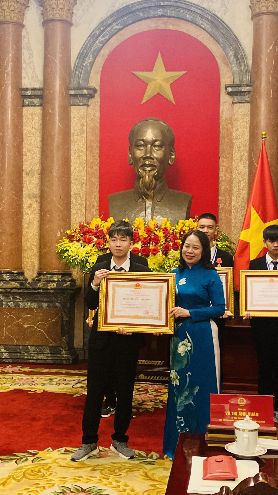

### Chào mọi người, hôm nay VNOI rất vinh dự khi được phỏng vấn bạn Thắng, một hiện tượng trong làng CP của năm 2023 khi các cuộc thi bạn tham gia đều đạt thành tích rất cao. Bạn có thể giới thiệu về bản thân được không?

Em là Nguyễn Đức Thắng, đang là học sinh lớp 12 chuyên Toán của trường Trung học Phổ thông Chuyên Hùng Vương, tỉnh Phú Thọ. Sở thích của em là xem bóng đá, chơi Fifa Online 4. Dạo này em hay chơi Sudoku. Ngày xưa thì em xem phim, chơi Rubik các thứ. Nếu xem phim thì em thích phim hành động, kiểu như Mission Impossible hay Điệp Viên 007. 

### Được biết bạn là một fan cuồng của Liverpool, bạn thích điều gì ở Liverpool?

Em là fan Liverpool từ năm 2018, năm mà Liverpool thua chung kết C1 với Real ý ạ. Em rất thích lối chơi máu lửa, gegenpressing của Klop. Dù đội đứng đầu bảng xếp hạng nhưng khá là khó nói, vì Man City có Kevin De Bruyne trở lại nên tình hình cũng khó lường. 

### Vốn xuất phát học cấp 3 chuyên Toán trường Hùng Vương – trường chuyên duy nhất và tốt nhất của tỉnh Phú Thọ, với chuyên Toán là chuyên khó vào nhất, bạn đã có những bước đệm nào từ cấp 2 để lên cấp 3 có thể tỏa sáng được như thế không? Bạn có từng tham gia các kỳ thi như Violympic, Toán Quốc Tế, Toán Úc, ... dành cho học sinh từ cấp 2 trở xuống không?

Em có thi HSG Huyện và Tỉnh môn Toán, vì em học toán từ cấp 1 rồi. Em chỉ vào được vòng Tỉnh thôi, vì cấp 1 chỉ có thi Huyện và cấp 2 chỉ ngang mức Tỉnh. Khi học Toán thì em nghĩ là mình khá yếu phần hình vì các thầy của em thời đó cũng không giỏi hình lắm nên em cũng thế. Còn bất đẳng thức thì em chỉ làm được vài bài dễ thôi, bình thường vào thi em thấy cũng không ai làm được bài bất đẳng thức. Lúc đấy thì em vẫn phải thi tuyển sinh, vì Nhất tỉnh Toán mới được tuyển thẳng, còn em chỉ được giải nhì thôi. Hôm thi chuyên Toán, em lúc đó làm khá là kém, lớp 30 bạn em đứng thứ 12 thôi. 

Violympic thì đến năm của em vẫn còn ạ, nhưng chỉ ở tiểu học thôi. Các cuộc thi khác thì em không tham gia nhiều. Em chỉ tham gia một hai lần vào năm lớp 9 thôi ạ.

### Tại sao bạn thi vào lớp chuyên Toán mà không phải lớp chuyên Tin? Tại sao bây giờ bạn lại học Tin mà lại không học toán? 

Tại vì em lúc đầu học toán ạ. Lên cấp ba em mới bắt đầu thử học Tin chứ giả sử em học Tin kém mà vào lớp chuyên Tin thì lại không ổn lắm. 

### Ở cấp 3 thì bạn tiếp xúc với môn Tin từ lúc nào? 

Khoảng hồi hè, trước khi vào lớp 10 ạ. Cô Thái mở lớp mời chào các bạn mới vào trường, ngoài ra còn có các anh chị ĐTQG mới ra trường dạy miễn phí lớp C++ cơ bản, chọn một số bạn thi ĐTQG nữa ạ. 

### Cảm giác của bạn khi lần đầu tiếp xúc với Tin học? 

Lần đầu tiên tiếp xúc thì phải kể đến năm lớp 8 với Pascal trên trường ấy ạ. Lúc đấy thì em cũng khá là hứng thú, dù lúc đó đa phần là code trên giấy. Em lúc đó còn có dự định thi đội tuyển tin ạ. 

### Với việc đạt giải Nhì Quốc Gia từ năm lớp 10 như thế đã cho bạn bàn đạp rất lớn khi được dành thời gian trọn vẹn 3 năm cấp 3 với môn Tin học. Bạn có thường xuyên phải học trên trường nữa không?

Có ạ. Lúc đấy em cũng khá là may, vì đội tuyển năm ấy khá là ít người. Các anh chị lớp 11, 12 chỉ được 7 người mà trường em có 8 slot. Thế là em được vào. Lúc học đội tuyển thì em được nghỉ trên trường. Còn bình thường thì thi VOI xong thì sẽ phải tiếp tục học chính khoá, nhưng cô em xin cho em nghỉ để ôn cùng Vòng 2, tại vì em … trượt.

### Phương pháp nào để bạn từ giải Nhì Quốc gia năm lớp 10 lên Á khoa của kỳ thi chỉ sau một năm như vậy? Bạn có thay đổi gì về chiến lược học trong suốt một năm hay không?

Từ lớp 10, em chỉ luyện code trên VNOJ thôi. Hồi ấy em cày điểm nhiều. Có lẽ em code mạnh nên mới được giải Nhì ạ. Hơn nữa, lớp 10 em cũng chả biết stress code gì cả, chỉ code thôi. Em bug mất bài 2 năm đó, thế là tạch TST. Thi xong thì em chơi nguyên hè cho tới khi chỉ được khuyến khích kì thi HSG Duyên Hải Đồng bằng Bắc Bộ. Sau đó thì em chả làm gì đặc biệt lắm, chỉ ôn bài như các năm trước thôi. Theo em nghĩ lợi thế cạnh tranh của em so với những thí sinh là khả năng code của em thì hơn đa số mọi người ở đây, và thi VOI thì chỉ cần code giỏi là vào vòng 2 rồi. 

### Bạn tập trung rất nhiều vào khả năng code, vậy còn khả năng nghĩ thì sao? Bạn phân bố thời gian học các thuật toán như thế nào? 

Lúc mới vào thì em chỉ học các thuật toán cơ bản như Segment Tree, DSU, etc. thôi. Lúc đấy em chỉ làm các bài bình thường, khi nào gặp một tính chất nào chưa gặp thì mới tìm đọc và làm bài tương tự. Lúc lên lớp 11 thì em cũng biết sinh test rồi ạ nên thường em code cũng không hay bug chỗ nào.
 
### Bạn học TST trong vòng bao lâu? Trình độ của bạn thay đổi như thế nào? 

Em nhớ là trong vòng một tháng ạ. Em nghĩ là em lên trình khá nhiều, vì các bài được tiếp xúc khác hẳn hồi ôn thi VOI, với nhiều kiến thức, dạng bài mới. Bài thật sự khó nghĩ nhưng code chỉ vài dòng. Hồi em học thì anh Thái thường cho các bài code ngắn, ngược lại thì có anh Hoàng. Thầy Đông cũng hay cho các bài code khá ngắn nữa ạ.

### Có một số người học Vòng 2 rất quyết liệt, bài nào các thầy đưa ra cũng code để AC bằng được. Tiếp cận của bạn cho vòng 2 là gì? 

Em học không đến mức đấy ạ. Các bài thầy cho, em làm được bài nào thì làm, không làm được thì thôi. Phải gặp những bài em thấy làm được thì mớilàm. Ngoài ra thì cô Thái cũng cho em đi ôn riêng nên em chỉ chủ yếu làm các bài từ các buổi ôn đấy thôi ạ. Đợt đấy thì thi Vòng 2 em được rank 5, còn APIO thì rank 1, cộng lại thì rank 3. 

### Trước khi thi Vòng 2, bạn có cảm thấy hồi hộp không? Sau đó cả hai ngày thi của bạn diễn ra như thế nào?

Em cảm thấy khá là bình tĩnh, vì mục tiêu của em ban đầu chỉ là vào APIO để miễn tốt nghiệp thôi ạ, chứ không thiết tha gì IOI. Mà nếu lớp 11 trượt, thì lớp 12 vẫn thi lại VOI được ạ. Em thấy là cả hai ngày đều nát ạ, mọi bài điểm của em đều khá là trung bình, trong khi các bạn rank ngang hoặc hơn em đều có một bài điểm cao hơn hẳn để “gánh” những bài còn lại nhưng em thì lại thấp đều. 

### Vậy chiến thuật của bạn có phải là tập trung cắn tất cả các subtask thay vì chỉ tập trung là một bài không?

Đề năm đấy khó, kể cả làm subtask cũng khó ạ vì em thấy tất cả mọi người chỉ làm được 1 đến 2 subtask. Các năm trước thì điểm Vòng 2 khá cao, nhưng ngày 1 năm đó em chỉ làm chưa tới 100 điểm. Tưởng “cook” rồi nhưng ra khỏi phòng thi thì thấy rank 7 ạ. Vào hôm sau lúc vào phòng thi thì em không nghĩ gì đến ngày hôm trước nữa, và em cứ tiếp tục làm thôi ạ. 

### Sau khi qua Vòng 2 thì các bạn ở các tỉnh sẽ được ra Hà Nội học một tháng và ở kí túc xá kèm tiền hỗ trợ 250 nghìn mỗi ngày, bạn có kỉ niệm nào với việc học APIO không?

Chắc là có kỉ niệm... trốn học ạ. Phòng em có em, anh Bảo Anh và anh Triệu. Anh Triệu thì chăm, hôm nào cũng đi học. Còn anh Bảo Anh và em thì trốn, sau đó bị thầy Phương gọi. Lúc trốn thì em thường chỉ ở nhà ngủ thôi nên nhiều lúc thầy gọi cho cả cô Thái để kêu dậy đi học. Với tiền phụ cấp thì em cũng chỉ đi ăn uống bình thường thôi ạ, không chi tiêu gì nhiều. Có một hôm ba bọn em đi xem phim, còn lại thì không khác gì sinh hoạt hằng ngày cả. 

### Ôn thi xong APIO là đến ôn thi IOI, trải nghiệm của bạn lúc đấy thế nào?

Đợt em ôn thi IOI thì ba bạn kia ở Hà Nội nên ở nhà riêng hết, chỉ có mình em ở kí túc xá thôi, mà cũng chỉ vì có 4 người học nên em cũng không trốn được. Thật ra nếu muốn thì có lẽ vẫn có thể, bởi vì các thầy chỉ cho bài thôi, đa phần các thầy sẽ không lên. Mọi người lên đầy đủ chủ yếu chỉ để học cùng nhau để có không khí. Bốn bạn học cả sáng cả chiều, đôi lúc cần thiết có thể hỏi nhau nữa. 
 

### Kỳ thi IOI 2023 được tổ chức ở Hungary, là một năm hiếm hoi trong những năm gần đây các thí sinh đi thi có thể giao lưu và gặp mặt nhau tại một nước. Cảm giác của bạn khi lần đầu tiên được đi Hungary là như thế nào?

Em nhìn Hungary thì các toà nhà có kết cấu từ ngày xưa, có nhiều hoa văn khá độc lạ. Em thấy Hungary đẹp, nhưng cũng chưa phát triển lắm, vì em thấy có nhiều khu đất trống. Cảm giác giống như em ở vùng nông thôn vậy. Đợt tụi em đi thi IOI là hội du học sinh du học Hungary của Việt Nam hỗ trợ rất nhiều. Ngoài ra còn có hội người Việt Nam ở Hungary tài trợ ở một số mặt nữa ạ. 

### Khi bạn bước vào thi IOI, bạn chuẩn bị tâm lý như thế nào? 

Em nghĩ là một khi đã đủ khả năng trở thành một trong bốn người đại diện cho Việt Nam thi IOI thì làm kiểu gì cũng đủ khả năng có giải, trừ khi trừ khi hôm đó phong độ tệ lắm thôi. Nếu thế thật thì em cũng hi vọng sẽ được huy chương Bạc. Ngày một thì em làm suýt nữa thì xuống Đồng. Ngày hai thì khá xanh. Em thấy đề IOI năm ngoái khi làm lại thì thật sự rất hay, nhưng các subtask thì không được thuận lợi lắm. Ví dụ như bài 1 năm ngoái, em nghĩ được subtask đường thẳng ra được thuật hình thang khá giống sol chuẩn. Tuy nhiên đến subtask $n \leq 3000$, tương ứng với $83$ điểm, code chỉ vài dòng, nhưng phải dùng Quy hoạch động, khác hẳn với hướng trước đó nên không nghĩ ra thế nào. Vậy là đành an phận với $50$ điểm. Có bài 3 thì em rút ra được nhận xét như mọi người, nhưng khi code trâu, kiểm tra lại thì code bug, thế lại nghĩ nhận xét đó sai. Em tưởng bài đấy khó, vậy là chỉ trâu đúng subtask 1 rồi bỏ. Khi ra khỏi phòng thi, ai cũng được $50~60$ điểm, chỉ em được khoảng $10$ điểm thôi. Nếu bài đó không bug, kèm thêm bài 1 nữa thì em sẽ lên được vàng. 

### Sau khi thi thì cảm giác của bạn như thế nào? Vui vì được huy chương bạc hay tiếc vì không thể đạt được vàng? 

Em được bạc thì cũng hoàn thành mục tiêu của mình rồi nên em cũng chả tiếc lắm. Khi về lại quê nhà, bố mẹ có tổ chức tiệc mừng HCB của em với hàng xóm, có cả các thầy cô cũng tới chia vui nữa ạ. Lúc em được HCB thì cũng được thông báo sẽ được huy chương lao động hạng 3. Mọi năm sẽ được gặp Chủ tịch nước nhưng năm nay chỉ được gặp Phó chủ tịch thôi ạ.

### Trường và tỉnh Phú Thọ có tổ chức tuyên dương, khen thưởng bạn không? Cảm xúc của bạn lúc đó như thế nào?

Em cũng không biết. Em chỉ khá là vui, hạnh phúc, và tự hào các thứ thôi. Nếu tính tới hiện tại, thì tổng tiền thưởng đã hơn một trăm triệu đồng. Em có dùng một khoản tiền đấy mua một cái laptop mới thôi, chứ cũng chưa có gì mấy. 

### Với tâm thế là một người đã có huy chương rồi, thì bạn có kì vọng gì cho Vòng 2 năm nay không? 

Chắc chắn là khác năm ngoái rồi ạ. Mọi người sẽ kì vọng năm nay mình có vàng IOI. Em nghĩ là năm nay được đại diện Việt Nam đi thi IOI đã là thành công rồi ạ. Năm nay có khá nhiều bạn giỏi nên em không nghĩ mình có thể vào được top 6 hay không nữa. Từ khi thi IOI năm ngoái về thì em đi chơi khá là nhiều, không tập trung học lắm. Thỉnh thoảng em chỉ lấy vài bài ra làm thôi. Em có dự định đợi tới khi có lớp ôn Vòng 2 thì em sẽ bắt đầu học cùng với lớp ấy. 

### Mình thấy hầu hết các bạn khi chuẩn bị cho IOI đều luyện tập trên Codeforces rất nhiều nhưng bạn thì ngược lại, không cày Codeforces nhiều lắm. Lí do tại sao bạn lại làm thế? Khi không tham gia các contest trên Codeforces thì bạn có hay làm lại các bài trên đó không? 

Em khá lười làm Codeforces vì hay phải làm vào buổi tối. Khi làm xong thì hay gặp trường hợp bài mình có thể làm được, mình nghĩ ra rồi nhưng không thể làm kịp được. Điều đó hay dẫn tới việc mình cay cú cả đêm và không ngủ được. Em không muốn trải qua cảm giác ấy nên em không làm. Bài trên đó thì em không hay làm lại nhiều lắm, hầu như không làm luôn. Chỉ hồi mới học thì em mới làm nhiều thôi. 

### Nếu không làm Codeforces thì nguồn bài chính của bạn là ở trang nào? 

Em hay làm trên VNOJ với các bài trên oj.uz hơn. Các bài trên oj.uz thì em cũng giải tương đối, có đề các năm gần đây thì em làm gần hết rồi ạ.

### Khi luyện tập thì trung bình bạn dành bao nhiêu thời gian cho một đề? 

Đó là tuỳ tâm trạng của em ạ. Nếu em thấy có thể nghĩ tiếp được thì sẽ nghĩ tiếp tới khi nào ra thì thôi. Còn ngược lại, nếu em thấy chán, hoặc là khó quá, thì em sẽ đọc sol và các subtask ở cuối đề. Em không hẳn là làm theo từng đề. Em chỉ mở ra từng bài rồi làm tới khi nào AC rồi chuyển qua bài khác thôi. 

### Vậy động lực nào để bạn có thể tiếp tục giải hết các đề IOI, APIO? Làm thế nào để bạn cảm thấy không bị chán khi giải các đề, khi mà các bài rất khó và yêu cầu cả giờ đồng hồ suy nghĩ? 

Chủ yếu vì bài rất hay. Không có quá nhiều bài yêu cầu mình phải code nhiều. IOI vẫn có một số bài code nhiều nhưng số bài đó chỉ ít thôi. Vả lại, nếu gặp các bài code nhiều, em vẫn rất thích vì sở trường của em là code cơ mà. Những bài nghĩ nhiều thì em thấy rất là thú vị.  Hồi sau thi APIO thì có kết quả rồi mà em vẫn chưa tập trung học, em rất lười nên chỉ chơi thôi. Thấy vậy, anh minhcool (Nguyễn Quang Minh - IOI 2023) yêu cầu em giải các đề IOI theo từng năm, và em bắt đầu làm theo. 

### Làm thế nào để bạn biến những đam mê tin học thành sức mạnh của bạn, mà không biến nó thành áp lực? Bạn nhìn nhận việc thi như thế nào?  
Em cũng không rõ lắm, tại vì từ cấp 1 thì em đã thi khá là nhiều. Ngoài ra, lần nào thi thì em cũng không áp lực lắm, có lẽ vì mục tiêu em đặt ra cũng không quan trọng. Lần thi áp lực nhất em thấy là thi VOI lớp 11, khi em phải vào được Vòng 2. Còn các cuộc thi sau đấy thì mình được giải gì không quan trọng, mình không quan trọng rằng TST và APIO mình đứng rank bao nhiêu, phải có huy chương gì. Nếu mà có áp lực thì chỉ áp lực trước khi thi thôi, còn một khi đã vào phòng thi thì sẽ tập trung hoàn toàn vào làm bài và không nghĩ gì về áp lực nữa. Tại vì đã được đi thi nhiều từ cấp 1, nên không khí phòng thi và tâm lý đi thi của em cũng đã được rèn luyện khá nhiều. 

### Bạn có dự định đi du học sau khi tốt nghiệp cấp 3 không? Nếu ở Việt Nam, bạn sẽ học UET hay Đại học Bách Khoa? 

Có lẽ là không ạ. Đơn giản là vì em không muốn ra nước ngoài. Bây giờ em vẫn đang phân vân, vì UET giờ phải chạy lên Hoà Lạc, mà em chẳng muốn tí nào.

### Bạn có phải là một người giỏi môn Anh không? Bạn có dự định học IELTS nghiêm túc không? 

Em không giỏi tiếng Anh lắm, ra nước ngoài chả nói chuyện được gì. Em đang có học bổng IELTS, em cũng đang học nhưng chỉ để giao tiếp được thôi, còn đi thi thì em chưa tính đến. 

### Bạn có muốn tiếp tục thi đấu ở ICPC không? 

Nếu kiếm được đội thì em vẫn sẽ thi được. Em khá là yếu ở nhiều bài IOI, như là hình với toán. Em cần team gánh em hình và toán thì mới thi được. 

### Sau này, bạn có dự định sẽ làm gì? Bạn thích đi nghiên cứu nhiều hơn, hay đi làm nhiều hơn? 

Em sẽ thiên về đi làm nhiều hơn, vì em không giỏi nghiên cứu nhiều lắm. 

### Với tình hình công việc hiện tại, thì bạn có thích một lĩnh vực nhất định nào chưa? (AI, ứng dụng, web, điện thoại, ...) 

Em vẫn chưa tìm hiểu nên chưa rõ lắm. Nhưng anh Bách (Trần Xuân Bách - IOI 2023) có rủ em học AI xem thử thế nào, nên em có ý định thử. 

### Một phương châm mà bạn luôn hướng đến? 

Mỗi lần đi thi chỉ nên cố gắng hết sức mình, còn kết quả đến đâu thì không quan trọng. Quan trọng là quá trình mình ôn luyện, học tập cùng nhau.

*Cảm ơn marvinthang đã nhận lời tham gia phỏng vấn cho tạp chí VNOI! Tết đã sắp đến rồi, và sau Tết thì cũng là Vòng 2, nên chúc bạn năm nay đổi màu được huy chương! Chúc bạn được vàng IOI năm nay!*
